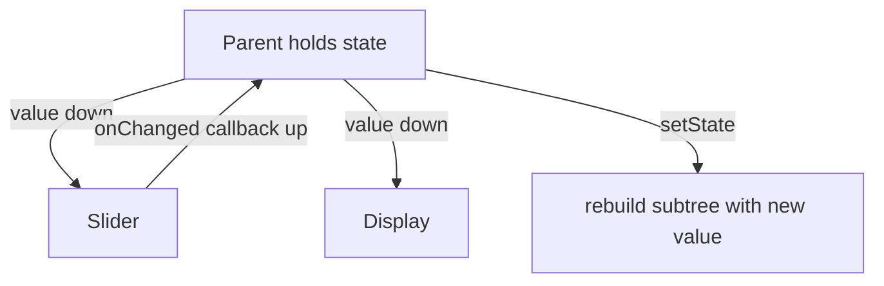
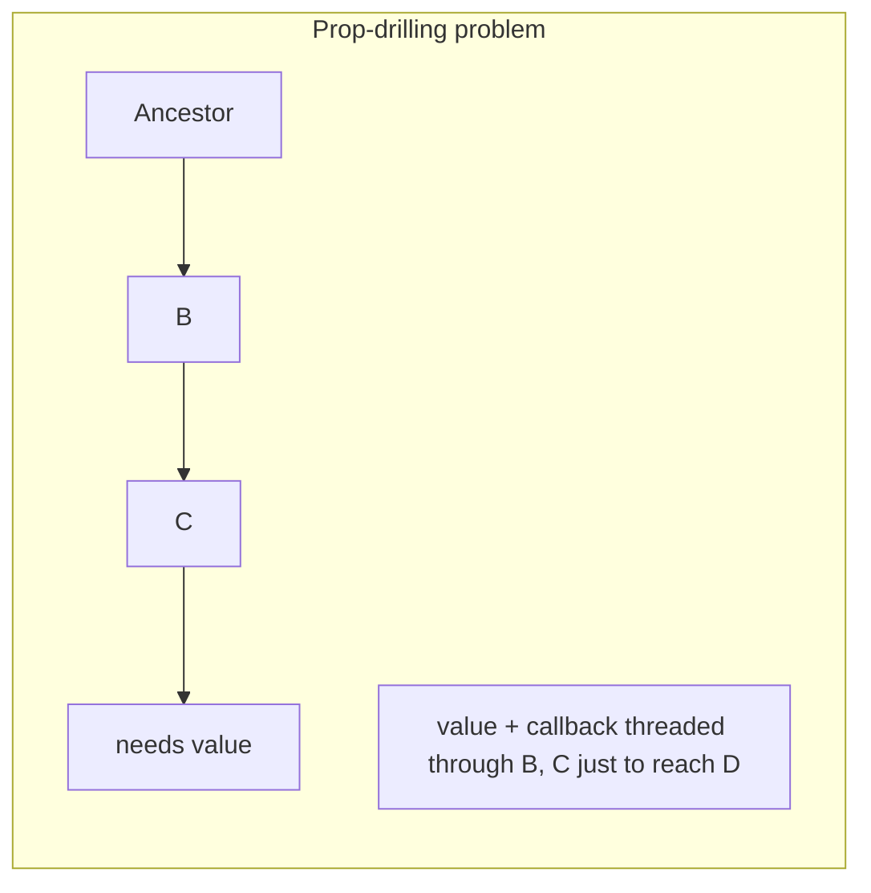

# `setState` & Lifting State Up

> `setState` manages a widget's own ephemeral state; when two sibling widgets need the same state, **lift it up** to their nearest common ancestor and pass it down + callbacks up — the baseline before reaching for any package.

## Introduction

The built-in baseline: `setState` for local state, and **lifting state up** when multiple widgets must share it. This is the React-derived pattern and often *all you need* for small scopes. Package solutions exist to solve lifting's limits at scale.

## Why this concept exists

Not everything needs a library. `setState` + lifting handles local and small-shared state with zero dependencies. Understanding its mechanics — and where it breaks down (prop-drilling, broad rebuilds) — motivates the solutions that follow.

## Real-world analogy

Two kids (sibling widgets) sharing a toy: instead of each keeping their own copy (inconsistent), the **parent holds the toy** (state) and hands it to whichever child needs it, and the child asks the parent to change it (callback up). One source of truth at the parent.

## Problem Statement

A temperature slider and a display must show the same value. Each holding its own state diverges. You'll lift the value to the parent, pass it down, and pass a change callback up.

## Internal Working



- **`setState`** ([08 · setstate_mechanics](../08%20Widget%20Lifecycle/04_setstate_mechanics.md)): mutate local state + mark dirty → rebuild this subtree.
- **Lifting state up**: move shared state to the **nearest common ancestor**; pass state **down** via constructor params and changes **up** via callbacks (`ValueChanged<T>`/`VoidCallback`).
- Single source of truth at the ancestor; children become stateless and driven by props.
- **Limits**: deep trees cause **prop-drilling** (threading state/callbacks through many layers), and `setState` at the ancestor rebuilds its whole subtree — motivating `InheritedWidget`/packages.

## Memory Representation

State lives in the ancestor's `State`; children are stateless (throwaway widgets). No extra machinery ([06 · widgets_elements_render_objects](../06%20Flutter%20Fundamentals/04_widgets_elements_render_objects.md)).

## Compiler Behavior

`const` children unaffected by the state can be skipped ([09 · build_phase](../09%20Rendering%20Pipeline/02_build_phase.md)).

## Runtime Behavior

`setState` at the ancestor rebuilds the ancestor's subtree; children rebuild with new props (reconciled). Scope = the ancestor's subtree.

## Flutter Engine Behavior / Dart VM Behavior

Not applicable beyond normal rebuild/GC.

## Examples

```dart
import 'package:flutter/material.dart';

class ThermostatPage extends StatefulWidget {
  const ThermostatPage({super.key});
  @override
  State<ThermostatPage> createState() => _ThermostatPageState();
}

class _ThermostatPageState extends State<ThermostatPage> {
  double _temp = 20; // single source of truth (lifted up)

  @override
  Widget build(BuildContext context) {
    return Scaffold(
      body: Column(
        mainAxisAlignment: MainAxisAlignment.center,
        children: [
          TempDisplay(temp: _temp),                       // value down
          TempSlider(
            temp: _temp,
            onChanged: (v) => setState(() => _temp = v),   // change up (callback)
          ),
        ],
      ),
    );
  }
}

class TempDisplay extends StatelessWidget {
  final double temp;
  const TempDisplay({super.key, required this.temp});
  @override
  Widget build(BuildContext context) =>
      Text('${temp.toStringAsFixed(1)}°C', style: const TextStyle(fontSize: 32));
}

class TempSlider extends StatelessWidget {
  final double temp;
  final ValueChanged<double> onChanged;
  const TempSlider({super.key, required this.temp, required this.onChanged});
  @override
  Widget build(BuildContext context) =>
      Slider(min: 10, max: 30, value: temp, onChanged: onChanged);
}
```

## Diagrams



## Common Mistakes

| Mistake | Why | Fix |
|---------|-----|-----|
| Duplicating state in siblings | Diverges/inconsistent | Lift to common ancestor (one source of truth) |
| Prop-drilling through many layers | Verbose, fragile | Use `InheritedWidget`/a solution ([03_inherited_widget.md](03_inherited_widget.md)) |
| `setState` too high | Broad rebuilds | Lift only as high as needed; scope subwidgets |
| Business logic in the ancestor `State` | Untestable | Move to a notifier/viewmodel for anything non-trivial |
| Mutating passed-down objects in children | Breaks single-source-of-truth | Change via callbacks up |

## Best Practices

- Keep state **as local as possible**; lift only when genuinely shared.
- Lift to the **nearest common ancestor**, not higher.
- Pass **immutable values down**, **callbacks up**; children stay stateless.
- When prop-drilling gets deep or the ancestor rebuilds too much, graduate to `InheritedWidget`/a package.
- Extract subwidgets + `const` to limit rebuild scope ([09 · build_phase](../09%20Rendering%20Pipeline/02_build_phase.md)).

## Performance

`setState` rebuilds the ancestor's subtree; keep it shallow and use `const`/subwidgets. Deep shared state via lifting causes wide rebuilds — a reason to move to `InheritedWidget`/selectors.

## Advantages / Disadvantages

- **+** Zero dependencies, simple, explicit data flow, single source of truth, great for small scopes.
- **−** Prop-drilling in deep trees, broad rebuilds, no built-in DI/testability separation, doesn't scale.

## Interview Questions

1. **🟢 What is "lifting state up"?** — Moving shared state to the nearest common ancestor of the widgets that need it, passing values down and change-callbacks up.
2. **🟢 When is `setState` sufficient?** — For ephemeral, local state and small shared scopes handled by lifting.
3. **🟡 What is prop-drilling and why is it a problem?** — Threading state/callbacks through many intermediate widgets that don't use them — verbose and fragile; motivates `InheritedWidget`/solutions.
4. **🟡 How do children change lifted state?** — By invoking callbacks passed down from the ancestor, which calls `setState`.
5. **🟡 What's the rebuild scope when lifting?** — The ancestor's subtree; mitigate with `const`/subwidgets and by lifting only as high as necessary.
6. **🔴 Why does lifting stop scaling?** — Deep prop-drilling and broad ancestor rebuilds; shared state across distant parts of the tree needs `InheritedWidget`/a package for efficient, decoupled access.
7. **🔴 How is this pattern related to React?** — It's the same unidirectional "state down, events up" model; Flutter inherits it for declarative UI.

## Senior Engineer Tips

- Resist premature libraries; `setState` + lifting is correct and dependency-free for small scopes.
- The moment you're threading a callback through 3+ layers or rebuilding a big subtree, that's the signal to move to `InheritedWidget`/a solution.
- Keep the ancestor thin; if logic grows, extract a notifier/viewmodel (bridge to the next files).

## Architect Perspective

`setState` + lifting is the foundation the rest build on: unidirectional data flow with a single source of truth. Solutions like Provider/Riverpod essentially *automate lifting + DI + fine-grained rebuilds* to remove prop-drilling and broad rebuilds. Knowing the baseline clarifies what each library actually buys you.

## Summary

- `setState` for local state; **lift up** to the nearest common ancestor for small shared state (value down, callbacks up).
- Single source of truth; children stateless; scope rebuilds with `const`/subwidgets.
- Prop-drilling and broad rebuilds are the limits that motivate `InheritedWidget`/packages.

## Revision Notes

- Local → `setState`; shared → lift to nearest common ancestor (value down, callbacks up).
- Single source of truth; children stateless.
- Limits: prop-drilling (deep) + broad ancestor rebuilds → `InheritedWidget`/solution.
- Scope with `const`/subwidgets; keep ancestor thin.

## Practice Questions

1. Why duplicate-state in siblings is a bug, and the fix?
2. What signals it's time to leave `setState`+lifting?
3. How do children mutate lifted state?

## Coding Questions

1. Build a slider+display sharing one lifted value.
2. Refactor duplicated sibling state into a lifted single source of truth.
3. Demonstrate prop-drilling through 3 layers, then note how you'd remove it.

## Mini Project

**Shared-value form (Flutter):** Build a small screen where 3 sibling widgets read/update one lifted value (e.g., a color theme preview), children stateless, changes via callbacks. Note (comments) where prop-drilling begins to hurt. Acceptance: single source of truth; stateless children; scoped rebuilds; app runs.
