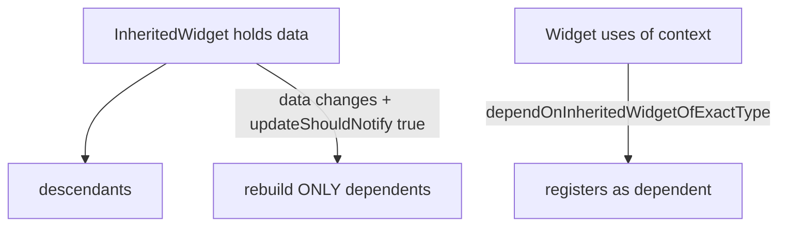
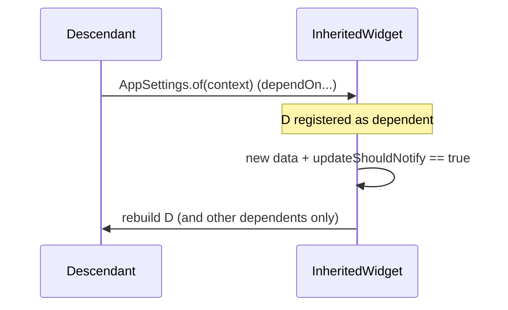

# `InheritedWidget` / `InheritedModel` (The Primitive)

> `InheritedWidget` is Flutter's built-in mechanism for efficiently propagating data *down* the tree and rebuilding only the widgets that depend on it — the primitive that Provider, Riverpod, and `Theme.of`/`MediaQuery.of` are all built on.

## Introduction

`InheritedWidget` solves prop-drilling: descendants access ancestor data via `context` (O(1)-ish), and only **dependents** rebuild when it changes. `InheritedModel` refines this to rebuild dependents only for the *specific aspects* they use. Understanding this demystifies every package that follows.

## Why this concept exists

Lifting state up + prop-drilling doesn't scale ([02_setstate_and_lifting_state.md](02_setstate_and_lifting_state.md)). `InheritedWidget` lets any descendant read ancestor data directly and subscribes it for targeted rebuilds — decoupling access from tree distance while keeping rebuilds efficient. It's *the* framework primitive for shared state.

## Real-world analogy

A **building's PA system**: information broadcast from a central point (ancestor) reaches any floor (descendant) that tunes in — without passing notes through every floor in between. `InheritedModel` is a **multi-channel PA**: you subscribe only to the channels (aspects) you care about.

## Problem Statement

You need a user's theme/locale/auth accessible anywhere in the tree, with only the widgets using it rebuilding on change. You'll build an `InheritedWidget`, expose a `.of(context)`, and see how dependency registration drives targeted rebuilds.

## Internal Working



- Subclass `InheritedWidget`, hold immutable data, and expose `static X of(BuildContext c) => c.dependOnInheritedWidgetOfExactType<X>()!`.
- `dependOn...` **registers** the calling element as a dependent and returns the data ([06 · build_context](../06%20Flutter%20Fundamentals/06_build_context.md)).
- Override **`updateShouldNotify(old)`**: return whether dependents should rebuild (compare data).
- When a **new instance** of the `InheritedWidget` is placed (usually because an ancestor `StatefulWidget` rebuilt with new data), Flutter rebuilds **only registered dependents** if `updateShouldNotify` is true.
- **`InheritedModel`**: dependents specify an **aspect**; `updateShouldNotifyDependent` decides per-aspect, so a widget using only "color" doesn't rebuild when only "font" changed.
- To make data *mutable*, wrap the `InheritedWidget` in a `StatefulWidget` that rebuilds it with new data (this is exactly what Provider automates).

## Memory Representation

The `InheritedWidget` is part of the tree; the element tracks its **dependent elements** for targeted rebuilds. Data should be immutable/value-equal for correct `updateShouldNotify` ([03 · equality_and_copying](../03%20Object%20Oriented%20Programming/07_equality_and_copying.md)).

## Compiler Behavior

Not applicable.

## Runtime Behavior

`of(context)` walks up to the nearest instance (fast, via an inherited-widget map on the element) and subscribes. On data change, only dependents rebuild — not the whole subtree.

## Flutter Engine Behavior / Dart VM Behavior

Not applicable.

## Examples

```dart
import 'package:flutter/material.dart';

// 1) The InheritedWidget carrying immutable data
class AppSettings extends InheritedWidget {
  final String locale;
  final bool darkMode;
  const AppSettings({
    super.key,
    required this.locale,
    required this.darkMode,
    required super.child,
  });

  static AppSettings of(BuildContext context) =>
      context.dependOnInheritedWidgetOfExactType<AppSettings>()!;

  @override
  bool updateShouldNotify(AppSettings old) =>
      locale != old.locale || darkMode != old.darkMode; // rebuild dependents only if changed
}

// 2) A StatefulWidget that makes it mutable by rebuilding it with new data
class SettingsScope extends StatefulWidget {
  final Widget child;
  const SettingsScope({super.key, required this.child});
  @override
  State<SettingsScope> createState() => _SettingsScopeState();

  static _SettingsScopeState of(BuildContext c) =>
      c.findAncestorStateOfType<_SettingsScopeState>()!;
}
class _SettingsScopeState extends State<SettingsScope> {
  String locale = 'en';
  bool darkMode = false;
  void toggleDark() => setState(() => darkMode = !darkMode);

  @override
  Widget build(BuildContext context) => AppSettings(
        locale: locale,
        darkMode: darkMode,
        child: widget.child,
      );
}

// 3) Descendants read via of(context) — only these rebuild on change
class DarkModeLabel extends StatelessWidget {
  const DarkModeLabel({super.key});
  @override
  Widget build(BuildContext context) {
    final settings = AppSettings.of(context); // subscribes to changes
    return Text('Dark: ${settings.darkMode}');
  }
}

void main() => runApp(MaterialApp(
      home: SettingsScope(
        child: Builder(
          builder: (context) => Scaffold(
            body: const Center(child: DarkModeLabel()),
            floatingActionButton: FloatingActionButton(
              onPressed: () => SettingsScope.of(context).toggleDark(),
              child: const Icon(Icons.dark_mode),
            ),
          ),
        ),
      ),
    ));
```

## Diagrams



## Common Mistakes

| Mistake | Why | Fix |
|---------|-----|-----|
| `updateShouldNotify` always true | Rebuilds dependents needlessly | Compare data (value equality) |
| Mutable data in the InheritedWidget | Change detection broken | Keep data immutable; rebuild with new instance |
| Reading with a context above the widget | Not found | Use a `Builder`/descendant context ([06](../06%20Flutter%20Fundamentals/06_build_context.md)) |
| Using it for everything by hand | Boilerplate | Use Provider (automates the Stateful+Inherited combo) |
| Ignoring aspects for multi-field data | Over-rebuilding | Use `InheritedModel` for per-aspect rebuilds |

## Best Practices

- Hold **immutable, value-equal** data; implement `updateShouldNotify` to compare it.
- Expose a clean `static of(context)` accessor.
- For mutability, wrap in a `StatefulWidget` that rebuilds the `InheritedWidget` — or just use **Provider**, which does this for you.
- Use **`InheritedModel`** when a widget depends on only part of a larger data object (per-aspect rebuilds).

## Performance

Targeted rebuilds (only dependents) are the key win vs lifting's subtree rebuilds. `InheritedModel` narrows further to aspects. Correct `updateShouldNotify` prevents needless rebuilds ([09 · build_phase](../09%20Rendering%20Pipeline/02_build_phase.md)).

## Advantages / Disadvantages

- **+** Built-in, efficient targeted rebuilds, no prop-drilling, the basis of `Theme`/`MediaQuery`/Provider.
- **−** Verbose to hand-write (esp. mutability), easy to get `updateShouldNotify` wrong; packages exist because raw usage is boilerplate-heavy.

## Interview Questions

1. **🟢 What problem does `InheritedWidget` solve?** — Efficiently propagating data down the tree without prop-drilling, rebuilding only widgets that depend on it.
2. **🟢 How do descendants access it?** — Via `context.dependOnInheritedWidgetOfExactType<T>()` (usually wrapped in a `static of(context)`), which also subscribes them.
3. **🟡 What does `updateShouldNotify` do?** — Returns whether dependents should rebuild when a new instance is placed — compare data to avoid needless rebuilds.
4. **🟡 How do you make `InheritedWidget` data mutable?** — Wrap it in a `StatefulWidget` that rebuilds the `InheritedWidget` with new data (which is what Provider automates).
5. **🟡 Which built-ins are `InheritedWidget`s?** — `Theme`, `MediaQuery`, `Navigator` scope, `DefaultTextStyle`, `Localizations`, etc.
6. **🔴 `InheritedWidget` vs `InheritedModel`?** — `InheritedModel` lets dependents subscribe to specific **aspects**, rebuilding only when *those* aspects change — finer-grained than all-or-nothing.
7. **🔴 How does this relate to Provider/Riverpod?** — Provider is a thin ergonomic wrapper over `InheritedWidget` (+ `ChangeNotifier`/DI); understanding the primitive explains the package.

## Senior Engineer Tips

- You rarely hand-write `InheritedWidget` in apps (use Provider), but understanding it is essential to reason about rebuilds and debug `.of(context)` errors.
- Get `updateShouldNotify` right — it's the difference between targeted and wasteful rebuilds.
- Reach for `InheritedModel`/selectors when one big shared object causes over-rebuilding.

## Architect Perspective

`InheritedWidget` is the framework's dependency-propagation + targeted-rebuild primitive — the foundation of DI-in-the-tree and of Provider/Riverpod. Grasping it lets you reason about *why* a package rebuilds what it does, choose fine-grained subscription strategies, and debug context/rebuild issues at the root ([05 · observer](../05%20Design%20Patterns/12_observer.md), [06 · build_context](../06%20Flutter%20Fundamentals/06_build_context.md)).

## Summary

- `InheritedWidget` propagates data down and rebuilds only dependents (registered via `of(context)`), gated by `updateShouldNotify`.
- Wrap in a `StatefulWidget` for mutability; `InheritedModel` gives per-aspect rebuilds.
- It's the primitive behind `Theme`/`MediaQuery`/Provider — learn it once, understand them all.

## Revision Notes

- `InheritedWidget`: data down + rebuild only dependents; access via `of(context)` (`dependOn...` subscribes).
- `updateShouldNotify` compares data (immutable/value-equal) to gate rebuilds.
- Mutability = wrap in Stateful that rebuilds it (Provider automates this).
- `InheritedModel` = per-aspect rebuilds; basis of Theme/MediaQuery/Provider.

## Practice Questions

1. Why does only part of the tree rebuild when the data changes?
2. How do you add mutability to an `InheritedWidget`?
3. When would `InheritedModel` beat `InheritedWidget`?

## Coding Questions

1. Build an `AppSettings` InheritedWidget with `of` + correct `updateShouldNotify`.
2. Add mutability via a wrapping `StatefulWidget`; toggle a value.
3. Convert a multi-field InheritedWidget to `InheritedModel` with aspects.

## Mini Project

**Settings scope (Flutter):** Implement an `InheritedWidget`-based settings scope (locale + darkMode) with a mutable wrapper and descendants that read via `of(context)`; prove only dependents rebuild. Then note how Provider would replace the boilerplate. Acceptance: targeted rebuilds; correct `updateShouldNotify`; immutable data; app runs.
