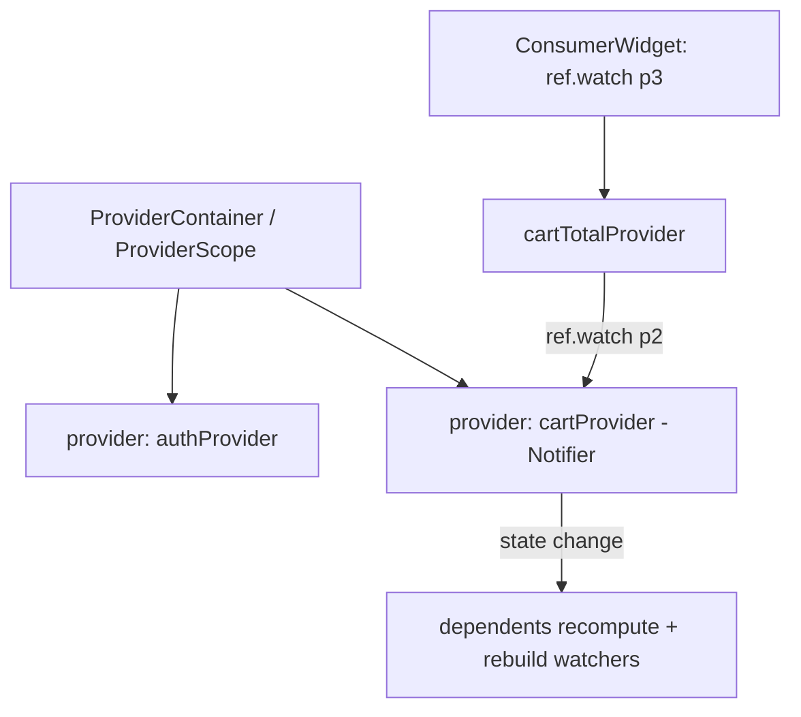

# Riverpod

> Riverpod is a compile-safe, `BuildContext`-independent evolution of Provider: providers are top-level, testable, composable, and auto-disposable, with fine-grained rebuilds via `ref.watch`/`select` — fixing Provider's runtime-lookup and context-coupling limits.

## Introduction

Riverpod (package: `flutter_riverpod` / `riverpod` + codegen) declares state as **top-level providers** accessed through a `ref`, not the widget `BuildContext`. This makes missing-provider errors compile-time, enables testing without the widget tree, and composes providers cleanly. This file covers the model, provider types, and the modern (Notifier/codegen) API.

## Why this concept exists

Provider's pain points: `ProviderNotFoundException` at runtime, `BuildContext` coupling, awkward provider-to-provider dependencies, and manual scoping. Riverpod re-architects around a `ProviderContainer` + `ref` so providers are global-but-scoped, compile-checked, and trivially testable/mocked.

## Real-world analogy

If Provider is utilities wired through the building (tree-bound), Riverpod is a **cloud service registry**: services are declared centrally, any client fetches them by handle (`ref`) with a type-safe contract, you can spin up an isolated test environment (a container) with mocked services, and unused ones auto-shut-down (autoDispose).

## Problem Statement

You need auth + a derived cart total that recomputes when either changes, testable in pure Dart, with compile-time safety and only affected widgets rebuilding. You'll compose providers and watch with `ref`.

## Internal Working



- **Providers are top-level**: `final xProvider = ...;` accessed via `ref` (in widgets via `ConsumerWidget`/`Consumer`, or `ref` in `Notifier`s).
- **Types**: `Provider` (derived/read-only), `StateProvider` (simple mutable), `NotifierProvider`/`AsyncNotifierProvider` (modern class-based mutable/async), `FutureProvider`/`StreamProvider` (async), plus `.family` (parameterized) and `.autoDispose` (auto-cleanup).
- **`ref`**: `ref.watch(p)` (subscribe/recompute), `ref.read(p)` (one-off, in callbacks), `ref.listen(p, cb)` (side effects), `ref.watch(p.select((s) => s.field))` (slice).
- **Composition**: one provider `ref.watch`es another; derived providers recompute when dependencies change (reactive graph).
- **`ProviderScope`** (widget) hosts the container; overrides let you inject mocks in tests/features.
- **Compile-safety**: referencing a provider is a Dart symbol → no runtime "not found"; codegen (`@riverpod`) adds more safety/ergonomics.

## Memory Representation

State lives in the `ProviderContainer`, keyed by provider. `autoDispose` frees state when no longer watched; otherwise it persists for the container's life ([08 · dispose_and_leaks](../08%20Widget%20Lifecycle/05_dispose_and_leaks.md)).

## Compiler Behavior

Providers are typed top-level symbols → missing/mismatched usage is a **compile/analysis error** (vs Provider's runtime exception). Codegen enforces signatures.

## Runtime Behavior

Changing a provider's state notifies watchers and recomputes dependents lazily; `select` narrows rebuilds. `autoDispose` disposes when the last listener leaves.

## Flutter Engine Behavior / Dart VM Behavior

Not applicable beyond rebuilds; logic runs on the isolate.

## Examples

```yaml
# pubspec.yaml
dependencies:
  flutter_riverpod: ^2.5.0
```

```dart
import 'package:flutter/material.dart';
import 'package:flutter_riverpod/flutter_riverpod.dart';

// Mutable state via a Notifier (modern API)
class CartNotifier extends Notifier<List<String>> {
  @override
  List<String> build() => [];
  void add(String item) => state = [...state, item]; // immutable update -> notifies
}
final cartProvider = NotifierProvider<CartNotifier, List<String>>(CartNotifier.new);

// Derived provider recomputes when cartProvider changes
final cartCountProvider = Provider<int>((ref) => ref.watch(cartProvider).length);

void main() {
  runApp(const ProviderScope(child: MyApp())); // hosts the container
}

class MyApp extends StatelessWidget {
  const MyApp({super.key});
  @override
  Widget build(BuildContext context) => const MaterialApp(home: CartScreen());
}

class CartScreen extends ConsumerWidget {
  const CartScreen({super.key});
  @override
  Widget build(BuildContext context, WidgetRef ref) {
    final count = ref.watch(cartCountProvider); // rebuilds only when count changes
    return Scaffold(
      appBar: AppBar(title: Text('Cart ($count)')),
      floatingActionButton: FloatingActionButton(
        onPressed: () => ref.read(cartProvider.notifier).add('item'), // read in callback
        child: const Icon(Icons.add),
      ),
    );
  }
}
```

```dart
// Testing in pure Dart (no widget tree):
// final container = ProviderContainer();
// container.read(cartProvider.notifier).add('x');
// expect(container.read(cartCountProvider), 1);
// container.dispose();
```

## Diagrams

```mermaid
flowchart LR
    read[ref.read] --> Callback[one-off, callbacks]
    watch[ref.watch] --> Reactive[subscribe/recompute]
    listen[ref.listen] --> SideEffect[side effects: nav/snackbar]
    select[ref.watch(p.select)] --> Slice[rebuild on slice change]
```

## Common Mistakes

| Mistake | Why | Fix |
|---------|-----|-----|
| `ref.watch` in a callback | Re-subscribes/rebuilds | Use `ref.read` in callbacks |
| Mutating state in place | Notifier compares by identity/`==` | Assign a new (immutable) `state` |
| Forgetting `ProviderScope` | No container | Wrap the app in `ProviderScope` |
| Not using `autoDispose` for ephemeral async | State lingers | Use `.autoDispose` |
| Whole-object `watch` for one field | Over-rebuild | Use `.select` |
| Side effects in `build` | Impure/looping | Use `ref.listen` for nav/snackbars |

## Best Practices

- Keep **Notifiers UI-free**; assign **immutable new state** to trigger updates.
- `read` in callbacks, `watch` in build, `listen` for side effects, `select` for slices.
- Use `.autoDispose` for screen-scoped/async state; `.family` for parameterized providers.
- Test with a `ProviderContainer` + `overrides` (mock dependencies) — no widget tree needed.
- Prefer the modern `Notifier`/`AsyncNotifier` (+ codegen `@riverpod`) API.

## Performance

Fine-grained: only watchers of changed providers/slices recompute/rebuild; derived providers recompute lazily; `autoDispose` bounds memory. Excellent rebuild control ([09 · build_phase](../09%20Rendering%20Pipeline/02_build_phase.md)).

## Advantages / Disadvantages

- **+** Compile-safe, context-independent, trivially testable/mockable, composable reactive graph, autoDispose/family, fine rebuilds.
- **−** Steeper concepts (providers/ref/notifiers), more API surface, codegen setup for the best ergonomics, another dependency.

## Interview Questions

1. **🟢 How does Riverpod differ from Provider?** — Providers are top-level and accessed via `ref` (not `BuildContext`), giving compile-time safety, easy testing/mocking, and composition — no runtime `ProviderNotFoundException`.
2. **🟢 `ref.watch` vs `ref.read` vs `ref.listen`?** — `watch`: subscribe/recompute (build). `read`: one-off (callbacks). `listen`: run side effects on change (nav/snackbar).
3. **🟡 How do you update a `Notifier`'s state?** — Assign a new (immutable) value to `state`; in-place mutation won't notify reliably.
4. **🟡 What are `.family` and `.autoDispose`?** — `.family` parameterizes a provider (e.g., by id); `.autoDispose` disposes state when no longer watched.
5. **🟡 How do you test Riverpod logic?** — With a `ProviderContainer` (+ `overrides` for mocks) in pure Dart — no widgets.
6. **🔴 How does Riverpod achieve compile-time safety?** — Providers are typed top-level Dart symbols; referencing an undefined one is a compile error, unlike Provider's runtime lookup by type.
7. **🔴 How do derived/composed providers work?** — A provider `ref.watch`es others; it recomputes when any dependency changes, forming a reactive dependency graph.

## Senior Engineer Tips

- Model state as **immutable** and update via new `state` — pairs with `freezed` for clean data classes ([02 · immutability](../02%20Advanced%20Dart/10_immutability.md)).
- Use `overrides` in `ProviderScope` for feature/test injection — best-in-class DI + testability.
- Reach for `select`/`autoDispose`/`family` deliberately; they're the levers for performance and lifecycle.

## Architect Perspective

Riverpod is DIP + Observer as a compile-checked, testable reactive graph decoupled from the widget tree — an excellent backbone for scalable, testable apps and clean architecture ([Module 40](../40%20Clean%20Architecture/README.md)). Its testability and composition make it a strong default for medium-to-large codebases, at the cost of a steeper model.

## Summary

- Riverpod: top-level, `ref`-accessed, compile-safe, testable, composable providers with fine rebuilds and autoDispose/family.
- `read`/`watch`/`listen`/`select`; update `Notifier` state immutably; test via `ProviderContainer`+overrides.
- Fixes Provider's runtime-lookup + context coupling; steeper but more powerful.

## Revision Notes

- Top-level providers + `ref` (not context); compile-safe; test with `ProviderContainer`+overrides.
- Types: Provider/StateProvider/NotifierProvider/AsyncNotifier/Future/Stream; `.family`, `.autoDispose`.
- `read`(callbacks)/`watch`(build)/`listen`(side effects)/`select`(slice).
- Immutable `state =`; wrap app in `ProviderScope`.

## Practice Questions

1. Why is Riverpod compile-safe where Provider isn't?
2. How do you update Notifier state correctly?
3. How do you inject a mock repository in a test?

## Coding Questions

1. Build a `NotifierProvider` cart + derived `cartCountProvider`; consume with `ConsumerWidget`.
2. Add `.autoDispose` + `.family` to a per-id async detail provider.
3. Unit-test the notifier with `ProviderContainer` + an overridden repository.

## Mini Project

**Cart with Riverpod (Flutter):** Rebuild the cart feature: `CartNotifier` (immutable state), derived count provider, `ref.listen` for a "added" snackbar, `select` for the badge, and a `ProviderContainer` test with a mocked repo. Acceptance: compile-safe; fine rebuilds; pure-Dart tests with overrides; app runs. (Part of the 5-way comparison capstone.)
