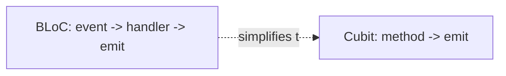

# Cubit (Simplified BLoC)

> A Cubit is a BLoC without events: it exposes **methods** that directly `emit` new immutable states — the same testable, stream-based state machine with far less boilerplate, ideal when you don't need event traceability.

## Introduction

Cubit (same package: `flutter_bloc`) is `BLoC`'s lighter sibling. Instead of dispatching events that map to states, you call methods (`increment()`, `loadCart()`) that `emit` states directly. UI renders via `BlocBuilder`/`BlocSelector` exactly like BLoC. It's the recommended default unless events add value.

## Why this concept exists

Full BLoC's event layer is overhead when you don't need event logging/replay/complex transitions. Cubit keeps BLoC's benefits (immutable states, streams, testability, `flutter_bloc` tooling, DI) while removing event classes and handlers — a pragmatic middle ground.

## Real-world analogy

If BLoC is a **vending machine with buttons** (events) routed to a controller, Cubit is a **person you just ask directly** ("give me a soda") — same result and internal state transitions, without the button-press indirection.

## Problem Statement

A counter/cart with loading + error states needs testable logic and controlled rebuilds, but doesn't need event traceability. You'll use a `Cubit` with methods that `emit`.

## Internal Working

```mermaid
flowchart LR
    UI -->|cubit.method()| Cubit
    Cubit -->|emit(State)| StateStream[Stream of States]
    StateStream --> BlocBuilder
    BlocBuilder --> UI
```

- **`Cubit<State>`**: extends `Cubit`, holds current `state`, exposes methods that call `emit(newState)`.
- **States**: immutable, value-equal (`Equatable`/`freezed`) — same as BLoC.
- **UI**: `context.read<XCubit>().method()` to trigger; `BlocBuilder`/`BlocSelector`/`BlocListener`/`BlocConsumer` to render/react (identical widgets to BLoC).
- **Provision**: `BlocProvider<XCubit>` injects + disposes (closes the stream).
- **No events**: transitions are just method calls → less boilerplate, but no event history/replay.

## Memory Representation

Cubit holds current state + a state stream; `BlocProvider` disposes it. Immutable states ([02 · immutability](../02%20Advanced%20Dart/10_immutability.md)).

## Compiler Behavior

Sealed state families enable exhaustive rendering; missing-cubit lookup is runtime (like Provider/BLoC).

## Runtime Behavior

A method mutates via `emit(state)` (sync or after async work); subscribed builders rebuild per new state (subject to `buildWhen`/`BlocSelector`).

## Flutter Engine Behavior / Dart VM Behavior

Not applicable beyond rebuilds.

## Examples

```yaml
# pubspec.yaml
dependencies:
  flutter_bloc: ^8.1.0
  equatable: ^2.0.0
```

```dart
import 'package:equatable/equatable.dart';
import 'package:flutter/material.dart';
import 'package:flutter_bloc/flutter_bloc.dart';

// State (immutable, value-equal)
sealed class CartState extends Equatable {
  const CartState();
  @override
  List<Object?> get props => [];
}
class CartLoaded extends CartState {
  final List<String> items;
  const CartLoaded(this.items);
  @override
  List<Object?> get props => [items];
}

// Cubit: methods emit states directly (no events)
class CartCubit extends Cubit<CartState> {
  CartCubit() : super(const CartLoaded([]));

  void add(String item) {
    final items = (state as CartLoaded).items;
    emit(CartLoaded([...items, item])); // emit new immutable state
  }

  Future<void> load() async {
    // emit(CartLoading());
    final items = await Future.value(['a', 'b']); // simulate repo call
    emit(CartLoaded(items));
  }
}

class CartScreen extends StatelessWidget {
  const CartScreen({super.key});
  @override
  Widget build(BuildContext context) {
    return BlocProvider(
      create: (_) => CartCubit(),
      child: Scaffold(
        appBar: AppBar(
          title: BlocSelector<CartCubit, CartState, int>(
            selector: (s) => s is CartLoaded ? s.items.length : 0, // rebuild on count only
            builder: (_, count) => Text('Cart ($count)'),
          ),
        ),
        floatingActionButton: Builder(
          builder: (context) => FloatingActionButton(
            onPressed: () => context.read<CartCubit>().add('item'),
            child: const Icon(Icons.add),
          ),
        ),
      ),
    );
  }
}
```

```dart
// Testing (bloc_test works for Cubit too):
// blocTest<CartCubit, CartState>('adds',
//   build: () => CartCubit(), act: (c) => c.add('x'),
//   expect: () => [const CartLoaded(['x'])]);
```

## Diagrams



## Common Mistakes

| Mistake | Why | Fix |
|---------|-----|-----|
| Mutable states / no `Equatable` | Broken rebuild control | Immutable + value equality |
| Using Cubit where events add real value | Lose traceability | Use full BLoC for complex/auditable flows |
| Business logic in the UI | Defeats the pattern | Put it in the cubit |
| No `BlocSelector`/`buildWhen` | Over-rebuild | Select the slice you render |
| Emitting after `close()` | Error | Guard/ensure cubit alive |

## Best Practices

- Default to **Cubit** for most feature state; escalate to **BLoC** only when events add value (audit/log/replay/complex transitions).
- Immutable, value-equal states; UI-free cubit; inject repositories.
- Use `BlocSelector`/`buildWhen` for fine rebuilds; `BlocListener` for side effects.
- Test with `bloc_test`/plain unit tests.

## Performance

Same as BLoC: value-equal states + `BlocSelector`/`buildWhen` give tight rebuilds; less boilerplate than BLoC with equal runtime characteristics ([09 · build_phase](../09%20Rendering%20Pipeline/02_build_phase.md)).

## Advantages / Disadvantages

- **+** Much less boilerplate than BLoC, same testability/tooling/DI, immutable states, easy to read.
- **−** No event history/replay; still more ceremony than Provider/`setState` for trivial state; runtime lookup.

## Interview Questions

1. **🟢 What is a Cubit?** — A simplified BLoC without events: methods directly `emit` immutable states.
2. **🟢 Cubit vs BLoC?** — Cubit uses methods (no event classes/handlers) — less boilerplate; BLoC's events add traceability/replay for complex flows.
3. **🟡 How does the UI use a Cubit?** — `context.read<XCubit>().method()` to trigger; `BlocBuilder`/`BlocSelector`/`BlocListener` to render/react (same as BLoC).
4. **🟡 Do states still need to be immutable/value-equal?** — Yes — for correct `buildWhen`/`BlocSelector` behavior (`Equatable`/`freezed`).
5. **🟡 How is a Cubit disposed?** — `BlocProvider` closes it (its stream) when removed.
6. **🔴 When would you choose BLoC over Cubit?** — When explicit events give value: auditing/logging user intents, replay/undo, complex multi-event transitions, or clearer modeling of many input types.
7. **🔴 Is Cubit testable like BLoC?** — Yes; `bloc_test` and plain unit tests both work since logic is UI-free.

## Senior Engineer Tips

- Reach for Cubit first; only "upgrade" to BLoC when you feel the need for events (you usually don't).
- Keep cubits pure-Dart (no Flutter imports) and inject dependencies for clean tests.
- Use `freezed` states for immutability + `copyWith` in async flows (loading/loaded/error).

## Architect Perspective

Cubit gives BLoC's separation and testability at lower ceremony — often the sweet spot for feature state in medium apps. It pairs with Clean Architecture use cases/repositories ([Module 40](../40%20Clean%20Architecture/README.md)) just like BLoC, and standardizing on Cubit-by-default/BLoC-when-needed is a pragmatic team convention.

## Summary

- Cubit = BLoC minus events: methods `emit` immutable states; same rendering widgets, tooling, testability, DI.
- Less boilerplate; escalate to BLoC only when events add value.
- Immutable value-equal states + `BlocSelector`/`buildWhen`; inject repos; test with `bloc_test`.

## Revision Notes

- Cubit: method → `emit(state)`; no events. Same `BlocProvider`/`BlocBuilder`/`BlocSelector`/`BlocListener`.
- Immutable value-equal states; UI-free; inject repos; disposed by `BlocProvider`.
- Default Cubit; BLoC when events add value (audit/replay/complex).

## Practice Questions

1. What does Cubit remove compared to BLoC, and what's the tradeoff?
2. How do you keep rebuilds tight with a Cubit?
3. When do events justify full BLoC?

## Coding Questions

1. Build a `CounterCubit` (increment/decrement/reset) + `BlocBuilder`.
2. Add async `load()` with loading/loaded/error states.
3. Convert a `CartBloc` to a `CartCubit`; note the boilerplate saved.

## Mini Project

**Cart with Cubit (Flutter):** Rebuild the cart with a `CartCubit` (immutable states, async load, error), `BlocSelector` badge, `BlocListener` snackbar, injected repo, and `bloc_test`. Compare LOC/complexity to the BLoC version. Acceptance: UI-free cubit; fine rebuilds; tests pass; boilerplate reduction noted; app runs. (Part of the 5-way comparison.)
