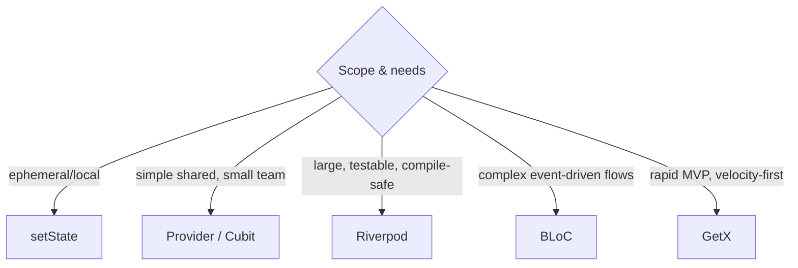
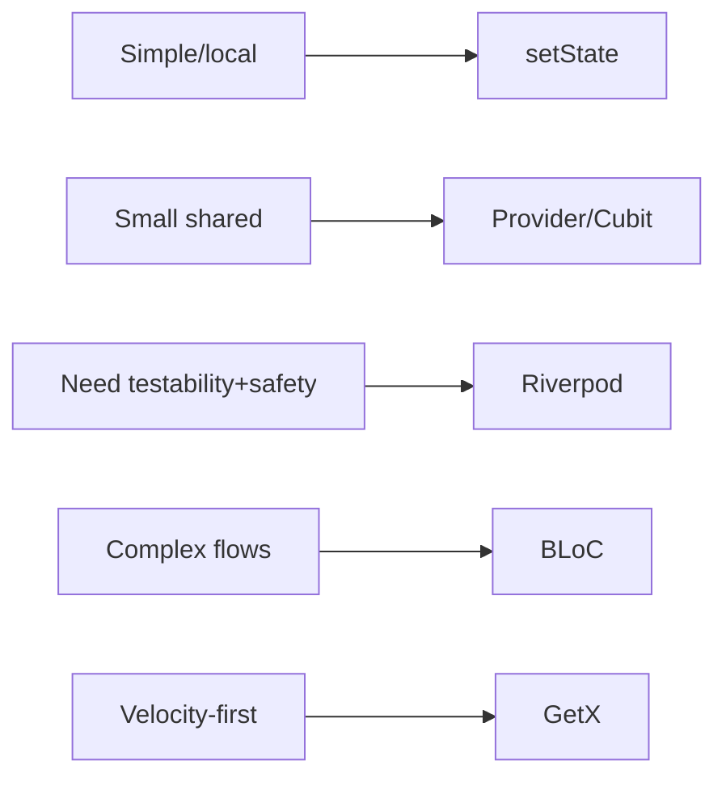

# Comparison & Selection Guide (5-Way Lens)

> There is no universally "best" state solution — only the best fit for your scope, team, testability, and rebuild needs. This guide compares the five main solutions on folder structure, performance, scalability, boilerplate, maintainability, and interview value, and gives a decision tree.

## Introduction

This is the synthesis file: a side-by-side comparison of **Provider, Riverpod, BLoC, Cubit, GetX** (plus the built-ins), the trade-off matrix, and a defensible selection framework you can articulate in a design review or interview.

## Why this concept exists

Choosing a state solution is a high-stakes, long-lived decision. Teams need an objective basis — not popularity — to pick, justify, and standardize. This guide encodes the criteria and the reasoning.

## Real-world analogy

Choosing a state solution is like **choosing a vehicle**: a bike (`setState`) for short trips, a car (Provider/Cubit) for daily commuting, a truck (BLoC) for heavy structured loads, a modular EV platform (Riverpod) for future-proof flexibility, and an all-in-one camper (GetX) for going fast with everything onboard. Pick by the *journey*, not the brochure.

## Problem Statement

Given an app's characteristics (size, team, testability bar, complexity), which solution — and how do you defend it? By the end you'll apply the matrix + decision tree.

## Internal Working (the comparison)



### Trade-off matrix

| Criterion | setState + Inherited | Provider | Riverpod | BLoC | Cubit | GetX |
|-----------|----------------------|----------|----------|------|-------|------|
| **Boilerplate** | Lowest (local) | Low | Medium | High | Medium | Lowest (shared) |
| **Learning curve** | Easy | Easy | Medium-High | High | Medium | Easy |
| **Testability** | Poor (UI-coupled) | Good | Excellent | Excellent | Excellent | Fair (if disciplined) |
| **Compile-time safety** | N/A | Runtime lookup | Compile-safe | Runtime lookup | Runtime lookup | Runtime lookup |
| **Rebuild control** | Coarse (subtree) | Good (`select`) | Excellent (`select`/family) | Excellent (`buildWhen`) | Excellent (`BlocSelector`) | Excellent (`Obx`) |
| **DI built-in** | No | Yes (tree) | Yes (container) | Via provider | Via provider | Yes (container) |
| **Context-independence** | No | No | Yes | No | No | Yes |
| **Scalability** | Low | Medium | High | High | High | Medium |
| **Structure enforced** | None | Light | Medium | Strong | Medium | Light |
| **Interview value** | Foundational | High | High | Very High | High | Medium |
| **Best for** | Local UI | Small-medium apps | Medium-large, testable | Complex/enterprise flows | Most feature state | MVPs/solo/rapid |

### Rebuild-scope summary

- **Coarse**: raw `setState` (rebuilds the `State`'s subtree).
- **Fine (opt-in)**: Provider `select`/`Selector`, Riverpod `select`, BLoC `buildWhen`/`BlocSelector`, Cubit `BlocSelector`, GetX `Obx` (auto). All can be fine-grained *if used correctly* ([09 · build_phase](../09%20Rendering%20Pipeline/02_build_phase.md)).

## Memory Representation

All shared solutions keep state outside the tree (containers/providers) with disposal responsibilities; Riverpod `autoDispose` and route-scoped GetX/Bloc providers help bound lifetime ([08 · dispose_and_leaks](../08%20Widget%20Lifecycle/05_dispose_and_leaks.md)).

## Compiler Behavior

Only **Riverpod** gives compile-time provider safety; others surface missing dependencies at runtime — a real reliability differentiator at scale.

## Runtime Behavior

All are Observer-based; performance differences come mostly from *how narrowly you subscribe*, not the library itself. Correct selector usage matters more than the choice for rebuild cost.

## Flutter Engine Behavior / Dart VM Behavior

Not applicable beyond rebuilds.

## Examples

```dart
// Same feature (counter), five ways — headline differences:
// setState:  int _c; setState(() => _c++);                 // local, coarse
// Provider:  ChangeNotifierProvider + context.select        // tree DI + fine
// Riverpod:  NotifierProvider + ref.watch(select)           // compile-safe + testable
// BLoC:      add(Increment()) -> on<Increment>(emit(...))   // events -> states
// Cubit:     cubit.increment() -> emit(...)                 // methods -> states
// GetX:      count.value++ inside Obx(() => Text(...))       // observable, minimal
```

## Diagrams



## Common Mistakes

| Mistake | Why | Fix |
|---------|-----|-----|
| Choosing by popularity | Wrong fit | Use scope/team/testability/complexity criteria |
| Mixing many solutions ad hoc | Inconsistent, confusing | Standardize one primary (setState still allowed for local) |
| Over-engineering (BLoC for a toggle) | Boilerplate waste | Match tool to complexity |
| Under-engineering (global mutable state) | Untestable, buggy | Use a proper solution + DI |
| Ignoring rebuild scope | Jank | Use selectors regardless of solution |
| Never migrating a bad fit | Tech debt | Re-evaluate as the app grows |

## Best Practices

- **Classify state first** (ephemeral vs app — [01_overview_and_choosing.md](01_overview_and_choosing.md)); use `setState` for local regardless of your shared solution.
- Pick **one primary shared solution** and standardize it across the codebase.
- Prioritize **testability + fine-grained rebuilds** for shared state; keep logic UI-free.
- Match tool to **complexity**: Cubit/Provider for most; BLoC for complex flows; Riverpod for scale/testability; GetX for velocity (with discipline).
- Be ready to **defend** the choice with these criteria in reviews/interviews.

## Performance

Comparable when used well; the differentiator is subscription granularity (selectors) and lifecycle (autoDispose/scoping), not the library brand ([09 · build_phase](../09%20Rendering%20Pipeline/02_build_phase.md), [Module 21](../21%20Performance/README.md)).

## Advantages / Disadvantages (meta)

- **+** A criteria-based framework yields defensible, consistent choices and avoids religious debates.
- **−** Requires understanding all options; the "right" answer is contextual and can change as the app evolves.

## Interview Questions

1. **🟢 Is there a best state management solution?** — No; the best fit depends on scope, complexity, testability, rebuild needs, and team — defend with criteria, not popularity.
2. **🟢 Provider vs Riverpod headline?** — Riverpod is compile-safe and `BuildContext`-independent with easier testing/composition; Provider is simpler, older, and context-based (runtime lookup).
3. **🟡 BLoC vs Cubit?** — BLoC adds an event layer (traceability/replay, complex flows); Cubit uses methods directly (less boilerplate) — default to Cubit, escalate to BLoC when events add value.
4. **🟡 When is `setState` still correct in a big app?** — For ephemeral/local UI state; not everything needs global management.
5. **🟡 What's the main criticism of GetX?** — It encourages global state/context-less shortcuts and has runtime DI errors, which can hurt testability/structure at scale.
6. **🔴 What actually drives rebuild performance across solutions?** — Subscription granularity (selectors) and correct lifecycle — not the library; misuse causes jank in any of them.
7. **🔴 How would you choose for a large, multi-team, highly-tested app?** — Likely Riverpod or BLoC/Cubit (compile-safety/testability/structure), standardized, with `setState` for local UI — and I'd justify via the trade-off matrix.

## Senior Engineer Tips

- Lead with **classification + criteria**; interviewers/reviewers value reasoning over naming a favorite.
- Standardize one solution; document the convention and the "use `setState` for local" rule.
- Revisit the choice at growth inflection points; migrating a well-separated (UI-free logic) codebase is far easier.

## Architect Perspective

The durable win is **separation and testability**, achievable with several solutions. Choose based on team capability, testability bar, complexity, and longevity; enforce consistency; keep business logic out of widgets. The package matters less than the discipline — but compile-safety (Riverpod) and structure (BLoC) pay off as scale and team size grow ([Modules 40, 43, 47](../40%20Clean%20Architecture/README.md)).

## Summary

- No universal best; choose by scope/complexity/testability/rebuild/team via the trade-off matrix + decision tree.
- `setState` for local; one standardized shared solution; logic UI-free; selectors for rebuild control.
- Riverpod (compile-safe/testable), BLoC (complex flows), Cubit (most feature state), Provider (simple), GetX (velocity with discipline).

## Revision Notes

- Decide: ephemeral→setState; simple shared→Provider/Cubit; scale+test→Riverpod; complex→BLoC; velocity→GetX.
- Only Riverpod = compile-safe; all Observer-based; rebuild perf = selector usage.
- Cubit default, BLoC when events add value; standardize one; keep logic UI-free.
- Defend choices with the matrix (boilerplate/testability/scalability/structure).

## Practice Questions

1. Defend a state solution for a 3-person MVP vs a 30-person enterprise app.
2. Why is Riverpod's compile-safety a scale advantage?
3. What single practice most affects rebuild performance across all solutions?

## Coding Questions

1. Implement the counter feature in all five and compare LOC/rebuild scope/testability.
2. Add fine-grained rebuilds (selector equivalents) in each.
3. Write the decision rationale for a given app spec.

## Mini Project — 5-way comparison capstone

**Counter+ five ways (Flutter):** Build one feature — a counter with async load, loading/error states, and a derived label — in **Provider, Riverpod, BLoC, Cubit, and GetX**. For each, measure/record: folder structure, lines of boilerplate, rebuild scope (widgets rebuilt per change), testability (write one logic test), and note interview value. Produce `COMPARISON.md` with the filled trade-off matrix and a recommendation for (a) a solo MVP and (b) a large team app. Acceptance: all five implemented with UI-free logic + fine-grained rebuilds; matrix filled from real observations; justified recommendations.
