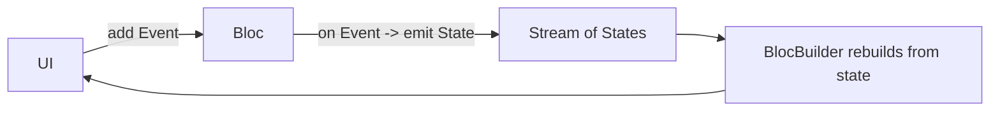
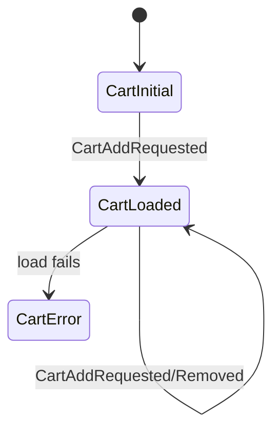

# BLoC (Business Logic Component)

> BLoC turns UI interactions into a stream of **events** that a `Bloc` maps to a stream of immutable **states**; widgets dispatch events and rebuild from states — a highly testable, explicit, event-driven architecture ideal for complex flows.

## Introduction

BLoC (package: `flutter_bloc` / `bloc`) separates business logic into a component that receives **events** and emits **states**. UI sends events (`context.read<XBloc>().add(...)`) and renders states (`BlocBuilder`). Its discipline — explicit events, immutable states, unidirectional flow — shines for complex, multi-state features.

## Why this concept exists

For complex features (checkout, auth flows, forms with many transitions), ad-hoc state gets tangled. BLoC imposes a clear, testable contract: *events in → states out*, with all logic in one place, decoupled from UI. It's built on streams ([02 · streams](../02%20Advanced%20Dart/streams.md)) and the State pattern ([05 · state](../05%20Design%20Patterns/state.md)).

## Real-world analogy

A **vending machine**: you press buttons (events); an internal controller transitions through states (idle → selecting → dispensing → change) and shows each on the display (states). The buttons don't contain the logic; the controller does, and every transition is explicit and inspectable.

## Problem Statement

A cart with async loading, success, and error states, plus add/remove events, must be fully unit-testable and have explicit, traceable transitions. You'll model events + states and a `Bloc` mapping between them.

## Internal Working



- **Events**: input intents (often a sealed class family): `CartAddRequested`, `CartLoadRequested`.
- **States**: immutable snapshots (sealed family): `CartLoading`, `CartLoaded(items)`, `CartError(message)`.
- **`Bloc<Event, State>`**: registers handlers via `on<Event>((event, emit) { ... emit(newState); })`; can `emit` multiple states (loading→loaded) and do async work.
- **UI**:
  - Dispatch: `context.read<CartBloc>().add(CartAddRequested(item))`.
  - Render: `BlocBuilder<CartBloc, CartState>` (rebuild), `BlocListener` (side effects: nav/snackbar), `BlocConsumer` (both), `buildWhen`/`listenWhen` (control).
- **Provision**: `BlocProvider` (built on `provider`/`InheritedWidget`) injects and disposes the bloc.
- **Immutability + `Equatable`/`freezed`** on states enables `buildWhen` and correct rebuilds ([02 · immutability](../02%20Advanced%20Dart/immutability.md)).

## Memory Representation

The bloc holds current state + a state stream; `BlocProvider` disposes it (closing streams). States are immutable value objects ([08 · dispose_and_leaks](../08%20Widget%20Lifecycle/dispose_and_leaks.md)).

## Compiler Behavior

Sealed event/state families give exhaustive `switch` handling ([02 · records_and_patterns](../02%20Advanced%20Dart/records_and_patterns.md)); missing-bloc lookup is a runtime error (like Provider).

## Runtime Behavior

`add(event)` enqueues; the matching `on<Event>` handler runs (async allowed), calling `emit(state)` one or more times; subscribed builders rebuild per new state (subject to `buildWhen`).

## Flutter Engine Behavior / Dart VM Behavior

Not applicable beyond rebuilds; async runs on the event loop ([02 · event_loop](../02%20Advanced%20Dart/event_loop.md)).

## Examples

```yaml
# pubspec.yaml
dependencies:
  flutter_bloc: ^8.1.0
  equatable: ^2.0.0
```

```dart
import 'package:equatable/equatable.dart';
import 'package:flutter/material.dart';
import 'package:flutter_bloc/flutter_bloc.dart';

// Events
sealed class CartEvent {}
class CartAddRequested extends CartEvent {
  final String item;
  CartAddRequested(this.item);
}

// States (immutable, value-equal)
sealed class CartState extends Equatable {
  @override
  List<Object?> get props => [];
}
class CartInitial extends CartState {}
class CartLoaded extends CartState {
  final List<String> items;
  CartLoaded(this.items);
  @override
  List<Object?> get props => [items];
}

// Bloc: events -> states
class CartBloc extends Bloc<CartEvent, CartState> {
  CartBloc() : super(CartInitial()) {
    on<CartAddRequested>((event, emit) {
      final current = state is CartLoaded ? (state as CartLoaded).items : <String>[];
      emit(CartLoaded([...current, event.item])); // emit new immutable state
    });
  }
}

class CartScreen extends StatelessWidget {
  const CartScreen({super.key});
  @override
  Widget build(BuildContext context) {
    return BlocProvider(
      create: (_) => CartBloc(),
      child: Scaffold(
        appBar: AppBar(
          // Rebuild count only when items change (buildWhen)
          title: BlocBuilder<CartBloc, CartState>(
            buildWhen: (p, n) => p is! CartLoaded || n is! CartLoaded ||
                p.items.length != n.items.length,
            builder: (context, state) =>
                Text('Cart (${state is CartLoaded ? state.items.length : 0})'),
          ),
        ),
        floatingActionButton: Builder(
          builder: (context) => FloatingActionButton(
            onPressed: () => context.read<CartBloc>().add(CartAddRequested('item')),
            child: const Icon(Icons.add),
          ),
        ),
      ),
    );
  }
}
```

```dart
// Testing with bloc_test (pure Dart):
// blocTest<CartBloc, CartState>('adds item',
//   build: () => CartBloc(),
//   act: (b) => b.add(CartAddRequested('x')),
//   expect: () => [isA<CartLoaded>()]);
```

## Diagrams



## Common Mistakes

| Mistake | Why | Fix |
|---------|-----|-----|
| Mutable states / no `Equatable` | Broken rebuild control | Immutable states + `Equatable`/`freezed` |
| Emitting after the handler completes | `emit` invalid | Do async within the handler, emit before returning |
| Business logic in the UI | Defeats BLoC | Put logic in the bloc; UI dispatches/renders |
| No `buildWhen` on hot builders | Over-rebuild | Use `buildWhen`/`BlocSelector` |
| Side effects in `BlocBuilder` | Impure/duplicated | Use `BlocListener`/`BlocConsumer` |
| Overusing BLoC for trivial state | Boilerplate overkill | Use Cubit/`setState` for simple cases |

## Best Practices

- Model **events** and **states** as sealed, immutable (`Equatable`/`freezed`) families.
- Keep the bloc **UI-free**; UI only dispatches events and renders states.
- Use `BlocBuilder`+`buildWhen`/`BlocSelector` for rebuilds; `BlocListener` for side effects.
- Inject repositories into blocs (constructor DI); test with `bloc_test`.
- Prefer **Cubit** ([cubit.md](cubit.md)) when events add no value (simpler API).

## Performance

Rebuild control via `buildWhen`/`BlocSelector` and value-equal states; unaffected widgets don't rebuild. State stream overhead is negligible; the discipline cost is boilerplate ([09 · build_phase](../09%20Rendering%20Pipeline/build_phase.md)).

## Advantages / Disadvantages

- **+** Explicit, testable, traceable (event/state history), great for complex flows, strong tooling (`bloc_test`, DevTools), clear UI/logic separation.
- **−** Boilerplate (events + states + handlers), overkill for simple state, learning curve, runtime bloc lookup.

## Interview Questions

1. **🟢 What is BLoC's core model?** — UI dispatches **events**; the `Bloc` maps them to immutable **states**; widgets rebuild from states — unidirectional, event-driven.
2. **🟢 Events vs states?** — Events are inputs/intents; states are immutable output snapshots the UI renders.
3. **🟡 How do you register event handling?** — `on<Event>((event, emit) { ...; emit(state); })` in the bloc's constructor; `emit` can be called multiple times (e.g., loading→loaded).
4. **🟡 How do widgets interact with a bloc?** — Dispatch via `context.read<XBloc>().add(...)`; render via `BlocBuilder`; side effects via `BlocListener`; both via `BlocConsumer`.
5. **🟡 How do you control rebuilds?** — `buildWhen`/`BlocSelector` plus value-equal states (`Equatable`/`freezed`).
6. **🔴 Why is BLoC highly testable?** — Logic is a pure event→state function decoupled from UI; `bloc_test` asserts emitted state sequences in pure Dart.
7. **🔴 BLoC vs Cubit?** — Cubit drops events and exposes methods that `emit` directly — simpler, less boilerplate; BLoC's events add traceability/replayability for complex flows ([cubit.md](cubit.md)).

## Senior Engineer Tips

- Use `freezed` for events/states to get immutability + unions + `copyWith` cheaply.
- Reserve BLoC for genuinely complex, event-driven features; use Cubit/`setState` otherwise to avoid boilerplate.
- Inject repositories; keep blocs free of Flutter imports so they're pure-Dart testable.

## Architect Perspective

BLoC is a disciplined application-layer pattern: it enforces unidirectional flow, immutable state machines, and UI/logic separation — pairing naturally with Clean Architecture use cases/repositories ([Module 40](../40%20Clean%20Architecture/README.md)) and sealed-class state modeling. Its testability and explicitness make it a common enterprise choice, justified when complexity warrants the boilerplate.

## Summary

- BLoC: events → (bloc) → immutable states; UI dispatches + renders.
- Sealed, value-equal events/states; UI-free bloc; `buildWhen`/listeners; inject repos; `bloc_test`.
- Excellent for complex flows; overkill for simple state (use Cubit/`setState`).

## Revision Notes

- Events in → states out; `on<Event>((e, emit) => emit(state))`.
- UI: `read().add(event)` + `BlocBuilder`/`BlocListener`/`BlocConsumer` (+ `buildWhen`/`BlocSelector`).
- Immutable states + `Equatable`/`freezed`; inject repos; `BlocProvider` disposes.
- Complex flows → BLoC; simple → Cubit/`setState`.

## Practice Questions

1. Why must states be immutable + value-equal?
2. How do you emit loading then loaded from one event?
3. When choose Cubit over BLoC?

## Coding Questions

1. Build a `CartBloc` with add/remove events and loaded/error states.
2. Add async load (loading→loaded/error) within a handler.
3. Write a `bloc_test` asserting the emitted state sequence.

## Mini Project

**Cart with BLoC (Flutter):** Rebuild the cart: sealed events/states (freezed/Equatable), async load with loading/error, `BlocBuilder`+`buildWhen` for the badge, `BlocListener` for a snackbar, injected repository, and `bloc_test` coverage. Acceptance: UI-free bloc; explicit states; fine rebuilds; tests pass; app runs. (Part of the 5-way comparison.)
