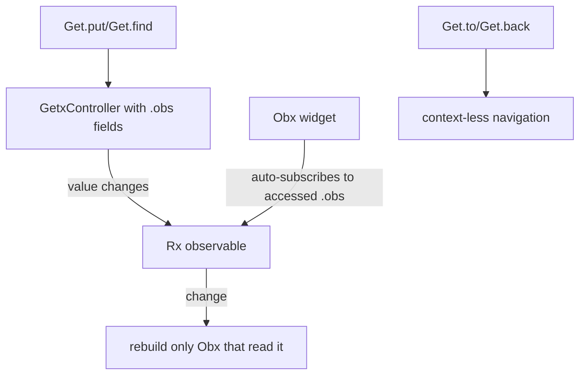
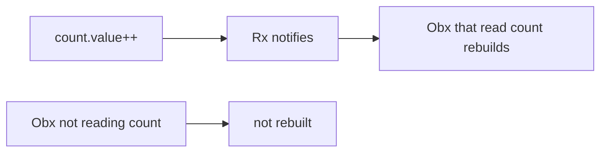

# GetX

> GetX is an all-in-one package combining reactive state management, dependency injection, and routing with minimal boilerplate — extremely productive and beginner-friendly, but its convenience (context-less navigation, global access) invites architectural shortcuts.

## Introduction

GetX (package: `get`) bundles three things: **reactive state** (`.obs` + `Obx`), **DI** (`Get.put`/`Get.find`), and **navigation** (`Get.to`/`Get.back`, no `context`). You wrap state in observables and rebuild with `Obx`. It's popular for rapid development; this file covers it fairly, including where it can lead teams astray.

## Why this concept exists

GetX targets developer velocity: minimal boilerplate, no `BuildContext` needed for many operations, and one dependency for state+DI+routing. For small apps/MVPs and solo devs, that productivity is compelling.

## Real-world analogy

GetX is a **Swiss Army knife**: state, DI, and routing in one tool — super convenient for quick jobs. But like a multi-tool, leaning on it for everything (especially context-less globals) can encourage sloppy structure compared to purpose-built tools.

## Problem Statement

A cart needs reactive updates and easy navigation with minimal ceremony for a fast MVP. You'll use `.obs` + `Obx`, `Get.put` for the controller, and `Get.to` for navigation — and note the tradeoffs.

## Internal Working



- **Reactive state**: make a value observable with `.obs` (`final count = 0.obs;`); update via `count.value++`. `Obx(() => Text('${count.value}'))` auto-subscribes to whatever observables it reads and rebuilds on change.
- **Controllers**: `GetxController` holds observables + logic; `onInit`/`onClose` lifecycle.
- **DI**: `Get.put(Controller())` registers; `Get.find<Controller>()` retrieves; `Get.lazyPut` for lazy; auto-dispose when routes close (`GetBuilder`/bindings).
- **Routing**: `Get.to(Page())`, `Get.back()`, named routes — without `BuildContext`.
- **`GetBuilder`**: manual (non-reactive) rebuild via `update()` for finer control.

## Memory Representation

Controllers live in GetX's DI container; route-scoped controllers auto-dispose when their route is removed (with bindings). Observables hold listeners ([08 · dispose_and_leaks](../08%20Widget%20Lifecycle/dispose_and_leaks.md)).

## Compiler Behavior

`Get.find<T>()` for an unregistered type fails at **runtime** (like Provider). No compile-time provider safety.

## Runtime Behavior

`Obx` tracks which observables were read during its build and rebuilds when any change; `.value` set notifies. Context-less navigation/snackbars use a global key.

## Flutter Engine Behavior / Dart VM Behavior

Not applicable beyond rebuilds.

## Examples

```yaml
# pubspec.yaml
dependencies:
  get: ^4.6.0
```

```dart
import 'package:flutter/material.dart';
import 'package:get/get.dart';

class CartController extends GetxController {
  final items = <String>[].obs;      // observable list
  int get count => items.length;
  void add(String i) => items.add(i); // mutating .obs notifies
}

void main() => runApp(const MyApp());

class MyApp extends StatelessWidget {
  const MyApp({super.key});
  @override
  Widget build(BuildContext context) {
    return GetMaterialApp(          // enables GetX routing/overlays
      home: CartScreen(),
    );
  }
}

class CartScreen extends StatelessWidget {
  CartScreen({super.key});
  final cart = Get.put(CartController()); // DI: register + retrieve

  @override
  Widget build(BuildContext context) {
    return Scaffold(
      // Obx rebuilds only when observables it reads change:
      appBar: AppBar(title: Obx(() => Text('Cart (${cart.items.length})'))),
      floatingActionButton: FloatingActionButton(
        onPressed: () {
          cart.add('item');
          Get.snackbar('Added', 'item added'); // context-less
        },
        child: const Icon(Icons.add),
      ),
    );
  }
}
```

## Diagrams



## Common Mistakes

| Mistake | Why | Fix |
|---------|-----|-----|
| `Obx` reading no observable | Throws "improper use of Obx" | Read at least one `.obs` inside it |
| Global controllers everywhere | Hidden global state, hard tests | Scope with bindings; inject dependencies |
| Context-less nav hiding structure | Harder to reason/test | Use deliberately; keep routing organized ([Module 12](../12%20Navigation/README.md)) |
| Logic + UI mixed in controller | Coupling | Keep controllers UI-free; inject repos |
| Not scoping controller lifecycle | Leaks/stale | Use route bindings/auto-dispose |

## Best Practices

- Keep controllers **UI-free** and inject repositories; treat them like ViewModels.
- Wrap only the reactive widget in `Obx`; read the specific observables you render.
- Scope controllers to routes with **bindings** for correct lifecycle/auto-dispose.
- Use GetX's convenience (context-less nav/DI) deliberately; don't let it erode layering.
- Consider more structured solutions (Riverpod/BLoC) for large, team, or highly-testable codebases.

## Performance

`Obx` gives fine-grained rebuilds (only widgets reading the changed observable). Runtime is efficient; the risks are architectural (global state) more than performance ([09 · build_phase](../09%20Rendering%20Pipeline/build_phase.md)).

## Advantages / Disadvantages

- **+** Minimal boilerplate, all-in-one (state+DI+routing), fine-grained `Obx` rebuilds, fast to build, context-less convenience.
- **−** Encourages global/anti-pattern usage, runtime (not compile-time) DI errors, less explicit structure, testability weaker than Riverpod/BLoC if misused, "magic" that can obscure data flow.

## Interview Questions

1. **🟢 What does GetX bundle?** — Reactive state (`.obs`/`Obx`), dependency injection (`Get.put`/`Get.find`), and routing (`Get.to`/`Get.back`) in one package.
2. **🟢 How does reactive state work in GetX?** — Values marked `.obs` are observables; `Obx` auto-subscribes to the observables it reads and rebuilds when they change.
3. **🟡 How does GetX do DI and navigation?** — DI via `Get.put`/`Get.find`/`lazyPut`; navigation without `BuildContext` via `Get.to`/`Get.back`/named routes (using a global key).
4. **🟡 `Obx` vs `GetBuilder`?** — `Obx` is automatic/reactive (rebuilds on observed `.obs` change); `GetBuilder` is manual (rebuild on `update()`), giving explicit control.
5. **🟡 What's a common GetX criticism?** — It encourages global state and context-less shortcuts that can hurt testability/structure; DI errors are runtime.
6. **🔴 When is GetX a good fit vs not?** — Good for rapid MVPs/solo/small apps prioritizing velocity; less ideal for large, team-based, highly-testable codebases where Riverpod/BLoC's explicitness/compile-safety win.
7. **🔴 How do you keep GetX testable/clean?** — UI-free controllers with injected repos, route-scoped bindings, and disciplined use of its conveniences.

## Senior Engineer Tips

- Use GetX's power *within* good architecture: UI-free controllers, injected deps, scoped lifecycles — don't let convenience become global-state sprawl.
- Prefer `Obx` around the smallest reactive widget; keep controllers cohesive per feature.
- Be aware many teams/enterprises favor Riverpod/BLoC for large codebases; know GetX's tradeoffs to defend a choice.

## Architect Perspective

GetX optimizes for velocity by collapsing state+DI+routing, which is powerful but can undercut the separation/testability that scale demands. Used with discipline (layered controllers, injected dependencies, scoped lifecycles) it's viable; unchecked, it drifts toward global mutable state. The architectural verdict depends on team size, testability requirements, and longevity ([comparison_and_selection.md](comparison_and_selection.md)).

## Summary

- GetX = reactive state (`.obs`/`Obx`) + DI (`Get.put`/`find`) + routing (`Get.to`), minimal boilerplate.
- Fine-grained `Obx` rebuilds; context-less convenience; runtime DI errors.
- Great for rapid/small apps; use with discipline to avoid global-state pitfalls; weigh vs Riverpod/BLoC for scale.

## Revision Notes

- `.obs` observables + `Obx` (auto-subscribe) / `GetBuilder` (manual `update()`).
- DI: `Get.put`/`Get.find`/`lazyPut`; routing: `Get.to`/`Get.back` (no context).
- Fine rebuilds; runtime DI errors; risks: global state, testability, "magic".
- Best for MVP/small; discipline needed at scale.

## Practice Questions

1. How does `Obx` know what to rebuild on?
2. What are the risks of context-less globals?
3. When would you pick Riverpod/BLoC over GetX?

## Coding Questions

1. Build a counter with `.obs` + `Obx` and a `GetxController`.
2. Use `Get.put`/`Get.find` for DI and `Get.to` for navigation.
3. Convert an `Obx` reactive widget to `GetBuilder` with manual `update()`.

## Mini Project

**Cart with GetX (Flutter):** Rebuild the cart: `CartController` (`.obs` items, injected repo), `Obx` badge, `Get.snackbar` feedback, route-scoped binding for lifecycle. Keep the controller UI-free/testable. Acceptance: fine-grained `Obx` rebuilds; UI-free controller; scoped lifecycle; app runs. (Completes the 5-way comparison set.)
