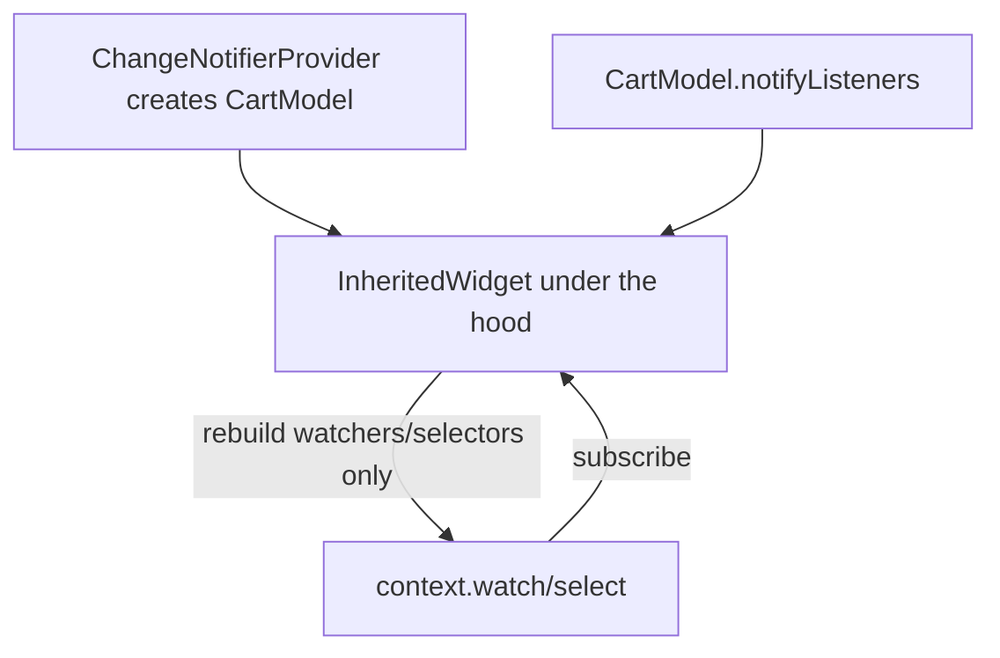
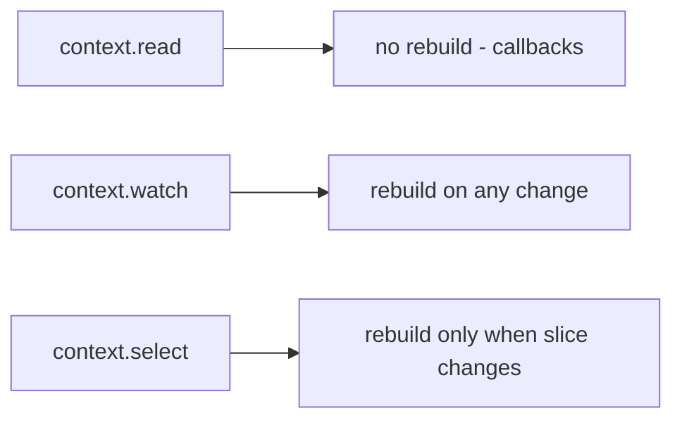

# Provider

> Provider is a thin, ergonomic wrapper over `InheritedWidget` + `ChangeNotifier` that provides dependencies down the tree and rebuilds watchers efficiently — the community's long-standing default and the officially-recommended entry point.

## Introduction

Provider (package: `provider`) combines **DI** (expose objects to descendants) with **reactive rebuilds** (via `ChangeNotifier`/`ValueNotifier` or plain values). It removes the `InheritedWidget` boilerplate ([inherited_widget.md](inherited_widget.md)) and gives `context.watch`/`read`/`select` and `Consumer`/`Selector` for controlled rebuilds.

## Why this concept exists

Hand-writing `InheritedWidget` + Stateful wrappers for every shared object is tedious and error-prone. Provider standardizes it: register objects at a scope, access them anywhere below, and rebuild only what depends on what changed — implementing DIP ([04](../04%20SOLID%20Principles/dip_dependency_inversion.md)) and Observer ([05](../05%20Design%20Patterns/observer.md)) ergonomically.

## Real-world analogy

Provider is a **utility company + meter**: it supplies a resource (state/service) to every unit (widget) in the building via shared lines (InheritedWidget), and each unit's meter (watch/select) charges (rebuilds) only for what it actually uses.

## Problem Statement

A cart's state must be readable/mutable across multiple screens, with only the count badge rebuilding when items change. You'll expose a `CartModel` via `ChangeNotifierProvider` and consume it with `select`.

## Internal Working



- **Providers**: `Provider<T>` (plain value/service), `ChangeNotifierProvider<T>` (a `ChangeNotifier`), `FutureProvider`, `StreamProvider`, `ProxyProvider` (derive from others), `MultiProvider` (compose).
- **Access**:
  - `context.watch<T>()` — read + subscribe (rebuild on change).
  - `context.read<T>()` — read once, no subscribe (use in callbacks).
  - `context.select<T, R>((t) => t.field)` — subscribe to a **slice** (rebuild only when that slice changes).
  - `Consumer<T>` / `Selector<T,R>` — builder-scoped equivalents.
- **DI**: place providers high (e.g., above `MaterialApp`) or per-feature; descendants resolve by type.
- **Lifecycle**: `ChangeNotifierProvider` **auto-disposes** the notifier when removed (unless `create`+external ownership).

## Memory Representation

Providers store the object in the element tree (InheritedWidget); `ChangeNotifierProvider` owns and disposes the notifier. Selectors reduce which elements are registered dependents.

## Compiler Behavior

`Provider.of<T>`/`watch<T>()` for an unregistered type throws at **runtime** (`ProviderNotFoundException`) — a key contrast with Riverpod's compile-time safety ([riverpod.md](riverpod.md)).

## Runtime Behavior

`notifyListeners()` → Provider rebuilds `watch`/`Consumer` subscribers; `select`/`Selector` rebuild only when the selected value changes (by `==`).

## Flutter Engine Behavior / Dart VM Behavior

Not applicable beyond rebuilds.

## Examples

```yaml
# pubspec.yaml
dependencies:
  provider: ^6.1.0
```

```dart
import 'package:flutter/material.dart';
import 'package:provider/provider.dart';

class CartModel extends ChangeNotifier {
  final _items = <String>[];
  int get count => _items.length;
  double get total => _items.length * 9.99;
  void add(String i) { _items.add(i); notifyListeners(); }
}

void main() {
  runApp(
    ChangeNotifierProvider(          // DI + reactivity, auto-disposed
      create: (_) => CartModel(),
      child: const MyApp(),
    ),
  );
}

class MyApp extends StatelessWidget {
  const MyApp({super.key});
  @override
  Widget build(BuildContext context) => const MaterialApp(home: CartScreen());
}

class CartScreen extends StatelessWidget {
  const CartScreen({super.key});
  @override
  Widget build(BuildContext context) {
    return Scaffold(
      appBar: AppBar(
        title: const Text('Cart'),
        actions: [
          // Rebuilds ONLY when `count` changes (select = slice subscription):
          Padding(
            padding: const EdgeInsets.all(16),
            child: Text('${context.select<CartModel, int>((c) => c.count)}'),
          ),
        ],
      ),
      body: Center(
        // watch total (rebuilds on any notify affecting total)
        child: Consumer<CartModel>(
          builder: (context, cart, _) => Text('Total: \$${cart.total.toStringAsFixed(2)}'),
        ),
      ),
      floatingActionButton: FloatingActionButton(
        // read = no subscribe; use in callbacks
        onPressed: () => context.read<CartModel>().add('item'),
        child: const Icon(Icons.add),
      ),
    );
  }
}
```

## Diagrams



## Common Mistakes

| Mistake | Why | Fix |
|---------|-----|-----|
| `watch` in a callback | Unneeded subscription/rebuilds | Use `read` in callbacks |
| Whole-object `watch` for one field | Over-rebuilds | Use `select`/`Selector` |
| `ProviderNotFoundException` | Type not provided above this context | Provide it higher; use a descendant context |
| Manually disposing a Provider-owned notifier | Double dispose | Let `ChangeNotifierProvider` dispose it |
| Business logic in widgets | Untestable | Put it in the `ChangeNotifier`/model |
| One giant model | Broad rebuilds | Split by feature; selectors |

## Best Practices

- `read` in callbacks, `watch`/`Consumer` for reactive UI, `select`/`Selector` to minimize rebuilds.
- Keep models as **UI-free `ChangeNotifier`s** (testable ViewModels).
- Scope providers by feature; use `MultiProvider` to compose; place cross-app state above `MaterialApp`.
- Let Provider manage notifier lifecycle (auto-dispose).
- Split large models and prefer `select` for hot fields.

## Performance

`select`/`Selector` give fine-grained rebuilds (only when a slice changes); whole-object `watch` rebuilds on any notify. Correct usage yields excellent rebuild scope ([09 · build_phase](../09%20Rendering%20Pipeline/build_phase.md)).

## Advantages / Disadvantages

- **+** Simple, official-recommended, DI + reactivity, auto-dispose, `select` for fine rebuilds, huge ecosystem/familiarity.
- **−** Runtime (not compile-time) provider lookup errors; `BuildContext`-bound; large models over-rebuild without selectors; less compile-safe than Riverpod.

## Interview Questions

1. **🟢 What is Provider built on?** — `InheritedWidget` (for DI/propagation) + `ChangeNotifier`/`ValueNotifier` (for reactivity), wrapped ergonomically.
2. **🟢 `watch` vs `read` vs `select`?** — `watch`: read + subscribe (rebuild on change). `read`: read once, no subscribe (callbacks). `select`: subscribe to a slice (rebuild only when it changes).
3. **🟡 How is a `ChangeNotifier` exposed and disposed?** — Via `ChangeNotifierProvider(create: ...)`, which auto-disposes it when removed.
4. **🟡 What error do you get for a missing provider, and when?** — `ProviderNotFoundException` at **runtime** (contrast Riverpod's compile-time safety).
5. **🟡 How do you avoid over-rebuilding with Provider?** — Use `select`/`Selector` to depend on specific fields; split large models.
6. **🔴 Provider vs raw `InheritedWidget`?** — Provider automates the Stateful+Inherited boilerplate, adds DI variants, lifecycle management, and `watch`/`read`/`select`.
7. **🔴 Provider vs Riverpod (headline)?** — Riverpod removes `BuildContext` coupling and gives compile-time-safe providers + easier composition/testing; Provider is simpler/older and context-based ([riverpod.md](riverpod.md)).

## Senior Engineer Tips

- Default to `select`/`Selector` for any hot or multi-field model to keep rebuilds tight.
- Keep models UI-free and injected; test them without the widget tree.
- Use `MultiProvider` + feature-scoped providers rather than one global mega-model.

## Architect Perspective

Provider operationalizes DIP + Observer in the widget tree: inject services/state, subscribe narrowly, dispose automatically. It's a solid MVVM backbone ([Module 43](../43%20MVVM/README.md)) for many apps; its main limitations (runtime lookup, context coupling) are exactly what Riverpod set out to fix ([riverpod.md](riverpod.md), [Module 14](../14%20Dependency%20Injection/README.md)).

## Summary

- Provider = `InheritedWidget` + `ChangeNotifier` ergonomics: DI + reactive rebuilds with `watch`/`read`/`select`.
- Keep models UI-free/testable; use `select` for fine rebuilds; let it auto-dispose.
- Simple and official, but runtime lookup + context coupling motivate Riverpod for larger/safer needs.

## Revision Notes

- Providers: `Provider`, `ChangeNotifierProvider`, `Future/StreamProvider`, `ProxyProvider`, `MultiProvider`.
- Access: `read`(callbacks) / `watch`(reactive) / `select`(slice); `Consumer`/`Selector`.
- Auto-disposes ChangeNotifier; missing provider → runtime `ProviderNotFoundException`.
- Fine rebuilds via `select`; UI-free models; scope by feature.

## Practice Questions

1. Why use `read` in a button callback but `watch` in build?
2. How does `select` reduce rebuilds vs `watch`?
3. What causes `ProviderNotFoundException` and how do you fix it?

## Coding Questions

1. Expose a `CounterModel` via `ChangeNotifierProvider`; increment via `read`, display via `select`.
2. Use `MultiProvider` to provide auth + cart; consume each.
3. Refactor a whole-object `watch` into `select` to cut rebuilds.

## Mini Project

**Cart with Provider (Flutter):** Build a multi-screen cart: `CartModel` via `ChangeNotifierProvider`, count badge via `select`, add via `read`, total via `Consumer`. Unit-test the model. Acceptance: fine-grained rebuilds (badge only on count change); UI-free tested model; auto-disposed; app runs. (Same feature is rebuilt in Riverpod/BLoC/Cubit/GetX for the comparison capstone.)
