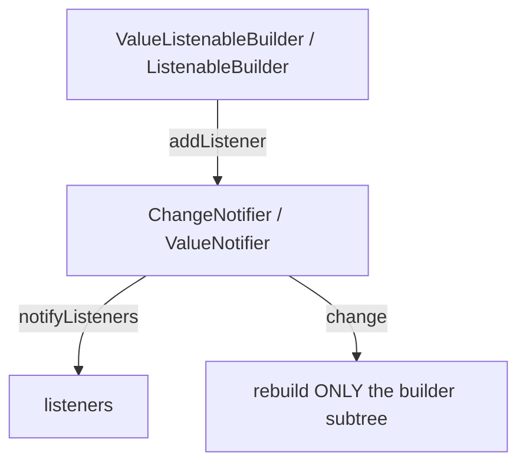
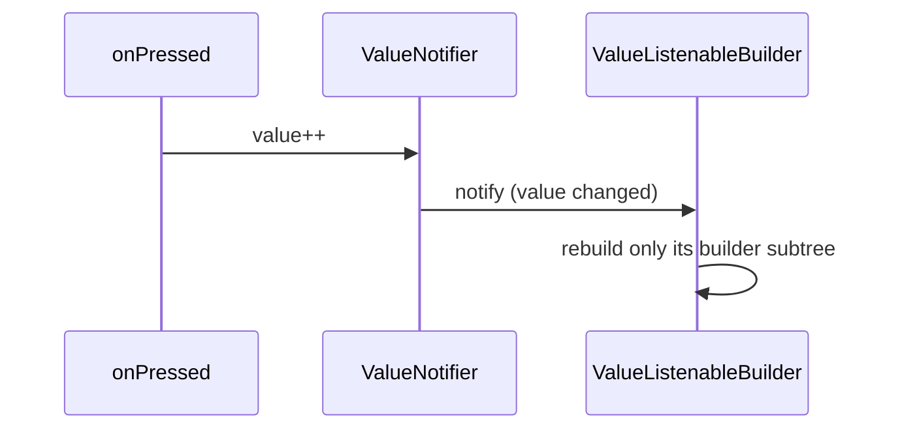

# `ValueNotifier` / `ChangeNotifier` / Builders

> `ChangeNotifier` and `ValueNotifier<T>` are Flutter's built-in **Observer** implementations; pair them with `ListenableBuilder`/`ValueListenableBuilder` to rebuild only the widgets that watch them — no packages required.

## Introduction

`ChangeNotifier` is a `Listenable` you extend to hold mutable state and call `notifyListeners()` on change. `ValueNotifier<T>` is a ready-made single-value `ChangeNotifier`. `ListenableBuilder`/`ValueListenableBuilder` subscribe and rebuild only their builder subtree. These built-ins underpin Provider and are often enough on their own.

## Why this concept exists

You need a lightweight, dependency-free way to hold shared/mutable state and rebuild only dependents (finer than `setState`'s subtree). `ChangeNotifier` provides the Observer plumbing ([05 · observer](../05%20Design%20Patterns/observer.md)); the builders provide targeted rebuilds without hand-writing `InheritedWidget`.

## Real-world analogy

A **newsletter with a signup sheet**: `ChangeNotifier` is the publisher; widgets that `ValueListenableBuilder`/`ListenableBuilder` subscribe get re-rendered when a new issue (change) is published. Non-subscribers don't.

## Problem Statement

A counter's value should update only a small text widget, not the whole screen, with logic separable/testable and no packages. You'll use `ValueNotifier` + `ValueListenableBuilder` (and `ChangeNotifier` for multi-field state).

## Internal Working



- **`ChangeNotifier`**: extend it, hold state, call `notifyListeners()` after mutations. It's a `Listenable` maintaining a listener list.
- **`ValueNotifier<T>`**: a `ChangeNotifier` wrapping one value; setting `.value` notifies (if changed by `==`).
- **`ValueListenableBuilder<T>`**: rebuilds its `builder` when a `ValueNotifier` changes (has a `child` slot for the non-rebuilding part).
- **`ListenableBuilder`**: rebuilds when any `Listenable` (incl. `ChangeNotifier`/`AnimationController`) notifies.
- **Disposal**: `ChangeNotifier`/`ValueNotifier` must be `dispose()`d; listeners added manually must be removed ([08 · dispose_and_leaks](../08%20Widget%20Lifecycle/dispose_and_leaks.md)).

## Memory Representation

The notifier holds a listener list (retains listeners until removed/disposed). Builders manage their own subscription lifecycle automatically ([08](../08%20Widget%20Lifecycle/dispose_and_leaks.md)).

## Compiler Behavior

`ChangeNotifier` lives in `package:flutter/foundation.dart` ([10 · framework_stack](../10%20Flutter%20Architecture/framework_stack.md)).

## Runtime Behavior

`notifyListeners()` synchronously calls listeners; builders subscribed rebuild their subtree. `ValueNotifier` only notifies when the new value `!=` old (by `==`).

## Flutter Engine Behavior / Dart VM Behavior

Not applicable beyond rebuild/GC.

## Examples

```dart
import 'package:flutter/material.dart';

// Single value:
final counter = ValueNotifier<int>(0);

// Multi-field logic (testable, no widgets):
class CartModel extends ChangeNotifier {
  final _items = <String>[];
  List<String> get items => List.unmodifiable(_items);
  int get count => _items.length;
  void add(String item) { _items.add(item); notifyListeners(); }
  void clear() { _items.clear(); notifyListeners(); }
}

class Demo extends StatefulWidget {
  const Demo({super.key});
  @override
  State<Demo> createState() => _DemoState();
}
class _DemoState extends State<Demo> {
  final cart = CartModel();

  @override
  void dispose() {
    cart.dispose();     // dispose ChangeNotifier
    counter.dispose();  // (if owned here)
    super.dispose();
  }

  @override
  Widget build(BuildContext context) {
    return Scaffold(
      body: Column(children: [
        // Only THIS text rebuilds when counter changes:
        ValueListenableBuilder<int>(
          valueListenable: counter,
          builder: (context, value, _) => Text('Count: $value'),
        ),
        // ListenableBuilder for a ChangeNotifier:
        ListenableBuilder(
          listenable: cart,
          builder: (context, _) => Text('Cart items: ${cart.count}'),
        ),
      ]),
      floatingActionButton: Row(
        mainAxisAlignment: MainAxisAlignment.end,
        children: [
          FloatingActionButton(
            onPressed: () => counter.value++, // triggers only the counter text rebuild
            child: const Icon(Icons.add),
          ),
          const SizedBox(width: 8),
          FloatingActionButton(
            onPressed: () => cart.add('item'),
            child: const Icon(Icons.shopping_cart),
          ),
        ],
      ),
    );
  }
}
```

## Diagrams



## Common Mistakes

| Mistake | Why | Fix |
|---------|-----|-----|
| Not disposing notifiers | Leak (retained listeners) | `dispose()` in `State.dispose` |
| Mutating internal state without `notifyListeners()` | UI won't update | Call `notifyListeners()` after mutation |
| Setting `ValueNotifier.value` to an equal value | No notify (by `==`) | Ensure value equality reflects change (immutables) |
| Wrapping too much in the builder | Broad rebuild | Put only the reactive part in the `builder`; use `child` slot |
| Mutable list without value-equal snapshots | Stale/incorrect updates | Expose unmodifiable copies; notify explicitly |

## Best Practices

- Use `ValueNotifier` for a single value, `ChangeNotifier` for multi-field logic (keep it UI-agnostic/testable).
- Wrap **only the reactive widget** in the builder; use the `child` slot for static parts.
- **Dispose** notifiers you own; remove manual listeners.
- Expose immutable views; call `notifyListeners()` after each state change.
- This is the built-in foundation Provider wraps — reach for Provider when you need DI/scoping across the tree.

## Performance

Rebuild scope = the builder's subtree only (finer than `setState`). `ValueNotifier`'s `==` check avoids no-op notifications. Great targeted-rebuild story with zero deps ([09 · build_phase](../09%20Rendering%20Pipeline/build_phase.md)).

## Advantages / Disadvantages

- **+** Built-in, lightweight, targeted rebuilds, testable logic (`ChangeNotifier`), no packages.
- **−** Manual disposal, no built-in DI/scoping (you pass/instantiate notifiers yourself), can get unwieldy for large app state (→ Provider/Riverpod).

## Interview Questions

1. **🟢 What is `ChangeNotifier`?** — A `Listenable` you extend to hold mutable state and call `notifyListeners()`; widgets subscribe to rebuild on change (Observer).
2. **🟢 `ValueNotifier` vs `ChangeNotifier`?** — `ValueNotifier<T>` is a ready-made single-value `ChangeNotifier` that notifies when `.value` changes (by `==`).
3. **🟡 How do you rebuild only part of the UI?** — Wrap the reactive widget in `ValueListenableBuilder`/`ListenableBuilder`; only its builder subtree rebuilds.
4. **🟡 Why must you dispose notifiers?** — They hold a listener list; not disposing leaks them and their listeners ([08](../08%20Widget%20Lifecycle/dispose_and_leaks.md)).
5. **🟡 Why might setting `ValueNotifier.value` not rebuild?** — It only notifies when the new value `!=` old by `==`; equal values (or mutated-in-place objects) don't trigger.
6. **🔴 How does this relate to Provider?** — Provider wraps `ChangeNotifier` (via `ChangeNotifierProvider`) with `InheritedWidget`-based DI/scoping and `context.watch`/`select`.
7. **🔴 How do you avoid over-rebuilding with a multi-field `ChangeNotifier`?** — Split into smaller notifiers, or use selectors (Provider `Selector`/Riverpod `select`) so only widgets depending on the changed field rebuild.

## Senior Engineer Tips

- Keep `ChangeNotifier` **UI-agnostic** (no `BuildContext`), so it's unit-testable — it's effectively a ViewModel ([Module 43](../43%20MVVM/README.md)).
- Use the builder's `child` slot to keep expensive static subtrees out of the rebuild.
- For large/shared state, graduate to Provider/Riverpod for DI + selectors; the mental model carries over.

## Architect Perspective

`ChangeNotifier` + builders is the minimal viable reactive layer and the conceptual core of Provider. As a testable, UI-free ViewModel with targeted rebuilds, it's a legitimate architecture for small-to-medium apps and a stepping stone to MVVM ([Module 43](../43%20MVVM/README.md)) and Provider/Riverpod for DI at scale.

## Summary

- `ChangeNotifier`/`ValueNotifier` are built-in Observers; builders rebuild only their subtree.
- Keep notifiers UI-agnostic/testable; dispose them; expose immutable views; notify after changes.
- Foundation of Provider; enough alone for small scopes, upgrade for DI/scaling.

## Revision Notes

- `ChangeNotifier` (multi-field, `notifyListeners()`) / `ValueNotifier<T>` (single value, notifies on `!=`).
- `ValueListenableBuilder`/`ListenableBuilder` → rebuild only builder subtree; use `child` slot.
- Dispose notifiers; keep them UI-free (testable ViewModel).
- Basis of Provider; split/selectors to avoid over-rebuild.

## Practice Questions

1. Why does only the builder subtree rebuild?
2. When does `ValueNotifier` fail to notify?
3. Why keep `ChangeNotifier` free of `BuildContext`?

## Coding Questions

1. Build a counter with `ValueNotifier` + `ValueListenableBuilder` (scoped rebuild).
2. Implement a `CartModel extends ChangeNotifier` with add/remove + unit tests.
3. Use the `child` slot to keep a static header out of the rebuild.

## Mini Project

**Cart with ChangeNotifier (Flutter):** Build a `CartModel` (`ChangeNotifier`) with add/remove/total, consumed by scoped `ListenableBuilder`s so only the count/total widgets rebuild; dispose correctly; add unit tests for the model. Acceptance: UI-free testable model; targeted rebuilds; disposed; tests pass; app runs.
