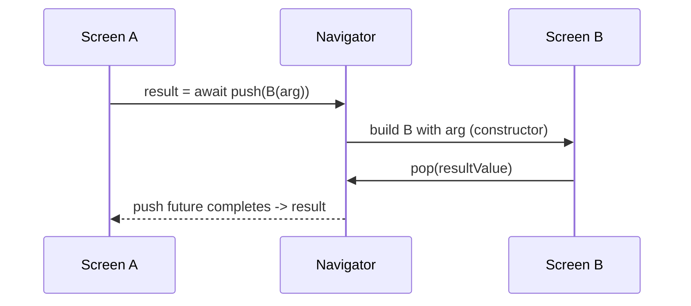
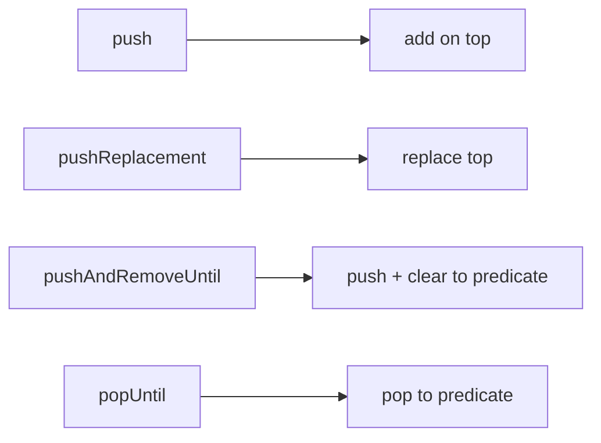

# Imperative Navigation (`push`/`pop`, Arguments & Results)

> Imperative navigation drives the stack directly with `Navigator.push`/`pop`; pass **arguments** via the destination's constructor and get a **result** back by `await`ing `push` (which completes when the destination `pop`s a value).

## Introduction

The everyday API: `Navigator.push(context, MaterialPageRoute(...))` to go forward, `Navigator.pop(context, result)` to go back with data. This file covers argument passing (type-safe via constructors), returning results, and the stack-manipulation variants (`pushReplacement`, `pushAndRemoveUntil`, `popUntil`, `maybePop`).

## Why this concept exists

Most navigation is direct and event-driven ("on tap, open details for this item"). Imperative navigation maps intuitively to that: call a method with the data. It's the simplest correct approach for typical flows.

## Real-world analogy

Handing someone a **filled-in form** as you send them to another department (arguments), and them handing back a **stamped receipt** when they return (result). You wait at the counter (`await`) until they come back.

## Problem Statement

Open a product's detail screen passing the `Product`, let the user edit and return the updated value, and replace the login screen with home after auth (no back to login). You'll use constructor args, `await push`, and `pushReplacement`.

## Internal Working



- **Forward**: `Navigator.push(context, MaterialPageRoute(builder: (_) => DetailsScreen(product: p)))` — pass data via the **constructor** (type-safe, preferred over untyped route arguments).
- **Result**: `push` returns a `Future<T?>`; `await` it. The destination calls `pop(value)`; `push` completes with that value (or `null` if popped without one/back-button).
- **Variants**:
  - `pushReplacement` — replace current top (e.g., login → home).
  - `pushAndRemoveUntil(route, predicate)` — push and clear stack up to a condition (e.g., to home).
  - `popUntil(predicate)` — pop repeatedly until a route matches.
  - `maybePop`/`canPop` — pop only if possible.
- **`context.mounted`** must be checked before using `context` after `await push` ([08 · setstate_mechanics](../08%20Widget%20Lifecycle/04_setstate_mechanics.md)).

## Memory Representation

The pushed route retains its subtree until popped; results are plain returned values ([01_navigator_stack.md](01_navigator_stack.md)).

## Compiler Behavior

Constructor-based args are **type-checked**; untyped `RouteSettings.arguments` are `Object?` (cast needed) — prefer constructors.

## Runtime Behavior

`await push` suspends until the destination pops; the awaiting code resumes with the result. Back-button pop yields `null`.

## Flutter Engine Behavior / Dart VM Behavior

Not applicable beyond transition rendering.

## Examples

```dart
import 'package:flutter/material.dart';

class Product {
  final String name;
  const Product(this.name);
}

class ListScreen extends StatefulWidget {
  const ListScreen({super.key});
  @override
  State<ListScreen> createState() => _ListScreenState();
}
class _ListScreenState extends State<ListScreen> {
  String _lastResult = '';

  Future<void> _openDetails() async {
    // Pass argument via constructor; AWAIT the returned result:
    final result = await Navigator.of(context).push<String>(
      MaterialPageRoute(builder: (_) => const DetailsScreen(product: Product('Widget'))),
    );
    if (!mounted) return;                 // guard context after await
    setState(() => _lastResult = result ?? 'cancelled');
  }

  @override
  Widget build(BuildContext context) {
    return Scaffold(
      appBar: AppBar(title: const Text('List')),
      body: Center(
        child: Column(mainAxisSize: MainAxisSize.min, children: [
          Text('Result: $_lastResult'),
          ElevatedButton(onPressed: _openDetails, child: const Text('Open details')),
        ]),
      ),
    );
  }
}

class DetailsScreen extends StatelessWidget {
  final Product product;
  const DetailsScreen({super.key, required this.product});
  @override
  Widget build(BuildContext context) {
    return Scaffold(
      appBar: AppBar(title: Text(product.name)),
      body: Center(
        child: Column(mainAxisSize: MainAxisSize.min, children: [
          ElevatedButton(
            onPressed: () => Navigator.of(context).pop('saved'),   // return a result
            child: const Text('Save & return'),
          ),
          ElevatedButton(
            onPressed: () => Navigator.of(context).pop(),          // returns null
            child: const Text('Cancel'),
          ),
        ]),
      ),
    );
  }
}

// Login -> Home without back to login:
void goHome(BuildContext context) => Navigator.of(context).pushReplacement(
      MaterialPageRoute(builder: (_) => const HomeScreen()),
    );
class HomeScreen extends StatelessWidget {
  const HomeScreen({super.key});
  @override
  Widget build(BuildContext context) => const Scaffold(body: Center(child: Text('Home')));
}
```

## Diagrams



## Common Mistakes

| Mistake | Why | Fix |
|---------|-----|-----|
| Using `context` after `await push` without `mounted` | Widget may be unmounted | `if (!mounted) return;` |
| Untyped route args + casts everywhere | Loses type safety, runtime errors | Pass via constructor |
| `push` where `pushReplacement` is needed | User can go back to login/splash | Use replacement/removeUntil |
| Ignoring the returned `Future` result | Miss returned data | `await push<T>()` |
| Not handling `null` result (back button) | Null crash | Default when result is null |

## Best Practices

- Pass arguments via the **destination's constructor** (type-safe); reserve untyped route arguments for named routes ([03_named_routes.md](03_named_routes.md)).
- `await push<T>()` and handle `null` (back/cancel) results.
- Use `pushReplacement`/`pushAndRemoveUntil` for auth/onboarding transitions (no back to those).
- Guard `context` after `await` with `mounted`.
- Keep navigation calls in handlers, not `build`.

## Performance

Negligible; each pushed route retains its subtree until popped ([01_navigator_stack.md](01_navigator_stack.md)).

## Advantages / Disadvantages

- **+** Simple, direct, type-safe (constructor args), easy result passing, fine stack control.
- **−** Scattered across the codebase; no central URL map; harder for deep links/web (→ declarative/Router).

## Interview Questions

1. **🟢 How do you navigate forward and back imperatively?** — `Navigator.push(context, MaterialPageRoute(...))` and `Navigator.pop(context, [result])`.
2. **🟢 How do you pass data to a new screen?** — Preferably via the destination widget's constructor (type-safe).
3. **🟡 How do you get a result back?** — `await Navigator.push<T>(...)`; the destination calls `pop(value)`, completing the future (back button → `null`).
4. **🟡 `push` vs `pushReplacement` vs `pushAndRemoveUntil`?** — Add on top; replace the current top; push and clear routes up to a predicate (e.g., login→home, splash→home).
5. **🟡 Why check `mounted` after `await push`?** — The awaiting widget may have been disposed; using its `context` would error.
6. **🔴 Constructor args vs `RouteSettings.arguments`?** — Constructor args are type-checked; `arguments` is `Object?` (needs casting) — used with named routes where you can't call the constructor directly.
7. **🔴 How do you return to a specific earlier screen?** — `popUntil((route) => route.settings.name == '/target')` or `pushAndRemoveUntil`.

## Senior Engineer Tips

- Prefer constructor injection of arguments for compile-time safety; it also makes destinations independently testable.
- Standardize auth/onboarding transitions on `pushReplacement`/`pushAndRemoveUntil` so users can't back into them.
- Wrap common flows (e.g., `openDetails(context, product)`) in helper functions to keep call sites clean and consistent.

## Architect Perspective

Imperative navigation is ideal for simple, event-driven flows and remains widely used. As apps need centralized route maps, deep links, and web URLs, you layer in named routes and ultimately declarative routing ([Module 13](../13%20Routing/README.md)). Keeping arguments type-safe and results explicit makes navigation testable and refactor-friendly.

## Summary

- `push`/`pop` drive the stack; pass args via constructors, get results by `await`ing `push`.
- Use `pushReplacement`/`pushAndRemoveUntil`/`popUntil` for stack control; guard `context` after `await`.
- Simple and type-safe; scale to named/declarative routing for URLs/deep links.

## Revision Notes

- `push(MaterialPageRoute)` / `pop([result])`; args via constructor; result via `await push<T>()` (null on back).
- Variants: `pushReplacement`, `pushAndRemoveUntil`, `popUntil`, `maybePop`/`canPop`.
- Guard `context` after `await` (`mounted`); navigate in handlers.
- Constructor args = type-safe (prefer over untyped `arguments`).

## Practice Questions

1. How do you get an edited value back from a details screen?
2. Which method sends login→home with no back?
3. Why guard `context` after `await push`?

## Coding Questions

1. Push a details screen with a constructor arg and return an edited result.
2. Implement login→home using `pushReplacement`.
3. Use `pushAndRemoveUntil` to return to home from a deep stack.

## Mini Project

**Edit flow (Flutter):** Build List→Detail→Edit: pass a `Product` via constructors, return an edited `Product` up the stack, and after a simulated "save" use `popUntil` to return to the list showing the update. Guard all post-`await` context use. Acceptance: type-safe args; results handled (incl. cancel/null); correct stack control; app runs.
