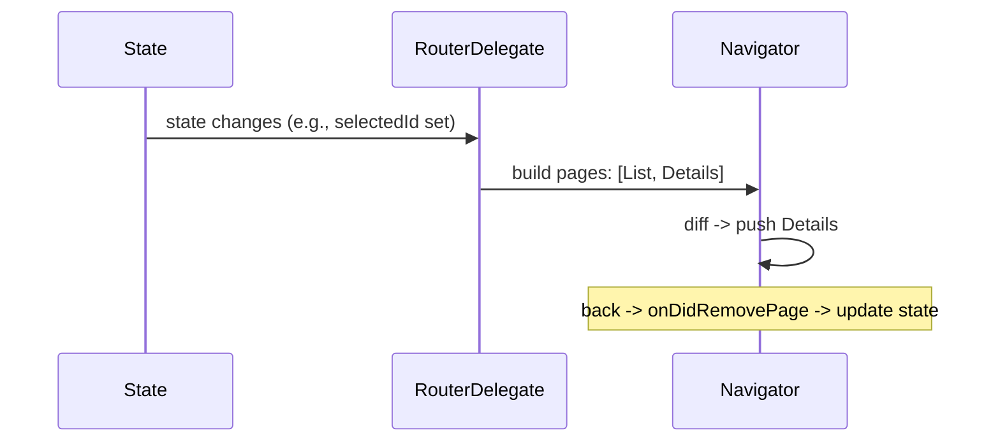

# Declarative Navigation (Navigator 2.0 / Router / `Page` API)

> Declarative navigation makes the route stack a **function of app state**: you provide a list of `Page`s and the framework reconciles the `Navigator` to match — enabling URL-sync, deep links, and complex flows, at the cost of more boilerplate (usually hidden behind `go_router`).

## Introduction

Navigator 2.0 (the Router API) flips navigation from imperative ("push this") to declarative ("the stack *is* `[A, B, C]` given this state"). You build `Page`s from state; the `Navigator` diffs and updates. This file explains the model, its pieces (`Router`/`RouterDelegate`/`RouteInformationParser`/`Page`), and when you actually need it.

## Why this concept exists

Imperative push/pop can't cleanly express: browser URL ↔ stack sync, deep links restoring a whole stack, or "stack derived from auth/onboarding state." Declarative navigation makes the stack a pure projection of state (like the rest of Flutter's UI = f(state)), which handles these correctly.

## Real-world analogy

Imperative is **giving turn-by-turn driving directions**; declarative is **stating your destination address** and letting the GPS compute the whole route from current position. You describe the desired end-state (the page list); the framework figures out the pushes/pops.

## Problem Statement

A web app must sync the URL with the screen and restore the right stack from a deep link; navigation should reflect auth state (logged-out → login stack). You'll model pages from state (conceptually), and see why `go_router` is the practical tool.

## Internal Working

```mermaid
flowchart TD
    State[App state: auth, selected item, ...] --> Pages[List of Page objects]
    Pages --> Nav[Navigator(pages:, onPopPage/onDidRemovePage)]
    URL[Platform route info] <-->|RouteInformationParser| Config[typed route config]
    Config <-->|RouterDelegate| State
```

- **`Navigator(pages: [...], onDidRemovePage: ...)`**: the declarative form — you pass the **current page list**; the framework reconciles (pushes new, pops removed).
- **`Page`**: an immutable description of a route (like a widget for a screen); `MaterialPage`/`CupertinoPage` wrap a child.
- **Router pieces** (full 2.0):
  - **`RouteInformationParser`**: platform route info (URL) ↔ a typed configuration.
  - **`RouterDelegate`**: holds app navigation state, builds the `Navigator` (pages) from it, and handles pops/new routes.
  - **`RouteInformationProvider`**/`BackButtonDispatcher`: platform integration.
- **Reconciliation**: change the state → rebuild the page list → `Navigator` diffs it (add/remove routes), like widget reconciliation ([06 · widgets_elements_render_objects](../06%20Flutter%20Fundamentals/04_widgets_elements_render_objects.md)).
- **Reality**: raw Navigator 2.0 is verbose; most teams use **`go_router`** (built on it) — covered in [Module 13](../13%20Routing/README.md).

## Memory Representation

Pages are immutable descriptions; the `Navigator` maintains the underlying route stack/state ([01_navigator_stack.md](01_navigator_stack.md)).

## Compiler Behavior

Not applicable (typed route configs improve safety in `go_router`/typed routes).

## Runtime Behavior

State change → new page list → diff → route add/remove with transitions. URL changes drive the parser → delegate → state; state changes update the URL (two-way sync on web).

## Flutter Engine Behavior / Dart VM Behavior

Not applicable beyond transition rendering.

## Examples

```dart
import 'package:flutter/material.dart';

// Declarative stack from state using the pages API (simplified, no URL parser):
class AppShell extends StatefulWidget {
  const AppShell({super.key});
  @override
  State<AppShell> createState() => _AppShellState();
}
class _AppShellState extends State<AppShell> {
  String? selectedId; // app state drives the stack

  @override
  Widget build(BuildContext context) {
    return Navigator(
      // The stack IS a function of state:
      pages: [
        const MaterialPage(child: ListPage(), name: '/list'),
        if (selectedId != null)
          MaterialPage(child: DetailsPage(id: selectedId!), name: '/details'),
      ],
      onDidRemovePage: (page) {
        // reconcile state when a page is popped (e.g., back on details)
        if (page.name == '/details') setState(() => selectedId = null);
      },
    );
  }
}
// (In a real app, ListPage would setState(selectedId=...) to "navigate".)

class ListPage extends StatelessWidget {
  const ListPage({super.key});
  @override
  Widget build(BuildContext context) =>
      Scaffold(appBar: AppBar(title: const Text('List (declarative)')));
}
class DetailsPage extends StatelessWidget {
  final String id;
  const DetailsPage({super.key, required this.id});
  @override
  Widget build(BuildContext context) =>
      Scaffold(appBar: AppBar(title: Text('Details $id')));
}
```

```dart
// In practice, use go_router (built on Navigator 2.0) — see Module 13:
// final router = GoRouter(routes: [ GoRoute(path: '/', ...), GoRoute(path: '/details/:id', ...) ]);
// MaterialApp.router(routerConfig: router);
```

## Diagrams



## Common Mistakes

| Mistake | Why | Fix |
|---------|-----|-----|
| Hand-rolling full Navigator 2.0 | Very verbose/error-prone | Use `go_router` ([Module 13](../13%20Routing/README.md)) |
| Not syncing state on pop | Stack/state diverge | Handle `onDidRemovePage`/pop callbacks |
| Using declarative for a simple app | Unneeded complexity | Stick to imperative/named routes |
| Duplicating navigation state | Two sources of truth | State drives pages (single source) |
| Ignoring URL/deep-link parsing | Broken web/deep links | Implement parser or use `go_router` |

## Best Practices

- Use declarative routing when you need **URL sync, deep links, or state-driven stacks**; otherwise imperative/named is simpler.
- Make the **page list a pure function of app state** (single source of truth); reconcile state on pops.
- In practice, adopt **`go_router`** (built on Navigator 2.0) rather than hand-writing delegates/parsers.
- Keep navigation state in your state layer ([Module 11](../11%20State%20Management/README.md)) so pages derive from it.

## Performance

Reconciliation is efficient (diff pages like widgets); no notable overhead vs imperative. The cost is conceptual/boilerplate, mitigated by `go_router` ([09 · build_phase](../09%20Rendering%20Pipeline/02_build_phase.md)).

## Advantages / Disadvantages

- **+** Stack = f(state), correct URL/deep-link handling, restores full stacks, fits Flutter's declarative model, testable navigation state.
- **−** Verbose in raw form (delegates/parsers), steeper concepts, overkill for simple apps — hence `go_router`.

## Interview Questions

1. **🟢 Imperative vs declarative navigation?** — Imperative: you call push/pop. Declarative: you describe the stack as a list of `Page`s derived from state and the framework reconciles it.
2. **🟢 What is a `Page`?** — An immutable description of a route (like a widget for a screen); e.g., `MaterialPage`.
3. **🟡 What are the Router API pieces?** — `RouteInformationParser` (URL ↔ config), `RouterDelegate` (state → pages, handle pops/new routes), plus provider/back-button dispatcher.
4. **🟡 When do you need declarative navigation?** — URL sync (web), deep links restoring a stack, and state-driven navigation (e.g., auth) — cases imperative handles poorly.
5. **🟡 Why is raw Navigator 2.0 rarely hand-written?** — It's verbose/error-prone; `go_router` (built on it) provides the ergonomics most apps want.
6. **🔴 How does declarative navigation mirror Flutter's UI model?** — Stack = f(state), just like UI = f(state); state changes rebuild the page list, which the Navigator diffs.
7. **🔴 How do deep links restore a stack?** — The parser turns the URL into a typed config; the delegate builds the corresponding page list, so opening a deep link recreates the full stack.

## Senior Engineer Tips

- Reach for declarative routing when URLs/deep links/state-driven stacks are requirements; don't adopt it for simple push/pop apps.
- Use `go_router` in practice; understand Navigator 2.0 so you can reason about and debug it.
- Keep navigation a projection of state — it makes deep links and testing straightforward.

## Architect Perspective

Declarative navigation aligns navigation with the app's state model, which is essential for web, deep linking, and complex/guarded flows. It's the foundation of `go_router` and modern routing architecture ([Module 13](../13%20Routing/README.md)); treating the stack as derived state (single source of truth) yields robust, testable, link-friendly navigation at scale.

## Summary

- Declarative navigation: the route stack is a list of `Page`s derived from state, reconciled by the `Navigator` (Router API: parser + delegate).
- Use it for URL sync/deep links/state-driven stacks; use `go_router` rather than hand-rolling.
- Stack = f(state), mirroring Flutter's UI model; keep navigation state in your state layer.

## Revision Notes

- Declarative = `Navigator(pages: fromState)`; framework diffs/reconciles.
- Router 2.0: `RouteInformationParser` (URL↔config) + `RouterDelegate` (state→pages, pops).
- Needed for URL/deep links/state-driven stacks; use `go_router` in practice.
- Reconcile state on pop (`onDidRemovePage`); single source of truth.

## Practice Questions

1. Why is declarative navigation better for deep links/web?
2. What do the parser and delegate each do?
3. When is imperative navigation still the right choice?

## Coding Questions

1. Build a state-driven `Navigator(pages:)` stack (list→details via a state field).
2. Handle back via `onDidRemovePage` to keep state in sync.
3. Sketch how a `/details/:id` URL would map to a page list.

## Mini Project

**State-driven stack (Flutter):** Build a declarative `Navigator(pages:)` whose stack derives from an app-state field (e.g., `selectedId`), with back reconciled to state. Then note (docs) how `go_router` would express the same with URL/deep-link support. Acceptance: stack = f(state); back updates state; single source of truth; app runs. (Continues in [Module 13 Routing](../13%20Routing/README.md).)
