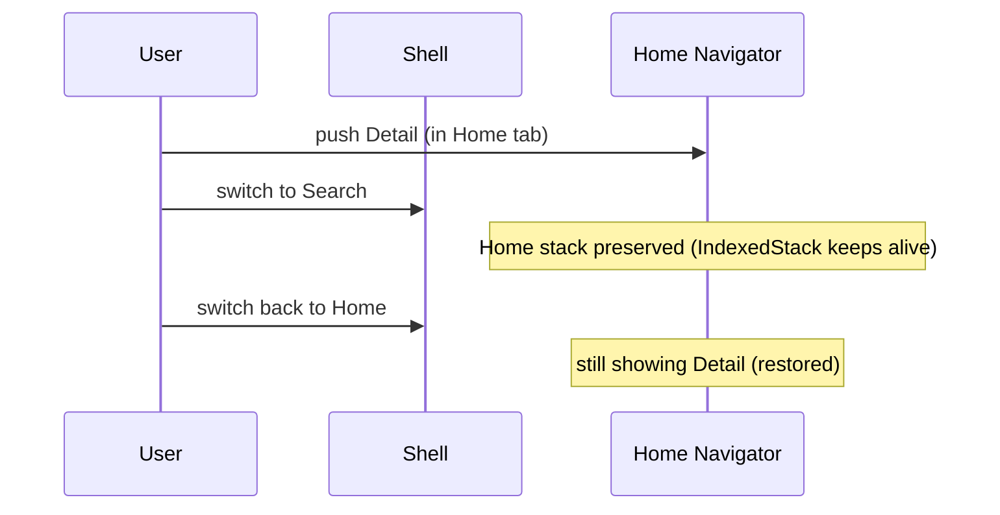

# Nested Navigators & Tabs

> A bottom-nav/tab app usually wants **each tab to keep its own navigation stack and state**; achieve this with a `Navigator` per tab (nested) inside an `IndexedStack`, so switching tabs preserves each tab's stack and scroll position.

## Introduction

Real apps have tabs where each tab is its own mini-app with its own back stack (Instagram-style). This file covers nesting `Navigator`s, preserving tab state with `IndexedStack`, handling the back button across nested navigators, and the tradeoffs.

## Why this concept exists

A single global navigator can't independently preserve each tab's stack/scroll/state. Nested navigators give each tab an isolated stack; `IndexedStack` keeps inactive tabs alive so switching back restores exactly where you were.

## Real-world analogy

A **building with multiple elevators**, one per wing (tab). Each elevator remembers its own current floor (stack position). Switching wings doesn't reset the other elevators — they stay where you left them.

## Problem Statement

A 3-tab app (Home/Search/Profile) where each tab can push detail screens and, when you switch away and back, resumes its own stack + scroll. You'll nest a `Navigator` per tab inside an `IndexedStack` and handle back.

## Internal Working

```mermaid
flowchart TD
    Root[Root Navigator - MaterialApp]
    Root --> Shell[Tab shell: BottomNavigationBar + IndexedStack]
    Shell --> N0[Navigator (Home stack)]
    Shell --> N1[Navigator (Search stack)]
    Shell --> N2[Navigator (Profile stack)]
    Note["IndexedStack keeps all 3 alive; each Navigator has its own stack"]
```

- **`IndexedStack`**: renders all children but shows one (by `index`); inactive children stay in the tree (state/stack preserved). (Alternative: rebuild per tab to save memory, losing state.)
- **A `Navigator` per tab**: each tab's content is wrapped in its own `Navigator` with its own routes → independent back stacks.
- **Back button across nested navigators**: use `PopScope`/`NavigatorState.maybePop` so back first pops the **active tab's** nested navigator, and only exits/handles at the root when that tab's stack is at its root.
- **Keys**: give each nested `Navigator` a `GlobalKey<NavigatorState>` to control it (pop to root on re-tap, etc.).
- **State preservation** also needs `AutomaticKeepAliveClientMixin` or `IndexedStack` for scroll/list state ([06 · widgets_elements_render_objects](../06%20Flutter%20Fundamentals/04_widgets_elements_render_objects.md)).

## Memory Representation

`IndexedStack` keeps all tab subtrees (and their nested stacks) alive → higher memory but preserved state; rebuilding tabs saves memory but loses state ([08 · dispose_and_leaks](../08%20Widget%20Lifecycle/05_dispose_and_leaks.md)).

## Compiler Behavior

Not applicable.

## Runtime Behavior

Switching `IndexedStack.index` shows a different, already-built subtree (instant, preserved). Back pops the active nested navigator first; re-tapping a tab commonly pops that tab to its root.

## Flutter Engine Behavior / Dart VM Behavior

Not applicable beyond keeping subtrees alive.

## Examples

```dart
import 'package:flutter/material.dart';

class TabShell extends StatefulWidget {
  const TabShell({super.key});
  @override
  State<TabShell> createState() => _TabShellState();
}
class _TabShellState extends State<TabShell> {
  int _index = 0;
  // One Navigator key per tab (control + pop-to-root):
  final _navKeys = List.generate(3, (_) => GlobalKey<NavigatorState>());

  @override
  Widget build(BuildContext context) {
    return PopScope(
      canPop: false, // intercept root back
      onPopInvokedWithResult: (didPop, _) async {
        if (didPop) return;
        // Back first pops the ACTIVE tab's nested navigator:
        final popped = await _navKeys[_index].currentState!.maybePop();
        if (!popped && mounted) {
          // active tab at its root -> could exit or go to first tab
          if (_index != 0) setState(() => _index = 0);
        }
      },
      child: Scaffold(
        body: IndexedStack(               // keeps all tabs alive (state preserved)
          index: _index,
          children: [
            _tabNavigator(0, const HomeTab()),
            _tabNavigator(1, const SearchTab()),
            _tabNavigator(2, const ProfileTab()),
          ],
        ),
        bottomNavigationBar: BottomNavigationBar(
          currentIndex: _index,
          onTap: (i) {
            if (i == _index) {
              _navKeys[i].currentState!.popUntil((r) => r.isFirst); // re-tap: pop to root
            } else {
              setState(() => _index = i);
            }
          },
          items: const [
            BottomNavigationBarItem(icon: Icon(Icons.home), label: 'Home'),
            BottomNavigationBarItem(icon: Icon(Icons.search), label: 'Search'),
            BottomNavigationBarItem(icon: Icon(Icons.person), label: 'Profile'),
          ],
        ),
      ),
    );
  }

  Widget _tabNavigator(int i, Widget root) => Navigator(
        key: _navKeys[i],
        onGenerateRoute: (_) => MaterialPageRoute(builder: (_) => root),
      );
}

class HomeTab extends StatelessWidget {
  const HomeTab({super.key});
  @override
  Widget build(BuildContext context) => Scaffold(
        appBar: AppBar(title: const Text('Home')),
        body: Center(
          child: ElevatedButton(
            onPressed: () => Navigator.of(context).push(
                MaterialPageRoute(builder: (_) => const _Detail('Home detail'))),
            child: const Text('Push detail (stays in tab)'),
          ),
        ),
      );
}
class SearchTab extends StatelessWidget {
  const SearchTab({super.key});
  @override
  Widget build(BuildContext context) => Scaffold(appBar: AppBar(title: const Text('Search')));
}
class ProfileTab extends StatelessWidget {
  const ProfileTab({super.key});
  @override
  Widget build(BuildContext context) => Scaffold(appBar: AppBar(title: const Text('Profile')));
}
class _Detail extends StatelessWidget {
  final String title;
  const _Detail(this.title);
  @override
  Widget build(BuildContext context) => Scaffold(appBar: AppBar(title: Text(title)));
}
```

## Diagrams



## Common Mistakes

| Mistake | Why | Fix |
|---------|-----|-----|
| One global navigator for tabs | Tabs lose independent stacks/state | Nested `Navigator` per tab |
| Rebuilding tabs on switch | Loses scroll/stack state | Use `IndexedStack` (or keep-alive) |
| Ignoring back-button across nesting | Back exits app instead of popping tab | `PopScope` + active nested `maybePop` |
| Keeping all tabs alive with heavy content | High memory | Balance: lazy tabs / dispose heavy ones |
| No pop-to-root on re-tap | Poor UX | `popUntil((r)=>r.isFirst)` on re-tap |

## Best Practices

- Give **each tab its own `Navigator`** (with a `GlobalKey`) for independent stacks.
- Use **`IndexedStack`** to preserve tab state/scroll (or `PageStorage`/keep-alive selectively).
- Handle **back** to pop the active tab's nested navigator first (`PopScope` + `maybePop`).
- Implement **pop-to-root on re-tap** for expected UX.
- Balance memory: keep-alive is great for a few tabs; for many/heavy tabs consider lazy build/dispose.

## Performance

`IndexedStack` trades memory (all tabs alive) for instant, state-preserving switches. For many heavy tabs, that memory adds up — consider lazy instantiation ([Module 21](../21%20Performance/README.md)).

## Advantages / Disadvantages

- **+** Independent per-tab stacks + preserved state/scroll, native-feeling tab UX, controllable via keys.
- **−** More complex back handling, higher memory with `IndexedStack`, careful wiring needed.

## Interview Questions

1. **🟢 How do you give each tab its own back stack?** — Wrap each tab's content in its own nested `Navigator`.
2. **🟢 How do you preserve each tab's state when switching?** — Use `IndexedStack` (keeps all tab subtrees alive) or keep-alive mechanisms.
3. **🟡 How do you handle the back button with nested navigators?** — Intercept with `PopScope` and first `maybePop` the active tab's nested navigator; only handle at the root when that stack is at its root.
4. **🟡 Why give nested navigators a `GlobalKey`?** — To control them (pop-to-root on re-tap, programmatic navigation) from the shell.
5. **🟡 `IndexedStack` vs rebuilding tabs?** — `IndexedStack` preserves state (more memory); rebuilding saves memory but loses state/scroll.
6. **🔴 What's the memory tradeoff of keep-alive tabs?** — All tab subtrees (and their stacks) stay in memory; fine for a few tabs, costly for many/heavy ones.
7. **🔴 How do you implement "tap active tab → go to its root"?** — `popUntil((r) => r.isFirst)` on that tab's nested `NavigatorState`.

## Senior Engineer Tips

- Standardize the tab-shell pattern (per-tab Navigator + `IndexedStack` + back handling) as a reusable widget; it's fiddly to get right each time.
- For URL/deep-link support with tabs, use `go_router`'s `StatefulShellRoute` (nested navigators + deep links) — [Module 13](../13%20Routing/README.md).
- Watch memory with many heavy tabs; lazy-init or dispose the least-used.

## Architect Perspective

Nested navigators model multi-stack apps (tabbed shells) correctly, preserving per-section state — a common product requirement. Modern routing (`go_router` `StatefulShellRoute`) generalizes this with deep-link support, making the tab-shell a first-class, URL-addressable structure ([Module 13](../13%20Routing/README.md)) — important for web and shareable links at scale.

## Summary

- Give each tab its own nested `Navigator` (with a `GlobalKey`); use `IndexedStack` to preserve state.
- Handle back by popping the active tab's navigator first (`PopScope`+`maybePop`); pop-to-root on re-tap.
- Balance memory; for deep links/URLs use `go_router`'s stateful shell.

## Revision Notes

- Per-tab nested `Navigator` (GlobalKey) + `IndexedStack` (keep-alive) = independent, preserved stacks.
- Back: `PopScope` → active tab `maybePop` → root.
- Re-tap active tab → `popUntil(isFirst)`.
- Memory: keep-alive costs; deep links/URLs → `go_router` `StatefulShellRoute`.

## Practice Questions

1. Why does a single navigator fail for independent tab stacks?
2. How does `IndexedStack` preserve tab state?
3. How do you make back pop the active tab, not exit?

## Coding Questions

1. Build a 3-tab shell with per-tab nested navigators + `IndexedStack`.
2. Implement correct back handling and pop-to-root on re-tap.
3. Measure memory difference between `IndexedStack` and rebuild-per-tab.

## Mini Project

**Tabbed shell (Flutter):** Build a bottom-nav app where each tab has its own `Navigator` and can push details; switching tabs preserves each stack (`IndexedStack`); back pops the active tab first; re-tapping a tab pops it to root. Acceptance: independent preserved stacks; correct back behavior; pop-to-root works; app runs.
