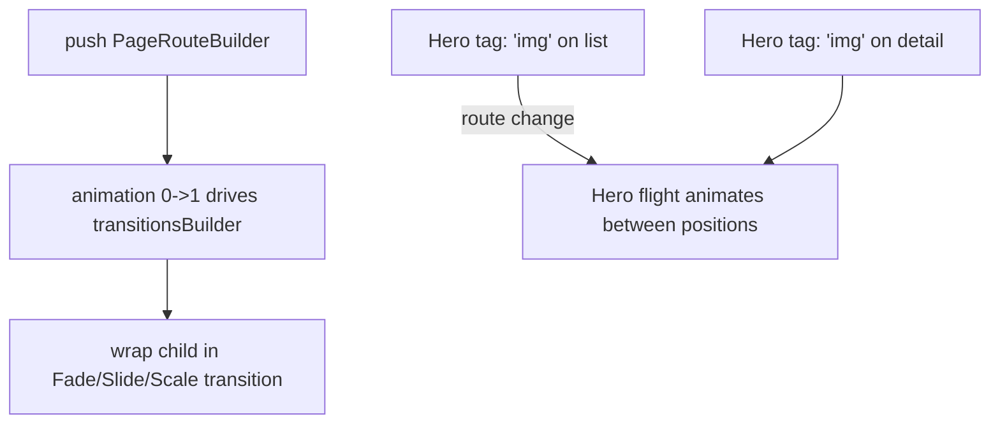
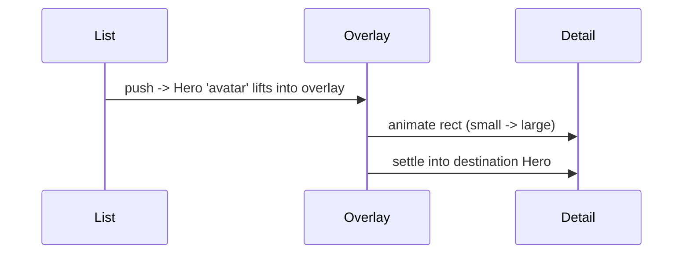

# Route Transitions & `Hero` Animations

> Customize how screens animate in/out with `PageRouteBuilder` + a `transitionsBuilder`, and animate a shared element between screens with `Hero` — polished motion that reinforces spatial continuity.

## Introduction

By default `MaterialPageRoute` gives platform-appropriate transitions. This file shows how to build **custom route transitions** (fade/slide/scale) via `PageRouteBuilder`, and how **`Hero`** animates a shared widget (e.g., a thumbnail growing into a detail image) across a route change.

## Why this concept exists

Motion communicates relationships and hierarchy. Custom transitions match brand/UX; `Hero` provides spatial continuity ("this thumbnail *became* this detail"), which reduces cognitive load and feels polished. Flutter builds these on its animation system ([Module 22](../22%20Animations/README.md)).

## Real-world analogy

A **stage scene change**: default is a standard curtain (Material transition); a custom transition is choosing how the set slides/fades in; `Hero` is a **prop carried by an actor** from one scene to the next so the audience tracks it across the cut.

## Problem Statement

You want a fade+slide transition to a detail screen, and the list thumbnail to smoothly expand into the detail's header image. You'll use `PageRouteBuilder` and `Hero`.

## Internal Working



- **`PageRouteBuilder`**: replaces `MaterialPageRoute`; you provide `pageBuilder` (the screen) and `transitionsBuilder(context, animation, secondaryAnimation, child)` that wraps `child` in transition widgets (`FadeTransition`, `SlideTransition`, `ScaleTransition`) driven by `animation` (0→1 on push).
- **`transitionDuration`/`reverseTransitionDuration`**: control timing.
- **`Hero`**: wrap the source and destination widgets with the **same `tag`**; on route change, Flutter runs a "flight" animating the widget from its source rect to its destination rect (via an overlay).
- **`secondaryAnimation`**: lets the outgoing route react as a new one covers it (e.g., fade out).
- Built on the animation framework (`Animation`, `CurvedAnimation`, `Tween`) — [Module 22](../22%20Animations/README.md).

## Memory Representation

Transitions/Hero flights are transient animation objects; the Hero temporarily moves the widget into an overlay during the flight ([09 · compositing](../09%20Rendering%20Pipeline/05_compositing_and_repaint_boundaries.md)).

## Compiler Behavior

Not applicable.

## Runtime Behavior

On push, `animation` runs 0→1 driving the transition; on pop it reverses. Hero matches tags between the outgoing and incoming routes and animates the flight; mismatched/duplicate tags cause errors/no animation.

## Flutter Engine Behavior

Transitions are per-frame repaints; wrap expensive content in `RepaintBoundary` if needed ([09 · compositing](../09%20Rendering%20Pipeline/05_compositing_and_repaint_boundaries.md)). Hero flights composite over an overlay layer.

## Dart VM Behavior

Not applicable.

## Examples

```dart
import 'package:flutter/material.dart';

// Custom fade + slide transition
Route _fadeSlideRoute(Widget page) => PageRouteBuilder(
      transitionDuration: const Duration(milliseconds: 350),
      pageBuilder: (_, __, ___) => page,
      transitionsBuilder: (_, animation, __, child) {
        final curved = CurvedAnimation(parent: animation, curve: Curves.easeOut);
        return FadeTransition(
          opacity: curved,
          child: SlideTransition(
            position: Tween(begin: const Offset(0, 0.1), end: Offset.zero).animate(curved),
            child: child,
          ),
        );
      },
    );

class ListScreen extends StatelessWidget {
  const ListScreen({super.key});
  @override
  Widget build(BuildContext context) {
    return Scaffold(
      appBar: AppBar(title: const Text('List')),
      body: GestureDetector(
        onTap: () => Navigator.of(context).push(_fadeSlideRoute(const DetailScreen())),
        child: const Padding(
          padding: EdgeInsets.all(16),
          // Shared element: same tag on both screens
          child: Hero(tag: 'avatar', child: CircleAvatar(radius: 30, child: Icon(Icons.person))),
        ),
      ),
    );
  }
}

class DetailScreen extends StatelessWidget {
  const DetailScreen({super.key});
  @override
  Widget build(BuildContext context) {
    return Scaffold(
      appBar: AppBar(title: const Text('Detail')),
      body: const Center(
        // Same Hero tag -> the avatar "flies" from list to here, growing
        child: Hero(tag: 'avatar', child: CircleAvatar(radius: 80, child: Icon(Icons.person, size: 64))),
      ),
    );
  }
}
```

## Diagrams



## Common Mistakes

| Mistake | Why | Fix |
|---------|-----|-----|
| Duplicate `Hero` tags on one screen | Ambiguous flight → error | Unique tags per screen (use ids) |
| Mismatched tags across screens | No Hero animation | Same tag on source + destination |
| Heavy widget in transition without boundary | Jank | `RepaintBoundary` / simpler content |
| Overlong/overwrought transitions | Feels sluggish | Keep durations ~200–350ms; standard curves |
| Hero on differently-shaped widgets | Visual jump | Match shapes or use `flightShuttleBuilder` |

## Best Practices

- Keep transitions **short and standard** (~200–350ms, `Curves.easeInOut`/`easeOut`); match brand without slowing UX.
- Use **unique, stable `Hero` tags** (e.g., item id) per screen; identical between source/destination.
- For complex Hero morphs, customize with `flightShuttleBuilder`.
- Wrap heavy transitioning content in `RepaintBoundary` ([09](../09%20Rendering%20Pipeline/05_compositing_and_repaint_boundaries.md)).
- Prefer built-in transitions unless a custom one adds real value.

## Performance

Transitions/Hero repaint per frame; isolate expensive subtrees with `RepaintBoundary`, keep transitions simple, and watch raster cost for image Heroes ([Module 21](../21%20Performance/README.md)).

## Advantages / Disadvantages

- **+** Polished, brand-consistent motion; `Hero` gives spatial continuity; built on a robust animation system.
- **−** Overdone transitions hurt UX; Hero tag pitfalls; per-frame cost for heavy content.

## Interview Questions

1. **🟢 How do you make a custom route transition?** — Use `PageRouteBuilder` with a `transitionsBuilder` that wraps the child in transition widgets driven by the route's `animation`.
2. **🟢 What is a `Hero` animation?** — A shared-element transition: widgets with the same `tag` on two screens animate ("fly") between their positions across the route change.
3. **🟡 What drives a route transition?** — The route's `animation` (0→1 on push, reversed on pop), typically curved and mapped via `Tween`s.
4. **🟡 What causes Hero to not animate or to error?** — Mismatched tags (no animation) or duplicate tags on one screen (ambiguous → error).
5. **🟡 What is `secondaryAnimation` for?** — Letting the current route react as a new route covers it (e.g., fade/scale out).
6. **🔴 How does Hero perform the flight?** — It lifts the widget into an `Overlay` and animates its rect from source to destination, then settles into the destination Hero.
7. **🔴 How do you optimize heavy transitions?** — Simplify content, keep durations short, and wrap expensive subtrees in `RepaintBoundary`; watch raster cost for images.

## Senior Engineer Tips

- Use item ids as Hero tags in lists to guarantee uniqueness and correct matching.
- Default to built-in transitions; add custom ones only where they improve comprehension/brand.
- For image Heroes, ensure both ends use similarly-sized/decoded images to avoid flicker and raster spikes ([07 · images](../07%20Widgets/07_images_and_assets.md)).

## Architect Perspective

Transitions and Hero animations are UX polish grounded in the animation and rendering systems ([Modules 22, 09](../22%20Animations/README.md)). Standardizing a small set of transitions and a Hero-tagging convention across the app yields consistent, professional motion without ad-hoc, janky one-offs — part of a coherent design system.

## Summary

- Custom transitions: `PageRouteBuilder` + `transitionsBuilder` driven by `animation`.
- `Hero` animates shared elements between screens via matching `tag`s (overlay flight).
- Keep motion short/standard; unique stable tags; isolate heavy content with `RepaintBoundary`.

## Revision Notes

- `PageRouteBuilder(pageBuilder, transitionsBuilder(anim))` → wrap child in Fade/Slide/Scale.
- `Hero(tag: sameOnBoth)` → shared-element flight via Overlay; unique per screen, matching across.
- `secondaryAnimation` = outgoing route reaction; `flightShuttleBuilder` for custom morphs.
- ~200–350ms; `RepaintBoundary` for heavy content; built on Module 22 animations.

## Practice Questions

1. What object drives a custom route transition?
2. Why do Hero tags need to match across screens but be unique within one?
3. How does Hero physically animate the widget?

## Coding Questions

1. Build a fade+scale `PageRouteBuilder` transition.
2. Add a `Hero` thumbnail→detail image animation with id-based tags.
3. Customize a Hero flight with `flightShuttleBuilder`.

## Mini Project

**Gallery Hero flow (Flutter):** Build a grid of thumbnails that push a detail screen via a custom fade+slide transition, with each thumbnail Hero-animating (id-based tag) into the detail's large image. Isolate the transition content with `RepaintBoundary`. Acceptance: smooth custom transition; correct Hero flights (unique/matching tags); no jank on images; app runs.
