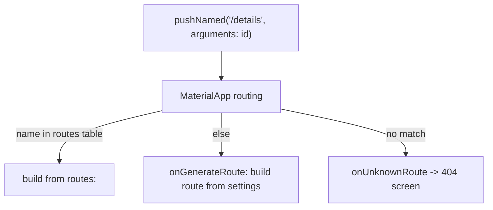
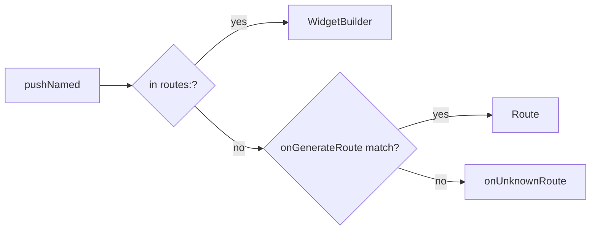

# Named Routes & `onGenerateRoute`

> Named routes give each screen a string name (`/details`) registered centrally; `onGenerateRoute` is the programmatic factory that builds a route from its name + arguments — enabling a single source of truth for navigation and dynamic/validated routing.

## Introduction

Instead of constructing `MaterialPageRoute`s inline everywhere, you register a **route table** (`routes:`) and/or an **`onGenerateRoute`** callback on `MaterialApp`, then navigate by name: `Navigator.pushNamed(context, '/details', arguments: ...)`. This centralizes routing and supports argument passing and dynamic route logic.

## Why this concept exists

Inline `MaterialPageRoute`s scatter navigation logic and duplicate screen wiring. Named routes centralize the map (one place to see all screens), enable dynamic/parameterized routing via `onGenerateRoute`, and are a stepping stone toward URL-based/declarative routing ([Module 13](../13%20Routing/README.md)).

## Real-world analogy

A **hotel directory + concierge**: rooms have names ("Suite 12"); the directory (`routes:`) lists fixed ones, and the concierge (`onGenerateRoute`) handles dynamic requests ("a room for this specific guest"), validating and directing appropriately.

## Problem Statement

You want a central route map, to pass a product id to `/details`, and to handle unknown routes gracefully. You'll use `routes:`, `onGenerateRoute`, and `onUnknownRoute`.

## Internal Working



- **`routes: {'/': ..., '/list': ...}`**: a static map of name → `WidgetBuilder` for simple, argument-less screens.
- **`onGenerateRoute(RouteSettings settings)`**: called for names not in `routes` (or for all, if you omit `routes`); read `settings.name` + `settings.arguments` and return a `Route` (e.g., `MaterialPageRoute`). This is where you do **parameterized/validated/dynamic** routing.
- **`onUnknownRoute`**: fallback for unmatched names (a 404/not-found screen).
- **Arguments**: passed via `pushNamed(name, arguments: obj)` and read from `settings.arguments` (typed via cast — less type-safe than constructors, so validate).
- **`initialRoute`**: the first route name at startup.

## Memory Representation

Same route-stack behavior as imperative ([navigator_stack.md](navigator_stack.md)); the route table/factory is config on `MaterialApp`.

## Compiler Behavior

`settings.arguments` is `Object?` → runtime cast; centralize + validate to avoid scattered unsafe casts.

## Runtime Behavior

`pushNamed` looks up `routes` first, then `onGenerateRoute`, then `onUnknownRoute`. `onGenerateRoute` runs per navigation, so it can branch on arguments/auth/etc.

## Flutter Engine Behavior / Dart VM Behavior

Not applicable.

## Examples

```dart
import 'package:flutter/material.dart';

class DetailsArgs {
  final String id;
  const DetailsArgs(this.id);
}

void main() {
  runApp(MaterialApp(
    initialRoute: '/',
    routes: {
      '/': (_) => const HomeScreen(),        // simple, no args
      '/list': (_) => const ListScreen(),
    },
    // Dynamic/parameterized routes + validation:
    onGenerateRoute: (settings) {
      switch (settings.name) {
        case '/details':
          final args = settings.arguments;
          if (args is DetailsArgs) {
            return MaterialPageRoute(
              builder: (_) => DetailsScreen(id: args.id),
              settings: settings, // keep name for popUntil/analytics
            );
          }
          return _errorRoute('Missing/invalid details args');
        default:
          return null; // fall through to onUnknownRoute
      }
    },
    onUnknownRoute: (settings) => _errorRoute('Unknown route: ${settings.name}'),
  ));
}

MaterialPageRoute _errorRoute(String message) => MaterialPageRoute(
      builder: (_) => Scaffold(body: Center(child: Text(message))),
    );

class HomeScreen extends StatelessWidget {
  const HomeScreen({super.key});
  @override
  Widget build(BuildContext context) => Scaffold(
        appBar: AppBar(title: const Text('Home')),
        body: Center(
          child: ElevatedButton(
            onPressed: () => Navigator.pushNamed(
              context, '/details', arguments: const DetailsArgs('42')),
            child: const Text('Open details 42'),
          ),
        ),
      );
}
class ListScreen extends StatelessWidget {
  const ListScreen({super.key});
  @override
  Widget build(BuildContext context) => const Scaffold(body: Center(child: Text('List')));
}
class DetailsScreen extends StatelessWidget {
  final String id;
  const DetailsScreen({super.key, required this.id});
  @override
  Widget build(BuildContext context) =>
      Scaffold(appBar: AppBar(title: Text('Details $id')));
}
```

## Diagrams



## Common Mistakes

| Mistake | Why | Fix |
|---------|-----|-----|
| Unvalidated `settings.arguments` cast | Runtime crash on wrong/absent args | Type-check + fallback in `onGenerateRoute` |
| No `onUnknownRoute` | Crash/blank on bad name | Provide a 404 route |
| Putting arg-heavy screens in static `routes:` | Can't pass typed args cleanly | Use `onGenerateRoute` |
| Losing `settings` on the built route | `popUntil(name)`/analytics break | Pass `settings: settings` |
| Duplicating route names/strings | Typos, drift | Centralize route-name constants |

## Best Practices

- Keep a **central route map** (constants for names) as a single source of truth.
- Use static `routes:` for simple screens; **`onGenerateRoute`** for parameterized/validated/guarded routing.
- **Validate `arguments`** and provide `onUnknownRoute` (404).
- Preserve `settings` on generated routes (for `popUntil`/analytics/deep links).
- Consider graduating to **`go_router`** for URL/deep-link-heavy apps ([Module 13](../13%20Routing/README.md)).

## Performance

Negligible; `onGenerateRoute` runs per navigation (keep it light). Same stack cost as imperative ([navigator_stack.md](navigator_stack.md)).

## Advantages / Disadvantages

- **+** Centralized route map, dynamic/parameterized/validated routing, unknown-route handling, easier analytics/deep-link hookup.
- **−** `arguments` is untyped (validate), string names can drift, still imperative under the hood; `go_router` is often better for complex URL routing.

## Interview Questions

1. **🟢 What are named routes?** — Screens registered by string name (`routes:` map) and navigated via `Navigator.pushNamed`.
2. **🟢 What is `onGenerateRoute`?** — A callback that builds a `Route` from `RouteSettings` (name + arguments) for names not in the static table — enabling dynamic/parameterized routing.
3. **🟡 How do you pass arguments to a named route?** — `pushNamed(name, arguments: obj)`, read via `settings.arguments` (cast/validate).
4. **🟡 What is `onUnknownRoute` for?** — Handling unmatched route names (a 404/not-found screen).
5. **🟡 Static `routes:` vs `onGenerateRoute`?** — `routes:` for simple, argument-less screens; `onGenerateRoute` for parameterized/validated/guarded routing.
6. **🔴 Why validate `settings.arguments`?** — It's `Object?`; a wrong/missing type crashes on cast — validate and fall back gracefully.
7. **🔴 When move beyond named routes?** — For URL sync, deep links, nested/guarded routing at scale — use `go_router`/declarative routing ([Module 13](../13%20Routing/README.md)).

## Senior Engineer Tips

- Centralize route names as constants (or an enum) to avoid typos and enable refactoring.
- Do route **guards/validation** in `onGenerateRoute` (auth checks, arg validation) as an early step toward guarded routing.
- Always pass `settings:` to generated routes so `popUntil(name)`, analytics, and deep links work.

## Architect Perspective

Named routes + `onGenerateRoute` centralize navigation into a single, testable map and introduce a place for guards/validation — the conceptual bridge to declarative, URL-driven routing. For anything beyond simple apps (deep links, web, nested/guarded flows), this evolves into `go_router`/Navigator 2.0 ([Module 13](../13%20Routing/README.md)).

## Summary

- Register routes by name (`routes:`) and/or build them dynamically in `onGenerateRoute`; handle unmatched names with `onUnknownRoute`.
- Pass/validate arguments via `settings.arguments`; preserve `settings`; centralize names.
- Great for a central map + dynamic routing; graduate to `go_router` for URLs/deep links.

## Revision Notes

- `routes:` (static, no-arg) + `onGenerateRoute` (dynamic/params/validate) + `onUnknownRoute` (404).
- `pushNamed(name, arguments:)`; read `settings.arguments` (cast+validate).
- Pass `settings:` to generated routes; centralize name constants.
- Beyond simple apps → `go_router` (Module 13).

## Practice Questions

1. When use `onGenerateRoute` over the static `routes:` map?
2. Why validate `settings.arguments`?
3. What breaks if you don't pass `settings` to a generated route?

## Coding Questions

1. Build a named-route app with `/`, `/list`, and a parameterized `/details`.
2. Add `onUnknownRoute` + argument validation with a fallback.
3. Centralize route names as constants and refactor call sites.

## Mini Project

**Central route map (Flutter):** Build an app with a route-name constants file, static `routes:` for simple screens, `onGenerateRoute` for a validated parameterized `/details`, and `onUnknownRoute` 404. Add a simple auth guard in `onGenerateRoute`. Acceptance: centralized names; validated args; 404 handled; guard works; app runs.
