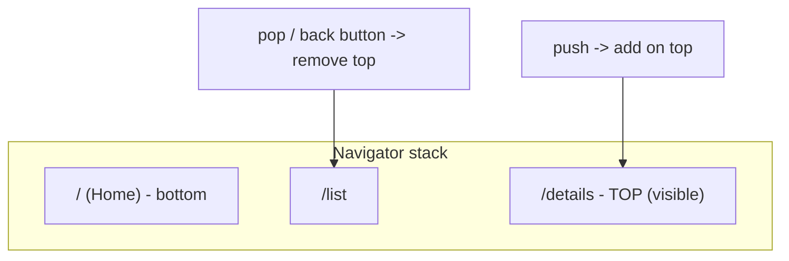
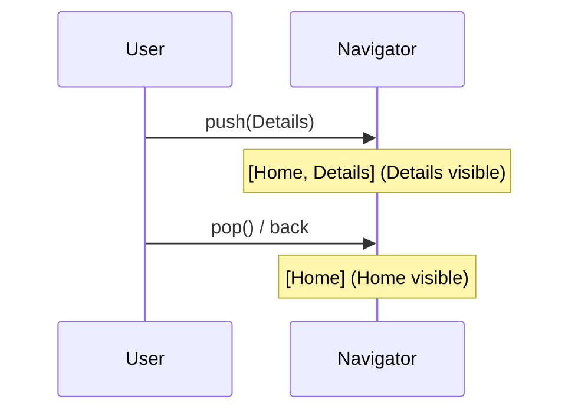

# The Navigator Stack

> A `Navigator` manages a **stack of routes** (screens): pushing adds one on top, popping removes it — exactly like a stack data structure, and it's what the device back button pops.

## Introduction

Flutter navigation is a stack: the visible screen is the top route; navigating deeper **pushes**, going back **pops**. The `Navigator` (provided by `MaterialApp`) owns this stack. Understanding it makes push/pop, back-button behavior, and route results intuitive.

## Why this concept exists

Users expect history/back semantics. A stack naturally models "screens I've visited, most recent on top, back returns to the previous." Flutter exposes this via `Navigator`, so navigation state is explicit and predictable.

## Real-world analogy

A **stack of plates**: you add a plate on top (push a screen), and you can only remove the top plate (pop back). The plate you see is the top of the stack; removing it reveals the one below (the previous screen).

## Problem Statement

You tap into a details screen, then back out; the back button returns to the list. Why, and what is the `Navigator` actually doing? You'll model it as a stack and reason about push/pop.

## Internal Working



- The **`Navigator`** holds an ordered list of **`Route`** objects; the last is on top (visible).
- **`push`** adds a route; **`pop`** removes the top (returning an optional result to the pusher).
- The **device/system back** triggers a pop (or `WillPopScope`/`PopScope` interception).
- `Navigator.of(context)` (or `Navigator.push(context, ...)`) finds the nearest `Navigator` up the tree ([06 · build_context](../06%20Flutter%20Fundamentals/build_context.md)).
- The root `Navigator` is created by `MaterialApp`; you can nest more ([nested_navigators_and_tabs.md](nested_navigators_and_tabs.md)).

## Memory Representation

Each route holds its screen's element/state subtree; routes below the top are kept alive (retained) so back returns to their preserved state. Popped routes are disposed ([08 · dispose_and_leaks](../08%20Widget%20Lifecycle/dispose_and_leaks.md)).

## Compiler Behavior

Not applicable.

## Runtime Behavior

Pushing animates the new route in and pauses (but retains) the one below; popping animates it out and resumes the previous. An empty stack (popping the last route) can exit the app.

## Flutter Engine Behavior / Dart VM Behavior

Not applicable beyond rendering the transitions.

## Examples

```dart
import 'package:flutter/material.dart';

void main() => runApp(const MaterialApp(home: HomeScreen()));

class HomeScreen extends StatelessWidget {
  const HomeScreen({super.key});
  @override
  Widget build(BuildContext context) {
    return Scaffold(
      appBar: AppBar(title: const Text('Home (stack bottom)')),
      body: Center(
        child: ElevatedButton(
          onPressed: () {
            // push -> adds DetailsScreen on TOP of the stack
            Navigator.of(context).push(
              MaterialPageRoute(builder: (_) => const DetailsScreen()),
            );
          },
          child: const Text('Go to details'),
        ),
      ),
    );
  }
}

class DetailsScreen extends StatelessWidget {
  const DetailsScreen({super.key});
  @override
  Widget build(BuildContext context) {
    return Scaffold(
      appBar: AppBar(title: const Text('Details (top)')), // back button auto-added
      body: Center(
        child: ElevatedButton(
          onPressed: () => Navigator.of(context).pop(), // remove top -> back to Home
          child: const Text('Back'),
        ),
      ),
    );
  }
}
```

## Diagrams



## Common Mistakes

| Mistake | Why | Fix |
|---------|-----|-----|
| `Navigator.of(context)` with a context above the Navigator | Not found | Use a descendant context / `Builder` ([06](../06%20Flutter%20Fundamentals/build_context.md)) |
| Expecting popped screens to retain state | They're disposed | Keep state above the route or in a store ([Module 11](../11%20State%20Management/README.md)) |
| Popping the last route unexpectedly | Exits the app | Guard with `PopScope`/check `canPop` |
| Using `context` after an async gap post-navigation | Widget may be unmounted | Check `mounted` ([08](../08%20Widget%20Lifecycle/README.md)) |
| Assuming one global Navigator | Nested navigators exist | Target the right Navigator |

## Best Practices

- Think in **stack operations**: push to go deeper, pop to go back; the top is visible.
- Keep shared/important state **outside** routes (a store) so it survives pops ([Module 11](../11%20State%20Management/README.md)).
- Use `PopScope` to intercept back (confirm-exit, unsaved-changes).
- Obtain a **descendant context** for `Navigator.of` when needed.

## Performance

Retained lower routes cost memory (their subtrees persist); deep stacks of heavy screens add up. Pop disposes; keep screens disposable and stores external ([08 · dispose_and_leaks](../08%20Widget%20Lifecycle/dispose_and_leaks.md)).

## Advantages / Disadvantages

- **+** Intuitive history/back semantics, preserved back-stack state, matches user expectations.
- **−** Imperative stack can get tangled for complex flows/deep links (→ declarative/Router — [declarative_navigation.md](declarative_navigation.md)).

## Interview Questions

1. **🟢 How does Flutter model navigation?** — As a stack of routes managed by a `Navigator`; the top route is visible.
2. **🟢 What do push and pop do?** — Push adds a route on top (new screen); pop removes the top (back), optionally returning a result.
3. **🟡 What handles the device back button?** — The `Navigator` pops the top route (interceptable via `PopScope`/`WillPopScope`).
4. **🟡 What happens to a screen below the top?** — It's retained (kept alive with its state) so back returns to it; the popped screen is disposed.
5. **🟡 How does `Navigator.of(context)` find the navigator?** — It walks up the tree to the nearest `Navigator` (usually the one from `MaterialApp`).
6. **🔴 Why keep important state outside routes?** — Popped routes are disposed; state living only in a route is lost on back — store it above or in a state solution.
7. **🔴 When does imperative stack navigation break down?** — Complex flows, deep links, and web URL sync — where declarative Navigator 2.0/Router fits better.

## Senior Engineer Tips

- Draw the stack when debugging navigation bugs; most "wrong screen/back" issues are stack-state confusion.
- Keep feature/session state in a store, not in ephemeral route widgets, so navigation doesn't lose it.
- Use `PopScope` for unsaved-changes/exit-confirm rather than hacking the back button.

## Architect Perspective

The stack model is the mental foundation for all navigation. Imperative push/pop suffices for simple flows; as apps need URL sync, deep links, and complex flows, you move to declarative Router ([declarative_navigation.md](declarative_navigation.md), [Module 13](../13%20Routing/README.md)) — but it's still a stack underneath. Keeping navigation-independent state external is a key architectural habit.

## Summary

- `Navigator` = a stack of routes; push adds, pop removes; top is visible; back pops.
- Lower routes retain state; popped routes dispose; keep shared state external.
- Foundation for imperative + declarative navigation.

## Revision Notes

- Navigation = route stack; push (add top), pop (remove top, returns result).
- Back button = pop (intercept via `PopScope`).
- Lower routes retained; popped disposed; keep state external.
- `Navigator.of(context)` = nearest navigator up the tree.

## Practice Questions

1. Why does back return to the previous screen automatically?
2. What happens to a screen's state when it's popped vs when it's below the top?
3. When does the imperative stack become insufficient?

## Coding Questions

1. Build a two-screen push/pop app and trace the stack.
2. Add a `PopScope` confirm-exit on the home screen.
3. Demonstrate state loss on pop, then fix by lifting state to a store.

## Mini Project

**Stack explorer (Flutter):** Build a 3-level push/pop flow (Home→List→Details) with a `PopScope` confirm on Home and a shared counter kept in a store so it survives navigation. Log the stack at each step. Acceptance: correct push/pop; state survives pops; back-intercept works; app runs.
