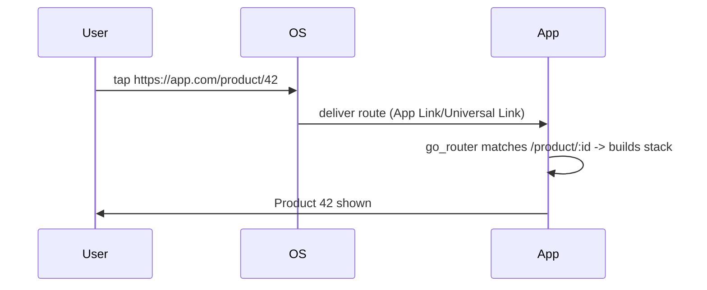

# Deep Linking & URL Strategy

> Deep links let an external URL (or app link/universal link) open a specific screen with its full state; `go_router` maps the link's path to a route and restores the stack — but mobile requires platform config, and web requires choosing a URL strategy (path vs hash).

## Introduction

A deep link is a URL that opens your app at a specific location (`myapp://product/42` or `https://app.com/product/42`). This file covers how `go_router` handles them, the mobile platform setup (App Links / Universal Links / custom schemes), and the **web URL strategy** (path vs hash) plus SEO implications.

## Why this concept exists

Users share links, click notifications, and (on web) bookmark/refresh URLs. The app must land them on the exact screen with correct state. `go_router`'s path-based routing makes links map to routes; platform/web config makes the OS/browser deliver those links to your app.

## Real-world analogy

A deep link is a **direct-dial phone extension**: instead of calling the front desk (app home) and being transferred, you dial the exact extension (screen) and reach it immediately. The phone system (OS/browser + platform config) must be set up to route that extension to you.

## Problem Statement

Tapping `https://app.com/product/42` (or a push notification) should open the product screen directly; on web, refreshing that URL should work and links should be clean (no `#`). You'll configure deep links and choose a URL strategy.

## Internal Working

```mermaid
flowchart TD
    Ext["External link / notification / browser URL"] --> OS[OS/browser + platform config]
    OS --> App[app receives route info]
    App --> GR[go_router matches path -> builds stack]
    GR --> Screen[/product/42 restored]
```

- **`go_router` side**: because routes are path-based, an incoming path (`/product/42`) matches a `GoRoute` and `go_router` builds the corresponding (possibly nested) stack — deep-link restoration is automatic if your route tree models the hierarchy.
- **Mobile platform config** (required for OS to deliver links):
  - **Android App Links** (verified `https://` via `assetlinks.json`) and/or **custom scheme** (`myapp://`) in `AndroidManifest.xml` intent filters.
  - **iOS Universal Links** (associated domains + `apple-app-site-association`) and/or custom URL scheme in `Info.plist`.
- **Web URL strategy**:
  - **Path strategy** (clean URLs, `app.com/product/42`) — requires server config to serve `index.html` for all paths; better for SEO/sharing. Enabled via `usePathUrlStrategy()`.
  - **Hash strategy** (default historically, `app.com/#/product/42`) — no server config needed, but ugly and worse for SEO.
- **Notifications**: a push payload carrying a route → on tap, `context.go(path)` (or set initial location) restores the screen ([Module 32](../32%20Notifications/README.md)).

## Memory Representation

Deep-link restoration builds the matched stack once; no special memory beyond the resulting routes ([12 · navigator_stack](../12%20Navigation/01_navigator_stack.md)).

## Compiler Behavior

Not applicable (typed routes still help correctness).

## Runtime Behavior

On cold start via a link, the app's initial location is the link's path; on warm start, the OS delivers the new location and `go_router` navigates. Web refresh re-parses the URL → same route.

## Flutter Engine Behavior

The embedder delivers platform route info (deep links) to the framework ([10 · embedder_and_startup](../10%20Flutter%20Architecture/05_embedder_and_startup.md)).

## Dart VM Behavior

Not applicable.

## Examples

```dart
import 'package:flutter/material.dart';
import 'package:flutter_web_plugins/url_strategy.dart'; // for web path strategy
import 'package:go_router/go_router.dart';

void main() {
  usePathUrlStrategy(); // web: clean URLs (app.com/product/42) instead of /#/product/42
  runApp(MaterialApp.router(routerConfig: _router));
}

final _router = GoRouter(
  // Nested route tree so /product/42 restores home -> product stack on deep link:
  routes: [
    GoRoute(
      path: '/',
      builder: (_, __) => const HomeScreen(),
      routes: [
        GoRoute(
          path: 'product/:id',
          builder: (_, state) => ProductScreen(id: state.pathParameters['id']!),
        ),
      ],
    ),
  ],
);

// Handling a notification payload that carries a route:
void onNotificationTap(BuildContext context, String? route) {
  if (route != null) context.go(route); // e.g., '/product/42'
}

class HomeScreen extends StatelessWidget {
  const HomeScreen({super.key});
  @override
  Widget build(BuildContext context) => Scaffold(appBar: AppBar(title: const Text('Home')));
}
class ProductScreen extends StatelessWidget {
  final String id;
  const ProductScreen({super.key, required this.id});
  @override
  Widget build(BuildContext context) => Scaffold(appBar: AppBar(title: Text('Product $id')));
}
```

```text
Android (AndroidManifest.xml) intent filter for https App Links:
  <intent-filter android:autoVerify="true">
    <action android:name="android.intent.action.VIEW"/>
    <category android:name="android.intent.category.DEFAULT"/>
    <category android:name="android.intent.category.BROWSABLE"/>
    <data android:scheme="https" android:host="app.com"/>
  </intent-filter>
  + host assetlinks.json for verification.

iOS: add Associated Domains (applinks:app.com) + apple-app-site-association file.
```

## Diagrams



## Common Mistakes

| Mistake | Why | Fix |
|---------|-----|-----|
| Expecting deep links without platform config | OS won't deliver links | Configure App Links/Universal Links/schemes |
| Flat routes but expecting stack restoration | No parent to restore | Model hierarchy with sub-routes |
| Hash URLs on web for SEO/sharing | Ugly, poor SEO | `usePathUrlStrategy()` + server rewrite to `index.html` |
| Path strategy without server rewrite | 404 on refresh/direct link | Configure hosting to serve `index.html` for all paths |
| Objects in deep-link URLs | Not serializable | Use ids in the path; fetch data |

## Best Practices

- Model your **route tree hierarchically** so deep links restore the correct (nested) stack.
- Configure platform deep links: **App Links (Android)** + **Universal Links (iOS)**; add custom schemes if needed.
- On web, prefer **path URL strategy** (clean URLs, SEO) and configure hosting to serve `index.html` for all routes.
- Encode only **ids/params** in URLs; fetch data by id on arrival.
- Route notification taps through `go_router` (`context.go(path)`).

## Performance

Deep-link restoration is a one-time stack build; no ongoing cost. Path strategy has SEO/shareability benefits at the cost of server config ([Module 53](../53%20Flutter%20Web/README.md)).

## Advantages / Disadvantages

- **+** Direct-to-screen links, shareable/bookmarkable URLs, notification routing, web refresh works, SEO (path strategy).
- **−** Platform setup required (Android/iOS), web needs server rewrite for path strategy, careful route-tree modeling.

## Interview Questions

1. **🟢 What is a deep link?** — A URL that opens the app at a specific screen with its state (e.g., `https://app.com/product/42`).
2. **🟢 How does `go_router` support deep links?** — Its path-based routes match incoming URLs and build the corresponding (nested) stack automatically.
3. **🟡 What platform setup is required?** — Android App Links (verified https + `assetlinks.json`) / custom scheme; iOS Universal Links (associated domains + AASA) / URL scheme.
4. **🟡 Path vs hash URL strategy on web?** — Path (`/product/42`, clean, SEO-friendly, needs server rewrite) vs hash (`/#/product/42`, no server config, ugly/poor SEO).
5. **🟡 Why must route trees be hierarchical for deep links?** — So restoring a deep path recreates its parent stack (home→product), enabling correct back behavior.
6. **🔴 Why does path strategy 404 on refresh without server config?** — The server must serve `index.html` for all paths; otherwise it looks for a real file at that path. Configure hosting rewrites.
7. **🔴 How do you route a notification tap to a screen?** — Carry the route/path in the payload and call `context.go(path)` (or set initial location) on tap.

## Senior Engineer Tips

- Test deep links in all three states: cold start, warm/background, and web refresh — behavior differs.
- Keep URLs id-based and canonical; avoid embedding transient/objects.
- Set up path strategy + hosting rewrites early for web; retrofitting hash→path breaks existing links.

## Architect Perspective

Deep linking + URL strategy are foundational for shareability, growth (marketing links), notifications, and web/SEO. A hierarchical, id-based route tree with platform + hosting config makes the whole app addressable and link-restorable — a cross-cutting concern spanning routing, notifications, and web ([Modules 32, 53, 17](../32%20Notifications/README.md)).

## Summary

- Deep links map external URLs to routes; `go_router` restores the (nested) stack from the path.
- Configure mobile App/Universal Links; on web choose path strategy (+ server rewrite) for clean, SEO-friendly URLs.
- Use hierarchical, id-based routes; route notification taps through the router.

## Revision Notes

- Deep link = URL → specific screen+state; `go_router` matches path → builds stack (model hierarchy!).
- Mobile: App Links (Android) / Universal Links (iOS) + optional custom schemes.
- Web: `usePathUrlStrategy()` (clean/SEO, needs `index.html` rewrite) vs hash (default, no config).
- URLs carry ids/params, not objects; route notifications via `context.go`.

## Practice Questions

1. What must you configure for OS to deliver deep links?
2. Path vs hash strategy tradeoffs?
3. Why must routes be hierarchical for correct deep-link back behavior?

## Coding Questions

1. Configure a nested route so `/product/42` restores home→product.
2. Enable path URL strategy and note the hosting requirement.
3. Route a fake notification payload to a screen via `context.go`.

## Mini Project

**Deep-linkable app (Flutter + docs):** Build a `go_router` app with a nested `/product/:id` route, enable path URL strategy, and document the Android/iOS deep-link config + web hosting rewrite. Verify a pasted/deep URL restores the correct stack. Acceptance: deep link opens the right nested screen; clean web URLs; config documented; app runs.
