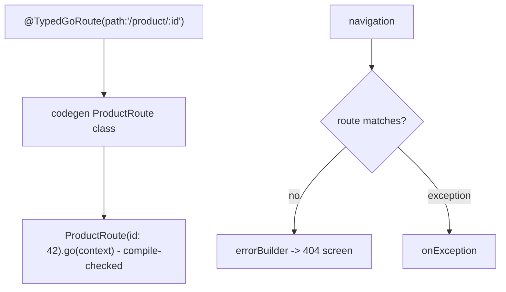
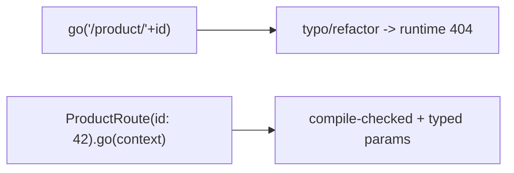

# Type-Safe Routes & Error Handling

> Type-safe routes (via `go_router_builder` codegen) turn stringly-typed paths into compile-checked classes with typed params, and `errorBuilder`/`onException` handle unmatched routes and navigation errors — together making routing refactor-safe and robust.

## Introduction

Two production concerns: (1) **type-safe routes** — replacing error-prone path strings (`'/product/${id}'`) with generated route classes (`ProductRoute(id: 42).go(context)`); (2) **error handling** — a fallback UI for unknown/invalid routes (`errorBuilder`) and exception handling. This file covers both.

## Why this concept exists

String paths are typo-prone and break silently on refactor (runtime 404). Codegen'd typed routes give compile-time safety and IDE support. And any router needs a graceful "route not found"/error screen instead of a crash or blank page.

## Real-world analogy

Type-safe routes are **pre-addressed, validated envelopes**: you can't mis-address them (the compiler checks), versus hand-writing addresses (typos → lost mail = 404). `errorBuilder` is the **dead-letter office**: mail that can't be delivered goes to a defined handler, not the void.

## Problem Statement

You keep breaking `'/product/:id'` links on refactors and want compile-time safety and typed params, plus a proper 404 screen for bad URLs/deep links. You'll use `go_router_builder` typed routes and an `errorBuilder`.

## Internal Working



- **Type-safe routes** (`go_router_builder` + `build_runner`): annotate a route class with `@TypedGoRoute<T>(path: '/product/:id')`, declare params as fields; codegen produces `T.go(context)`/`T.push(context)` and a `build`/`GoRouteData`-based builder. Params are typed (`int id`), so typos/wrong types are **compile errors**.
- **`errorBuilder`** (`GoRouter(errorBuilder: (context, state) => ...)`): renders when no route matches (404) or a build error occurs; `state.error` holds details.
- **`onException`** (newer API): centralized handling of navigation exceptions (e.g., redirect to a safe location).
- **`extra`** typing: with typed routes you can carry typed `extra` more safely (still non-URL).
- Typed routes compose with guards/shells from the other files.

## Memory Representation

Not applicable beyond normal routing.

## Compiler Behavior

**The point**: typed routes make missing/mistyped paths and params **compile-time errors** rather than runtime 404s — the key safety win. Requires a codegen build step (`dart run build_runner build`).

## Runtime Behavior

Navigating a typed route resolves to its path with encoded params; unmatched/invalid locations hit `errorBuilder`/`onException` instead of crashing.

## Flutter Engine Behavior / Dart VM Behavior

Not applicable.

## Examples

```yaml
# pubspec.yaml
dependencies:
  go_router: ^14.0.0
dev_dependencies:
  go_router_builder: ^2.0.0
  build_runner: ^2.4.0
```

```dart
import 'package:flutter/material.dart';
import 'package:go_router/go_router.dart';
// part 'routes.g.dart'; // generated by build_runner

// Type-safe route definitions (codegen produces navigation helpers)
@TypedGoRoute<HomeRoute>(path: '/', routes: [
  TypedGoRoute<ProductRoute>(path: 'product/:id'),
])
class HomeRoute extends GoRouteData {
  const HomeRoute();
  @override
  Widget build(BuildContext context, GoRouterState state) => const HomeScreen();
}

class ProductRoute extends GoRouteData {
  final int id;              // typed path param
  final String? ref;         // typed query param
  const ProductRoute({required this.id, this.ref});
  @override
  Widget build(BuildContext context, GoRouterState state) =>
      ProductScreen(id: id, ref: ref);
}

final router = GoRouter(
  routes: $appRoutes, // generated aggregate of typed routes
  // 404 / error fallback:
  errorBuilder: (context, state) => Scaffold(
    appBar: AppBar(title: const Text('Not found')),
    body: Center(child: Text('No route for "${state.uri}"\n${state.error}')),
  ),
);

// Navigating — compile-checked, typed params (no string typos):
// const ProductRoute(id: 42, ref: 'home').go(context);
// const ProductRoute(id: 42).push(context);

void main() => runApp(MaterialApp.router(routerConfig: router));

class HomeScreen extends StatelessWidget {
  const HomeScreen({super.key});
  @override
  Widget build(BuildContext context) => Scaffold(
        appBar: AppBar(title: const Text('Home')),
        body: Center(
          child: ElevatedButton(
            onPressed: () => const ProductRoute(id: 42, ref: 'home').go(context),
            child: const Text('Open product 42 (type-safe)'),
          ),
        ),
      );
}
class ProductScreen extends StatelessWidget {
  final int id;
  final String? ref;
  const ProductScreen({super.key, required this.id, this.ref});
  @override
  Widget build(BuildContext context) =>
      Scaffold(appBar: AppBar(title: Text('Product $id (ref: $ref)')));
}
```

## Diagrams



## Common Mistakes

| Mistake | Why | Fix |
|---------|-----|-----|
| Hand-building path strings everywhere | Typos, refactor breakage | Use type-safe routes |
| No `errorBuilder` | Crash/blank on bad route/deep link | Provide a 404/error screen |
| Forgetting to run `build_runner` | Generated code stale/missing | Run/watch codegen |
| Putting objects in typed query/path | URLs can't hold objects | Use ids; `extra` for in-app objects |
| Ignoring `state.error` | Unhelpful error UI | Surface/log the error appropriately |

## Best Practices

- Adopt **type-safe routes** for anything beyond a trivial app — compile-time safety + IDE navigation + refactor-friendliness.
- Always provide an **`errorBuilder`** (404) and handle exceptions (`onException`) gracefully; log `state.error`.
- Keep params **typed and id-based**; reserve `extra` for non-URL data.
- Automate codegen in CI (`build_runner`); commit generated files or generate in CI consistently.
- Combine typed routes with guards/shells for a fully robust router.

## Performance

Codegen adds build time, not runtime cost. Error handling is a cheap fallback path. No runtime penalty vs untyped ([01_go_router_fundamentals.md](01_go_router_fundamentals.md)).

## Advantages / Disadvantages

- **+** Compile-time route/param safety, IDE autocomplete/refactor, robust 404/error UX, fewer navigation bugs.
- **−** Codegen setup + build step, more ceremony than raw strings, must keep generated code in sync.

## Interview Questions

1. **🟢 What do type-safe routes give you?** — Compile-checked navigation with typed params (via `go_router_builder` codegen), eliminating string-typo runtime 404s.
2. **🟢 What is `errorBuilder` for?** — Rendering a fallback (404/error) screen when no route matches or a build error occurs.
3. **🟡 How are typed routes defined?** — Annotate `GoRouteData` classes with `@TypedGoRoute`, declare params as fields; codegen generates `.go`/`.push` helpers and the route table (`$appRoutes`).
4. **🟡 What's the tradeoff of type-safe routes?** — Compile-time safety + refactor-friendliness at the cost of a codegen build step and extra ceremony.
5. **🟡 How do you handle a deep link to a non-existent route?** — `errorBuilder` renders a 404 (log `state.error`); optionally `onException`/`redirect` to a safe page.
6. **🔴 Where does the compile-time safety come from?** — Params/paths become Dart types/fields, so mistakes are caught by the analyzer/compiler, not at runtime.
7. **🔴 How do typed routes handle non-URL objects?** — Still via `extra` (not encoded in the URL); URL params stay id/primitive-based.

## Senior Engineer Tips

- Turn on type-safe routes early; migrating string call sites later is tedious.
- Wire `build_runner` into CI and pre-commit so generated routes never go stale.
- Pair a good `errorBuilder` with logging/monitoring so bad deep links are visible ([Module 52](../52%20Monitoring/README.md)).

## Architect Perspective

Type-safe routes + robust error handling make routing a compile-checked, resilient contract — fewer runtime navigation bugs, safe refactors, and graceful failure for bad links. Combined with guards ([03_guards_and_redirects.md](03_guards_and_redirects.md)) and shells ([04_shell_routes_and_nested.md](04_shell_routes_and_nested.md)), it forms a production routing layer that scales across large teams and platforms.

## Summary

- Type-safe routes (codegen) give compile-checked navigation with typed params; `errorBuilder`/`onException` handle 404s/errors.
- Prefer typed, id-based routes; `extra` for in-app objects; always provide an error screen.
- Automate codegen; combine with guards/shells for a robust router.

## Revision Notes

- Type-safe: `@TypedGoRoute<T>` on `GoRouteData` + `build_runner` → `T(params).go(context)` (compile-checked). `routes: $appRoutes`.
- `errorBuilder` (404/error, `state.error`) + `onException` (centralized handling).
- Typed/id params; `extra` for non-URL objects; automate codegen in CI.
- Compose with guards + shells for production routing.

## Practice Questions

1. How do type-safe routes prevent runtime 404s?
2. What renders on an unmatched deep link?
3. What's the cost of adopting type-safe routes?

## Coding Questions

1. Define a typed `ProductRoute(id, ref)` and navigate with it.
2. Add an `errorBuilder` 404 screen surfacing `state.error`.
3. Set up `build_runner` and regenerate after adding a route.

## Mini Project — Module capstone

**Production router (Flutter):** Build a `go_router` app combining all four concerns: type-safe routes (codegen), an auth guard (`redirect` + `refreshListenable`), a deep-linkable `StatefulShellRoute` tab shell, and an `errorBuilder` 404 — with clean web URLs (path strategy). Acceptance: compile-checked navigation; guards + deep links + tabs all work; 404 handled; app runs. (This is the Module 13 routing backbone for a real app.)
