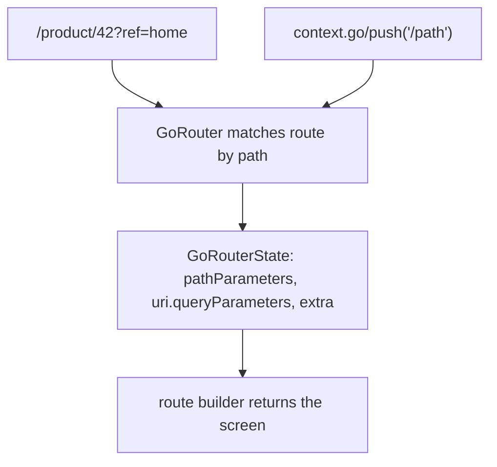
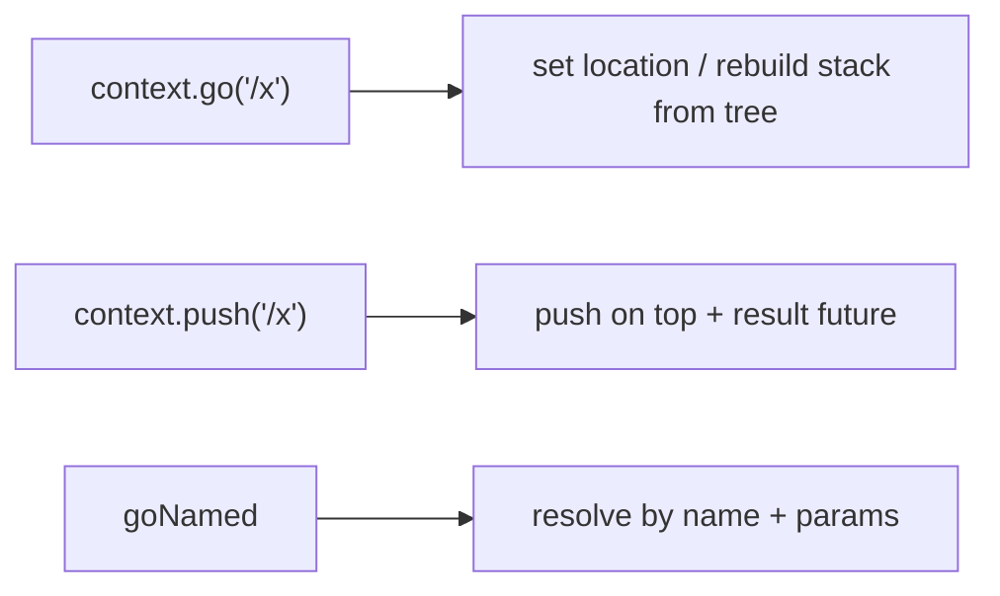

# `go_router` Fundamentals

> `go_router` is a declarative, URL-based router (built on Navigator 2.0) where you define routes by path with builders, navigate with `context.go`/`push`, and read `:params` and `?query` from the matched location.

## Introduction

`go_router` (package: `go_router`) lets you declare a route table by **path** (`/product/:id`), wire it with `MaterialApp.router`, and navigate declaratively. It handles the Navigator 2.0 boilerplate (delegate/parser) for you. This file covers setup, params, and the navigation API.

## Why this concept exists

Raw Navigator 2.0 is powerful but verbose ([12 · declarative_navigation](../12%20Navigation/declarative_navigation.md)); imperative named routes don't sync URLs or handle deep links well. `go_router` gives a concise, URL-first API that's the officially-recommended production choice.

## Real-world analogy

`go_router` is a **street-address system** for your app: every screen has an address (`/product/42`), you navigate by address (`go('/product/42')`), and anyone can share/bookmark an address to land exactly there (deep link).

## Problem Statement

You need `/`, `/products`, and `/product/:id?ref=...`, navigable by URL and deep-linkable. You'll configure `GoRouter`, read the `id` path param and `ref` query param, and navigate with `go`/`push`.

## Internal Working



- **Config**: `GoRouter(routes: [GoRoute(path: '/', builder: ...), GoRoute(path: '/product/:id', builder: ...)])`; attach via `MaterialApp.router(routerConfig: router)`.
- **Params**: `:id` is a **path parameter** (`state.pathParameters['id']`); `?ref=` is a **query parameter** (`state.uri.queryParameters['ref']`).
- **Navigation**:
  - `context.go('/path')` — set the location (replaces the stack per the route tree; URL-style).
  - `context.push('/path')` — push on top (adds to stack, returns a result future).
  - `context.goNamed('name', pathParameters: {...}, queryParameters: {...})` — by route name.
  - `context.pop()` — pop.
- **Sub-routes**: nest `routes:` inside a `GoRoute` to build hierarchical paths/stacks.
- **`extra`**: pass a non-URL object alongside navigation (not shareable/deep-linkable — for in-app objects).

## Memory Representation

`go_router` manages the Navigator 2.0 delegate/pages; route state is derived from the current location ([12 · declarative_navigation](../12%20Navigation/declarative_navigation.md)).

## Compiler Behavior

Path strings are untyped by default (typos = runtime 404) → use **type-safe routes** for compile safety ([type_safe_and_error_handling.md](type_safe_and_error_handling.md)).

## Runtime Behavior

Navigating changes the location; `go_router` matches it to a route (or the error builder), builds the page stack, and syncs the URL (on web). `go` vs `push` differ in stack behavior.

## Flutter Engine Behavior / Dart VM Behavior

Not applicable beyond rendering.

## Examples

```yaml
# pubspec.yaml
dependencies:
  go_router: ^14.0.0
```

```dart
import 'package:flutter/material.dart';
import 'package:go_router/go_router.dart';

final router = GoRouter(
  initialLocation: '/',
  routes: [
    GoRoute(
      path: '/',
      name: 'home',
      builder: (context, state) => const HomeScreen(),
      routes: [ // sub-route -> /products
        GoRoute(
          path: 'products',
          name: 'products',
          builder: (context, state) => const ProductsScreen(),
        ),
      ],
    ),
    GoRoute(
      path: '/product/:id', // path param
      name: 'product',
      builder: (context, state) {
        final id = state.pathParameters['id']!;            // path param
        final ref = state.uri.queryParameters['ref'];      // query param
        return ProductScreen(id: id, ref: ref);
      },
    ),
  ],
);

void main() => runApp(MaterialApp.router(routerConfig: router));

class HomeScreen extends StatelessWidget {
  const HomeScreen({super.key});
  @override
  Widget build(BuildContext context) => Scaffold(
        appBar: AppBar(title: const Text('Home')),
        body: Center(
          child: Column(mainAxisSize: MainAxisSize.min, children: [
            ElevatedButton(
              onPressed: () => context.go('/products'),
              child: const Text('Go to products'),
            ),
            ElevatedButton(
              // navigate by name with params + query
              onPressed: () => context.pushNamed('product',
                  pathParameters: {'id': '42'}, queryParameters: {'ref': 'home'}),
              child: const Text('Open product 42'),
            ),
          ]),
        ),
      );
}
class ProductsScreen extends StatelessWidget {
  const ProductsScreen({super.key});
  @override
  Widget build(BuildContext context) => Scaffold(appBar: AppBar(title: const Text('Products')));
}
class ProductScreen extends StatelessWidget {
  final String id;
  final String? ref;
  const ProductScreen({super.key, required this.id, this.ref});
  @override
  Widget build(BuildContext context) =>
      Scaffold(appBar: AppBar(title: Text('Product $id (ref: $ref)')));
}
```

## Diagrams



## Common Mistakes

| Mistake | Why | Fix |
|---------|-----|-----|
| Confusing `go` vs `push` | Different stack behavior | `go` = set location; `push` = add on top |
| Untyped path typos | Runtime 404 | Use type-safe routes ([type_safe_and_error_handling.md](type_safe_and_error_handling.md)) |
| Passing objects via query params | URLs can't hold objects | Use `extra` (non-shareable) or fetch by id |
| Forgetting `MaterialApp.router` | Router not wired | Use `.router(routerConfig:)` |
| Reading query from `pathParameters` | Wrong map | Use `state.uri.queryParameters` |

## Best Practices

- Design **clean, hierarchical paths** (`/product/:id`); use sub-routes for hierarchy.
- Use **path params** for identity, **query params** for options/filters, **`extra`** only for in-app objects (not deep-linkable).
- Prefer **named routes** + params for refactor-safety; adopt **type-safe routes** for compile safety.
- Wire via `MaterialApp.router(routerConfig:)`; keep the router config centralized.
- Understand `go` (URL-set) vs `push` (stack-add) and pick intentionally.

## Performance

Comparable to Navigator; route matching is cheap. Deep-link restoration builds the matched stack once ([12 · navigator_stack](../12%20Navigation/navigator_stack.md)).

## Advantages / Disadvantages

- **+** Declarative URL-based routing, deep links, params, sub-routes, guards/shells, official recommendation, web-ready.
- **−** Untyped paths by default (typo-prone), `go`/`push` nuance, learning curve vs simple `Navigator.push`.

## Interview Questions

1. **🟢 What is `go_router`?** — A declarative, URL-based routing package built on Navigator 2.0; you define routes by path and navigate with `context.go`/`push`.
2. **🟢 Path param vs query param?** — Path (`:id`) identifies the resource (`state.pathParameters`); query (`?ref=`) carries options (`state.uri.queryParameters`).
3. **🟡 `go` vs `push`?** — `go` sets the location (rebuilds the stack from the route tree; URL-style); `push` adds a route on top (and returns a result future).
4. **🟡 How do you pass an in-app object that shouldn't be in the URL?** — Via `extra` (not shareable/deep-linkable); for shareable, use an id param and fetch.
5. **🟡 How is the router attached?** — `MaterialApp.router(routerConfig: goRouter)`.
6. **🔴 Why prefer type-safe routes?** — Untyped path strings cause runtime 404 on typos; codegen'd typed routes catch errors at compile time ([type_safe_and_error_handling.md](type_safe_and_error_handling.md)).
7. **🔴 How do sub-routes work?** — Nesting `routes:` inside a `GoRoute` composes paths/stacks hierarchically (`/` → `/products`).

## Senior Engineer Tips

- Centralize the router config; name routes and navigate by name/typed routes to survive path refactors.
- Reserve `extra` for genuinely non-URL data; anything shareable/deep-linkable must be expressible in the path/query.
- Be deliberate about `go` vs `push`; misuse causes surprising back-stack behavior.

## Architect Perspective

`go_router` makes navigation a declarative projection of URLs/state — the routing backbone for shareable, deep-linkable, web-capable apps. Centralized, typed, guarded route config is a maintainability and UX asset that scales across teams and platforms ([Modules 17, 53](../17%20Authentication/README.md)).

## Summary

- `go_router`: declarative URL routes with `:path`/`?query` params, navigated via `go`/`push`/`goNamed`.
- Path params = identity, query = options, `extra` = in-app objects; wire with `MaterialApp.router`.
- Prefer named/type-safe routes; understand `go` vs `push`.

## Revision Notes

- `GoRouter(routes: [GoRoute(path, builder, routes:)])` + `MaterialApp.router(routerConfig:)`.
- Params: `state.pathParameters` (`:id`), `state.uri.queryParameters` (`?q=`), `state.extra` (in-app obj).
- Navigate: `context.go` (set location) / `push` (add + result) / `goNamed`/`pushNamed`.
- Untyped paths → runtime 404; prefer type-safe routes.

## Practice Questions

1. When use `go` vs `push`?
2. Where do you read `:id` vs `?ref=`?
3. Why not pass an object via query params?

## Coding Questions

1. Configure `/`, `/products`, `/product/:id?ref=` and navigate to each.
2. Add a sub-route and navigate by name with params.
3. Pass an in-app object via `extra` and read it.

## Mini Project

**Product routing (Flutter):** Build a `go_router` app with home, products list, and `/product/:id?ref=` (path + query), navigable by name with params, plus one sub-route. Verify a pasted URL opens the right screen. Acceptance: params read correctly; `go`/`push` used intentionally; URL-addressable; app runs.
