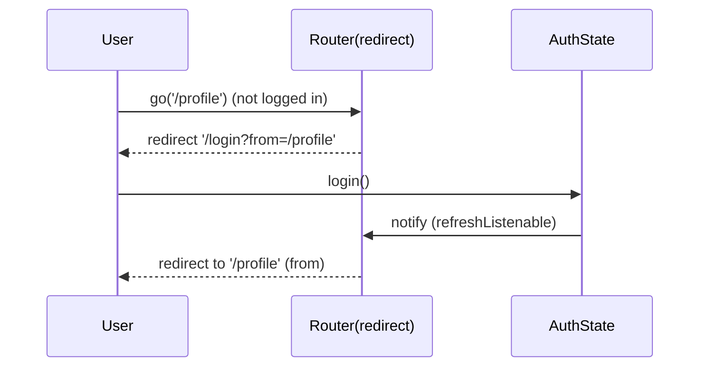

# Route Guards & Redirects

> `go_router`'s `redirect` is a function that inspects the target location + app state and optionally returns a different location — the mechanism for auth guards, onboarding gates, and conditional routing that also react to state changes via `refreshListenable`.

## Introduction

Guards protect routes: unauthenticated users go to `/login`, unonboarded users to `/welcome`, etc. `go_router` implements this with **`redirect`** (global and/or per-route) plus **`refreshListenable`** so the router re-evaluates when auth/app state changes. This file covers safe, loop-free guard design.

## Why this concept exists

Apps must enforce access rules centrally and consistently — not sprinkle `if (loggedIn)` checks in every screen. A redirect function centralizes routing policy and reacts to auth changes, so login/logout instantly moves the user to the right place, including for deep links.

## Real-world analogy

A **security checkpoint** at a building: before you reach any floor (route), the guard checks your badge (auth state) and either lets you through or redirects you to reception (`/login`). When your access changes (badge activated/revoked), the checkpoint re-evaluates.

## Problem Statement

Unauthenticated users hitting any protected route (even via deep link) must be sent to `/login`; after login they proceed to their original target; logout kicks them back to `/login`. You'll use `redirect` + `refreshListenable` without redirect loops.

## Internal Working

```mermaid
flowchart TD
    Nav[navigation / deep link / state change] --> R[redirect(context, state)]
    R --> Q{allowed?}
    Q -- yes --> Null[return null -> proceed]
    Q -- no, unauth --> Login[return '/login']
    Q -- already at login & logged in --> Home[return '/home']
    Refresh[refreshListenable notifies] --> R
```

- **`redirect`**: `String? Function(BuildContext, GoRouterState)` on `GoRouter` (global) or a `GoRoute` (local). Return `null` to proceed, or a location string to redirect. Runs on every navigation **and** whenever `refreshListenable` notifies.
- **`refreshListenable`**: a `Listenable` (e.g., your auth `ChangeNotifier`/a stream adapter) that tells the router to re-run redirects when auth/app state changes — so login/logout re-routes immediately.
- **Loop safety**: guard against infinite redirects — allow the destination you redirect *to* (e.g., don't redirect `/login` to `/login`); compare current location.
- **Preserve intended destination**: capture `state.uri` (the attempted location) so post-login you can `go` back to it (via a `from`/`redirect` query or stored value).
- **Per-route vs global**: global for app-wide auth; per-route `redirect` for route-specific rules.

## Memory Representation

The `refreshListenable` (auth notifier) lives in your state layer ([Module 11](../11%20State%20Management/README.md)); redirects are pure functions of state + target.

## Compiler Behavior

Not applicable (typed routes help correctness).

## Runtime Behavior

Every navigation triggers `redirect`; a returned location causes an immediate re-navigation (which re-runs redirect — hence loop guards). `refreshListenable` notifications re-evaluate the current location.

## Flutter Engine Behavior / Dart VM Behavior

Not applicable.

## Examples

```dart
import 'package:flutter/material.dart';
import 'package:go_router/go_router.dart';

// Auth state as a Listenable (drives router refresh)
class AuthState extends ChangeNotifier {
  bool loggedIn = false;
  void login() { loggedIn = true; notifyListeners(); }   // triggers redirect re-eval
  void logout() { loggedIn = false; notifyListeners(); }
}
final auth = AuthState();

final router = GoRouter(
  refreshListenable: auth, // re-run redirects when auth changes
  redirect: (context, state) {
    final loggingIn = state.matchedLocation == '/login';
    if (!auth.loggedIn) {
      // not logged in -> go to login, remembering where we wanted to go
      return loggingIn ? null : '/login?from=${state.uri}';
    }
    if (loggingIn) {
      // logged in but on login -> send onward (to 'from' or home)
      final from = state.uri.queryParameters['from'];
      return (from != null && from.isNotEmpty) ? from : '/home';
    }
    return null; // allow
  },
  routes: [
    GoRoute(path: '/login', builder: (_, __) => const LoginScreen()),
    GoRoute(path: '/home', builder: (_, __) => const HomeScreen()),
    GoRoute(path: '/profile', builder: (_, __) => const ProfileScreen()), // protected
  ],
);

void main() => runApp(MaterialApp.router(routerConfig: router));

class LoginScreen extends StatelessWidget {
  const LoginScreen({super.key});
  @override
  Widget build(BuildContext context) => Scaffold(
        appBar: AppBar(title: const Text('Login')),
        body: Center(
          child: ElevatedButton(onPressed: auth.login, child: const Text('Log in')),
        ),
      );
}
class HomeScreen extends StatelessWidget {
  const HomeScreen({super.key});
  @override
  Widget build(BuildContext context) => Scaffold(
        appBar: AppBar(title: const Text('Home'), actions: [
          IconButton(onPressed: auth.logout, icon: const Icon(Icons.logout)),
        ]),
      );
}
class ProfileScreen extends StatelessWidget {
  const ProfileScreen({super.key});
  @override
  Widget build(BuildContext context) => Scaffold(appBar: AppBar(title: const Text('Profile')));
}
```

## Diagrams



## Common Mistakes

| Mistake | Why | Fix |
|---------|-----|-----|
| Redirect loop | Redirecting the destination to itself | Allow the target (`if at /login return null`) |
| No `refreshListenable` | Router won't react to login/logout | Provide an auth `Listenable` |
| Per-screen `if (loggedIn)` checks | Scattered, inconsistent, deep-link holes | Centralize in `redirect` |
| Losing the intended destination | Post-login lands on home, not target | Carry `from`/`redirect` query param |
| Heavy work in `redirect` | Runs on every navigation | Keep it a fast pure check |

## Best Practices

- Centralize access policy in **`redirect`**; keep screens free of auth branching.
- Provide a **`refreshListenable`** (auth notifier / stream adapter) so login/logout re-routes instantly.
- **Guard against loops**: always allow the location you redirect to; compare `matchedLocation`.
- **Preserve intended destination** (`?from=`) for post-login continuation — including deep links.
- Keep `redirect` a fast, pure function of state + target.

## Performance

`redirect` runs per navigation and on every `refreshListenable` notification — keep it O(1)/pure (no I/O). Negligible if disciplined ([09 · build_phase](../09%20Rendering%20Pipeline/build_phase.md)).

## Advantages / Disadvantages

- **+** Centralized, consistent, deep-link-safe access control that reacts to state; supports post-login continuation.
- **−** Loop pitfalls; requires an auth `Listenable`; redirect logic can grow complex (keep it structured).

## Interview Questions

1. **🟢 How do you guard routes in `go_router`?** — With `redirect`: inspect target + app state, return `null` to allow or a location to redirect (e.g., to `/login`).
2. **🟢 What is `refreshListenable`?** — A `Listenable` (e.g., auth `ChangeNotifier`) that makes the router re-run `redirect` when it notifies — so login/logout re-routes immediately.
3. **🟡 How do you avoid redirect loops?** — Allow the destination you redirect to (return `null` when already at `/login`); compare the current/matched location.
4. **🟡 How do you send the user back to their intended page after login?** — Capture the attempted location (`state.uri`) in a `from`/`redirect` query and `go` there after auth.
5. **🟡 Why centralize guards in `redirect` vs per-screen checks?** — Consistency, no deep-link bypass, single source of routing policy, easier to maintain/test.
6. **🔴 When does `redirect` run?** — On every navigation and whenever `refreshListenable` notifies (re-evaluating the current location).
7. **🔴 Why keep `redirect` pure/fast?** — It runs frequently; async/heavy work would stall navigation — do I/O elsewhere and expose results as state.

## Senior Engineer Tips

- Model auth as a `Listenable`/stream in your state layer; the router just reads it in `redirect` ([Module 11](../11%20State%20Management/README.md), [Module 17](../17%20Authentication/README.md)).
- Structure complex guard logic as small helpers (isProtected, needsOnboarding) for readability/testability.
- Test guards for cold-start deep links (unauth → login → back to target) — a common gap.

## Architect Perspective

Redirect-based guards centralize routing policy, making auth/onboarding rules consistent and deep-link-safe — a key security/UX concern. Coupling the router to auth state via `refreshListenable` yields reactive, testable access control that integrates cleanly with the auth module ([Module 17](../17%20Authentication/README.md)) and state layer.

## Summary

- `redirect` centralizes access control (return `null` or a location); `refreshListenable` re-evaluates on auth/state changes.
- Guard against loops, preserve the intended destination, keep `redirect` pure/fast.
- Centralized guards beat per-screen checks for consistency and deep-link safety.

## Revision Notes

- `redirect(context, state)` → `null` (allow) or location (redirect); global or per-route.
- `refreshListenable: auth` → re-run redirects on auth change.
- Loop-safe: allow the redirect target; preserve `?from=` for post-login.
- Keep `redirect` pure/fast; centralize policy (no per-screen auth ifs).

## Practice Questions

1. How do you prevent an infinite redirect loop?
2. Why is `refreshListenable` necessary?
3. How do you return the user to a deep link after login?

## Coding Questions

1. Add an auth guard redirecting protected routes to `/login`.
2. Wire `refreshListenable` so logout instantly routes to `/login`.
3. Preserve and honor a `from` destination after login.

## Mini Project

**Auth-guarded router (Flutter):** Build a `go_router` app with `/login`, `/home`, and protected `/profile`; guard via `redirect` + an auth `ChangeNotifier` `refreshListenable`; preserve the intended destination for post-login continuation (test with a deep link to `/profile` while logged out). Acceptance: no loops; deep-link continuation works; logout re-routes; app runs.
