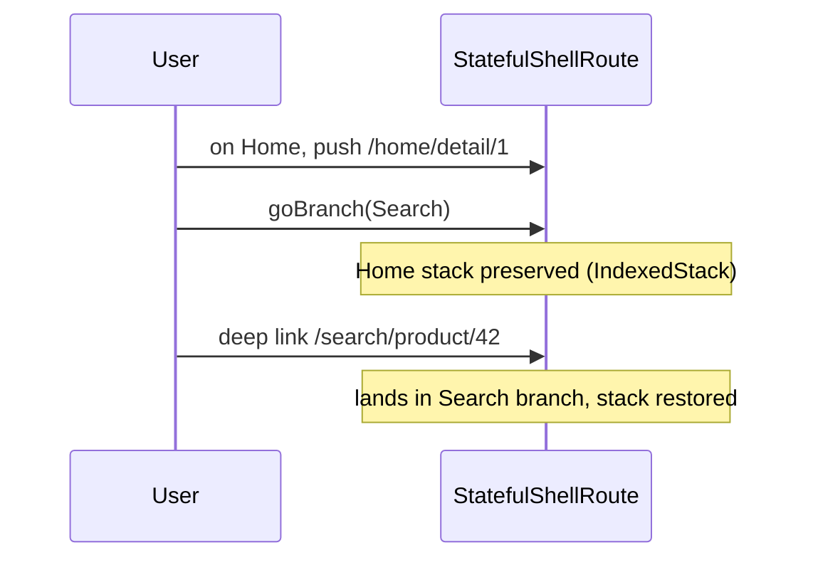

# Shell Routes & Nested Routing (`ShellRoute`, `StatefulShellRoute`)

> `ShellRoute` wraps child routes in a persistent shell (e.g., a scaffold with a bottom nav); `StatefulShellRoute` gives each branch its **own navigator + preserved state**, delivering deep-linkable tabs that keep their stacks — the `go_router` answer to Module 12's nested-navigator pattern.

## Introduction

Real apps have a persistent chrome (bottom nav, side rail) around swapping content, where each tab keeps its own stack. Hand-wiring nested navigators ([12 · nested_navigators_and_tabs](../12%20Navigation/nested_navigators_and_tabs.md)) is fiddly and not deep-linkable. `go_router`'s **`StatefulShellRoute`** provides this as first-class, URL-addressable routing.

## Why this concept exists

Tabs need: persistent shell UI, independent per-tab back stacks, preserved state on switch, **and** deep-linkability (each tab's screens have URLs). `StatefulShellRoute` combines nested navigators + state preservation + URL routing in one construct.

## Real-world analogy

A **shopping mall with a fixed directory/escalators (the shell)** and independent **stores (branches)**: each store remembers where you were browsing (per-branch stack/state), the mall frame stays put as you switch stores, and every store/aisle has an address (deep link).

## Problem Statement

A bottom-nav app (Home/Search/Cart) where each tab can push details, switching preserves each stack, back pops within the active tab, and `/search/product/42` deep-links into the Search tab. You'll use `StatefulShellRoute.indexedStack`.

## Internal Working

```mermaid
flowchart TD
    Shell[StatefulShellRoute: builds shell UI with navigationShell]
    Shell --> B0[Branch 0: /home + sub-routes (own navigator)]
    Shell --> B1[Branch 1: /search + sub-routes (own navigator)]
    Shell --> B2[Branch 2: /cart + sub-routes (own navigator)]
    Nav[navigationShell.goBranch(index)] --> Switch[switch tab, preserve stacks]
```

- **`ShellRoute`**: a route with a `builder` that wraps its child routes in shared UI (one navigator for the children). Good for a common frame with a **single** stack.
- **`StatefulShellRoute.indexedStack`**: multiple **branches**, each a `StatefulShellBranch` with its own routes and **its own `Navigator`** (backed by an `IndexedStack` for state preservation). The shell `builder` receives a `navigationShell` you use to render the tab bar and switch branches (`navigationShell.goBranch(index)`), reading `navigationShell.currentIndex`.
- **Deep links**: because each branch's routes have real paths (`/search/product/:id`), deep links land in the correct branch with its stack restored.
- **Back handling**: managed per-branch by the shell; back pops within the active branch.

## Memory Representation

`indexedStack` keeps all branches alive (state/stacks preserved) — memory ∝ number/heft of branches, like Module 12's `IndexedStack` ([12 · nested_navigators_and_tabs](../12%20Navigation/nested_navigators_and_tabs.md), [08 · dispose_and_leaks](../08%20Widget%20Lifecycle/dispose_and_leaks.md)).

## Compiler Behavior

Not applicable (typed routes still help).

## Runtime Behavior

Switching branches via `goBranch` shows the preserved branch stack; navigating within a branch pushes onto that branch's navigator; deep links route to the matching branch.

## Flutter Engine Behavior / Dart VM Behavior

Not applicable.

## Examples

```dart
import 'package:flutter/material.dart';
import 'package:go_router/go_router.dart';

final router = GoRouter(
  initialLocation: '/home',
  routes: [
    StatefulShellRoute.indexedStack(
      builder: (context, state, navigationShell) =>
          ScaffoldWithNav(navigationShell: navigationShell), // persistent shell
      branches: [
        StatefulShellBranch(routes: [
          GoRoute(
            path: '/home',
            builder: (_, __) => const TabScreen('Home'),
            routes: [ // deep-linkable within the Home branch
              GoRoute(path: 'detail/:id',
                  builder: (_, s) => DetailScreen('Home', s.pathParameters['id']!)),
            ],
          ),
        ]),
        StatefulShellBranch(routes: [
          GoRoute(
            path: '/search',
            builder: (_, __) => const TabScreen('Search'),
            routes: [
              GoRoute(path: 'product/:id',
                  builder: (_, s) => DetailScreen('Search', s.pathParameters['id']!)),
            ],
          ),
        ]),
        StatefulShellBranch(routes: [
          GoRoute(path: '/cart', builder: (_, __) => const TabScreen('Cart')),
        ]),
      ],
    ),
  ],
);

class ScaffoldWithNav extends StatelessWidget {
  final StatefulNavigationShell navigationShell;
  const ScaffoldWithNav({super.key, required this.navigationShell});
  @override
  Widget build(BuildContext context) {
    return Scaffold(
      body: navigationShell, // shows the active branch's navigator (IndexedStack)
      bottomNavigationBar: BottomNavigationBar(
        currentIndex: navigationShell.currentIndex,
        onTap: (i) => navigationShell.goBranch(
          i,
          initialLocation: i == navigationShell.currentIndex, // re-tap -> reset branch
        ),
        items: const [
          BottomNavigationBarItem(icon: Icon(Icons.home), label: 'Home'),
          BottomNavigationBarItem(icon: Icon(Icons.search), label: 'Search'),
          BottomNavigationBarItem(icon: Icon(Icons.shopping_cart), label: 'Cart'),
        ],
      ),
    );
  }
}

class TabScreen extends StatelessWidget {
  final String name;
  const TabScreen(this.name, {super.key});
  @override
  Widget build(BuildContext context) => Scaffold(
        appBar: AppBar(title: Text(name)),
        body: Center(
          child: ElevatedButton(
            onPressed: () => context.go(
                '/${name.toLowerCase()}${name == 'Search' ? '/product/42' : '/detail/1'}'),
            child: const Text('Push detail in this tab'),
          ),
        ),
      );
}
class DetailScreen extends StatelessWidget {
  final String tab, id;
  const DetailScreen(this.tab, this.id, {super.key});
  @override
  Widget build(BuildContext context) =>
      Scaffold(appBar: AppBar(title: Text('$tab detail $id')));
}

void main() => runApp(MaterialApp.router(routerConfig: router));
```

## Diagrams



## Common Mistakes

| Mistake | Why | Fix |
|---------|-----|-----|
| Using `ShellRoute` for independent tab stacks | Single navigator, no per-branch state | Use `StatefulShellRoute.indexedStack` |
| Hand-wiring nested navigators + `IndexedStack` | Reinvents the wheel, not deep-linkable | Use `StatefulShellRoute` |
| No re-tap reset behavior | Poor tab UX | `goBranch(i, initialLocation: i == current)` |
| Many heavy branches kept alive | Memory | Keep branches lean; lazy-load heavy content |
| Deep links not landing in the right tab | Flat routes | Nest branch routes with real paths |

## Best Practices

- Use **`StatefulShellRoute.indexedStack`** for tabbed shells needing per-branch stacks + state + deep links.
- Use plain **`ShellRoute`** only when children share one stack/frame (no independent tabs).
- Give each branch **real nested paths** so deep links land correctly.
- Implement **re-tap resets** via `goBranch(initialLocation:)`.
- Mind memory (all branches alive); keep branch content lean ([Module 21](../21%20Performance/README.md)).

## Performance

`indexedStack` preserves all branches (memory cost) for instant, state-preserving switches — same tradeoff as manual `IndexedStack`, now with deep-link support ([12 · nested_navigators_and_tabs](../12%20Navigation/nested_navigators_and_tabs.md)).

## Advantages / Disadvantages

- **+** Deep-linkable tabs with preserved per-branch stacks/state, persistent shell UI, first-class in `go_router`, far less boilerplate than manual nesting.
- **−** Memory (branches kept alive), conceptually dense, `ShellRoute` vs `StatefulShellRoute` confusion.

## Interview Questions

1. **🟢 `ShellRoute` vs `StatefulShellRoute`?** — `ShellRoute` wraps children in shared UI with one navigator; `StatefulShellRoute` gives each branch its own navigator + preserved state (for tabs).
2. **🟢 What does `StatefulShellRoute.indexedStack` give you?** — Deep-linkable tabs where each branch keeps its own stack/state (via an `IndexedStack`) inside a persistent shell.
3. **🟡 How do you switch tabs and get re-tap reset?** — `navigationShell.goBranch(index, initialLocation: index == currentIndex)`.
4. **🟡 How do deep links land in the right tab?** — Each branch's routes have real nested paths (`/search/product/:id`), so the URL matches that branch and restores its stack.
5. **🟡 How is this different from Module 12's manual approach?** — Same nested-navigator + `IndexedStack` idea, but first-class and **deep-linkable** with far less wiring.
6. **🔴 What's the memory implication?** — All branches are kept alive (state preserved) → memory grows with branch count/heft; keep branches lean.
7. **🔴 When would you use plain `ShellRoute`?** — When children share a single stack/frame (e.g., a common layout) and don't need independent per-tab stacks.

## Senior Engineer Tips

- Default to `StatefulShellRoute.indexedStack` for bottom-nav/side-rail apps — it's the modern, deep-linkable tab solution.
- Structure branch routes so every screen is URL-addressable; that's what makes tabs shareable/linkable.
- Watch memory with many/heavy branches; lazy-load expensive tab content.

## Architect Perspective

`StatefulShellRoute` makes tabbed shells first-class, URL-addressable, and state-preserving — reconciling the "native tab UX" requirement with deep linking and web. It's the routing structure for most multi-section apps and integrates guards/deep links cleanly, a key scalability/UX decision ([Modules 17, 53](../17%20Authentication/README.md)).

## Summary

- `ShellRoute` = shared frame + one stack; `StatefulShellRoute.indexedStack` = per-branch navigators with preserved state + deep links.
- Give branches real nested paths; implement re-tap reset; mind memory.
- The modern, deep-linkable replacement for manual nested navigators.

## Revision Notes

- `ShellRoute` (shared UI, single stack) vs `StatefulShellRoute.indexedStack` (per-branch navigator + preserved state + deep links).
- Shell `builder` gets `navigationShell`; `goBranch(i, initialLocation: i==current)` (re-tap reset).
- Branches need real nested paths for deep links; all branches kept alive (memory).
- Modern replacement for manual nested navigators (Module 12).

## Practice Questions

1. Why `StatefulShellRoute` over manual nested navigators?
2. How do deep links reach a specific tab?
3. What's the memory tradeoff and how do you mitigate it?

## Coding Questions

1. Build a 3-branch `StatefulShellRoute.indexedStack` bottom-nav shell.
2. Add deep-linkable detail sub-routes per branch and test a deep link.
3. Implement re-tap-to-reset on the active tab.

## Mini Project

**Deep-linkable tab shell (Flutter):** Build a `go_router` bottom-nav app with `StatefulShellRoute.indexedStack` (Home/Search/Cart), each branch with a deep-linkable detail route, preserved stacks on switch, re-tap reset, and back popping within the active branch. Verify `/search/product/42` deep-links into Search. Acceptance: preserved per-branch state; deep links land correctly; re-tap resets; app runs.
