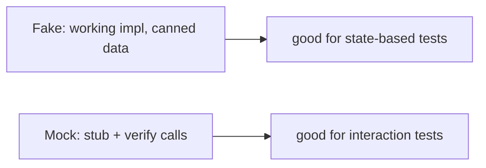

# Testing with DI (Fakes, Mocks, Overrides)

> The payoff of DI is testability: because consumers depend on abstractions, you inject **fakes/mocks** in tests to run logic without real network/DB/platform — via constructor injection, `get_it.reset()`+re-register, or Riverpod/Provider overrides.

## Introduction

DI's whole point (beyond decoupling) is that you can substitute dependencies. This file shows how to test with injected doubles: constructor-injected fakes, `get_it` test setup, Riverpod/Provider overrides, and the fake-vs-mock distinction. It's the bridge to Module 49 Testing.

## Why this concept exists

Testing logic against real HTTP/DB/platform is slow, flaky, and often impossible in unit tests. DI lets you inject a controllable double (fake/mock) so tests are fast, deterministic, and isolated — verifying *your* logic, not the dependency's.

## Real-world analogy

A **flight simulator**: pilots (your logic) train against a simulated cockpit (fakes) instead of a real plane (production deps) — safe, repeatable, and you can script any scenario (errors, edge cases) on demand.

## Problem Statement

Test a `LoginViewModel` that calls an `AuthRepository` (which hits the network) — for success, failure, and exception cases — without any real network. You'll inject a fake/mock repository three ways.

## Internal Working

```mermaid
flowchart TD
    Test[Unit test] -->|inject| Fake[FakeAuthRepository]
    Fake --> VM[LoginViewModel(repo)]
    VM --> Assert[assert behavior for scripted responses]
    subgraph Injection points
      CI[Constructor: new LoginViewModel(fake)]
      GI[get_it: reset + register fake]
      RP[Riverpod/Provider: override]
    end
```

- **Fake vs mock**:
  - **Fake**: a working lightweight implementation (in-memory repo, canned responses) — you write it.
  - **Mock**: a generated/configured stub (via `mockito`/`mocktail`) where you stub methods and verify calls.
- **Injection in tests**:
  - **Constructor injection** (simplest): `LoginViewModel(FakeAuthRepo())` — no framework needed.
  - **`get_it`**: `getIt.reset()` then register fakes in test `setUp`; code that resolves `getIt<T>()` gets the fake.
  - **Riverpod**: `ProviderContainer(overrides: [authRepoProvider.overrideWithValue(fake)])` — pure Dart, no widgets.
  - **Provider**: wrap the widget-under-test in a `Provider` supplying the fake (widget tests).
- **Widget tests**: use `pumpWidget` with the DI wired to fakes; `bloc_test` for blocs; `mocktail`/`mockito` for verifications.

## Memory Representation

Test doubles are lightweight objects; reset DI (`getIt.reset()`, dispose containers) between tests to avoid state bleed ([08 · dispose_and_leaks](../08%20Widget%20Lifecycle/05_dispose_and_leaks.md)).

## Compiler Behavior

Abstractions make substitution type-safe; Riverpod overrides are compile-checked. `mocktail` avoids codegen; `mockito` uses codegen (`build_runner`).

## Runtime Behavior

The consumer runs its real logic against the double's scripted behavior; tests assert results/interactions. No real I/O occurs.

## Flutter Engine Behavior / Dart VM Behavior

Not applicable.

## Examples

```dart
import 'package:test/test.dart';

abstract interface class AuthRepository { Future<bool> login(String u, String p); }
class LoginViewModel {
  final AuthRepository repo;
  LoginViewModel(this.repo);
  Future<String> submit(String u, String p) async {
    try {
      return (await repo.login(u, p)) ? 'success' : 'invalid';
    } catch (_) {
      return 'error';
    }
  }
}

// 1) FAKE: hand-written, scriptable
class FakeAuthRepo implements AuthRepository {
  final bool result;
  final bool throwErr;
  FakeAuthRepo({this.result = true, this.throwErr = false});
  @override
  Future<bool> login(String u, String p) async {
    if (throwErr) throw Exception('network');
    return result;
  }
}

void main() {
  group('LoginViewModel', () {
    test('success', () async {
      final vm = LoginViewModel(FakeAuthRepo(result: true)); // constructor injection
      expect(await vm.submit('a', 'b'), 'success');
    });
    test('invalid', () async {
      final vm = LoginViewModel(FakeAuthRepo(result: false));
      expect(await vm.submit('a', 'b'), 'invalid');
    });
    test('error', () async {
      final vm = LoginViewModel(FakeAuthRepo(throwErr: true));
      expect(await vm.submit('a', 'b'), 'error');
    });
  });
}
```

```dart
// 2) get_it in tests:
// setUp(() { getIt.reset(); getIt.registerSingleton<AuthRepository>(FakeAuthRepo()); });
//
// 3) Riverpod override (pure Dart):
// final c = ProviderContainer(overrides: [
//   authRepositoryProvider.overrideWithValue(FakeAuthRepo()),
// ]);
// addTearDown(c.dispose);
//
// 4) mocktail:
// class MockAuthRepo extends Mock implements AuthRepository {}
// when(() => repo.login(any(), any())).thenAnswer((_) async => true);
// verify(() => repo.login('a', 'b')).called(1);
```

## Diagrams



## Common Mistakes

| Mistake | Why | Fix |
|---------|-----|-----|
| Testing against real network/DB in unit tests | Slow, flaky | Inject fakes/mocks |
| Not resetting `get_it` between tests | State bleed | `getIt.reset()` in `setUp` |
| Not disposing `ProviderContainer` | Leaks across tests | `addTearDown(c.dispose)` |
| Over-mocking (mocking everything) | Brittle, tests the mock | Prefer fakes; mock only at boundaries |
| Depending on concretes | Can't substitute | Depend on abstractions |

## Best Practices

- **Depend on abstractions** so any double can be injected.
- Prefer **fakes** (working, readable) for most logic; use **mocks** (`mocktail`/`mockito`) when you must verify interactions.
- Use **constructor injection** for pure unit tests (no framework); **Riverpod overrides** / `get_it.reset()` for wired tests.
- **Reset/dispose DI** between tests to prevent state bleed.
- Keep logic **UI-free** (view models/use cases/blocs) so it's testable without the widget tree.

## Performance

Unit tests with fakes are fast/deterministic (no I/O). Reset/dispose keeps tests isolated; this is the foundation for a fast test suite ([Module 49](../49%20Testing/README.md)).

## Advantages / Disadvantages

- **+** Fast, deterministic, isolated tests; scriptable scenarios (errors/edges); verifies your logic; enables TDD.
- **−** Requires abstraction-based design + doubles; over-mocking creates brittle tests; some DI test setup boilerplate.

## Interview Questions

1. **🟢 How does DI enable testing?** — Consumers depend on abstractions, so tests inject fakes/mocks to run logic without real dependencies.
2. **🟢 Fake vs mock?** — Fake: a working lightweight implementation (canned data); mock: a stub where you configure returns and verify calls.
3. **🟡 How do you inject a fake with Riverpod?** — `ProviderContainer(overrides: [provider.overrideWithValue(fake)])` (or `ProviderScope` overrides in widget tests) — no widget tree needed for the container case.
4. **🟡 How do you inject fakes with `get_it` in tests?** — `getIt.reset()` in `setUp`, then register the fakes so `getIt<T>()` returns them.
5. **🟡 Why prefer fakes over mocks generally?** — Fakes are readable, reusable, and less brittle; mocks are best for verifying interactions at boundaries.
6. **🔴 Why reset/dispose DI between tests?** — To prevent state/registration bleed that causes order-dependent, flaky tests.
7. **🔴 What design makes logic testable without the widget tree?** — Keeping logic UI-free (view models/use cases/blocs) with injected abstractions.

## Senior Engineer Tips

- Write reusable **fakes** for your repositories/services; they double as documentation and speed up all tests.
- Use `mocktail` (no codegen) for quick interaction verification; reserve heavy mocking for true boundaries.
- Riverpod overrides are the cleanest DI-for-tests story — prefer them if you're on Riverpod.

## Architect Perspective

Testability is the primary architectural dividend of DI. Abstraction-based dependencies + a clear injection strategy (constructor/overrides/reset) enable a fast, deterministic test pyramid ([Module 49](../49%20Testing/README.md)) and TDD/BDD. Combined with UI-free logic layers (view models/use cases), it makes the whole system verifiable and refactor-safe — the hallmark of Clean Architecture ([Module 40](../40%20Clean%20Architecture/README.md)).

## Summary

- DI's payoff is testability: inject fakes/mocks via constructor, `get_it.reset()`, or Riverpod/Provider overrides.
- Prefer fakes (state-based) over mocks (interaction-based); reset/dispose DI between tests.
- Keep logic UI-free + abstraction-based so it's testable without real deps or the widget tree.

## Revision Notes

- Inject doubles: constructor (pure unit), `get_it.reset()`+register, Riverpod/Provider overrides.
- Fake (working impl) vs mock (`mocktail`/`mockito`: stub + verify).
- Depend on abstractions; reset/dispose between tests; logic UI-free.
- Fast/deterministic/isolated → foundation of the test pyramid (Module 49).

## Practice Questions

1. When use a fake vs a mock?
2. How do you inject a fake with Riverpod vs `get_it`?
3. Why reset DI between tests?

## Coding Questions

1. Test a `LoginViewModel` with a fake repo for success/invalid/error.
2. Rewrite one test using `mocktail` (stub + `verify`).
3. Write a widget test wiring a Provider/Riverpod override to a fake.

## Mini Project — Module capstone

**Wired + tested slice (Flutter):** Wire `HttpClient → AuthRepository → LoginViewModel` with your chosen DI (get_it or Riverpod), register real impls at a composition root, and write a test suite that injects fakes (constructor + container/reset override) covering success/failure/error — plus one `mocktail` interaction test. Acceptance: consumers depend on abstractions; real wiring at root; fakes injected in tests; DI reset/disposed between tests; suite passes.
