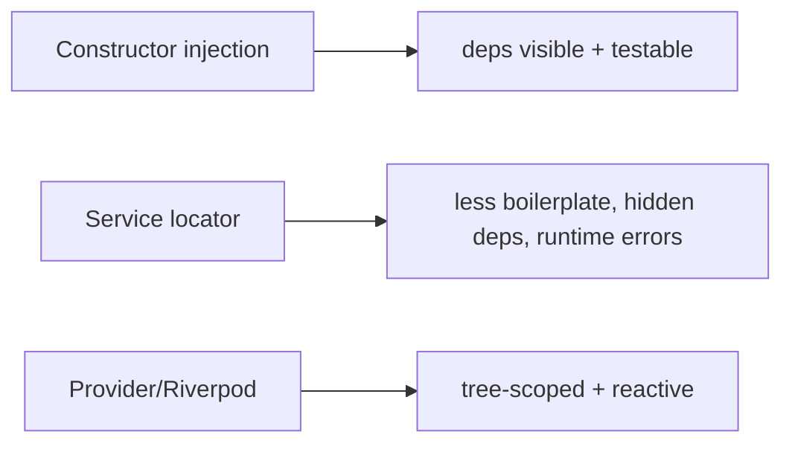

# DI Fundamentals (Composition Root, DI vs Service Locator)

> Dependency Injection supplies a class's dependencies from outside; in Flutter you wire the object graph at a **composition root** (app startup) and choose between **constructor injection** (explicit) and a **service locator** (global lookup) — usually a blend.

## Introduction

Recapping the pattern ([05 · dependency_injection](../05%20Design%20Patterns/dependency_injection.md)) in a Flutter context: what a composition root is, the DI-vs-service-locator tradeoff, and how the Flutter widget tree itself is a DI mechanism (`InheritedWidget`). This grounds the tool choices in the next files.

## Why this concept exists

Hard-wired `new`s make code untestable and rigid (DIP violation — [04](../04%20SOLID%20Principles/dip_dependency_inversion.md)). DI decouples "what a class needs" from "who provides it," enabling testing (inject fakes), swapping (flavors/providers), and a visible dependency graph. Flutter apps need a concrete strategy for this.

## Real-world analogy

A **restaurant kitchen**: ingredients (dependencies) are delivered to each station from a central pantry (composition root), not foraged by each cook (`new`). Constructor injection is **handing the cook exactly what they need**; a service locator is **a shared pantry cooks fetch from** — convenient, but you can't see from the recipe what a cook actually uses.

## Problem Statement

A `LoginViewModel` needs an `AuthRepository` which needs an `HttpClient`. Where do you create/wire these, how do consumers get them, and how do you swap real→fake in tests? You'll set up a composition root and pick injection styles.

## Internal Working

```mermaid
flowchart TD
    Root[Composition Root - app startup] -->|create + wire| Graph[HttpClient -> AuthRepository -> LoginViewModel]
    subgraph Delivery
      CI[Constructor injection: pass deps in ctor]
      SL[Service locator: getIt<T>() global lookup]
      Tree[InheritedWidget/Provider: deps down the tree]
    end
    Root --> Delivery
```

- **Composition root**: the single place (usually `main`/startup) where concrete implementations are created and wired to abstractions — the one spot allowed to know concretes ([06 · app_entry_point](../06%20Flutter%20Fundamentals/app_entry_point.md)).
- **Constructor injection** (preferred): dependencies passed to the constructor — explicit, immutable, testable; the graph is visible in signatures.
- **Service locator**: a global registry (`get_it`) where code calls `getIt<T>()` to fetch deps — convenient, less boilerplate, but hides dependencies (looks like a global) and errors at runtime.
- **Tree-based DI**: `InheritedWidget`/Provider/Riverpod supply deps to descendants via `context`/`ref` — natural for widget-scoped and reactive deps ([Module 11](../11%20State%20Management/README.md)).
- **Reality**: apps blend these — e.g., `get_it` for services + constructor injection into view models, or Riverpod providers for everything.

## Memory Representation

Container-registered singletons live for app lifetime; factories create per-request. Mind retained singletons ([05 · singleton](../05%20Design%20Patterns/singleton.md), [08 · dispose_and_leaks](../08%20Widget%20Lifecycle/dispose_and_leaks.md)).

## Compiler Behavior

Constructor injection + abstractions give compile-time-safe substitution; service-locator lookups by type fail at runtime if unregistered (like Provider). Riverpod adds compile-time provider safety ([11 · riverpod](../11%20State%20Management/riverpod.md)).

## Runtime Behavior

The composition root registers/creates; consumers receive (ctor) or fetch (locator/context). Tests substitute fakes at the root/override.

## Flutter Engine Behavior / Dart VM Behavior

Not applicable.

## Examples

```dart
// Abstractions
abstract interface class HttpClient { Future<String> get(String url); }
abstract interface class AuthRepository { Future<bool> login(String u, String p); }

// Concrete impls
class RealHttpClient implements HttpClient {
  @override
  Future<String> get(String url) async => 'ok';
}
class HttpAuthRepository implements AuthRepository {
  final HttpClient client;
  HttpAuthRepository(this.client); // constructor injection
  @override
  Future<bool> login(String u, String p) async => (await client.get('/login')) == 'ok';
}

// Consumer receives its dependency (constructor injection)
class LoginViewModel {
  final AuthRepository repo;
  LoginViewModel(this.repo);
  Future<bool> submit(String u, String p) => repo.login(u, p);
}

// Composition root (wire the graph once, at startup)
LoginViewModel buildLoginViewModel() {
  final client = RealHttpClient();
  final repo = HttpAuthRepository(client);
  return LoginViewModel(repo);
}

// In tests: inject fakes, no real HTTP
class FakeAuthRepo implements AuthRepository {
  @override
  Future<bool> login(String u, String p) async => true;
}
Future<void> demo() async {
  final vm = LoginViewModel(FakeAuthRepo()); // swap at the boundary
  assert(await vm.submit('a', 'b'));
}
```

## Diagrams



## Common Mistakes

| Mistake | Why | Fix |
|---------|-----|-----|
| `new`ing deps inside classes | Untestable, coupled | Inject via constructor |
| Service locator everywhere | Hidden global deps | Prefer ctor injection; locate at edges |
| No single composition root | Wiring scattered | Centralize creation/wiring at startup |
| Injecting trivial pure values | Ceremony | Inject volatile/external deps only |
| Depending on concretes | Recoupling | Depend on abstractions |

## Best Practices

- Prefer **constructor injection of abstractions**; make deps `final`.
- Wire the graph at a **single composition root** (thin `main`).
- Use a container (`get_it`/Riverpod) to *reduce wiring boilerplate*, not to hide dependencies.
- Inject **volatile/external** deps (repos, clients, clock); not trivial values.
- Keep the "dirty" concrete knowledge in the composition root.

## Performance

Negligible; container lookups are cheap, singletons avoid re-creation ([05 · dependency_injection](../05%20Design%20Patterns/dependency_injection.md)).

## Advantages / Disadvantages

- **+** Testable (fakes), swappable (flavors), explicit graph, single wiring point, enables DIP/OCP/Clean Architecture.
- **−** Boilerplate/wiring; service-locator overuse hides deps; lifetime management needs care.

## Interview Questions

1. **🟢 What is a composition root?** — The single startup place where concrete implementations are created and wired to abstractions; the rest of the app stays detail-agnostic.
2. **🟢 Constructor injection vs service locator?** — Constructor injection passes deps explicitly (visible, testable); a service locator is a global registry fetched by type (convenient but hides deps, runtime errors).
3. **🟡 How is the Flutter widget tree a DI mechanism?** — `InheritedWidget`/Provider/Riverpod supply dependencies to descendants via `context`/`ref` — tree-scoped DI.
4. **🟡 What should you inject vs not?** — Volatile/external deps (repos, HTTP clients, clock, config); not trivial pure helpers/values.
5. **🟡 How does DI enable testing?** — Substitute fakes/mocks for abstractions without changing consumers.
6. **🔴 Why prefer constructor injection over a locator generally?** — It makes dependencies explicit and compile-checked; locators hide the graph and defer errors to runtime — but locators are handy at composition edges.
7. **🔴 How does DI relate to build flavors?** — The composition root wires different implementations per flavor (dev/prod/mock) without touching feature code.

## Senior Engineer Tips

- Blend approaches deliberately: a locator/container for app services + constructor injection into view models/use cases keeps the graph both convenient and explicit.
- Keep the composition root thin and the only place that names concretes.
- Inject a `Clock`/`Uuid`/`Random` abstraction so time/randomness are testable — a common oversight.

## Architect Perspective

DI is the connective tissue of testable, modular architecture — the practical realization of DIP and the wiring layer of Clean Architecture ([Module 40](../40%20Clean%20Architecture/README.md)). A clear composition root, abstraction-based injection, and disciplined lifetimes enable testing, flavors, and modular boundaries at scale. The *mechanism* (get_it/Riverpod/Provider) matters less than the discipline.

## Summary

- DI supplies deps from outside; wire at a composition root; prefer constructor injection of abstractions.
- Service locators and tree-based DI (Provider/Riverpod) are alternatives/complements; blend deliberately.
- Inject volatile deps; keep concretes at the root; enables testing/flavors/DIP.

## Revision Notes

- Composition root = single startup wiring place (thin `main`).
- Ctor injection (explicit/testable) vs service locator (convenient/hidden/runtime) vs tree DI (Provider/Riverpod).
- Inject volatile/external deps (abstractions); keep concretes at root.
- Enables testing (fakes), flavors, DIP/Clean Arch.

## Practice Questions

1. Why is a `new`-ing class untestable, and how does DI fix it?
2. Constructor injection vs service locator tradeoffs?
3. What belongs in the composition root?

## Coding Questions

1. Wire a `Client→Repo→ViewModel` graph at a composition root.
2. Swap the repo for a fake in a test.
3. Introduce a `Clock` abstraction and inject a fake in a test.

## Mini Project

**Composition root (Dart/Flutter):** Wire `HttpClient → AuthRepository → LoginViewModel` at a single composition root with constructor injection of abstractions; provide a fake repo path for tests. Acceptance: no `new` inside consumers; graph wired once; swappable/testable; analyzer clean.
