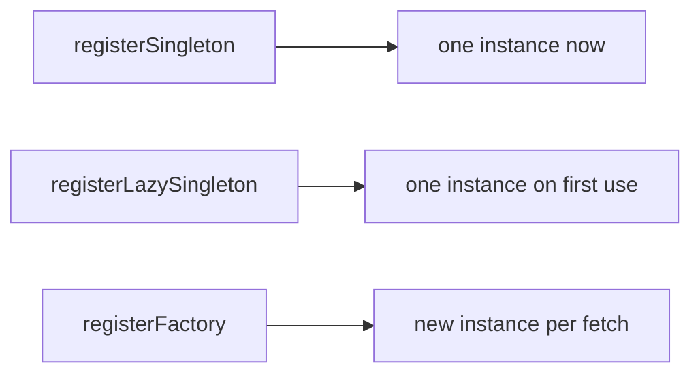

# `get_it` & `injectable`

> `get_it` is a lightweight **service locator** — register implementations against abstractions once, then fetch them anywhere with `getIt<T>()`; `injectable` adds annotation-based **codegen** so registrations are generated from your classes instead of hand-written.

## Introduction

`get_it` (package: `get_it`) is the most popular Flutter service locator. You register dependencies (singleton/lazy/factory) in a composition root and retrieve them without `BuildContext`. `injectable` (package: `injectable` + codegen) auto-generates the registration boilerplate from annotations. This file covers both.

## Why this concept exists

Passing dependencies through many constructors/widgets is tedious; `get_it` provides a central, context-free registry to fetch services from anywhere (great for repositories/services/blocs). `injectable` removes the manual registration boilerplate as the graph grows.

## Real-world analogy

`get_it` is a **tool crib** at a worksite: tools (services) are checked in once; any worker fetches what they need by name (`getIt<Drill>()`) without carrying everything. `injectable` is an **automated inventory system** that stocks the crib from labels on the tools, so you don't hand-list every item.

## Problem Statement

An app has an `HttpClient`, an `AuthRepository`, and an `AnalyticsService` used across many screens/blocs. You want to register them once and fetch anywhere, then automate registration as they multiply. You'll use `get_it`, then `injectable`.

## Internal Working

```mermaid
flowchart TD
    Root[configureDependencies() at startup] --> Reg[getIt.register... : Singleton/LazySingleton/Factory]
    Reg --> Locator[(get_it registry)]
    Anywhere["getIt<AuthRepository>()"] --> Locator
    Injectable[@injectable/@LazySingleton annotations] -->|codegen| Reg
```

- **Register** (composition root):
  - `getIt.registerSingleton<T>(instance)` — one eager instance.
  - `getIt.registerLazySingleton<T>(() => impl)` — created on first `getIt<T>()`, then cached.
  - `getIt.registerFactory<T>(() => impl)` — new instance every fetch.
  - `getIt.registerFactoryParam` — factory with runtime params.
- **Resolve**: `getIt<T>()` (or `getIt.get<T>()`) anywhere — no `BuildContext` needed.
- **Register against the abstraction** (`registerLazySingleton<AuthRepository>(() => HttpAuthRepository(getIt()))`) so consumers depend on the interface (DIP).
- **`injectable`**: annotate classes (`@injectable`, `@LazySingleton(as: AuthRepository)`, `@singleton`, `@module` for third-party); run `build_runner` to generate `configureDependencies()` (the wiring) — no manual `register` calls.
- **Scopes/reset**: `getIt.pushNewScope()`/`popScope()` for scoped deps; `getIt.reset()` in tests.

## Memory Representation

Singletons/lazy-singletons persist for the app (or scope) lifetime; factories are transient. Registered disposables should be disposed on scope pop/reset (`dispose` param) ([08 · dispose_and_leaks](../08%20Widget%20Lifecycle/dispose_and_leaks.md)).

## Compiler Behavior

`getIt<T>()` for an unregistered type throws at **runtime** (not compile-time) — a service-locator tradeoff. `injectable` codegen surfaces some wiring issues at build time.

## Runtime Behavior

Lazy singletons construct on first access; factories construct each call. Fetching missing/unregistered types throws; ordering matters (register dependencies before dependents, or use lazy).

## Flutter Engine Behavior / Dart VM Behavior

Not applicable.

## Examples

```yaml
# pubspec.yaml
dependencies:
  get_it: ^7.6.0
  injectable: ^2.4.0
dev_dependencies:
  injectable_generator: ^2.6.0
  build_runner: ^2.4.0
```

```dart
import 'package:get_it/get_it.dart';

final getIt = GetIt.instance;

abstract interface class HttpClient { Future<String> get(String url); }
abstract interface class AuthRepository { Future<bool> login(String u, String p); }

class RealHttpClient implements HttpClient {
  @override
  Future<String> get(String url) async => 'ok';
}
class HttpAuthRepository implements AuthRepository {
  final HttpClient client;
  HttpAuthRepository(this.client);
  @override
  Future<bool> login(String u, String p) async => (await client.get('/login')) == 'ok';
}

// Manual registration (composition root):
void configureDependencies() {
  getIt.registerLazySingleton<HttpClient>(() => RealHttpClient());
  getIt.registerLazySingleton<AuthRepository>(
      () => HttpAuthRepository(getIt<HttpClient>())); // resolve dependency
  // getIt.registerFactory<LoginViewModel>(() => LoginViewModel(getIt()));
}

Future<void> main() async {
  configureDependencies();          // wire once at startup
  final repo = getIt<AuthRepository>(); // fetch anywhere, no context
  await repo.login('a', 'b');
}
```

```dart
// With injectable (codegen) — annotate, then `dart run build_runner build`:
// @LazySingleton(as: AuthRepository)
// class HttpAuthRepository implements AuthRepository { HttpAuthRepository(this.client); ... }
//
// @InjectableInit()
// void configureDependencies() => getIt.init(); // generated wiring
```

## Diagrams



## Common Mistakes

| Mistake | Why | Fix |
|---------|-----|-----|
| Registering against concretes | Recoupling | Register `<Abstraction>(() => Impl(...))` |
| `getIt<T>()` unregistered | Runtime crash | Register in the composition root; check ordering |
| Locator calls sprinkled deep in widgets | Hidden deps, hard tests | Fetch at edges; inject into constructors |
| Not disposing scoped/disposable singletons | Leaks | Provide `dispose`, pop scopes, `reset()` in tests |
| Forgetting `build_runner` (injectable) | Stale generated wiring | Run/watch codegen |

## Best Practices

- Register against **abstractions**; wire in one `configureDependencies()` composition root.
- Prefer **lazy singletons** for services (created on demand, cached); **factories** for per-use objects (e.g., a fresh bloc).
- Fetch from `get_it` at **composition edges** (e.g., provide a bloc), then use **constructor injection** downstream so the graph stays explicit/testable.
- Use **`injectable`** codegen once the graph is non-trivial; use `@module` for third-party types.
- Manage lifetimes/disposal (scopes, `dispose`, `reset()` in tests).

## Performance

Lazy singletons defer creation; factories allocate per call. Registry lookups are O(1)-ish. No notable runtime cost ([scopes_and_lifetimes.md](scopes_and_lifetimes.md)).

## Advantages / Disadvantages

- **+** Simple, context-free, popular, flexible lifetimes, `injectable` removes boilerplate, great for services/blocs.
- **−** Service-locator: hidden dependencies, runtime (not compile-time) errors, global-state risk if overused; codegen setup for `injectable`.

## Interview Questions

1. **🟢 What is `get_it`?** — A service locator: a global registry where you register implementations (against abstractions) and fetch them via `getIt<T>()` without `BuildContext`.
2. **🟢 Singleton vs lazySingleton vs factory?** — Eager single instance; single instance created on first access; a new instance per fetch.
3. **🟡 Why register against an abstraction?** — So consumers depend on the interface (DIP) and you can swap implementations (incl. fakes in tests).
4. **🟡 What does `injectable` add?** — Annotation-based codegen that generates the `get_it` registrations, removing manual boilerplate.
5. **🟡 What's the main downside of a service locator?** — Hidden dependencies (not visible in signatures) and runtime errors for unregistered types.
6. **🔴 How do you keep `get_it` from becoming global-state sprawl?** — Fetch at composition edges and use constructor injection downstream; register abstractions; scope where possible.
7. **🔴 How do you handle disposal/scoping?** — Use `pushNewScope`/`popScope` and register `dispose` callbacks; `reset()` between tests.

## Senior Engineer Tips

- Treat `get_it` as your composition-root wiring, not an excuse to call `getIt<T>()` everywhere — fetch at the edge, inject downstream.
- Use lazy singletons by default for services; factories for stateful per-screen objects (blocs/view models).
- Adopt `injectable` when hand-registration becomes tedious; keep `@module` for third-party (Dio, SharedPreferences).

## Architect Perspective

`get_it`/`injectable` provide a pragmatic, context-free DI container that pairs well with Clean Architecture: register repositories/data sources/services at startup, inject into use cases/view models. The service-locator tradeoffs (hidden deps, runtime errors) are mitigated by edge-only lookups + constructor injection — a common, scalable enterprise setup ([Module 40](../40%20Clean%20Architecture/README.md)).

## Summary

- `get_it` = service locator: register (singleton/lazy/factory) against abstractions in a composition root, fetch via `getIt<T>()`.
- `injectable` generates registrations from annotations.
- Fetch at edges + inject downstream; manage lifetimes/disposal; runtime (not compile-time) errors.

## Revision Notes

- `getIt.registerSingleton/LazySingleton/Factory<Abstraction>(() => Impl(getIt()))`; fetch `getIt<T>()`.
- `injectable`: `@injectable`/`@LazySingleton(as:)`/`@module` + `build_runner` → generated `configureDependencies`.
- Fetch at edges, inject downstream; abstractions; lifetimes/disposal via scopes/`reset()`.
- Runtime errors for unregistered types (service-locator tradeoff).

## Practice Questions

1. When use lazySingleton vs factory?
2. Why register against an abstraction, not the concrete?
3. What problem does `injectable` solve?

## Coding Questions

1. Register `HttpClient`+`AuthRepository` in `get_it` and resolve the repo.
2. Convert manual registrations to `injectable` annotations + codegen.
3. Register a factory bloc and fetch a fresh instance per screen.

## Mini Project

**Service registry (Flutter):** Set up `get_it` with lazy-singleton `HttpClient`/`AuthRepository`/`AnalyticsService` (registered against abstractions) in one `configureDependencies()`, plus a factory view model; fetch at a screen edge and inject downstream. Add an `injectable` variant. Acceptance: abstractions registered; edge-only lookups; lifetimes correct; analyzer clean.
