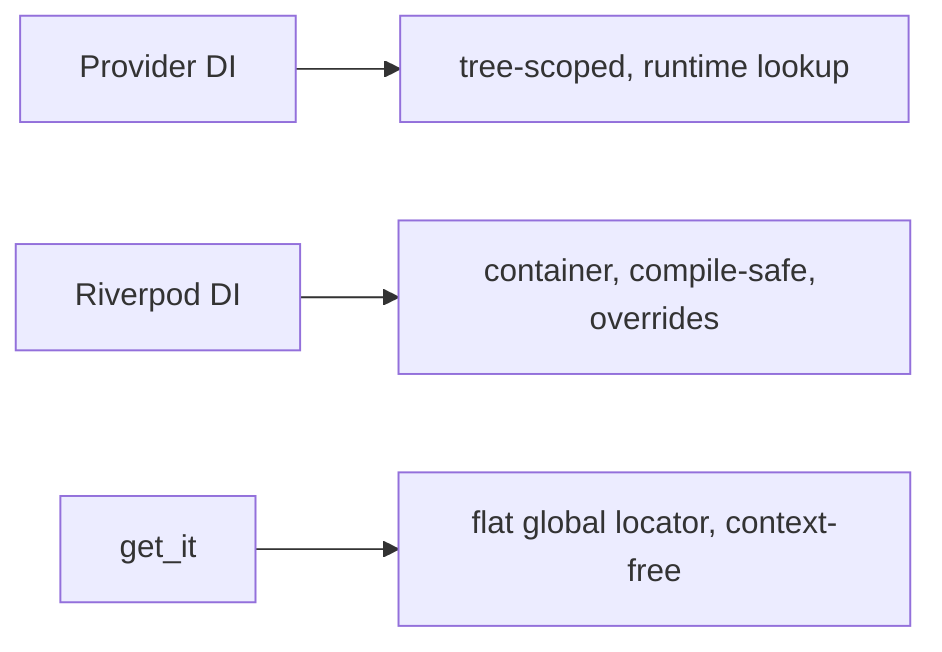

# Provider & Riverpod as DI

> Provider and Riverpod aren't just state solutions — they're **DI containers**: Provider injects objects down the widget tree (via `InheritedWidget`), and Riverpod exposes them as compile-safe, overridable, testable top-level providers accessed by `ref`.

## Introduction

You already met these as state solutions ([Module 11](../11%20State%20Management/README.md)); here we use them purely as **dependency injection**. Provider provides services scoped to the tree; Riverpod provides them via a container with compile-time safety and easy test overrides. Both can replace or complement `get_it`.

## Why this concept exists

Widget-tree-scoped and reactive dependencies are natural in Flutter. Provider/Riverpod inject services where they're needed (often scoped to a subtree/feature) and, crucially, make **test overrides** trivial — a big advantage over a global locator. Riverpod adds compile-time safety.

## Real-world analogy

Provider is **piping utilities to specific floors** of a building (tree-scoped delivery); Riverpod is a **service registry with a staging environment** — you declare services centrally and can spin up a test building with mocked services (overrides) effortlessly.

## Problem Statement

Inject an `AuthRepository` and `AnalyticsService` so screens/view models use them, scoped appropriately, and swap them for fakes in tests. You'll do it with Provider and with Riverpod, contrasting with `get_it`.

## Internal Working

```mermaid
flowchart TD
    subgraph Provider (tree DI)
      P[Provider/MultiProvider above scope] --> D1[context.read<AuthRepository>()]
    end
    subgraph Riverpod (container DI)
      R[authRepositoryProvider] --> D2[ref.read(authRepositoryProvider)]
      Override[ProviderScope overrides] --> R
    end
```

- **Provider as DI**:
  - `Provider<AuthRepository>(create: (_) => HttpAuthRepository(...))` (plain service, not a `ChangeNotifier`).
  - `MultiProvider` to compose several.
  - Access via `context.read<AuthRepository>()` (in callbacks/wiring) — subscribe only if reactive.
  - **Scope**: place providers above the subtree that needs them (app-wide above `MaterialApp`, or feature-scoped).
  - Auto-disposes `ChangeNotifierProvider`/`Provider` with `dispose`.
- **Riverpod as DI**:
  - `final authRepositoryProvider = Provider<AuthRepository>((ref) => HttpAuthRepository(ref.read(httpClientProvider)));`
  - Access via `ref.read(authRepositoryProvider)` (or `watch` if reactive).
  - **Compile-safe** (typed top-level symbols); **overridable** in `ProviderScope(overrides: [...])` for tests/flavors; `ref.watch` composes providers.
- **vs `get_it`**: Provider/Riverpod are tree/container-scoped and (Riverpod) compile-safe + override-friendly; `get_it` is a flat global locator (context-free). Choose per app conventions.

## Memory Representation

Provider objects live in the tree (scope-bound); Riverpod state lives in the `ProviderContainer` (with `autoDispose` for cleanup) ([11 · riverpod](../11%20State%20Management/riverpod.md), [08 · dispose_and_leaks](../08%20Widget%20Lifecycle/dispose_and_leaks.md)).

## Compiler Behavior

Riverpod: referencing a provider is compile-checked. Provider: `read<T>()` for an unprovided type throws at runtime (`ProviderNotFoundException`).

## Runtime Behavior

Provider resolves up the tree from `context`; Riverpod resolves from the container via `ref`. Overrides (Riverpod) or a different provider subtree (Provider) inject alternate implementations.

## Flutter Engine Behavior / Dart VM Behavior

Not applicable.

## Examples

```dart
// ---- Provider as DI ----
import 'package:flutter/material.dart';
import 'package:provider/provider.dart';

abstract interface class AuthRepository { Future<bool> login(); }
class HttpAuthRepository implements AuthRepository {
  @override
  Future<bool> login() async => true;
}

void mainProvider() {
  runApp(
    MultiProvider(
      providers: [
        Provider<AuthRepository>(create: (_) => HttpAuthRepository()), // DI, plain service
      ],
      child: const MyApp(),
    ),
  );
}
class MyApp extends StatelessWidget {
  const MyApp({super.key});
  @override
  Widget build(BuildContext context) => MaterialApp(
        home: Builder(builder: (context) {
          final repo = context.read<AuthRepository>(); // resolve dependency
          return Scaffold(body: Center(child: Text('repo: ${repo.runtimeType}')));
        }),
      );
}
```

```dart
// ---- Riverpod as DI ----
import 'package:flutter_riverpod/flutter_riverpod.dart';

final httpClientProvider = Provider<HttpAuthRepository>((ref) => HttpAuthRepository());
final authRepositoryProvider = Provider<AuthRepository>(
  (ref) => ref.read(httpClientProvider), // compose providers
);

// Test/flavor override (no widget tree needed):
// final container = ProviderContainer(overrides: [
//   authRepositoryProvider.overrideWithValue(FakeAuthRepo()),
// ]);
// container.read(authRepositoryProvider); // -> FakeAuthRepo
```

## Diagrams



## Common Mistakes

| Mistake | Why | Fix |
|---------|-----|-----|
| Using `ChangeNotifierProvider` for a plain service | Unneeded reactivity | Use `Provider<T>` for services |
| Providing too low in the tree | Consumers can't see it | Provide above the needed subtree |
| `watch` for a non-reactive dependency | Extra rebuilds | Use `read` for pure DI access |
| Riverpod without `ProviderScope` | No container | Wrap app in `ProviderScope` |
| Mixing locator + tree DI inconsistently | Confusion | Standardize an approach |

## Best Practices

- Use `Provider<T>`/Riverpod `Provider` for **plain service DI** (not `ChangeNotifierProvider`, which is for reactive state).
- **Scope** providers to where they're needed (app-wide vs feature); Riverpod providers are global-but-scoped via overrides.
- Prefer **Riverpod** when you want **compile-time safety + trivial test overrides + composition**; Provider when you're already using it and want simplicity.
- Access with `read` for DI (no subscription); `watch` only for reactive needs.
- Standardize one DI approach across the codebase.

## Performance

DI access is cheap; Riverpod `autoDispose` bounds lifetime. No notable cost vs `get_it` ([11 · riverpod](../11%20State%20Management/riverpod.md)).

## Advantages / Disadvantages

- **+ Provider:** simple, tree-scoped, familiar. **+ Riverpod:** compile-safe, context-independent, override-based testing, composition, autoDispose.
- **− Provider:** runtime lookup, context-bound. **− Riverpod:** more concepts/setup. Both: another dependency vs plain `get_it`.

## Interview Questions

1. **🟢 How is Provider a DI mechanism?** — It provides objects to descendants via `InheritedWidget`; consumers resolve them with `context.read<T>()`.
2. **🟢 How does Riverpod do DI?** — Services are top-level providers accessed via `ref.read/watch`, resolved from a `ProviderContainer` — compile-safe and overridable.
3. **🟡 Provider vs `get_it` for DI?** — Provider is tree-scoped and context-bound (runtime lookup); `get_it` is a flat global, context-free locator. Choose by scoping needs/conventions.
4. **🟡 How do you inject fakes in tests with Riverpod?** — `ProviderScope(overrides: [provider.overrideWithValue(fake)])` (or `ProviderContainer(overrides:)`) — no widget tree needed.
5. **🟡 `read` vs `watch` for DI?** — `read` for one-off dependency access (no subscription); `watch` only when you need to rebuild on change.
6. **🔴 Why is Riverpod's compile-safety a DI advantage?** — Missing/mistyped providers are compile errors, not runtime `ProviderNotFoundException`s — safer at scale.
7. **🔴 When would you still use `get_it` alongside Riverpod/Provider?** — For context-free access (e.g., in pure-Dart services/blocs not tied to the tree) or existing conventions.

## Senior Engineer Tips

- For DI-heavy, testable apps, Riverpod's **overrides** are the cleanest way to swap dependencies per test/flavor.
- Use `Provider<T>` (not `ChangeNotifierProvider`) for stateless services; reserve reactive providers for state.
- Don't run two DI systems ad hoc; pick one primary (Riverpod *or* Provider *or* get_it) and be consistent.

## Architect Perspective

Provider/Riverpod fold DI and state into one tree/container model — reducing moving parts. Riverpod's compile-safe, override-driven DI is especially strong for Clean Architecture: inject repositories/data sources/use cases with easy mocking and flavor overrides ([Module 40](../40%20Clean%20Architecture/README.md)). The choice among these and `get_it` is a team/consistency decision more than a capability one.

## Summary

- Provider (tree, runtime) and Riverpod (container, compile-safe, overridable) are full DI mechanisms, not just state tools.
- Use `Provider<T>`/Riverpod `Provider` for services; scope appropriately; `read` for DI access.
- Riverpod's overrides make test/flavor injection trivial; standardize one approach (or combine with `get_it` deliberately).

## Revision Notes

- Provider DI: `Provider<T>(create:)` + `context.read<T>()` (tree-scoped, runtime lookup).
- Riverpod DI: top-level `Provider` + `ref.read/watch`; compile-safe; `ProviderScope(overrides:)` for tests/flavors; `autoDispose`.
- `read` for DI, `watch` for reactive; `Provider<T>` (not ChangeNotifierProvider) for services.
- Choose one primary DI (Riverpod/Provider/get_it); combine deliberately.

## Practice Questions

1. Why use `Provider<T>` not `ChangeNotifierProvider` for a service?
2. How do Riverpod overrides help testing?
3. Provider vs `get_it` scoping differences?

## Coding Questions

1. Inject an `AuthRepository` via `Provider` and resolve it in a screen.
2. Inject the same via Riverpod and override it with a fake in a container test.
3. Compose two Riverpod providers (client → repository).

## Mini Project

**DI two ways (Flutter):** Inject `AuthRepository` (+ `AnalyticsService`) using (a) Provider/`MultiProvider` and (b) Riverpod providers; in each, write a test that swaps a fake (Provider: different provider subtree; Riverpod: override). Acceptance: services injected (not `new`ed) in consumers; fakes swapped in tests; consistent per-approach; app/tests run.
