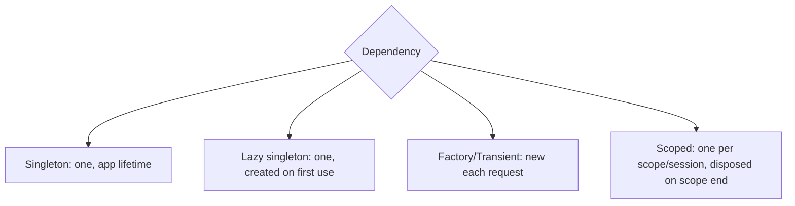
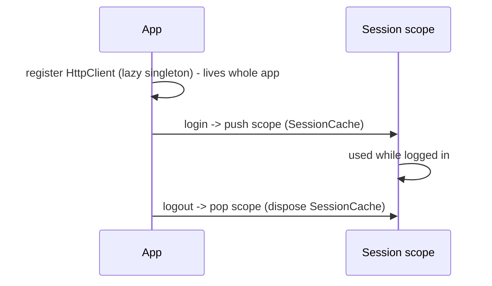

# Scopes & Lifetimes (Singleton / Factory / Lazy / Scoped) + Disposal

> Every injected dependency has a **lifetime** — app-wide singleton, per-request factory, lazily-created, or scoped to a feature/session — and choosing it correctly (plus disposing when it ends) prevents both stale-state bugs and memory leaks.

## Introduction

DI isn't just *what* to inject but *how long it lives*. This file classifies lifetimes (singleton, lazy singleton, factory/transient, scoped), maps them across `get_it`/Riverpod/Provider, and covers **disposal** so scoped/disposable dependencies are released.

## Why this concept exists

An `HttpClient` should usually be one shared instance (singleton); a per-screen bloc should be fresh (factory) and disposed on exit; a session-scoped cache should live only while logged in (scoped). Wrong lifetimes cause leaks (never-disposed) or bugs (unexpected sharing/re-creation).

## Real-world analogy

Lifetimes are **rental terms**: buy-once shared equipment (singleton), single-use rentals returned after each job (factory), equipment leased for a project then returned (scoped). Forgetting to return leased gear = leak; sharing single-use gear = contamination.

## Problem Statement

Your app needs: one `HttpClient` (app-wide), a fresh `EditBloc` per edit screen (disposed on close), and a `SessionCache` that exists only while logged in (cleared on logout). You'll assign correct lifetimes and disposal.

## Internal Working



| Lifetime | Meaning | Use for | `get_it` | Riverpod | Provider |
|----------|---------|---------|----------|----------|----------|
| **Singleton** | One instance, app lifetime | Stateless shared services | `registerSingleton` | keep-alive `Provider` | app-level `Provider` |
| **Lazy singleton** | One, created on first use | Expensive shared services | `registerLazySingleton` | `Provider` (lazy by default) | `Provider(create:)` (lazy) |
| **Factory / transient** | New each fetch | Per-screen blocs/view models | `registerFactory` | `.autoDispose` + `.family` | `ChangeNotifierProvider` per route |
| **Scoped** | One per scope/session | Session/feature state | `pushNewScope`/`popScope` | scoped `ProviderScope`/`autoDispose` | subtree provider |

- **Disposal**: singletons live until app end (rarely disposed); factories/scoped **must** be disposed when their owner/scope ends. `get_it` register `dispose:` + `popScope`; Riverpod `autoDispose` (and `ref.onDispose`); Provider auto-disposes `ChangeNotifierProvider` on removal ([08 · dispose_and_leaks](../08%20Widget%20Lifecycle/dispose_and_leaks.md)).
- **Scoped DI**: tie a dependency's life to a session/feature (e.g., a scope pushed at login, popped at logout) so it's created and torn down with that context.

## Memory Representation

Singletons are effectively GC roots for their lifetime (never collected while registered — watch what they retain). Factory instances are collected once unreferenced; scoped instances are disposed on scope end ([05 · singleton](../05%20Design%20Patterns/singleton.md), [02 · memory_and_gc](../02%20Advanced%20Dart/memory_and_gc.md)).

## Compiler Behavior

Not applicable.

## Runtime Behavior

Lazy singletons construct on first resolve; factories construct per resolve; scoped instances construct on scope entry and dispose on exit. Missing disposal → leaks; over-eager singletons → wasted startup/memory.

## Flutter Engine Behavior / Dart VM Behavior

Not applicable.

## Examples

```dart
import 'package:get_it/get_it.dart';

final getIt = GetIt.instance;

abstract interface class HttpClient {}
class RealHttpClient implements HttpClient {}
class SessionCache { void clear() {} }
class EditBloc { void dispose() {} }

void configure() {
  // App-wide singleton (lazy): created on first use, lives forever
  getIt.registerLazySingleton<HttpClient>(() => RealHttpClient());

  // Factory: NEW EditBloc each time (per screen); dispose it when the screen closes
  getIt.registerFactory<EditBloc>(() => EditBloc());
}

// Session scope: create at login, dispose at logout
void onLogin() {
  getIt.pushNewScope(
    scopeName: 'session',
    init: (getIt) {
      getIt.registerSingleton<SessionCache>(SessionCache());
    },
    dispose: () {
      // called on popScope: release session-scoped deps
    },
  );
}
Future<void> onLogout() async {
  await getIt.popScope(); // disposes session scope (SessionCache) 
}
```

```dart
// Riverpod lifetimes:
// final httpClientProvider = Provider<HttpClient>((ref) => RealHttpClient()); // kept alive
// final editBlocProvider = Provider.autoDispose<EditBloc>((ref) {
//   final bloc = EditBloc();
//   ref.onDispose(bloc.dispose); // disposed when no longer watched
//   return bloc;
// });
```

## Diagrams



## Common Mistakes

| Mistake | Why | Fix |
|---------|-----|-----|
| Singleton for per-screen state | Shared/stale across screens | Use factory/`autoDispose` |
| Factory for a shared service | Wasteful re-creation/inconsistency | Use (lazy) singleton |
| Never disposing scoped/factory deps | Leaks | `popScope`/`autoDispose`/`ref.onDispose`/dispose |
| Eager singletons for rarely-used deps | Slower startup/memory | Lazy singleton |
| Session data as app singleton | Leaks across logout | Scope to session; clear on logout |

## Best Practices

- Default services to **lazy singletons**; per-screen state to **factory/`autoDispose`**; session/feature state to **scoped**.
- **Always dispose** factory/scoped disposables (streams, blocs, controllers) at end-of-life ([08 · dispose_and_leaks](../08%20Widget%20Lifecycle/dispose_and_leaks.md)).
- Tie **session-scoped** deps to auth (push scope on login, pop on logout) so they clear correctly.
- Audit what **singletons retain** (they never get collected) — avoid holding large/transient data.
- Prefer Riverpod `autoDispose` for automatic lifetime management where suitable.

## Performance

Lazy creation avoids startup cost; correct disposal keeps memory flat. Wrong lifetimes cause leaks (growing memory) or churn (excess re-creation) ([Module 21](../21%20Performance/README.md)).

## Advantages / Disadvantages

- **+** Right lifetimes prevent leaks/stale-state, bound memory, and match real ownership (session/feature).
- **−** Requires deliberate choice + disposal discipline; scoped DI adds complexity.

## Interview Questions

1. **🟢 Name the common DI lifetimes.** — Singleton, lazy singleton, factory/transient, and scoped.
2. **🟢 When use a factory vs a singleton?** — Factory for per-use/per-screen instances (fresh, disposed); singleton for shared stateless services.
3. **🟡 What is a lazy singleton and why prefer it?** — One instance created on first use (then cached); avoids paying creation cost until needed.
4. **🟡 What is scoped DI, with an example?** — A dependency living for a scope's duration (e.g., a `SessionCache` created at login, disposed at logout via `pushNewScope`/`popScope`).
5. **🟡 Why must factory/scoped deps be disposed?** — They own resources (streams/blocs/controllers); not disposing leaks them (singletons live for the app, so rarely disposed).
6. **🔴 What's the risk of storing session data in an app singleton?** — It persists across logout (stale/leaked user data); scope it to the session instead.
7. **🔴 How does Riverpod manage lifetimes?** — Providers are kept-alive by default; `.autoDispose` disposes when unwatched; `ref.onDispose` runs cleanup; `.family` parameterizes instances.

## Senior Engineer Tips

- Map each dependency to an **ownership/lifetime** explicitly; most leaks and stale-state bugs are lifetime mistakes.
- Use **session scopes** for anything tied to auth; pop on logout to guarantee cleanup.
- Prefer `autoDispose`/factory + dispose for anything holding resources; reserve singletons for truly shared, stateless services.

## Architect Perspective

Lifetime/scope design is a cross-cutting reliability and correctness concern: it governs memory, data freshness (session isolation), and resource cleanup across the app. Establishing conventions (services=lazy singleton, screen state=factory/autoDispose, session=scoped) and enforcing disposal is essential for leak-free, correct apps at scale ([Modules 21, 40](../21%20Performance/README.md)).

## Summary

- Lifetimes: singleton, lazy singleton, factory/transient, scoped — pick by ownership.
- Services → lazy singleton; per-screen → factory/`autoDispose`; session/feature → scoped.
- Always dispose factory/scoped disposables; scope session data to auth; audit singleton retention.

## Revision Notes

- Singleton (app), lazy singleton (first use), factory (per fetch), scoped (per session/feature).
- get_it: `registerSingleton/LazySingleton/Factory` + `pushNewScope/popScope(dispose:)`.
- Riverpod: kept-alive vs `.autoDispose` + `ref.onDispose`; Provider auto-disposes on removal.
- Dispose factory/scoped; scope session data; don't leak via singletons.

## Practice Questions

1. Which lifetime for an `HttpClient` vs a per-screen bloc vs a session cache?
2. Why lazy over eager singletons?
3. How do you guarantee session data clears on logout?

## Coding Questions

1. Register a lazy-singleton client + factory bloc in `get_it`; dispose the bloc on screen close.
2. Implement a session scope (push on login, pop on logout) with a `SessionCache`.
3. Use Riverpod `autoDispose` + `ref.onDispose` for a screen-scoped resource.

## Mini Project

**Lifetime-correct wiring (Flutter):** Wire a lazy-singleton `HttpClient`, a factory `EditBloc` (disposed on screen close), and a session-scoped `SessionCache` (cleared on logout), using `get_it` scopes (or Riverpod `autoDispose`). Prove (notes/tests) session data clears on logout and no factory leaks. Acceptance: correct lifetimes; disposal verified; session isolation; app runs.
