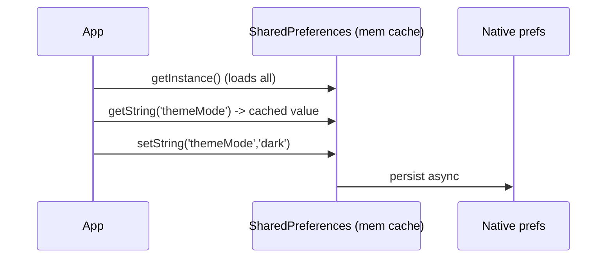

# `SharedPreferences`

> `SharedPreferences` is a simple async key-value store for **small, non-sensitive settings** (theme, onboarding-seen, last tab) — backed by the platform's native prefs; never use it for secrets or large/structured data.

## Introduction

`SharedPreferences` (package: `shared_preferences`) persists primitive key-value pairs (`bool`, `int`, `double`, `String`, `List<String>`) across app launches, wrapping platform storage (Android SharedPreferences, iOS UserDefaults). This file covers its API, correct use, and its (important) limits.

## Why this concept exists

Apps need to remember tiny bits of state — the chosen theme, whether onboarding was seen, a feature flag. A full database is overkill; prefs give a trivial, cross-platform key-value API for exactly this.

## Real-world analogy

A **whiteboard by the door** where you jot quick reminders ("lights off," "buy milk"). Perfect for small notes you check on the way in; you wouldn't store your passport (secret) or filing cabinet (records) there.

## Problem Statement

Persist the user's `themeMode` and an `onboardingSeen` flag across launches, read them at startup, and expose them behind a repository. You'll use `SharedPreferences` correctly and see why tokens/large data don't belong here.

## Internal Working

```mermaid
flowchart TD
    App -->|getInstance()| SP[SharedPreferences]
    SP -->|get/set primitives| Native[(platform prefs: UserDefaults / SharedPreferences.xml)]
    Note["values cached in memory after load; writes persisted async"]
```

- **Get instance**: `final prefs = await SharedPreferences.getInstance();` (async; often initialized once at startup).
- **Read/write**: `prefs.getString('key')` / `await prefs.setString('key', v)`; supported types: `bool`/`int`/`double`/`String`/`List<String>`.
- **Absent keys** return `null` (typed getters return `null` if unset) — provide defaults.
- **Remove/clear**: `prefs.remove('key')`, `prefs.clear()`.
- **Not for**: secrets (plain text — use secure storage), large/complex data (use files/db), or anything needing queries.
- Values are **cached in memory** after first load; writes are persisted asynchronously to native storage.

## Memory Representation

All prefs are loaded into an in-memory map on first access; keep the dataset **small**. Native backing is a plist/XML file (readable on a rooted/jailbroken device) — hence no secrets ([03_secure_storage.md](03_secure_storage.md)).

## Compiler Behavior

Not applicable. Typed getters return nullable values.

## Runtime Behavior

`getInstance()` loads the store; getters read the in-memory cache (sync after load); setters update cache + persist async. Needs `WidgetsFlutterBinding.ensureInitialized()` if used before `runApp`.

## Flutter Engine Behavior

Crosses the embedder to native prefs storage ([10 · embedder_and_startup](../10%20Flutter%20Architecture/05_embedder_and_startup.md)).

## Dart VM Behavior

Not applicable.

## Examples

```yaml
# pubspec.yaml
dependencies:
  shared_preferences: ^2.2.0
```

```dart
import 'package:shared_preferences/shared_preferences.dart';

// Wrap prefs behind a repository (storage-agnostic app, testable)
class SettingsRepository {
  final SharedPreferences _prefs;
  SettingsRepository(this._prefs);

  static const _kTheme = 'themeMode';
  static const _kOnboarded = 'onboardingSeen';

  String get themeMode => _prefs.getString(_kTheme) ?? 'system'; // default!
  Future<void> setThemeMode(String v) => _prefs.setString(_kTheme, v);

  bool get onboardingSeen => _prefs.getBool(_kOnboarded) ?? false;
  Future<void> setOnboardingSeen(bool v) => _prefs.setBool(_kOnboarded, v);
}

Future<void> main() async {
  WidgetsFlutterBinding.ensureInitialized();          // needed before async in main
  final prefs = await SharedPreferences.getInstance(); // load once at startup
  final settings = SettingsRepository(prefs);

  print(settings.themeMode);        // 'system' first run
  await settings.setThemeMode('dark');
  await settings.setOnboardingSeen(true);
  print(settings.themeMode);        // 'dark' (persists next launch)
}

// (main uses ensureInitialized; import flutter/widgets in a real app)
```

## Diagrams



## Common Mistakes

| Mistake | Why | Fix |
|---------|-----|-----|
| Storing tokens/secrets | Plain text, readable | Secure storage ([03_secure_storage.md](03_secure_storage.md)) |
| Storing large JSON/blobs | Loaded into memory, size limits | Files/database |
| No default for absent keys | `null` surprises | `?? default` |
| Assuming instant persistence | Writes are async | `await` sets when ordering matters |
| Prefs calls scattered in UI | Coupling/untestable | Wrap in a repository |
| Manual JSON in a single pref key | Unqueryable, error-prone | Use a database for structured data |

## Best Practices

- Use only for **small, non-sensitive** settings/flags.
- Provide **defaults** for absent keys; centralize **key constants**.
- Wrap behind a **repository** (inject `SharedPreferences`) for testability/swap-ability ([14 DI](../14%20Dependency%20Injection/README.md)).
- Initialize once at startup (`getInstance()`); `ensureInitialized()` before `runApp` if needed.
- Escalate to **secure storage** (secrets), **files** (blobs), or a **database** (structured) when outgrown.

## Performance

Fast (in-memory after load); keep the store small since everything loads at once. Writes persist async — negligible cost for small values ([Module 21](../21%20Performance/README.md)).

## Advantages / Disadvantages

- **+** Trivial cross-platform key-value API, fast reads (cached), perfect for small settings.
- **−** Plain text (no secrets), primitives only, no queries, loads everything into memory (not for large/structured data).

## Interview Questions

1. **🟢 What is `SharedPreferences` for?** — Persisting small key-value settings/flags (primitives) across launches.
2. **🟢 What types can it store?** — `bool`, `int`, `double`, `String`, `List<String>`.
3. **🟡 Why not store tokens in it?** — It's plain text (readable on a compromised device); use OS secure storage instead.
4. **🟡 What happens for an absent key?** — Typed getters return `null`; always provide a default (`?? x`).
5. **🟡 Is it synchronous?** — `getInstance()` is async (loads the store); after that, getters read an in-memory cache (effectively sync), writes persist async.
6. **🔴 Why keep the prefs dataset small?** — All entries load into memory on first access; large/complex data bloats memory and hits size limits — use files/db.
7. **🔴 How do you make prefs testable?** — Wrap behind a repository and inject `SharedPreferences` (use `setMockInitialValues` or a fake in tests).

## Senior Engineer Tips

- Centralize keys as constants and expose a typed `SettingsRepository`; avoid raw `prefs.getX('literal')` across the app.
- In tests, `SharedPreferences.setMockInitialValues({})` gives a fake store — no platform needed.
- The moment you're serializing complex/growing JSON into a pref, switch to a database ([Module 20](../20%20Database/README.md)).

## Architect Perspective

`SharedPreferences` is the right tool for a narrow job: small, non-sensitive app settings. Fronting it with a repository keeps the app storage-agnostic (easy to migrate to a DB or add encryption) and testable — consistent with the storage-abstraction strategy ([01_storage_options_overview.md](01_storage_options_overview.md), [05 · repository](../05%20Design%20Patterns/20_repository.md)).

## Summary

- `SharedPreferences`: small key-value primitives for non-sensitive settings, cached in memory, persisted async.
- Not for secrets (secure storage), large blobs (files), or structured data (database).
- Provide defaults, centralize keys, wrap in a repository, initialize at startup.

## Revision Notes

- Small non-sensitive settings; types: bool/int/double/String/List<String>.
- `getInstance()` async (loads all → mem cache); getters sync-ish, sets async; absent key → null (default it).
- NO secrets (plain text) / large / structured data.
- Wrap in repository (inject; `setMockInitialValues` in tests); centralize keys.

## Practice Questions

1. Why provide a default for `getString`?
2. Why are tokens unsafe in prefs?
3. When do you outgrow prefs?

## Coding Questions

1. Build a `SettingsRepository` (theme + onboarding flag) over injected `SharedPreferences`.
2. Test it using `setMockInitialValues` (no platform).
3. Migrate a "big JSON in one pref key" hack to a proper store.

## Mini Project

**Settings persistence (Flutter):** Build a `SettingsRepository` (themeMode, onboardingSeen, lastTab) over `SharedPreferences`, with defaults and centralized keys, wired via DI, and a widget that reads/updates it. Add a unit test with mock initial values. Acceptance: small non-sensitive data only; defaults handled; repository-fronted; test passes; app runs.
