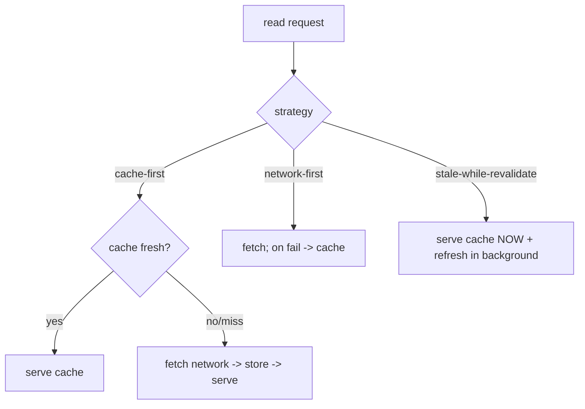
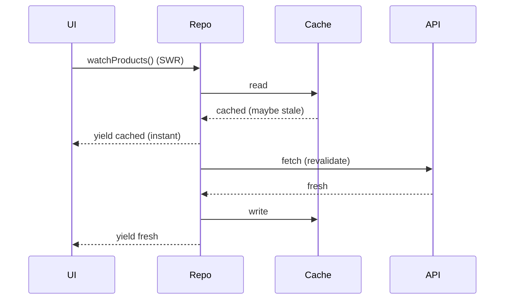

# Caching Strategies (TTL, Cache-First, Invalidation)

> A cache trades freshness for speed/offline resilience — but only if you control **staleness (TTL)**, choose a **read strategy** (cache-first vs network-first vs stale-while-revalidate), and have an **invalidation** plan; an uncontrolled cache is just a stale-data bug.

## Introduction

Caching stores fetched data locally (in file/db/memory) to serve faster and offline. This file covers the strategies (cache-first, network-first, stale-while-revalidate), **TTL** (time-to-live), and **invalidation** — the discipline that separates a useful cache from a source of stale-data bugs.

## Why this concept exists

Network is slow, costly, and sometimes unavailable. Caching improves perceived speed and enables offline reads. But cached data goes stale; without TTL and invalidation you show wrong data. Strategy makes caching correct, not just fast.

## Real-world analogy

A cache is a **fridge**: keeping food (data) handy avoids trips to the store (network). But food expires (TTL) — eat it fresh (network-first), grab whatever's there first (cache-first), or eat the leftover now while restocking (stale-while-revalidate). And you must throw out spoiled items (invalidation).

## Problem Statement

A product feed should load instantly from cache, refresh in the background, expire after an hour, and clear on logout/mutation. You'll implement cache-first + TTL + stale-while-revalidate + invalidation, behind a repository.

## Internal Working



- **Read strategies**:
  - **Cache-first**: serve cache if present/fresh, else network (fast, may be stale).
  - **Network-first**: try network, fall back to cache on failure (fresh, offline-resilient).
  - **Stale-while-revalidate (SWR)**: serve cache immediately *and* refresh in the background, updating the UI when new data arrives (best perceived UX).
- **TTL (time-to-live)**: store a timestamp with each cache entry; treat it stale after `age > ttl`. "Fresh" = within TTL.
- **Invalidation**: remove/refresh cache on events — logout, mutation (create/update/delete), version change, manual pull-to-refresh, or TTL expiry.
- **Where**: memory (fastest, volatile), file/db (persistent). Often layered (memory + disk).
- Wrap in a **repository** that hides the strategy from callers ([05 · repository](../05%20Design%20Patterns/repository.md)).

## Memory Representation

Cache entries hold data + metadata (timestamp/etag). Memory caches must be **bounded** (LRU/size cap) to avoid leaks; disk caches use the temporary dir ([file_storage.md](file_storage.md), [02 · memory_and_gc](../02%20Advanced%20Dart/memory_and_gc.md)).

## Compiler Behavior

Not applicable.

## Runtime Behavior

On read, the repository checks freshness (TTL) and applies the strategy; SWR returns cached data then emits fresh data (often via a `Stream`). Mutations/logout trigger invalidation.

## Flutter Engine Behavior / Dart VM Behavior

Not applicable.

## Examples

```dart
import 'dart:convert';

class CacheEntry<T> {
  final T data;
  final DateTime storedAt;
  CacheEntry(this.data, this.storedAt);
  bool isFresh(Duration ttl, DateTime now) => now.difference(storedAt) < ttl;
}

abstract interface class ProductApi { Future<List<String>> fetch(); }
abstract interface class CacheBox {
  String? read(String key);
  Future<void> write(String key, String value);
  Future<void> remove(String key);
}

class ProductRepository {
  final ProductApi api;
  final CacheBox cache;
  final Duration ttl;
  final DateTime Function() now; // injectable clock (testable TTL)
  ProductRepository(this.api, this.cache, {this.ttl = const Duration(hours: 1), DateTime Function()? clock})
      : now = clock ?? DateTime.now;

  static const _key = 'products';

  // Cache-first with TTL:
  Future<List<String>> getProducts({bool forceRefresh = false}) async {
    if (!forceRefresh) {
      final cached = _readCache();
      if (cached != null && cached.isFresh(ttl, now())) return cached.data; // fresh hit
    }
    final fresh = await api.fetch();       // miss/stale/forced -> network
    await _writeCache(fresh);
    return fresh;
  }

  // Stale-while-revalidate: serve cache now, refresh in background
  Stream<List<String>> watchProducts() async* {
    final cached = _readCache();
    if (cached != null) yield cached.data;     // instant (maybe stale)
    final fresh = await api.fetch();           // revalidate
    await _writeCache(fresh);
    yield fresh;                               // update UI
  }

  Future<void> invalidate() => cache.remove(_key); // on logout/mutation

  CacheEntry<List<String>>? _readCache() {
    final raw = cache.read(_key);
    if (raw == null) return null;
    final m = jsonDecode(raw) as Map<String, dynamic>;
    return CacheEntry(
      (m['data'] as List).cast<String>(),
      DateTime.parse(m['storedAt'] as String),
    );
  }
  Future<void> _writeCache(List<String> data) => cache.write(
      _key, jsonEncode({'data': data, 'storedAt': now().toIso8601String()}));
}
```

## Diagrams



## Common Mistakes

| Mistake | Why | Fix |
|---------|-----|-----|
| No TTL | Data never expires → stale | Store timestamp; treat stale after TTL |
| No invalidation on mutation/logout | Wrong/leaked data | Invalidate on write/logout/version change |
| Unbounded memory cache | Leak/OOM | LRU/size cap ([02](../02%20Advanced%20Dart/memory_and_gc.md)) |
| Cache-first for critical fresh data | Shows stale (e.g., balance) | Network-first / short TTL |
| Strategy logic in the UI | Coupling | Hide strategy in the repository |
| Ignoring `DateTime.now()` in tests | Untestable TTL | Inject a clock |

## Best Practices

- Always attach a **TTL/timestamp**; define freshness explicitly.
- Choose the strategy per data criticality: **SWR** for feeds (great UX), **network-first** for critical/fresh data (balances, prices), **cache-first** for rarely-changing data.
- **Invalidate** on mutations, logout, and version changes; support pull-to-refresh (`forceRefresh`).
- **Bound** memory caches (LRU/size); persist disk caches in the temporary dir.
- Hide all of this behind a **repository**; inject a **clock** for testable TTL.
- For full offline read/write with conflict handling, graduate to **offline-first** ([Module 19](../19%20Offline%20First/README.md)).

## Performance

Caching cuts latency and network cost and enables offline reads; SWR gives instant-then-fresh UX. Bound caches to protect memory; parse large cached payloads off-isolate ([02 · isolates](../02%20Advanced%20Dart/isolates.md), [Module 21](../21%20Performance/README.md)).

## Advantages / Disadvantages

- **+** Faster loads, less network, offline reads, better UX (SWR), lower cost.
- **−** Staleness risk, invalidation complexity, memory bounds, potential wrong-data bugs if undisciplined.

## Interview Questions

1. **🟢 What is a cache TTL?** — Time-to-live: how long a cache entry is considered fresh; after it, the entry is stale and should be refreshed.
2. **🟢 Cache-first vs network-first?** — Cache-first serves cache then network (fast, maybe stale); network-first fetches then falls back to cache (fresh, offline-resilient).
3. **🟡 What is stale-while-revalidate?** — Serve cached data immediately, refresh in the background, then update the UI with fresh data — best perceived UX.
4. **🟡 When must you invalidate a cache?** — On mutations (create/update/delete), logout, version changes, and TTL expiry; plus manual refresh.
5. **🟡 Why bound a memory cache?** — Unbounded caches leak/OOM; use LRU or a size cap.
6. **🔴 Which strategy for a bank balance vs a product feed?** — Balance: network-first / very short TTL (freshness critical); feed: SWR/cache-first (speed, tolerant of brief staleness).
7. **🔴 How do you make TTL testable?** — Inject a clock (`DateTime Function() now`) so tests can advance time deterministically.

## Senior Engineer Tips

- Decide caching per-endpoint by *how bad stale data is* — one global policy is wrong; criticality drives strategy/TTL.
- Prefer SWR for lists/feeds — users get instant content and fresh data arrives seamlessly.
- Always wire invalidation to mutations/logout; a "correct but stale" cache erodes trust fast.

## Architect Perspective

Caching strategy is a core performance/UX/offline decision, best encapsulated in the repository/data layer so the app is oblivious to it. TTL + strategy + invalidation + bounded storage compose into a reliable data layer, and scale up into full offline-first sync with conflict resolution ([Module 19](../19%20Offline%20First/README.md)) — a defining trait of resilient, fast apps.

## Summary

- Cache = speed/offline at the cost of freshness; control it with **TTL**, a **read strategy** (cache-first/network-first/SWR), and **invalidation**.
- Choose strategy by data criticality; bound memory; hide behind a repository; inject a clock for testable TTL.
- Escalate to offline-first for full offline read/write with conflict handling.

## Revision Notes

- Strategies: cache-first (fast/stale), network-first (fresh/fallback), SWR (cache now + refresh).
- TTL = freshness window (store timestamp); invalidate on mutation/logout/version/refresh.
- Bound memory caches (LRU/size); persist in temp dir; parse big payloads off-isolate.
- Repository-fronted; inject clock (testable TTL); full offline → Module 19.

## Practice Questions

1. Which strategy and TTL for a chat list vs a bank balance?
2. When must you invalidate the cache?
3. Why inject a clock into a TTL cache?

## Coding Questions

1. Implement cache-first-with-TTL in a repository over an injected cache + clock.
2. Add a stale-while-revalidate `Stream` variant.
3. Add invalidation on mutation and logout; test TTL expiry with a fake clock.

## Mini Project — Module capstone

**Cached feed data layer (Flutter):** Build a `ProductRepository` fronting an API + file/db cache with: TTL-based freshness, cache-first `getProducts` + SWR `watchProducts`, invalidation on mutation/logout, a bounded memory layer, and an injected clock. Unit-test freshness/expiry/invalidation with a fake clock. Acceptance: strategy hidden behind the repository; TTL + invalidation correct; bounded cache; tests pass; app runs. (Combines prefs/secure/file from this module; bridges to [Module 19 Offline First](../19%20Offline%20First/README.md).)
