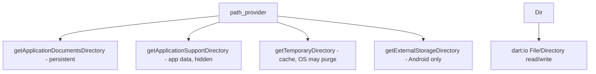
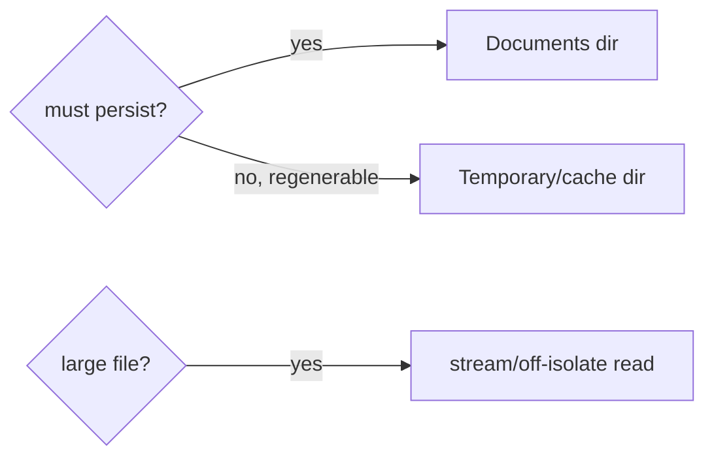

# File Storage (`path_provider`, Files & Directories)

> Use `path_provider` to get the correct platform directories, then `dart:io`'s `File`/`Directory` to read/write blobs — documents, images, exports, and cache files — choosing the right directory for persistence vs cache and never hardcoding paths.

## Introduction

For data too big or unstructured for prefs (PDFs, images, downloaded files, JSON caches, exports), use the filesystem. `path_provider` (package) gives platform-correct directories; `dart:io` handles the actual read/write. This file covers directories, file operations, and the persistence-vs-cache distinction.

## Why this concept exists

Apps can't hardcode filesystem paths (they differ per OS/sandbox). `path_provider` returns the sandboxed app directories (documents, support, temporary/cache) so you write to valid, correctly-treated locations (e.g., cache dirs the OS may purge).

## Real-world analogy

`path_provider` is a **building directory that tells you which room is which**: the permanent archive (documents), the staff-only back office (app support), and the recycling bin the janitor empties (temporary/cache). You store each thing in the appropriate room.

## Problem Statement

Save a downloaded invoice PDF that must persist, cache an API JSON response that can be purged, and export a CSV the user keeps. You'll pick directories via `path_provider` and read/write with `dart:io`.

## Internal Working



- **Directories** (via `path_provider`):
  - `getApplicationDocumentsDirectory()` — **persistent** user data (backed up); for files that must survive.
  - `getApplicationSupportDirectory()` — app-managed data, not user-visible.
  - `getTemporaryDirectory()` — **cache**; the OS may delete it anytime; for regenerable data.
  - `getExternalStorageDirectory()` (Android) / downloads dirs — platform-specific, permissions may apply.
- **File ops** (`dart:io`): `File('$dir/name').writeAsString/Bytes(...)`, `readAsString/Bytes()`, `exists()`, `delete()`; `Directory(...).create(recursive: true)`, `list()`.
- **Path building**: join with `package:path`'s `join(dir, 'sub', 'file.txt')` — never string-concat with `/`.
- **Large files/heavy parsing**: read/parse off the UI isolate (`Isolate.run`/streams) to avoid jank ([02 · isolates](../02%20Advanced%20Dart/isolates.md)).

## Memory Representation

Files live on disk; `readAsBytes`/`readAsString` load into memory (mind large files — stream them). Cache dirs are OS-purgeable, so never store must-keep data there ([02 · memory_and_gc](../02%20Advanced%20Dart/memory_and_gc.md)).

## Compiler Behavior

Not applicable. `dart:io` is unavailable on web — use conditional imports / web-specific storage for web ([Module 53](../53%20Flutter%20Web/README.md)).

## Runtime Behavior

File I/O is async (`Future`); large reads/writes should be chunked/streamed and possibly off-isolate. Missing files throw on read — check `exists()` or handle errors.

## Flutter Engine Behavior

`path_provider` crosses the embedder to native path APIs; file I/O uses the IO task runner conceptually ([10 · threading_model](../10%20Flutter%20Architecture/threading_model.md)).

## Dart VM Behavior

Not applicable beyond `dart:io`.

## Examples

```yaml
# pubspec.yaml
dependencies:
  path_provider: ^2.1.0
  path: ^1.9.0
```

```dart
import 'dart:convert';
import 'dart:io';
import 'package:path/path.dart' as p;
import 'package:path_provider/path_provider.dart';

class FileStore {
  // Persistent file (survives; backed up)
  Future<File> _docFile(String name) async {
    final dir = await getApplicationDocumentsDirectory();
    return File(p.join(dir.path, name)); // use path.join, not string concat
  }

  // Cache file (OS may purge)
  Future<File> _cacheFile(String name) async {
    final dir = await getTemporaryDirectory();
    return File(p.join(dir.path, name));
  }

  Future<void> savePdf(String name, List<int> bytes) async {
    final f = await _docFile(name);
    await f.writeAsBytes(bytes); // persistent
  }

  Future<void> cacheJson(String name, Map<String, dynamic> json) async {
    final f = await _cacheFile(name);
    await f.writeAsString(jsonEncode(json)); // regenerable -> cache dir
  }

  Future<Map<String, dynamic>?> readCachedJson(String name) async {
    final f = await _cacheFile(name);
    if (!await f.exists()) return null;
    return jsonDecode(await f.readAsString()) as Map<String, dynamic>;
  }
}

Future<void> demo() async {
  final store = FileStore();
  await store.cacheJson('feed.json', {'items': [1, 2, 3]});
  print(await store.readCachedJson('feed.json')); // {items: [1,2,3]}
}
```

## Diagrams



## Common Mistakes

| Mistake | Why | Fix |
|---------|-----|-----|
| Hardcoding paths | Wrong/invalid per platform | Use `path_provider` dirs + `path.join` |
| Persistent data in temporary dir | OS purges it | Use documents/support dir |
| String-concat paths (`dir+'/'+name`) | Breaks cross-platform | `p.join(...)` |
| Reading huge files on UI isolate | Jank | Stream/`Isolate.run` ([02](../02%20Advanced%20Dart/isolates.md)) |
| Assuming `dart:io` on web | Unavailable | Conditional imports / web storage ([Module 53](../53%20Flutter%20Web/README.md)) |
| No `exists()`/error handling | Crash on missing file | Check exists / try-catch |

## Best Practices

- Choose the **right directory**: documents/support for persistent, temporary for cache (regenerable).
- Build paths with **`path.join`**; never hardcode/concat.
- **Stream or off-isolate** large reads/writes/parsing to avoid jank.
- Front file access behind a **repository/`FileStore`**; handle missing files.
- On web, provide an alternative (`dart:io` unavailable); consider `path_provider` web support limits.
- Encrypt sensitive files if needed ([Module 37](../37%20Security/README.md)); use files for cache with TTL ([caching_strategies.md](caching_strategies.md)).

## Performance

Disk I/O is async; large operations should stream/off-load to keep frames smooth. Cache dirs avoid backup bloat for regenerable data ([Module 21](../21%20Performance/README.md)).

## Advantages / Disadvantages

- **+** Large/blob storage, full control, exports/documents, cache files, streaming for big data.
- **−** No querying, manual serialization, platform/web caveats, large-file/jank pitfalls, must pick correct dir.

## Interview Questions

1. **🟢 Why use `path_provider`?** — To get platform-correct, sandboxed app directories instead of hardcoding paths.
2. **🟢 Documents vs temporary directory?** — Documents = persistent (backed up); temporary/cache = OS may purge (regenerable data only).
3. **🟡 How do you build file paths correctly?** — With `package:path`'s `join`, not string concatenation.
4. **🟡 How do you avoid jank with large files?** — Stream them and/or parse on a background isolate (`Isolate.run`).
5. **🟡 What's different on web?** — `dart:io` File isn't available; use conditional imports / web-appropriate storage.
6. **🔴 Where do you store a cache vs a must-keep document?** — Cache → temporary dir (purgeable); must-keep → documents/support dir (persistent).
7. **🔴 How do you make file storage testable?** — Front it behind a repository and inject a directory/file-system abstraction (or a temp dir in tests).

## Senior Engineer Tips

- Use the **temporary/cache directory** for anything regenerable (network caches, thumbnails) so it doesn't bloat backups and can be purged.
- Offload large JSON/image processing to isolates; file reads on the UI isolate are a common jank source.
- Centralize file access in a `FileStore` repository with error handling; it also eases web/desktop branching.

## Architect Perspective

Filesystem storage handles blobs/caches/exports the other mechanisms can't. Correct directory choice (persistent vs purgeable), path safety, off-isolate I/O, and repository fronting make it robust and testable — and it's the backing for file-based caches ([caching_strategies.md](caching_strategies.md)), file handling ([Module 34](../34%20File%20Handling/README.md)), and offline data ([Module 19](../19%20Offline%20First/README.md)).

## Summary

- Use `path_provider` for platform directories (documents=persistent, temporary=cache) + `dart:io` for I/O; join paths with `path.join`.
- Stream/off-isolate large data; front behind a repository; mind web (`dart:io` unavailable).
- Files are for blobs/exports/caches — not queryable structured data (use a DB).

## Revision Notes

- `path_provider`: documents/support (persistent) vs temporary (purgeable cache) vs external (Android).
- `dart:io` File/Directory (async); `path.join` for paths; `exists()`/try-catch.
- Large files → stream/`Isolate.run`; web → no `dart:io`.
- Front in a repository; cache in temp dir; encrypt sensitive files (Module 37).

## Practice Questions

1. Which directory for a purgeable cache vs a kept document?
2. Why use `path.join` over string concatenation?
3. How do you keep large-file I/O from janking the UI?

## Coding Questions

1. Write/read a persistent JSON file in the documents directory.
2. Cache an API response in the temporary directory and read it back.
3. Stream-read a large file off the UI isolate.

## Mini Project

**File-backed store (Flutter):** Build a `FileStore` repository that saves a persistent export (documents dir) and caches API JSON (temporary dir), using `path.join`, `exists()` checks, and off-isolate parsing for large payloads. Acceptance: correct dir per data kind; safe paths; no UI-isolate jank on large data; repository-fronted; app runs.
