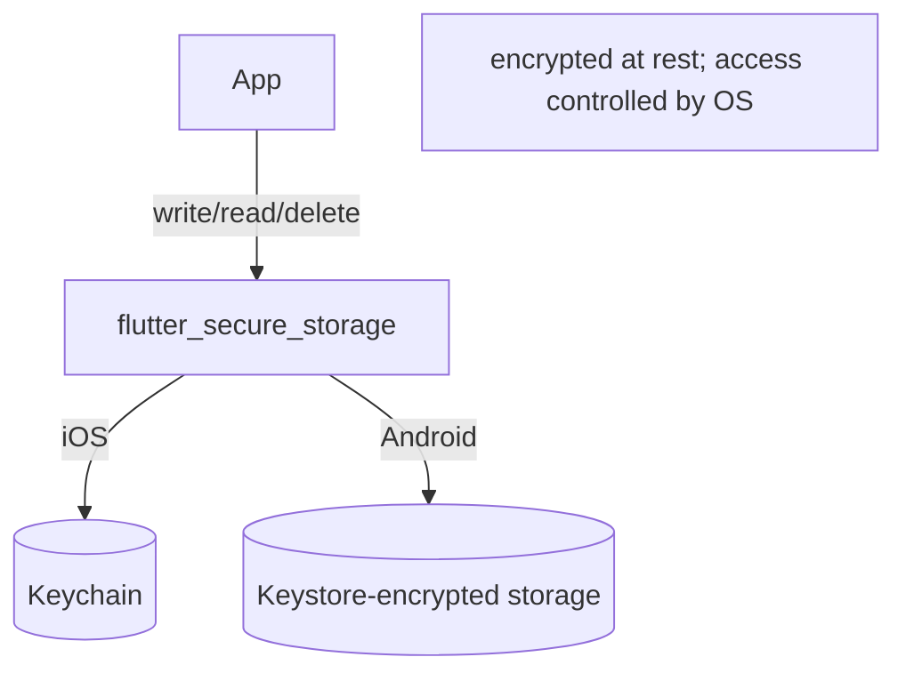
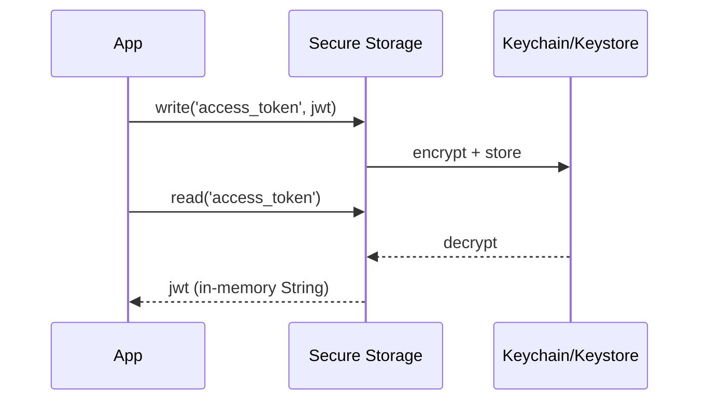

# Secure Storage (`flutter_secure_storage`, Keychain/Keystore)

> Store secrets — auth tokens, refresh tokens, credentials, encryption keys — in the OS-backed secure store (`flutter_secure_storage`), which uses the iOS **Keychain** and Android **Keystore/EncryptedSharedPreferences**, so data is encrypted at rest and not readable like plain prefs.

## Introduction

`flutter_secure_storage` (package: `flutter_secure_storage`) provides a key-value API like prefs, but backed by platform secure enclaves: iOS **Keychain**, Android **Keystore**-encrypted storage. This file covers its API, the security model, and correct handling of tokens/secrets.

## Why this concept exists

`SharedPreferences`/files are plain text — readable on rooted/jailbroken devices, backups, or via forensic tools. Secrets need OS-level encryption tied to the device/app. Secure storage delegates to the platform's hardened stores so your secrets aren't sitting in the clear.

## Real-world analogy

A **bank safe deposit box** vs a drawer: prefs are the drawer (anyone with access can read it); secure storage is the safe deposit box — locked by the bank (OS), tied to your identity (app/device), and far harder to break into.

## Problem Statement

Store an auth token + refresh token securely, read them to authorize requests, and clear them on logout — never touching plain prefs. You'll use `flutter_secure_storage` behind a repository.

## Internal Working



- **API**: `const storage = FlutterSecureStorage();` → `await storage.write(key:, value:)`, `read(key:)` (returns `String?`), `delete(key:)`, `deleteAll()`, `readAll()`.
- **Backing**: iOS **Keychain** (with configurable accessibility, e.g., `first_unlock`), Android **Keystore**-based encryption (EncryptedSharedPreferences).
- **All async**; values are `String` (serialize objects to JSON if needed — but avoid storing large data here).
- **Platform options**: iOS accessibility (`IOSOptions`), Android options (`AndroidOptions(encryptedSharedPreferences: true)`), biometric-gated access on some platforms.
- **Limits**: for secrets/credentials/keys only — not large data; secure storage can be slower than prefs and has platform quirks (e.g., Android backup/keystore edge cases).

## Memory Representation

Secrets are encrypted at rest in the OS store; when read into your Dart heap they're plain `String`s — minimize their in-memory lifetime and don't log them ([Module 37](../37%20Security/README.md)).

## Compiler Behavior

Not applicable.

## Runtime Behavior

Reads/writes go through native secure APIs (slower than prefs). `read` returns `null` if absent. Some configurations require device unlock/biometrics for access.

## Flutter Engine Behavior

Crosses the embedder to native Keychain/Keystore APIs ([10 · embedder_and_startup](../10%20Flutter%20Architecture/embedder_and_startup.md)).

## Dart VM Behavior

Not applicable.

## Examples

```yaml
# pubspec.yaml
dependencies:
  flutter_secure_storage: ^9.0.0
```

```dart
import 'package:flutter_secure_storage/flutter_secure_storage.dart';

// Repository fronting secure storage (tokens only)
class TokenStore {
  final FlutterSecureStorage _storage;
  TokenStore([FlutterSecureStorage? s])
      : _storage = s ??
            const FlutterSecureStorage(
              aOptions: AndroidOptions(encryptedSharedPreferences: true),
              iOptions: IOSOptions(accessibility: KeychainAccessibility.first_unlock),
            );

  static const _kAccess = 'access_token';
  static const _kRefresh = 'refresh_token';

  Future<void> saveTokens({required String access, required String refresh}) async {
    await _storage.write(key: _kAccess, value: access);   // encrypted at rest
    await _storage.write(key: _kRefresh, value: refresh);
  }

  Future<String?> get accessToken => _storage.read(key: _kAccess);

  Future<void> clear() async {
    await _storage.delete(key: _kAccess);   // on logout
    await _storage.delete(key: _kRefresh);
  }
}

Future<void> demo() async {
  final store = TokenStore();
  await store.saveTokens(access: 'eyJ...', refresh: 'r...');
  final token = await store.accessToken; // read for Authorization header
  print(token != null ? 'have token' : 'none');
  await store.clear(); // logout
}
```

## Diagrams



## Common Mistakes

| Mistake | Why | Fix |
|---------|-----|-----|
| Tokens/secrets in prefs/files | Plain text, readable | Use secure storage |
| Storing large data here | Slow, not designed for it | Secure storage = secrets only |
| Logging secret values | Leaks to logs/crash reports | Never log tokens; redact |
| Assuming it's unbreakable | Rooted devices/OS bugs exist | Defense-in-depth; short-lived tokens, server checks |
| Ignoring platform options | Wrong accessibility/backup behavior | Configure iOS/Android options |

## Best Practices

- Store **only secrets** (tokens, refresh tokens, keys, credentials) — small string values.
- Front it with a **repository** (`TokenStore`); inject for testability ([14 DI](../14%20Dependency%20Injection/README.md)).
- Configure platform options (iOS accessibility, Android encrypted prefs); consider biometric gating for high-value secrets.
- **Clear tokens on logout**; use short-lived access tokens + refresh flow ([Module 17](../17%20Authentication/README.md)).
- Never log/serialize secrets into analytics/crash reports; minimize their in-memory lifetime ([Module 37](../37%20Security/README.md)).

## Performance

Slower than prefs (native crypto/enclave calls) — fine for occasional token reads; don't use it as a general cache. Read once and hold briefly rather than per-request if hot ([Module 21](../21%20Performance/README.md)).

## Advantages / Disadvantages

- **+** OS-backed encryption at rest, right home for secrets, simple key-value API, platform-hardened.
- **−** Secrets only (small), slower than prefs, platform quirks/edge cases, not a silver bullet (rooted devices).

## Interview Questions

1. **🟢 What is secure storage for?** — Persisting secrets (tokens, credentials, keys) encrypted at rest via the OS (Keychain/Keystore), unlike plain prefs.
2. **🟢 What backs `flutter_secure_storage` per platform?** — iOS Keychain; Android Keystore-based encryption (EncryptedSharedPreferences).
3. **🟡 Why not store tokens in `SharedPreferences`?** — Prefs are plain text and readable on compromised devices/backups; secrets need OS encryption.
4. **🟡 What should you store in secure storage?** — Only small secrets; not large data (slow, not designed for it).
5. **🟡 How do you handle logout?** — Delete the tokens (`delete`/`deleteAll`) so they don't persist.
6. **🔴 Is secure storage unbreakable?** — No; rooted/jailbroken devices and OS bugs exist. Use defense-in-depth: short-lived tokens, server-side validation, and never log secrets.
7. **🔴 What platform options matter?** — iOS Keychain accessibility (e.g., `first_unlock`) and Android `encryptedSharedPreferences`/backup behavior; biometric gating for sensitive secrets.

## Senior Engineer Tips

- Keep a dedicated `TokenStore`/`SecretStore` repository — the only code touching secure storage — so security handling is centralized and auditable.
- Pair with short-lived access tokens + refresh; don't rely on device storage as your only defense.
- Audit that no secret is ever logged, put in analytics, or written to plain files/prefs.

## Architect Perspective

Secure storage is a security-critical boundary. Centralizing secret handling behind a repository, configuring platform options, and combining with short-lived tokens + server validation forms a defense-in-depth strategy integral to auth and security architecture ([Modules 17, 37](../17%20Authentication/README.md)).

## Summary

- Store secrets in OS-backed secure storage (Keychain/Keystore) — never plain prefs/files.
- Small string secrets only; front with a repository; clear on logout; configure platform options.
- Not unbreakable — combine with short-lived tokens, server checks, and no-logging discipline.

## Revision Notes

- Secrets → `flutter_secure_storage` (iOS Keychain / Android Keystore, encrypted at rest).
- API: `write/read/delete/deleteAll` (async, String values); secrets only (small).
- Never in prefs/files/logs; clear on logout; configure iOS/Android options.
- Defense-in-depth: short-lived tokens + server validation (rooted devices exist).

## Practice Questions

1. Where do auth tokens belong and why?
2. What backs secure storage on iOS vs Android?
3. Why is secure storage not a complete security solution?

## Coding Questions

1. Build a `TokenStore` (save/read/clear) over `flutter_secure_storage`.
2. Wire logout to clear tokens; verify a subsequent read is `null`.
3. Configure iOS accessibility + Android encrypted prefs options.

## Mini Project

**Secure session (Flutter):** Build a `TokenStore` repository over secure storage that saves access/refresh tokens on login, exposes the access token for requests, and clears on logout — with platform options configured and no logging of secrets. Acceptance: secrets only in secure storage; cleared on logout; no secret logging; app runs.
