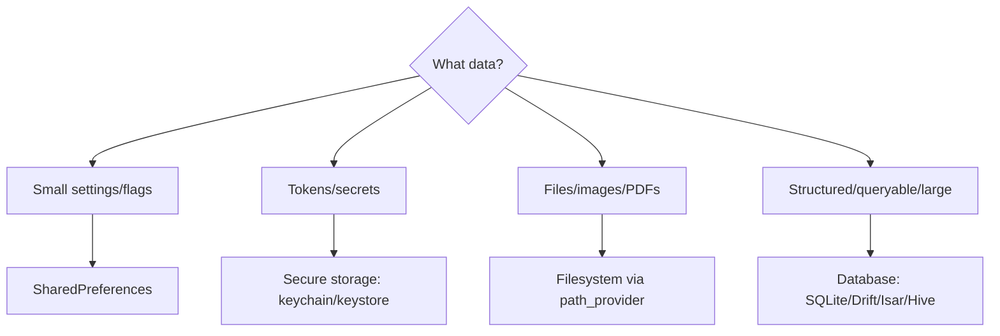
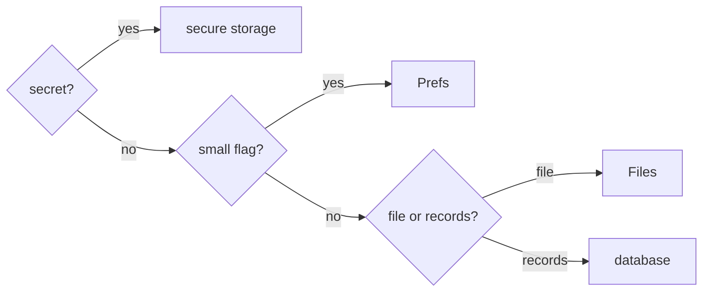

# Storage Options Overview & How to Choose

> Match the data to the mechanism: **small key-value settings → SharedPreferences**, **secrets/tokens → secure storage**, **files/blobs → filesystem**, **structured/queryable data → a database** — using the wrong one causes security holes, bloat, or stale data.

## Introduction

Flutter offers several on-device persistence options with distinct purposes and limits. This file is the decision framework so the detailed files (prefs/secure/files/cache) and the database module ([20](../20%20Database/README.md)) are applied correctly.

## Why this concept exists

Beginners default to `SharedPreferences` for everything — storing tokens (insecure), large JSON (bloat), or relational data (unqueryable). Each mechanism exists for a reason; choosing correctly is a correctness, security, and performance decision.

## Real-world analogy

Storage options are like **places to keep belongings**: a sticky note for a quick reminder (prefs), a safe for valuables (secure storage), a filing cabinet for documents (files), and a library with an index for lots of searchable records (database). You don't keep cash on a sticky note or a library in a drawer.

## Problem Statement

You must persist: theme choice, an auth token, a downloaded PDF, and 5,000 searchable products. Which storage each? By the end you'll route each correctly.

## Internal Working



| Option | Best for | Security | Capacity | Query | Module |
|--------|----------|----------|----------|-------|--------|
| **SharedPreferences** | Small key-value settings/flags | ❌ plain text | Small | No | [shared_preferences.md](shared_preferences.md) |
| **Secure storage** | Tokens, secrets, credentials | ✅ keychain/keystore | Small | No | [secure_storage.md](secure_storage.md) |
| **Files (`path_provider`)** | Blobs, images, PDFs, exports, cache files | Optional (encrypt yourself) | Large | No | [file_storage.md](file_storage.md) |
| **Database** | Structured, queryable, relational, large | Optional (encrypt) | Large | ✅ | [Module 20](../20%20Database/README.md) |

Decision heuristics:
- **Is it a secret?** → secure storage (never prefs).
- **Is it a small flag/setting?** → prefs.
- **Is it a file/large blob?** → filesystem.
- **Is it structured/queryable/lots of records?** → database.
- **Is it just a cache of network data?** → file/db cache with TTL ([caching_strategies.md](caching_strategies.md)); consider offline-first ([Module 19](../19%20Offline%20First/README.md)).

## Memory Representation

Prefs/secure store small values (loaded into memory); files/db hold larger data on disk read on demand. Wrap access so the app holds only what it needs ([02 · memory_and_gc](../02%20Advanced%20Dart/memory_and_gc.md)).

## Compiler Behavior / Runtime Behavior

All are async plugin APIs (platform channels); most are `Future`-based and need `WidgetsFlutterBinding.ensureInitialized()` before use in `main` ([06 · app_entry_point](../06%20Flutter%20Fundamentals/app_entry_point.md)).

## Flutter Engine Behavior

Storage plugins cross the embedder boundary to native storage (UserDefaults/SharedPreferences, Keychain/Keystore, filesystem) ([10 · embedder_and_startup](../10%20Flutter%20Architecture/embedder_and_startup.md)).

## Dart VM Behavior

Not applicable.

## Examples

```dart
// Routing data to storage (mental model):
// - themeMode: 'dark'            -> SharedPreferences (small flag)
// - authToken: 'eyJ...'          -> secure storage (secret!)
// - invoice.pdf (2MB)            -> filesystem (path_provider)
// - 5000 products (searchable)   -> database (Module 20)
// - cached /feed JSON            -> file/db cache with TTL (caching_strategies.md)
```

## Diagrams



## Common Mistakes

| Mistake | Why | Fix |
|---------|-----|-----|
| Tokens/secrets in `SharedPreferences` | Plain text, readable | Use secure storage |
| Large JSON/blobs in prefs | Bloat, slow, size limits | Files or database |
| Relational/queryable data in prefs/files | No querying | Use a database ([Module 20](../20%20Database/README.md)) |
| Cache without TTL/invalidation | Stale data | TTL + invalidation ([caching_strategies.md](caching_strategies.md)) |
| Storage calls scattered in UI | Coupling, untestable | Wrap behind a repository ([05 · repository](../05%20Design%20Patterns/repository.md)) |

## Best Practices

- **Match data to mechanism** (secret→secure, flag→prefs, blob→file, records→db).
- **Never** store secrets in prefs; use secure storage.
- Wrap all storage behind **repositories/abstractions** so the app is storage-agnostic and testable ([14 DI](../14%20Dependency%20Injection/README.md)).
- Cache network data with explicit **TTL/invalidation**; consider offline-first for full sync ([Module 19](../19%20Offline%20First/README.md)).
- Encrypt sensitive files/db as needed ([Module 37](../37%20Security/README.md)).

## Performance

Prefs/secure are small/fast; files/db scale but need on-demand reads and (for large data) off-isolate parsing ([02 · isolates](../02%20Advanced%20Dart/isolates.md)). Right-sizing avoids memory/latency issues.

## Advantages / Disadvantages

- **+** A clear framework prevents insecure/bloated/unqueryable storage choices.
- **−** Multiple mechanisms to learn; the "right" choice is contextual.

## Interview Questions

1. **🟢 Where should you store an auth token?** — Secure storage (keychain/keystore) — never `SharedPreferences` (plain text).
2. **🟢 What's `SharedPreferences` for?** — Small key-value settings/flags (theme, onboarding-seen), not secrets or large/structured data.
3. **🟡 When files vs a database?** — Files for blobs/documents/exports/cache files; a database for structured, queryable, relational, or large record sets.
4. **🟡 Why wrap storage behind a repository?** — To keep the app storage-agnostic, swappable, and testable (inject fakes), per DIP.
5. **🟡 What's wrong with caching without TTL?** — Data goes stale with no expiry/invalidation; add TTL + invalidation strategy.
6. **🔴 How do you decide storage for cached network data?** — By size/structure: small→prefs is wrong (no expiry logic), typically file/db cache with TTL, or offline-first sync for full offline support.
7. **🔴 What are the security implications of the choice?** — Prefs/files are readable unless encrypted; secrets belong in OS secure storage; sensitive files/db should be encrypted ([Module 37](../37%20Security/README.md)).

## Senior Engineer Tips

- Treat "should this be secure?" as the first question — getting tokens/PII into secure storage prevents a common vulnerability.
- Abstract storage behind repositories from day one; it makes migrating prefs→db or adding encryption painless.
- For anything beyond a handful of key-values, reach for a database rather than stuffing JSON into prefs/files.

## Architect Perspective

Storage strategy is a cross-cutting decision spanning security, performance, and offline capability. A repository-fronted, mechanism-appropriate design (secure for secrets, db for records, files for blobs, cache with TTL) keeps the app secure, fast, and swappable — and sets up offline-first ([Module 19](../19%20Offline%20First/README.md)) and encryption ([Module 37](../37%20Security/README.md)) cleanly.

## Summary

- Options: prefs (small settings), secure storage (secrets), files (blobs), database (structured/queryable).
- Never store secrets in prefs; wrap storage behind repositories; cache with TTL/invalidation.
- Match data to mechanism; escalate to a database for records and offline-first for sync.

## Revision Notes

- Secret→secure storage; small flag→prefs; blob/file→filesystem; records/queryable→database.
- Prefs/files are plain text unless encrypted; secrets never in prefs.
- Wrap behind repositories (testable/swappable); cache with TTL + invalidation.
- DBs = Module 20; sync = Module 19; encryption = Module 37.

## Practice Questions

1. Route four data items to the correct storage with justification.
2. Why is a token in prefs a vulnerability?
3. When do you need a database over files/prefs?

## Coding Questions

1. Design a `Storage` abstraction with prefs/secure/file backends and route calls appropriately.
2. Identify and fix a codebase that stores a token in prefs.
3. Sketch a cache decision (file vs db) for a paginated feed.

## Mini Project

**Storage router (docs + skeleton):** For a described app, write `STORAGE.md` mapping each data item to its mechanism (with rationale + security notes), and sketch a repository interface fronting prefs/secure/file. Acceptance: correct, secure choices; repository abstraction; no secrets in prefs.
