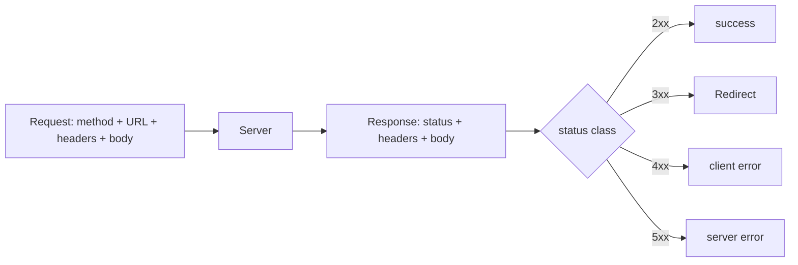
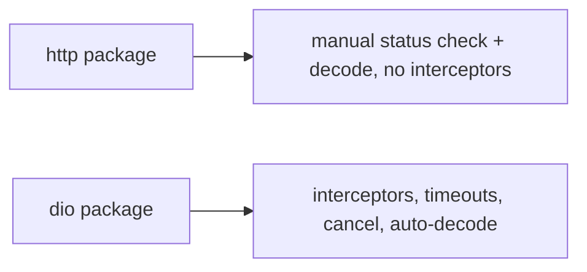

# HTTP Fundamentals (`http` vs `dio`)

> HTTP is a request/response protocol: you send a **method** (GET/POST/…) to a URL with headers/body and get back a **status code** + headers + body; Flutter's `http` package is minimal, while `dio` adds interceptors, timeouts, cancellation, and more for production apps.

## Introduction

Before frameworks, understand HTTP: methods, status codes, headers, and bodies. Then the two main Dart clients: **`http`** (simple, official, minimal) and **`dio`** (feature-rich: interceptors, timeouts, cancel tokens, transformers). This file covers both and when to use which.

## Why this concept exists

Every REST call is HTTP under the hood; misreading status codes or ignoring headers causes bugs. And choosing the client matters: `http` is fine for trivial calls, but production apps need `dio`'s cross-cutting features (auth injection, retry, logging) — better to know both.

## Real-world analogy

HTTP is **ordering by mail**: you send a labeled request (method + address + contents), and get a reply with a status stamp ("delivered 200", "not found 404", "office closed 503"). `http` is a basic postbox; `dio` is a mailroom with tracking, auto-retry, and a clerk stamping every outgoing letter (interceptors).

## Problem Statement

Fetch a list of products (GET) and create one (POST with JSON), reading status codes and headers correctly, and decide between `http` and `dio`. You'll do both requests and compare clients.

## Internal Working



- **Methods**: GET (read), POST (create), PUT/PATCH (update), DELETE (remove) — plus semantics (idempotency: GET/PUT/DELETE idempotent, POST not).
- **Status classes**: 2xx success, 3xx redirect, 4xx client error (400 bad request, 401 unauthorized, 403 forbidden, 404 not found, 429 too many requests), 5xx server error (500, 502, 503).
- **Headers**: `Content-Type`/`Accept` (usually `application/json`), `Authorization: Bearer <token>`, caching headers (`ETag`, `Cache-Control`).
- **Body**: request payload (JSON) and response body (JSON to parse — [02 · json](../02%20Advanced%20Dart/12_json_and_serialization.md)).
- **Clients**:
  - `http`: `http.get/post(...)`; returns a `Response` (`statusCode`, `body`); you check status + decode manually. Minimal.
  - `dio`: `Dio().get/post(...)`; auto-decodes JSON, throws `DioException` on non-2xx (configurable), supports interceptors/timeouts/cancel tokens/base options.

## Memory Representation

Response bodies load into memory (stream large ones); decoded JSON is a heap tree — parse big payloads off-isolate ([02 · isolates](../02%20Advanced%20Dart/04_isolates.md)).

## Compiler Behavior

Not applicable.

## Runtime Behavior

Requests are async (`Future`). `http` returns a `Response` regardless of status (you check `statusCode`); `dio` throws `DioException` on non-2xx by default. Timeouts/cancellation are manual in `http`, built-in in `dio`.

## Flutter Engine Behavior

Networking uses platform sockets via the embedder; on the UI isolate for orchestration, heavy parsing should be offloaded ([10 · threading_model](../10%20Flutter%20Architecture/03_threading_model.md)).

## Dart VM Behavior

Not applicable beyond async on the event loop ([02 · event_loop](../02%20Advanced%20Dart/01_event_loop.md)).

## Examples

```yaml
# pubspec.yaml
dependencies:
  http: ^1.2.0     # minimal
  dio: ^5.4.0      # production-featured
```

```dart
import 'dart:convert';
import 'package:http/http.dart' as http;
import 'package:dio/dio.dart';

// --- http (minimal): check status + decode manually ---
Future<List<dynamic>> fetchWithHttp() async {
  final res = await http.get(
    Uri.parse('https://api.example.com/products'),
    headers: {'Accept': 'application/json'},
  );
  if (res.statusCode == 200) {                 // must check status yourself
    return jsonDecode(res.body) as List<dynamic>;
  }
  throw Exception('HTTP ${res.statusCode}');   // handle non-2xx
}

// --- dio (production): base options, auto-decode, throws on non-2xx ---
final dio = Dio(BaseOptions(
  baseUrl: 'https://api.example.com',
  connectTimeout: const Duration(seconds: 10),
  receiveTimeout: const Duration(seconds: 10),
  headers: {'Accept': 'application/json'},
));

Future<List<dynamic>> fetchWithDio() async {
  final res = await dio.get('/products');       // decodes JSON, throws DioException on non-2xx
  return res.data as List<dynamic>;
}

Future<void> createProduct(Map<String, dynamic> body) async {
  await dio.post('/products', data: body);      // JSON-encodes body automatically
}
```

## Diagrams



## Common Mistakes

| Mistake | Why | Fix |
|---------|-----|-----|
| Ignoring status codes (`http`) | Treats errors as success | Check `statusCode`; handle non-2xx |
| No timeouts | Hangs on bad network | Set connect/receive timeouts (`dio` built-in) |
| Parsing huge JSON on UI isolate | Jank | Offload to `Isolate.run`/`compute` |
| Hardcoding base URL/headers everywhere | Duplication | Central `BaseOptions`/client |
| Leaking raw `Response`/`DioException` to UI | Coupling | Map to domain types at the repository |

## Best Practices

- Understand and handle **status codes** explicitly; don't assume 2xx.
- Set **timeouts** always; add cancellation for abandoned requests.
- Centralize config (base URL, headers) in one client (`BaseOptions`).
- Use **`http`** for trivial/one-off; **`dio`** for real apps (interceptors/timeouts/cancel).
- Offload large parsing off the UI isolate; map responses to domain models at the repo boundary.

## Performance

Latency dominates; parallelize independent calls (`Future.wait` — [02 · async_futures](../02%20Advanced%20Dart/02_async_futures.md)), set timeouts, and offload heavy JSON parsing ([Module 21](../21%20Performance/README.md)).

## Advantages / Disadvantages

- **+ `http`:** simple, official, tiny. **+ `dio`:** interceptors, timeouts, cancellation, transformers, base options.
- **− `http`:** manual status/decoding, no interceptors/timeouts. **− `dio`:** heavier, more API to learn.

## Interview Questions

1. **🟢 What are the main HTTP methods and their semantics?** — GET (read), POST (create, non-idempotent), PUT/PATCH (update), DELETE (remove); GET/PUT/DELETE are idempotent.
2. **🟢 What do status code classes mean?** — 2xx success, 3xx redirect, 4xx client error, 5xx server error.
3. **🟡 `http` vs `dio`?** — `http` is minimal (manual status check/decode); `dio` adds interceptors, timeouts, cancellation, auto-decode, base options — better for production.
4. **🟡 How does error handling differ between them?** — `http` returns a `Response` for any status (you check `statusCode`); `dio` throws `DioException` on non-2xx by default.
5. **🟡 Why set timeouts?** — To avoid hanging on slow/dead connections; `dio` has connect/receive timeouts built in.
6. **🔴 Why offload JSON parsing?** — Large decodes are CPU-bound and block the UI isolate → jank; use `compute`/`Isolate.run`.
7. **🔴 Where should raw responses be converted to domain models?** — At the repository boundary (DTO→entity), so the UI never sees `Response`/`DioException` ([05 · repository](../05%20Design%20Patterns/20_repository.md)).

## Senior Engineer Tips

- Default to `dio` for anything real — you'll want interceptors (auth/logging/retry) and timeouts almost immediately.
- Never let transport types (`Response`, `DioException`) escape the data layer; map to typed failures ([Module 38](../38%20Error%20Handling/README.md)).
- Set sane timeouts and parallelize independent requests; treat the network as unreliable by default.

## Architect Perspective

The HTTP client is the app's edge to the outside world. A centralized, timeout-aware, interceptor-driven client behind repositories (returning domain entities/typed failures) makes networking resilient, testable, and swappable — the foundation for the REST-client design, auth, caching, and offline layers ([02_rest_client_and_interceptors.md](02_rest_client_and_interceptors.md), [Modules 17, 15, 19](../17%20Authentication/README.md)).

## Summary

- HTTP = method + URL + headers + body → status + headers + body; know the status classes.
- `http` (minimal, manual) vs `dio` (interceptors/timeouts/cancel/auto-decode) — prefer `dio` for production.
- Set timeouts, offload heavy parsing, and map responses to domain types at the repository.

## Revision Notes

- Methods: GET/POST/PUT/PATCH/DELETE (idempotency varies); status: 2xx/3xx/4xx/5xx.
- Headers: Content-Type/Accept/Authorization/caching; body = JSON.
- `http` = manual status+decode; `dio` = interceptors/timeouts/cancel/auto-decode/throws on non-2xx.
- Timeouts always; offload big parsing; map to domain at repo.

## Practice Questions

1. What does a 401 vs 404 vs 503 indicate?
2. How does error handling differ between `http` and `dio`?
3. Why offload large JSON parsing?

## Coding Questions

1. GET + POST with `http`, checking status and decoding.
2. Same with `dio` + `BaseOptions` (timeouts, base URL).
3. Parallelize three independent GETs with `Future.wait`.

## Mini Project

**Two-client comparison (Flutter/Dart):** Implement product fetch/create with both `http` and `dio` (timeouts, base URL), handling status codes and mapping responses to a domain model at a repository boundary; parse a large list off-isolate. Acceptance: status handled; timeouts set; no transport types leak to callers; big parse offloaded; runs.
