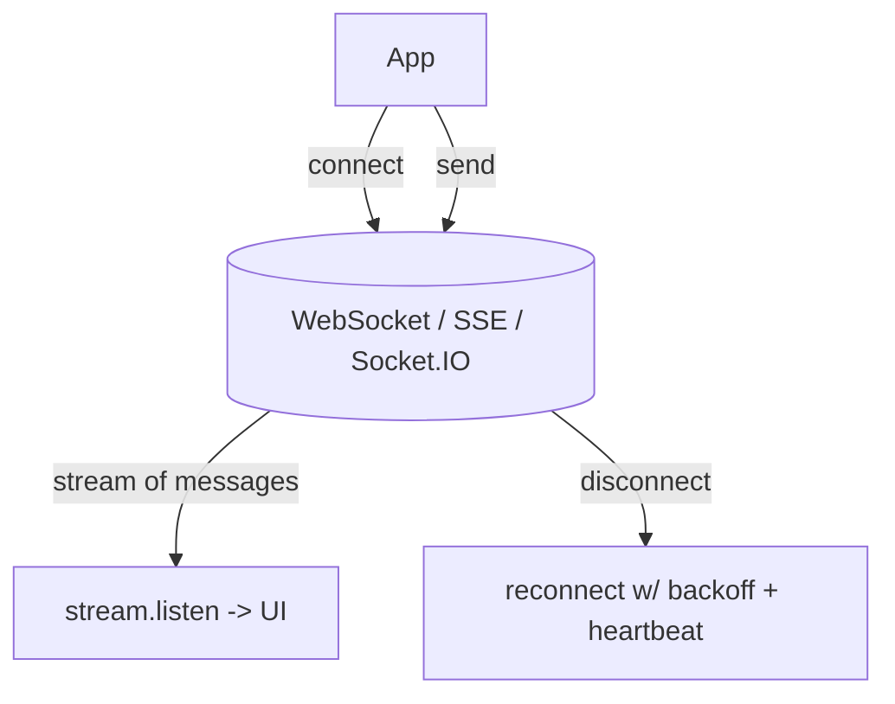
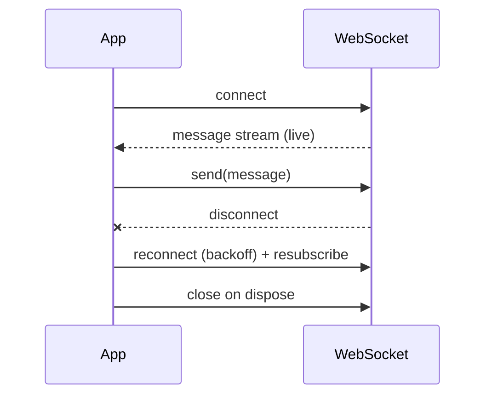

# WebSockets & Real-Time (WebSockets, SSE, Socket.IO)

> Real-time features (chat, live prices, presence) need a persistent connection: **WebSockets** (bidirectional), **Server-Sent Events** (server→client only), or **Socket.IO** (WebSocket + fallbacks + rooms) — exposed to the app as a `Stream`, with reconnection and lifecycle management.

## Introduction

Request/response HTTP can't push updates. This file covers persistent-connection options — **WebSockets** (`web_socket_channel`), **SSE** (one-way server push), and **Socket.IO** (`socket_io_client`) — how to model them as `Stream`s, and the hard parts: reconnection, heartbeats, and lifecycle/leak management.

## Why this concept exists

Chat, notifications, live dashboards, collaborative editing, and presence require the server to push data as it happens. Polling is wasteful/laggy; persistent connections deliver low-latency, bidirectional/streamed updates.

## Real-world analogy

HTTP is **sending letters** (one round-trip each). A WebSocket is an **open phone line** — both sides talk anytime. SSE is a **radio broadcast** (you only listen). Socket.IO is a **managed conference call** with auto-redial (reconnect) and breakout rooms (channels).

## Problem Statement

A chat screen must receive messages in real time, send messages, reconnect after drops, and clean up on dispose. You'll open a WebSocket, expose it as a `Stream`, handle reconnection, and cancel on dispose.

## Internal Working



- **WebSocket** (`web_socket_channel`): full-duplex over one TCP connection. `channel.stream` (incoming) + `channel.sink.add(...)` (outgoing). Use for chat, games, collaborative apps.
- **SSE** (Server-Sent Events): **server→client only**, over HTTP, auto-reconnecting, text/event-stream. Simpler than WS for one-way feeds (notifications, live scores).
- **Socket.IO** (`socket_io_client`): a library/protocol atop WebSocket with **automatic reconnection, fallbacks, rooms/namespaces, and event names** (`socket.on('event')`/`emit`). Requires a Socket.IO server (not plain WS).
- **Model as a `Stream`**: expose incoming messages as a broadcast `Stream` the UI/blocs consume ([02 · streams](../02%20Advanced%20Dart/03_streams.md)); consumers `listen` and **cancel** subscriptions on dispose.
- **Resilience**: reconnect with backoff, heartbeat/ping-pong to detect dead connections, resubscribe/replay on reconnect, buffer outgoing while disconnected.
- **Lifecycle**: close the channel and cancel subscriptions on dispose; pause on app background ([08 · app_lifecycle](../08%20Widget%20Lifecycle/06_app_lifecycle.md)).

## Memory Representation

Open connections + stream subscriptions retain callbacks (and captured state) → leaks if not cancelled/closed ([08 · dispose_and_leaks](../08%20Widget%20Lifecycle/05_dispose_and_leaks.md), [02 · streams](../02%20Advanced%20Dart/03_streams.md)).

## Compiler Behavior

Not applicable.

## Runtime Behavior

Messages arrive as stream events; disconnects surface as stream errors/`onDone` → trigger reconnect. Backpressure/buffering may be needed for fast producers.

## Flutter Engine Behavior

Uses platform sockets via the embedder; runs on the isolate's event loop — keep message handlers light ([10 · threading_model](../10%20Flutter%20Architecture/03_threading_model.md)).

## Dart VM Behavior

Not applicable.

## Examples

```yaml
# pubspec.yaml
dependencies:
  web_socket_channel: ^2.4.0
  # socket_io_client: ^2.0.0   # if using a Socket.IO server
```

```dart
import 'dart:async';
import 'package:web_socket_channel/web_socket_channel.dart';

// Chat service exposing incoming messages as a Stream, with reconnect + cleanup
class ChatService {
  final Uri uri;
  WebSocketChannel? _channel;
  final _controller = StreamController<String>.broadcast();
  StreamSubscription? _sub;
  bool _closed = false;

  ChatService(this.uri) { _connect(); }

  Stream<String> get messages => _controller.stream;

  void _connect() {
    _channel = WebSocketChannel.connect(uri);
    _sub = _channel!.stream.listen(
      (data) => _controller.add(data as String),   // incoming -> stream
      onError: (_) => _reconnect(),
      onDone: _reconnect,                           // disconnect -> reconnect
    );
  }

  Future<void> _reconnect() async {
    if (_closed) return;
    await _sub?.cancel();
    await Future.delayed(const Duration(seconds: 2)); // backoff (grow with attempts)
    _connect();
  }

  void send(String msg) => _channel?.sink.add(msg);  // outgoing

  Future<void> dispose() async {                     // MUST clean up
    _closed = true;
    await _sub?.cancel();
    await _channel?.sink.close();
    await _controller.close();
  }
}

// UI/bloc consumes ChatService.messages via a StreamBuilder / listen,
// and calls dispose() in State.dispose().
```

## Diagrams



## Common Mistakes

| Mistake | Why | Fix |
|---------|-----|-----|
| Not closing channel / cancelling subscription | Leaks, battery drain | Close + cancel in `dispose` |
| No reconnection logic | Silent dead connection | Reconnect with backoff + heartbeat |
| Using plain WS with a Socket.IO server (or vice versa) | Protocol mismatch | Match client to server protocol |
| Heavy work in message handlers | Jank | Keep handlers light; offload |
| Not pausing on background | Wasted battery/data | Pause/close on app background ([08](../08%20Widget%20Lifecycle/06_app_lifecycle.md)) |
| Losing outgoing messages while disconnected | Data loss | Buffer + flush on reconnect |

## Best Practices

- Expose real-time data as a **broadcast `Stream`**; consumers `listen` and **cancel on dispose**; **close** the channel.
- Implement **reconnection with backoff** + **heartbeat/ping** to detect dead links; resubscribe/replay on reconnect.
- **Pause/close** connections on app background; resume on foreground.
- Choose the protocol: **WebSocket** (bidirectional), **SSE** (one-way feeds), **Socket.IO** (managed reconnect/rooms, needs matching server).
- Keep message handlers light; front the service behind a repository/bloc.

## Performance

Persistent connections are efficient for frequent updates (vs polling) but consume battery/data when idle — pause on background. Keep handlers light; buffer/batch high-frequency streams ([Module 21](../21%20Performance/README.md)).

## Advantages / Disadvantages

- **+** Low-latency push, bidirectional (WS/Socket.IO), efficient vs polling, natural `Stream` model.
- **−** Connection/lifecycle management (reconnect/heartbeat/cleanup), battery/data cost, protocol-specific servers, leak-prone if undisciplined.

## Interview Questions

1. **🟢 Why not use HTTP polling for real-time?** — It's wasteful and laggy; persistent connections (WebSocket/SSE/Socket.IO) push updates with low latency.
2. **🟢 WebSocket vs SSE?** — WebSocket is full-duplex (both directions); SSE is server→client only (simpler, HTTP-based, auto-reconnecting).
3. **🟡 What is Socket.IO and what does it add?** — A library/protocol atop WebSocket adding auto-reconnection, transport fallbacks, rooms/namespaces, and named events — requires a Socket.IO server.
4. **🟡 How do you model incoming messages in Flutter?** — As a (broadcast) `Stream` consumers `listen`/`StreamBuilder` on, cancelling subscriptions on dispose.
5. **🟡 Why must you close/cancel connections?** — Open channels + subscriptions leak memory/battery and can fire callbacks after dispose.
6. **🔴 How do you make a real-time connection resilient?** — Reconnect with exponential backoff, heartbeat/ping to detect dead links, resubscribe/replay and buffer outgoing on reconnect.
7. **🔴 How should real-time connections behave on app background?** — Pause/close to save battery/data; resume/reconnect on foreground ([08 · app_lifecycle](../08%20Widget%20Lifecycle/06_app_lifecycle.md)).

## Senior Engineer Tips

- Wrap the socket in a service exposing a `Stream` + `send` + `dispose`; keep reconnection/heartbeat inside it so the UI is simple.
- Always handle background/foreground (pause/reconnect) and buffer outgoing messages while offline.
- Treat every subscription/connection as an owned resource with explicit cleanup — a top real-time leak source.

## Architect Perspective

Real-time connectivity is a stateful, lifecycle-heavy subsystem best encapsulated behind a service/repository exposing streams. Reconnection, heartbeat, background handling, and cleanup are cross-cutting reliability concerns; centralizing them yields robust chat/live features and integrates with app lifecycle, notifications, and offline strategy ([Modules 08, 32, 19](../08%20Widget%20Lifecycle/06_app_lifecycle.md)).

## Summary

- Real-time needs persistent connections: WebSocket (bidirectional), SSE (one-way), Socket.IO (managed, rooms).
- Model as a `Stream`; implement reconnection/backoff/heartbeat; pause on background; close/cancel on dispose.
- Encapsulate behind a service/repository; keep handlers light; buffer outgoing while disconnected.

## Revision Notes

- WebSocket (full-duplex, `web_socket_channel`) / SSE (server→client, auto-reconnect) / Socket.IO (reconnect+rooms, needs server).
- Expose broadcast `Stream`; cancel subscriptions + close channel on dispose (leak!).
- Reconnect w/ backoff + heartbeat + resubscribe; buffer outgoing; pause on background.
- Light handlers; front behind service/repo.

## Practice Questions

1. WebSocket vs SSE vs Socket.IO — pick for chat, live scores, and rooms.
2. How do you detect and recover from a dead connection?
3. Why pause connections on app background?

## Coding Questions

1. Build a `ChatService` (WebSocket) exposing a message `Stream` + `send` + `dispose`.
2. Add reconnection with exponential backoff + heartbeat.
3. Pause/resume the connection on app lifecycle changes.

## Mini Project

**Live chat service (Flutter):** Build a `ChatService` over `web_socket_channel` exposing incoming messages as a broadcast `Stream`, with `send`, reconnection (backoff + heartbeat), outgoing buffering while disconnected, background pause/resume, and full cleanup on dispose. Consume it via `StreamBuilder`. Acceptance: real-time updates; resilient reconnect; no leaks (closed/cancelled); background-aware; runs.
