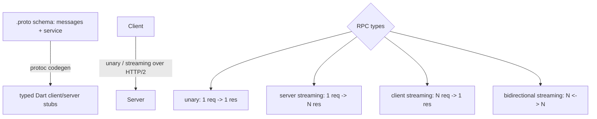
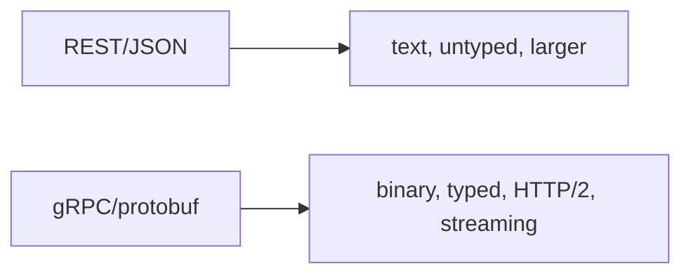

# gRPC

> gRPC is a high-performance RPC framework using **Protocol Buffers** (binary, schema-defined messages) over HTTP/2, with generated typed client/server stubs and four call types (unary + three streaming) — ideal for efficient, strongly-typed, low-latency service-to-service and mobile-to-backend communication.

## Introduction

gRPC lets you call remote methods as if local, with messages defined in `.proto` files (Protocol Buffers) and typed Dart stubs generated by codegen. This file covers protobuf, the four RPC types, the `grpc` Dart package, and when gRPC fits vs REST/GraphQL.

## Why this concept exists

For performance-sensitive, strongly-typed APIs (microservices, streaming, low-bandwidth mobile), JSON/REST is verbose and untyped. gRPC's compact binary protobuf + HTTP/2 multiplexing + generated types give smaller payloads, lower latency, streaming, and compile-time contracts.

## Real-world analogy

REST/JSON is **writing full sentences in a shared language** (verbose but universal); gRPC is a **pre-agreed shorthand code** between two parties (`.proto` schema) — compact, fast, and unambiguous, but both sides must share the codebook (generated stubs).

## Problem Statement

You call a backend `GetProduct(id)` and stream live price updates, with typed messages and efficient binary transport. You'll define a `.proto`, generate stubs, and make unary + streaming calls.

## Internal Working



- **Protocol Buffers**: define `message`s and a `service` with RPC methods in a `.proto`; `protoc` + the Dart plugin generate typed stubs and message classes (binary serialization).
- **Transport**: HTTP/2 (multiplexed streams, header compression) — efficient, supports streaming.
- **Four RPC types**:
  - **Unary**: one request → one response (like a normal call).
  - **Server streaming**: one request → a stream of responses (e.g., live prices).
  - **Client streaming**: a stream of requests → one response (e.g., upload chunks).
  - **Bidirectional streaming**: both stream concurrently (e.g., chat).
- **Dart (`grpc` package)**: create a `ClientChannel`, instantiate the generated client, call methods (returning `Future`/`Stream`), pass metadata (auth) via `CallOptions`.
- **Errors**: `GrpcError` with status codes (e.g., `unauthenticated`, `notFound`) — map to domain failures.
- **Web caveat**: browsers need **gRPC-Web** (a proxy like Envoy) since raw gRPC isn't browser-supported.

## Memory Representation

Protobuf messages are compact binary → smaller than JSON in memory/on the wire. Streaming responses arrive incrementally (bounded memory) ([02 · streams](../02%20Advanced%20Dart/03_streams.md)).

## Compiler Behavior

`.proto` codegen produces **typed** Dart classes/stubs → compile-time-safe messages and method signatures (a major advantage over untyped JSON).

## Runtime Behavior

Unary calls return `Future`; streaming calls return `Stream`; the channel manages HTTP/2 connections. Cancel via the call's `cancel()`; handle `GrpcError` status codes.

## Flutter Engine Behavior

Uses platform networking via the embedder; web requires gRPC-Web proxying ([10 · threading_model](../10%20Flutter%20Architecture/03_threading_model.md)).

## Dart VM Behavior

Not applicable beyond async/streams.

## Examples

```yaml
# pubspec.yaml
dependencies:
  grpc: ^3.2.0
  protobuf: ^3.1.0
dev_dependencies:
  protoc_plugin: ^21.0.0   # generates Dart from .proto via protoc
```

```proto
// product.proto
syntax = "proto3";
message ProductRequest { string id = 1; }
message Product { string id = 1; string name = 2; double price = 3; }
message PriceUpdate { double price = 1; }

service ProductService {
  rpc GetProduct (ProductRequest) returns (Product);                 // unary
  rpc WatchPrice (ProductRequest) returns (stream PriceUpdate);       // server streaming
}
```

```dart
// After `protoc --dart_out=grpc:lib/generated product.proto`, generated stubs exist.
import 'package:grpc/grpc.dart';
// import 'generated/product.pbgrpc.dart';

Future<void> useGrpc() async {
  final channel = ClientChannel(
    'api.example.com',
    port: 443,
    options: const ChannelOptions(credentials: ChannelCredentials.secure()),
  );
  // final client = ProductServiceClient(channel);

  // Unary call (typed):
  // final product = await client.getProduct(ProductRequest(id: '42'),
  //     options: CallOptions(metadata: {'authorization': 'Bearer $token'}));
  // print('${product.name}: ${product.price}');

  // Server streaming (Stream of typed updates):
  // await for (final update in client.watchPrice(ProductRequest(id: '42'))) {
  //   print('price: ${update.price}');
  // }

  await channel.shutdown(); // clean up the connection
}
```

## Diagrams



## Common Mistakes

| Mistake | Why | Fix |
|---------|-----|-----|
| Using gRPC on Flutter Web without gRPC-Web | Browsers don't support raw gRPC | Use gRPC-Web + a proxy (Envoy) |
| Not shutting down channels | Leaked connections | `channel.shutdown()` when done |
| Ignoring `GrpcError` status codes | Poor error handling | Map status → domain failures |
| No auth metadata | Unauthenticated calls | Pass token via `CallOptions.metadata` |
| Choosing gRPC for simple public APIs | Complexity/tooling overhead | REST/GraphQL may fit better |
| Leaking generated types to UI | Coupling | Map protobuf → entities at repo |

## Best Practices

- Define clear `.proto` contracts; commit generated stubs or generate in CI (`protoc`).
- Use the right **RPC type** (unary vs streaming) per use case; consume streams as Dart `Stream`s and cancel/`shutdown` properly.
- Pass **auth via metadata** (`CallOptions`); map **`GrpcError`** to domain failures.
- On **web**, plan for **gRPC-Web** (proxy) — raw gRPC won't work in browsers.
- Front gRPC clients behind **repositories** returning entities/typed failures (map protobuf→entity).

## Performance

Compact binary + HTTP/2 multiplexing + streaming → lower latency/bandwidth than JSON/REST, ideal for chatty/streaming/low-bandwidth scenarios. Streaming keeps memory bounded ([Module 21](../21%20Performance/README.md)).

## Advantages / Disadvantages

- **+** Compact/fast binary, strongly typed (codegen), streaming (4 types), HTTP/2 multiplexing, great for microservices/mobile.
- **−** Tooling/codegen + `.proto` maintenance, not human-readable, web needs gRPC-Web proxy, overkill for simple public APIs, less ubiquitous than REST.

## Interview Questions

1. **🟢 What is gRPC?** — A high-performance RPC framework using Protocol Buffers (binary, schema-defined) over HTTP/2, with generated typed client/server stubs.
2. **🟢 What are the four RPC types?** — Unary (1→1), server streaming (1→N), client streaming (N→1), bidirectional streaming (N↔N).
3. **🟡 Why is gRPC efficient vs REST/JSON?** — Compact binary protobuf, HTTP/2 multiplexing/header compression, and typed contracts — smaller payloads, lower latency, streaming.
4. **🟡 How are Dart types generated?** — From `.proto` via `protoc` + the Dart plugin, producing typed message/stub classes (compile-time-safe).
5. **🟡 How do you pass auth in gRPC?** — Via call metadata (`CallOptions.metadata`, e.g., an `authorization` header).
6. **🔴 Why can't raw gRPC run on Flutter Web?** — Browsers don't support the required HTTP/2 primitives; use **gRPC-Web** with a proxy (e.g., Envoy).
7. **🔴 When choose gRPC over REST/GraphQL?** — Performance-critical, strongly-typed, streaming, or microservice/mobile-to-backend scenarios; not for simple public/human-facing APIs.

## Senior Engineer Tips

- Treat `.proto` as the source-of-truth contract; automate codegen in CI and version schemas carefully (backward compatibility via field numbers).
- Map `GrpcError` status codes to your sealed failures and protobuf messages to entities at the repo boundary.
- For web targets, decide gRPC-Web early — it changes deployment (proxy) and client setup.

## Architect Perspective

gRPC is a strong choice for typed, high-performance, streaming communication — common in microservice backends and performance-sensitive mobile clients. Architecturally it still sits behind repositories (entities + typed failures); the tradeoff vs REST/GraphQL is efficiency/typing vs tooling/ubiquity/web friction — a deliberate protocol decision per system needs ([05 · repository](../05%20Design%20Patterns/20_repository.md), [Module 48](../48%20System%20Design/README.md)).

## Summary

- gRPC = protobuf (binary, typed, schema) + HTTP/2 + generated stubs + four RPC types (unary + streaming).
- Efficient and strongly typed; consume as `Future`/`Stream`; pass auth via metadata; map errors/messages to domain.
- Web needs gRPC-Web (proxy); front behind repositories; choose per performance/typing/streaming needs.

## Revision Notes

- Protobuf messages/service in `.proto` → `protoc` Dart stubs (typed); HTTP/2 transport.
- RPC types: unary (1→1), server-stream (1→N), client-stream (N→1), bidi (N↔N).
- `grpc` pkg: `ClientChannel` + generated client; `CallOptions.metadata` for auth; `GrpcError` codes; `shutdown()`.
- Web → gRPC-Web + proxy; map protobuf→entity/failure at repo; not for simple APIs.

## Practice Questions

1. Name the four RPC types with a use case each.
2. Why is gRPC more efficient than REST/JSON?
3. Why does Flutter Web need gRPC-Web?

## Coding Questions

1. Write a `.proto` with a unary and a server-streaming RPC.
2. Make a unary call with auth metadata and map `GrpcError` to a failure.
3. Consume a server-streaming RPC as a Dart `Stream` and cancel it.

## Mini Project

**gRPC product service (Flutter/Dart):** Define `ProductService` (`GetProduct` unary + `WatchPrice` server-streaming) in `.proto`, generate stubs, and build a repository that returns a `Product` entity (unary) and a price `Stream` (streaming), passing auth metadata, mapping `GrpcError`→failures, and shutting down the channel. Acceptance: typed calls; auth via metadata; streaming consumed as `Stream`; errors mapped; entities at boundary; channel closed. (Note gRPC-Web requirement for web.)
