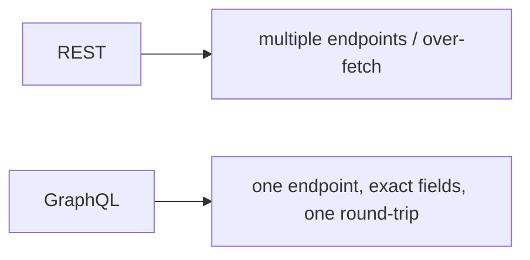

# GraphQL

> GraphQL is a query language where the **client specifies exactly which fields it wants** in a single request against a typed schema — reducing over/under-fetching — with queries (read), mutations (write), and subscriptions (real-time), plus a normalized client cache.

## Introduction

GraphQL replaces many REST endpoints with a single typed endpoint you query precisely. This file covers queries/mutations/subscriptions, variables, the `graphql_flutter` client and its normalized cache, and when GraphQL beats REST.

## Why this concept exists

REST often over-fetches (returns fields you don't need) or under-fetches (requires multiple round-trips to assemble a screen). GraphQL lets the client ask for exactly the shape it needs in one request, driven by a server schema — efficient for complex, nested, client-driven data needs.

## Real-world analogy

REST is a **fixed-menu restaurant** (you order dish #4 and get whatever it includes); GraphQL is a **build-your-own bowl** — you specify exactly the ingredients (fields) you want, in one order, and get precisely that.

## Problem Statement

A profile screen needs a user's name, avatar, and their last 5 posts' titles — one request, no extra fields. You'll write a GraphQL query with variables, run a mutation, and note subscriptions + caching.

## Internal Working

```mermaid
flowchart TD
    Client -->|query { fields }| Endpoint[single GraphQL endpoint]
    Endpoint --> Schema[typed schema resolves fields]
    Schema --> Data[exactly requested shape]
    Sub[subscription] -->|websocket| Realtime[live updates]
    Client --> Cache[normalized cache by id/type]
```

- **Operations**:
  - **Query** (read): request a field tree; server returns exactly that shape.
  - **Mutation** (write): create/update/delete, returning selected fields of the result.
  - **Subscription** (real-time): push updates over a WebSocket ([websockets_and_realtime.md](websockets_and_realtime.md)).
- **Variables**: parameterize operations (`query($id: ID!)`), passed separately — avoids string interpolation/injection.
- **Schema/types**: the server defines types/fields; clients get typed, validated queries (codegen tools generate Dart types).
- **Client (`graphql_flutter`)**: `GraphQLClient` with a `Link` (HTTP + WebSocket for subs) and a **normalized cache** (stores objects by `id`/`__typename`, so entities update everywhere).
- **Caching**: normalized cache dedupes/updates entities across queries; policies control cache-first vs network.

## Memory Representation

The normalized cache holds entities keyed by type+id (in-memory, optionally persisted). Large results still cost memory; request only needed fields ([02 · memory_and_gc](../02%20Advanced%20Dart/memory_and_gc.md)).

## Compiler Behavior

With codegen (`graphql_codegen`/`ferry`), operations become typed Dart classes — compile-time-safe queries/variables/results.

## Runtime Behavior

Queries hit the endpoint (or cache per policy); mutations update the cache (auto for entities with ids, or via manual cache writes); subscriptions stream over WebSocket.

## Flutter Engine Behavior / Dart VM Behavior

Not applicable beyond async/sockets.

## Examples

```yaml
# pubspec.yaml
dependencies:
  graphql_flutter: ^5.1.0
```

```dart
import 'package:graphql_flutter/graphql_flutter.dart';

final client = GraphQLClient(
  link: HttpLink('https://api.example.com/graphql'),
  cache: GraphQLCache(), // normalized cache
);

// Query with variables — ask for EXACTLY these fields:
const _profileQuery = r'''
  query Profile($id: ID!) {
    user(id: $id) {
      id
      name
      avatarUrl
      posts(last: 5) { title }
    }
  }
''';

Future<Map<String, dynamic>?> fetchProfile(String id) async {
  final result = await client.query(QueryOptions(
    document: gql(_profileQuery),
    variables: {'id': id},
    fetchPolicy: FetchPolicy.cacheAndNetwork, // cache-first + revalidate
  ));
  if (result.hasException) {
    throw result.exception!; // map to Failure at the repository boundary
  }
  return result.data?['user'] as Map<String, dynamic>?;
}

// Mutation:
const _likeMutation = r'''
  mutation Like($postId: ID!) {
    likePost(id: $postId) { id likes }
  }
''';
Future<void> like(String postId) => client.mutate(
    MutationOptions(document: gql(_likeMutation), variables: {'postId': postId}));
```

## Diagrams



## Common Mistakes

| Mistake | Why | Fix |
|---------|-----|-----|
| String-interpolating variables | Injection/errors | Use `variables:` (parameterized) |
| Over-selecting fields | Defeats GraphQL's benefit | Request only needed fields |
| Ignoring the normalized cache | Redundant fetches/stale entities | Use `id`/`__typename`; set fetch policies |
| Leaking client types to UI | Coupling | Map to entities at repo boundary |
| Assuming GraphQL is always better | Not for simple APIs | Use REST when a simple resource API suffices |

## Best Practices

- Request **exactly the fields** each screen needs; use **variables** (never interpolate).
- Leverage the **normalized cache** (ids + `__typename`) so entities update consistently; pick fetch policies (`cacheAndNetwork`, `networkOnly`).
- Adopt **codegen** (`graphql_codegen`/`ferry`) for type-safe operations.
- Wrap the client in a **repository** returning entities/typed failures; don't leak client types.
- Use **subscriptions** for real-time; otherwise queries/mutations.

## Performance

Fewer round-trips + precise fields reduce payloads/latency; the normalized cache dedupes and enables cache-first. Beware huge nested queries (cost/complexity limits server-side) ([Module 21](../21%20Performance/README.md)).

## Advantages / Disadvantages

- **+** Precise fetching (no over/under-fetch), single endpoint, typed schema, normalized cache, subscriptions, great for complex client-driven data.
- **−** Server/tooling complexity, caching subtleties, overkill for simple CRUD, learning curve, query-cost/security considerations.

## Interview Questions

1. **🟢 What problem does GraphQL solve?** — Over/under-fetching: the client requests exactly the fields it needs in one typed request against a schema.
2. **🟢 Query vs mutation vs subscription?** — Read; write (create/update/delete); real-time push (over WebSocket).
3. **🟡 Why use variables instead of interpolation?** — Safety (no injection) and reuse; variables are typed and passed separately.
4. **🟡 What is the normalized cache?** — A client cache storing entities by type+id (`__typename`/`id`) so the same entity updates consistently across queries.
5. **🟡 When is REST preferable to GraphQL?** — Simple resource CRUD APIs, or when server/tooling complexity isn't justified.
6. **🔴 How do you keep GraphQL type-safe in Dart?** — Codegen (`graphql_codegen`/`ferry`) turns operations into typed classes (compile-time-checked queries/results).
7. **🔴 What are GraphQL's server-side risks?** — Expensive/deeply-nested queries; mitigate with query-cost limits, depth limits, and persisted queries.

## Senior Engineer Tips

- Keep queries **field-minimal and screen-scoped**; co-locate queries with the widgets that use them.
- Use fetch policies deliberately (`cacheAndNetwork` for lists = SWR-like UX — [15 · caching_strategies](../15%20Local%20Storage/caching_strategies.md)).
- Front the client with a repository returning domain entities/typed failures, exactly like REST.

## Architect Perspective

GraphQL shifts data-shaping to the client with a typed contract — powerful for complex, nested, evolving UIs and for reducing round-trips. Architecturally it still sits behind repositories (entities + typed failures) with caching policies; the choice vs REST depends on data complexity, team, and backend capability ([05 · repository](../05%20Design%20Patterns/repository.md), [Module 40](../40%20Clean%20Architecture/README.md)).

## Summary

- GraphQL: one typed endpoint; clients request exact fields via queries/mutations/subscriptions with variables.
- Normalized cache (id/`__typename`) + fetch policies; codegen for type safety.
- Great for complex client-driven data; front with repositories; use REST for simple APIs.

## Revision Notes

- Query (read)/mutation (write)/subscription (real-time via WS); variables (typed, not interpolated).
- `graphql_flutter`: `GraphQLClient` + `Link` + normalized cache; fetch policies (`cacheAndNetwork`).
- Codegen for typed ops; repo maps to entities/failures; request minimal fields.
- REST for simple CRUD; watch server query cost.

## Practice Questions

1. How does GraphQL avoid over/under-fetching?
2. Why use variables over interpolation?
3. What does the normalized cache do?

## Coding Questions

1. Write a parameterized query (variables) selecting minimal fields.
2. Run a mutation and update the cache.
3. Wrap the client in a repository returning entities/`Result`.

## Mini Project

**GraphQL profile (Flutter):** Build a `ProfileRepository` over `graphql_flutter` fetching a user + last posts with a variabled query (`cacheAndNetwork`), a like mutation updating the cache, mapping results to entities and exceptions to failures. Acceptance: minimal field selection; variables used; cache leveraged; entities/failures at boundary; runs.
