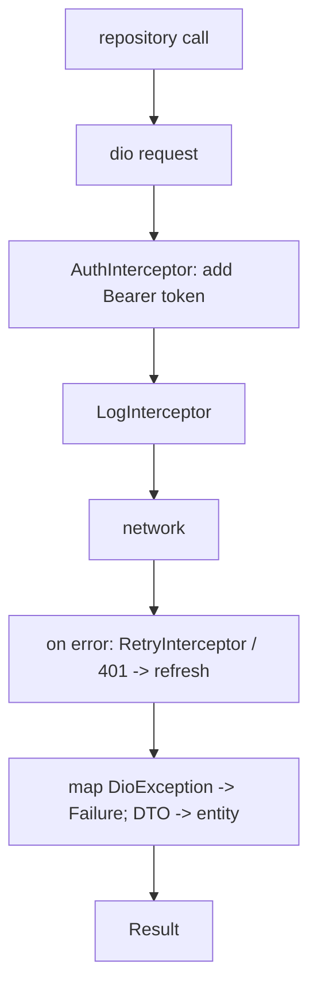
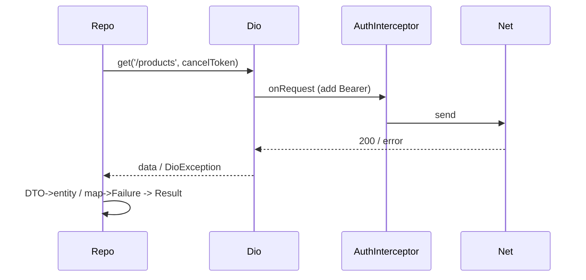

# REST Client & Interceptors (Production `dio` Setup)

> A production REST client centralizes cross-cutting concerns in **interceptors** (auth token injection, logging, retry, error mapping), enforces **timeouts/cancellation**, converts failures to a **typed `Result`**, and maps **DTOs→entities** at the repository — so feature code sees only domain objects, never HTTP.

## Introduction

This is the heart of the module: turning raw `dio` into a robust, testable API layer. Interceptors handle auth/logging/retry/errors uniformly; the repository maps DTOs to entities and returns typed results; timeouts and cancel tokens keep it resilient. This applies the Decorator/Interceptor and Repository patterns ([05](../05%20Design%20Patterns/decorator.md)).

## Why this concept exists

Without central handling, every call re-implements auth headers, logging, retry, and error parsing — inconsistent and bug-prone. Interceptors and a repository boundary centralize these, so adding auth or retry happens once, and the UI depends on clean domain APIs returning success/failure.

## Real-world analogy

A **corporate mailroom**: every outgoing letter automatically gets a stamp (auth token) and a log entry (logging); failed deliveries are auto-retried; and incoming mail is translated into your language (DTO→entity) before reaching your desk. You never touch postage or translation — the mailroom (interceptors + repository) does.

## Problem Statement

Build an API layer where every request carries the auth token, is logged, retries transient failures, times out, can be cancelled, and returns a typed `Result<T, Failure>` of domain entities. You'll wire `dio` interceptors + a repository.

## Internal Working



- **Interceptors** (`dio.interceptors.add(...)`): run on every request/response/error:
  - **Auth**: inject `Authorization: Bearer <token>` (from secure storage — [15 · secure_storage](../15%20Local%20Storage/secure_storage.md)); on 401, refresh token + retry.
  - **Logging**: log method/url/status/timing (redact secrets).
  - **Retry**: retry transient failures (timeouts, 5xx, network) with backoff, bounded attempts.
  - **Error mapping**: translate `DioException` into your domain `Failure` types.
- **Timeouts**: `connectTimeout`/`receiveTimeout`/`sendTimeout` on `BaseOptions`.
- **Cancellation**: `CancelToken` per request; cancel on screen dispose / new search query ([08 · dispose_and_leaks](../08%20Widget%20Lifecycle/dispose_and_leaks.md)).
- **Typed results**: the repository catches errors and returns `Result<T, Failure>` (or `Either`) instead of throwing across layers ([Module 38](../38%20Error%20Handling/README.md)).
- **DTO↔entity**: parse response into DTOs, map to domain entities; the UI never sees DTOs/`Response` ([02 · json](../02%20Advanced%20Dart/json_and_serialization.md), [05 · repository](../05%20Design%20Patterns/repository.md)).

## Memory Representation

The `dio` instance + interceptors are typically singletons ([14 · scopes_and_lifetimes](../14%20Dependency%20Injection/scopes_and_lifetimes.md)); cancel tokens tie to widget lifetimes. Offload large parses off-isolate ([02 · isolates](../02%20Advanced%20Dart/isolates.md)).

## Compiler Behavior

Typed `Result`/sealed failures give exhaustive handling ([02 · records_and_patterns](../02%20Advanced%20Dart/records_and_patterns.md)).

## Runtime Behavior

Interceptors execute in order per request/response/error; retry/refresh re-issue requests; cancelled requests throw a cancellation error the repository maps to a "cancelled" failure or ignores.

## Flutter Engine Behavior / Dart VM Behavior

Not applicable beyond async/sockets.

## Examples

```dart
import 'package:dio/dio.dart';

// Domain types
class Product { final String id, name; const Product(this.id, this.name); }
sealed class Failure { const Failure(); }
class NetworkFailure extends Failure { const NetworkFailure(); }
class ServerFailure extends Failure { final int code; const ServerFailure(this.code); }
class UnauthorizedFailure extends Failure { const UnauthorizedFailure(); }

// A tiny Result type
sealed class Result<T> { const Result(); }
class Ok<T> extends Result<T> { final T value; const Ok(this.value); }
class Err<T> extends Result<T> { final Failure failure; const Err(this.failure); }

// Auth interceptor: inject token, refresh on 401
class AuthInterceptor extends Interceptor {
  final Future<String?> Function() getToken;
  AuthInterceptor(this.getToken);
  @override
  void onRequest(RequestOptions options, RequestInterceptorHandler handler) async {
    final token = await getToken();
    if (token != null) options.headers['Authorization'] = 'Bearer $token';
    handler.next(options);
  }
  // (onError could refresh the token and retry the request)
}

Dio buildDio(Future<String?> Function() getToken) {
  final dio = Dio(BaseOptions(
    baseUrl: 'https://api.example.com',
    connectTimeout: const Duration(seconds: 10),
    receiveTimeout: const Duration(seconds: 10),
  ));
  dio.interceptors.addAll([
    AuthInterceptor(getToken),
    LogInterceptor(requestBody: false, responseBody: false), // redact in real apps
    // RetryInterceptor(...) for transient failures
  ]);
  return dio;
}

// Repository: DTO -> entity, DioException -> Failure, returns Result
class ProductRepository {
  final Dio dio;
  ProductRepository(this.dio);

  Future<Result<List<Product>>> getProducts({CancelToken? cancel}) async {
    try {
      final res = await dio.get('/products', cancelToken: cancel);
      final list = (res.data as List)
          .map((j) => Product(j['id'] as String, j['name'] as String)) // DTO->entity
          .toList();
      return Ok(list);
    } on DioException catch (e) {
      return Err(_mapError(e)); // typed failure, never leaks DioException
    }
  }

  Failure _mapError(DioException e) => switch (e.response?.statusCode) {
        401 => const UnauthorizedFailure(),
        final int code when code >= 500 => ServerFailure(code),
        _ => const NetworkFailure(),
      };
}
```

## Diagrams



## Common Mistakes

| Mistake | Why | Fix |
|---------|-----|-----|
| Auth/logging/retry per call | Duplicated, inconsistent | Centralize in interceptors |
| Throwing `DioException` to the UI | Leaks transport, hard to handle | Map to typed `Failure`/`Result` |
| No timeouts/cancellation | Hangs, wasted work, leaks | Timeouts + `CancelToken` |
| Logging tokens/PII | Security leak | Redact in log interceptor |
| Unbounded retry | Hammering/backoff storms | Bounded retries + backoff, only transient errors |
| Returning DTOs to UI | Couples to wire format | Map DTO→entity in repo |

## Best Practices

- Centralize **auth/logging/retry/error-mapping** in interceptors; keep one configured `dio` (DI singleton).
- Always set **timeouts**; use **`CancelToken`** and cancel on dispose/new query.
- Return **typed `Result`/`Failure`** from repositories; never leak `DioException`/`Response`.
- **Retry only transient** errors (timeouts/5xx/network) with **bounded backoff**; refresh token on 401 then retry once.
- Map **DTO→entity** at the boundary; offload large parses off-isolate.
- **Redact secrets** in logging.

## Performance

Interceptors add negligible overhead; retry/backoff prevent storms; cancellation avoids wasted work; parallelize independent calls and offload parsing ([Module 21](../21%20Performance/README.md)).

## Advantages / Disadvantages

- **+** Uniform cross-cutting concerns, resilient (retry/timeout/cancel), typed errors, testable (mock `dio`/repo), clean UI.
- **−** More setup; interceptor ordering/refresh logic can get subtle; must avoid retry storms.

## Interview Questions

1. **🟢 What are `dio` interceptors for?** — Running cross-cutting logic on every request/response/error (auth injection, logging, retry, error mapping).
2. **🟢 Why return a typed `Result`/`Failure` from repositories?** — So callers handle success/failure explicitly without catching transport exceptions; the UI stays decoupled from HTTP.
3. **🟡 How do you handle a 401?** — In an interceptor: refresh the token and retry the request once; if refresh fails, surface an `UnauthorizedFailure` (→ re-login).
4. **🟡 What errors should you retry, and how?** — Transient ones (timeouts, network, 5xx) with bounded attempts + exponential backoff — never non-idempotent unsafe retries or 4xx like 400/401.
5. **🟡 How do you cancel requests?** — With a `CancelToken` per request, cancelled on screen dispose or when a newer request supersedes it.
6. **🔴 Where do DTOs become entities?** — At the repository boundary (DTO→entity mapping); the UI never sees DTOs or `Response`.
7. **🔴 How do you keep this testable?** — Inject `dio` (mock it) or the repository (fake it); assert `Result` outcomes for success/error paths ([Module 14](../14%20Dependency%20Injection/testing_with_di.md)).

## Senior Engineer Tips

- Build the client once (interceptors + timeouts) and inject it; never construct `dio` ad hoc in features.
- Get the **401→refresh→retry-once** flow right early; it's the most error-prone interceptor (avoid infinite refresh loops).
- Make failures a **sealed type** so the UI can exhaustively map each to messaging/actions ([Module 38](../38%20Error%20Handling/README.md)).

## Architect Perspective

A disciplined REST client is the data layer's backbone: interceptors centralize cross-cutting policy, the repository boundary enforces domain purity (entities + typed failures), and resilience features (timeout/retry/cancel) make the app robust on real networks. This composes with caching/offline ([15](../15%20Local%20Storage/caching_strategies.md), [19](../19%20Offline%20First/README.md)), auth ([17](../17%20Authentication/README.md)), and error handling ([38](../38%20Error%20Handling/README.md)) into a production data stack.

## Summary

- Centralize auth/logging/retry/error-mapping in interceptors; one configured `dio`.
- Enforce timeouts + cancellation; return typed `Result`/`Failure`; map DTO→entity at the repo.
- Retry only transient errors with backoff; refresh on 401; redact secrets; keep it testable.

## Revision Notes

- Interceptors: auth (Bearer/refresh-on-401), logging (redact), retry (transient+backoff), error→Failure.
- `BaseOptions` timeouts; `CancelToken` per request (cancel on dispose/new query).
- Repo returns `Result<T, Failure>` (sealed); DTO→entity at boundary; no `DioException` to UI.
- Inject/mock `dio`/repo for tests; offload big parses.

## Practice Questions

1. Design the 401→refresh→retry flow (avoiding loops).
2. Which failures are safe to retry and how?
3. Why never leak `DioException` to the UI?

## Coding Questions

1. Write an `AuthInterceptor` that injects a token and refreshes on 401 (retry once).
2. Add a bounded retry-with-backoff interceptor for transient errors.
3. Implement a repository returning `Result<List<Entity>, Failure>` with DTO mapping + cancellation; test with a mocked `dio`.

## Mini Project — Module capstone (REST)

**Robust API layer (Flutter):** Build a configured `dio` (timeouts) with auth + logging + retry interceptors, a `ProductRepository` returning `Result<List<Product>, Failure>` (DTO→entity, `DioException`→`Failure`), and per-request `CancelToken`s cancelled on dispose. Unit-test success/401/timeout/5xx with a mocked `dio`. Acceptance: cross-cutting concerns in interceptors; typed failures; timeouts/cancellation; no transport leakage; tests pass.
