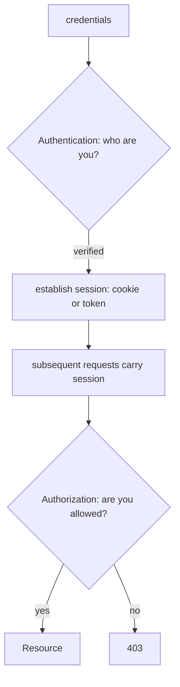
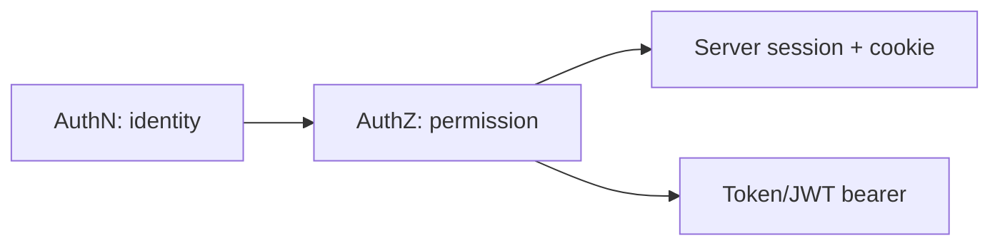

# Auth Fundamentals (AuthN vs AuthZ, Session Models)

> **Authentication (AuthN)** proves *who you are*; **authorization (AuthZ)** decides *what you can do* — and a session model (stateful server sessions vs stateless tokens) determines how identity persists across requests.

## Introduction

Before implementing login, get the concepts straight: authentication vs authorization, and the two session models (server-side sessions with cookies vs stateless tokens like JWT). These decisions shape the whole auth architecture the later files build on.

## Why this concept exists

Confusing AuthN and AuthZ leads to security holes (authenticated ≠ allowed). And choosing the wrong session model (or mixing them) causes scaling, security, and UX problems. Clear fundamentals prevent both.

## Real-world analogy

**AuthN** = showing your **ID at the door** (proving identity). **AuthZ** = your **ticket/badge** deciding which rooms you may enter (VIP vs general). A **session** is the **wristband** you wear after entry so you don't re-show ID at every room — a stamped wristband (server session) vs a self-verifying hologram badge (stateless token).

## Problem Statement

A user logs in and accesses an admin page. Which step verifies identity, which verifies permission, and how does the app "remember" them across requests? You'll separate AuthN/AuthZ and pick a session model.

## Internal Working



- **Authentication (AuthN)**: verify identity (password, OTP, biometric, OAuth). Result: a session/token.
- **Authorization (AuthZ)**: given identity, check permissions/roles/scopes for a resource. `401` = not authenticated; `403` = authenticated but not authorized.
- **Session models**:
  - **Stateful (server-side sessions)**: server stores session state; client holds a session **cookie** (session id). Easy to revoke; needs server memory/sticky sessions; CSRF considerations.
  - **Stateless (tokens/JWT)**: the token itself carries claims and is verified by signature — server stores nothing. Scales horizontally; harder to revoke (needs short expiry + refresh/blacklist). Common in mobile ([02_token_auth_jwt.md](02_token_auth_jwt.md)).
- Mobile apps typically use **stateless tokens** (bearer tokens in the `Authorization` header) rather than cookies.

## Memory Representation

Sessions/tokens are stored client-side: tokens in **secure storage** (never prefs — [15 · secure_storage](../15%20Local%20Storage/03_secure_storage.md)); server session state (stateful) lives on the server.

## Compiler Behavior / Runtime Behavior

Not applicable directly; auth state is often modeled as a `Listenable`/stream driving guards ([13 · guards_and_redirects](../13%20Routing/03_guards_and_redirects.md)).

## Flutter Engine Behavior / Dart VM Behavior

Not applicable.

## Examples

```dart
// Modeling auth state (drives guards + UI)
sealed class AuthState { const AuthState(); }
class Authenticated extends AuthState { final User user; const Authenticated(this.user); }
class Unauthenticated extends AuthState { const Unauthenticated(); }
class AuthLoading extends AuthState { const AuthLoading(); }

class User {
  final String id;
  final Set<String> roles; // for AuthZ (e.g., {'admin'})
  const User(this.id, this.roles);
  bool can(String role) => roles.contains(role); // authorization check
}

// AuthN: verify identity -> session. AuthZ: check permission.
bool canAccessAdmin(AuthState state) => switch (state) {
      Authenticated(:final user) => user.can('admin'), // authenticated AND authorized
      _ => false,                                       // 401 vs 403 handled upstream
    };
```

## Diagrams



## Common Mistakes

| Mistake | Why | Fix |
|---------|-----|-----|
| Treating authenticated as authorized | Security hole | Check permissions/roles separately (AuthZ) |
| Confusing 401 vs 403 | Wrong handling/UX | 401 = re-authenticate; 403 = show "no access" |
| Tokens in `SharedPreferences` | Plain text leak | Secure storage ([15](../15%20Local%20Storage/03_secure_storage.md)) |
| Client-only authorization | Bypassable | Enforce AuthZ server-side; client checks are UX only |
| Mixing session models inconsistently | Confusion/bugs | Pick one (tokens for mobile) |

## Best Practices

- Separate **AuthN** (identity) from **AuthZ** (permissions); handle **401 vs 403** distinctly.
- For mobile, prefer **stateless tokens** (bearer) with short expiry + refresh ([02_token_auth_jwt.md](02_token_auth_jwt.md)).
- Store tokens in **secure storage**; never trust client-side authorization for security (server enforces).
- Model **auth state** as a `Listenable`/stream to drive route guards and UI ([13](../13%20Routing/03_guards_and_redirects.md)).
- Front auth behind an **`AuthRepository`** the app depends on.

## Performance

Stateless tokens avoid server session lookups (scale better); short-lived tokens + refresh balance security and UX. Negligible client cost ([Module 21](../21%20Performance/README.md)).

## Advantages / Disadvantages

- **+ Stateless tokens:** scalable, mobile-friendly, self-contained. **+ Stateful sessions:** easy revocation, server control.
- **− Stateless:** revocation is hard (short expiry/blacklist). **− Stateful:** server state, sticky sessions, CSRF.

## Interview Questions

1. **🟢 Authentication vs authorization?** — AuthN proves identity (who you are); AuthZ decides permissions (what you can do).
2. **🟢 401 vs 403?** — 401 Unauthorized = not authenticated (log in); 403 Forbidden = authenticated but not permitted.
3. **🟡 Stateful sessions vs stateless tokens?** — Server stores session state (cookie holds an id; easy revoke, needs server state) vs self-verifying tokens (no server state; scalable; harder to revoke).
4. **🟡 Which session model do mobile apps typically use?** — Stateless bearer tokens (JWT) in the `Authorization` header — not cookies.
5. **🟡 Where should tokens be stored on-device?** — Secure storage (Keychain/Keystore), never `SharedPreferences`.
6. **🔴 Why is client-side authorization insufficient?** — Clients can be tampered with; authorization must be enforced server-side (client checks only improve UX).
7. **🔴 What's the revocation tradeoff with stateless tokens?** — They can't be easily invalidated before expiry; mitigate with short-lived access tokens + refresh and/or a server-side blacklist.

## Senior Engineer Tips

- Always ask "authenticated *and* authorized?" — model roles/scopes explicitly and enforce them server-side.
- Represent auth as a sealed state (`Authenticated`/`Unauthenticated`/`Loading`) so guards and UI are exhaustive and reactive.
- For mobile, standardize on short-lived access tokens + refresh in secure storage from day one.

## Architect Perspective

The AuthN/AuthZ split and session-model choice are foundational security-architecture decisions. Stateless tokens + secure storage + reactive auth state + server-enforced authorization form the backbone that guards ([13](../13%20Routing/03_guards_and_redirects.md)), interceptors ([16](../16%20Networking/02_rest_client_and_interceptors.md)), and the auth repository build on ([Module 37](../37%20Security/README.md)).

## Summary

- AuthN = identity; AuthZ = permission; 401 vs 403 differ accordingly.
- Stateful sessions (cookie) vs stateless tokens (JWT); mobile prefers stateless bearer tokens.
- Store tokens securely, enforce AuthZ server-side, model auth as reactive state behind a repository.

## Revision Notes

- AuthN (who) vs AuthZ (what); 401 (re-auth) vs 403 (forbidden).
- Stateful (server session + cookie, revocable) vs stateless (JWT, scalable, hard revoke).
- Mobile → bearer tokens in secure storage; server enforces AuthZ.
- Model auth as sealed state → drives guards/UI; front with `AuthRepository`.

## Practice Questions

1. Give an example where a user is authenticated but not authorized.
2. Why do mobile apps favor stateless tokens?
3. Why can't the client be the source of truth for authorization?

## Coding Questions

1. Model a sealed `AuthState` + `User` with roles and a `can(role)` check.
2. Write a function distinguishing 401 vs 403 handling.
3. Sketch an `AuthRepository` interface (login/logout/currentUser).

## Mini Project

**Auth model (Dart):** Define `AuthState` (sealed), a `User` with roles, and an `AuthRepository` interface; implement a fake that logs in with roles and expose auth state as a `Stream`/`Listenable`. Write a permission check (`can`). Acceptance: AuthN/AuthZ separated; reactive auth state; roles enforced in the model; analyzer clean.
