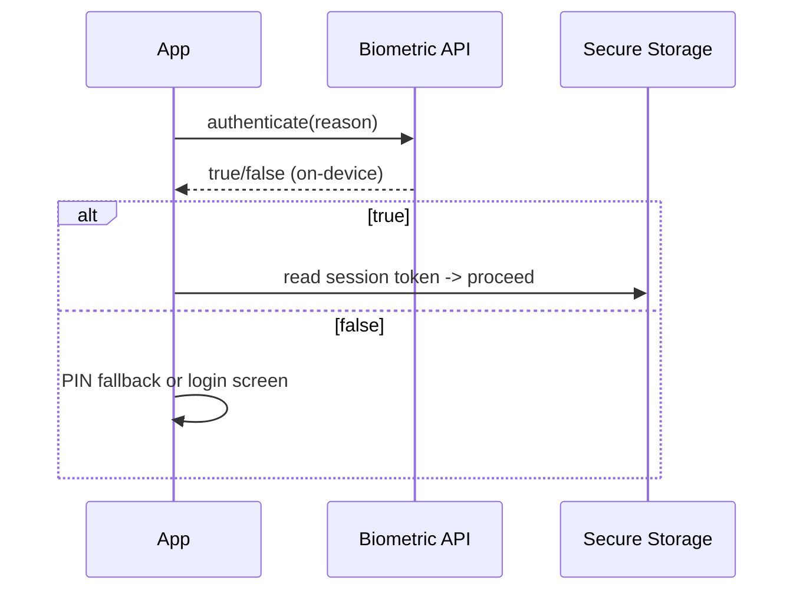

# Biometric Authentication (`local_auth`)

> Biometric auth (fingerprint/Face ID) is a **local device unlock**, not a server login — use `local_auth` to gate access to an existing session or sensitive actions; the biometric result never leaves the device and must be backed by real credentials/tokens.

## Introduction

`local_auth` (package) prompts the OS biometric/device-credential check and returns a simple pass/fail. This file covers correct usage (as a *local gate*, not identity to a server), availability checks, fallbacks, and the crucial distinction from network authentication.

## Why this concept exists

Users want fast, secure re-entry ("unlock with Face ID") without re-typing passwords. Biometrics provide a convenient local factor. But biometrics **authenticate to the device**, not your server — they gate access to already-established, securely-stored credentials/sessions.

## Real-world analogy

Biometrics are the **fingerprint lock on your phone case** protecting a wallet inside (your stored session token). Your fingerprint opens the case locally; it isn't shown to the bank. The bank still trusts the card (token) inside, not your fingerprint.

## Problem Statement

After first login, let returning users unlock the app / authorize a payment with Face ID/fingerprint — falling back to PIN/password, handling unavailable hardware, and only unlocking a securely-stored session. You'll use `local_auth` correctly.

## Internal Working

```mermaid
flowchart TD
    Check[canCheckBiometrics / isDeviceSupported] --> Prompt[authenticate()]
    Prompt -->|success| Unlock[reveal stored session / authorize action]
    Prompt -->|fail/cancel| Fallback[PIN/password or deny]
    Note["biometric result stays on-device; gates access to secure-storage token"]
```

- **Availability**: `canCheckBiometrics`, `isDeviceSupported()`, `getAvailableBiometrics()` — check before prompting; handle no-hardware/not-enrolled.
- **Prompt**: `authenticate(localizedReason: ..., options: AuthenticationOptions(biometricOnly: false, stickyAuth: true))` returns `bool`. `biometricOnly: false` allows device PIN/passcode fallback.
- **Role**: a **local gate** — on success, reveal the app or read the securely-stored session token ([15 · secure_storage](../15%20Local%20Storage/03_secure_storage.md)) / authorize a sensitive action. It does **not** authenticate to your server.
- **Options**: `stickyAuth` (survive app backgrounding during prompt), error handling for lockout (too many attempts).
- **Security note**: biometrics are convenience over an existing session; the real credential is the stored token — protect it and require real login when the session is gone/expired.

## Memory Representation

No biometric data is exposed to your app (OS-handled); you only get pass/fail. The gated secret lives in secure storage ([15](../15%20Local%20Storage/03_secure_storage.md)).

## Compiler Behavior / Runtime Behavior

`authenticate()` is async; can throw platform exceptions (no hardware, not enrolled, locked out) — handle them. Result is a simple boolean.

## Flutter Engine Behavior

`local_auth` calls native biometric APIs via the embedder ([10 · embedder_and_startup](../10%20Flutter%20Architecture/05_embedder_and_startup.md)); requires platform config (Face ID usage string on iOS, permissions on Android).

## Dart VM Behavior

Not applicable.

## Examples

```yaml
# pubspec.yaml
dependencies:
  local_auth: ^2.2.0
```

```dart
import 'package:local_auth/local_auth.dart';

class BiometricGate {
  final _auth = LocalAuthentication();

  Future<bool> isAvailable() async {
    try {
      return await _auth.isDeviceSupported() && await _auth.canCheckBiometrics;
    } catch (_) {
      return false;
    }
  }

  Future<bool> unlock() async {
    if (!await isAvailable()) return false; // fall back to password login
    try {
      return await _auth.authenticate(
        localizedReason: 'Unlock to access your account',
        options: const AuthenticationOptions(
          biometricOnly: false, // allow device PIN/passcode fallback
          stickyAuth: true,     // survive backgrounding during prompt
        ),
      );
    } on Exception {
      return false;             // not enrolled / locked out / cancelled
    }
  }
}

// Usage: on app resume, if a session token exists in secure storage,
// require BiometricGate.unlock() before revealing it; else go to login.
```

## Diagrams



## Common Mistakes

| Mistake | Why | Fix |
|---------|-----|-----|
| Treating biometrics as server auth | It's local-only, no server proof | Gate an existing token; server trusts the token |
| No availability check | Crash/poor UX on unsupported devices | Check `isDeviceSupported`/`canCheckBiometrics` first |
| No fallback | Locked out if biometrics fail | Allow PIN/password fallback |
| Storing a "biometric = logged in" flag insecurely | Bypassable | Gate the secure-storage token, not a bool |
| Ignoring lockout/enrollment errors | Crashes | Catch platform exceptions |
| Missing platform config (Face ID string) | Runtime failure/rejection | Add usage descriptions/permissions |

## Best Practices

- Use biometrics as a **local gate** over a securely-stored session/action — never as your only/server auth.
- **Check availability** and always provide a **PIN/password fallback** (`biometricOnly: false`).
- Handle errors (not enrolled, lockout, cancel) gracefully; use `stickyAuth`.
- Require **real login** when no valid session exists or it's expired.
- Configure platform requirements (iOS `NSFaceIDUsageDescription`, Android biometric permissions).

## Performance

Instant, occasional, user-driven; negligible cost. It improves UX (fast re-entry) without network round-trips.

## Advantages / Disadvantages

- **+** Fast, secure local re-entry/action authorization; no password typing; privacy-preserving (data stays on device).
- **−** Local-only (not server identity), device/enrollment dependent, needs fallback + platform config, can be bypassed if the underlying token isn't protected.

## Interview Questions

1. **🟢 What does biometric auth actually authenticate?** — The user *to the device* (local pass/fail); it does not authenticate to your server.
2. **🟢 What should biometrics gate?** — Access to an already-established, securely-stored session/token or a sensitive action — not a fresh server login.
3. **🟡 Why always provide a fallback?** — Hardware may be absent, not enrolled, or locked out; `biometricOnly: false` allows device PIN/passcode.
4. **🟡 What checks precede a biometric prompt?** — `isDeviceSupported()` / `canCheckBiometrics` (and handle exceptions) before `authenticate()`.
5. **🟡 Does biometric data reach your app?** — No; the OS handles it and returns only success/failure.
6. **🔴 What's insecure about a "biometric passed → logged in" boolean?** — It's bypassable/tamperable; biometrics must gate the *actual* secure-stored token, and the server must still trust that token.
7. **🔴 When must you force a full login despite biometrics?** — When there's no valid stored session or it's expired/revoked — biometrics can't create a session.

## Senior Engineer Tips

- Frame biometrics as "unlock the wallet," not "prove identity to the bank" — the token is the credential; biometrics just gate local access to it.
- Always ship a fallback path; biometric-only flows strand users on unsupported/locked devices.
- Pair with app-lifecycle handling (re-lock on background) for sensitive apps ([08 · app_lifecycle](../08%20Widget%20Lifecycle/06_app_lifecycle.md)).

## Architect Perspective

Biometrics are a UX-security convenience layer over the real session, not an identity provider. Architecturally they gate access to secure-stored tokens and sensitive actions, with mandatory fallback and platform config, complementing token auth and secure storage ([02_token_auth_jwt.md](02_token_auth_jwt.md), [15 · secure_storage](../15%20Local%20Storage/03_secure_storage.md), [Module 37](../37%20Security/README.md)).

## Summary

- Biometrics (`local_auth`) are a local device gate returning pass/fail — not server authentication.
- Gate access to a securely-stored session/action; always provide fallback; check availability; handle errors.
- The token is the real credential; force login when no valid session exists.

## Revision Notes

- `local_auth`: `isDeviceSupported`/`canCheckBiometrics` → `authenticate(reason, options)` → bool.
- Local gate only (no server proof); gate secure-stored token/action; `biometricOnly:false` for PIN fallback; `stickyAuth`.
- Handle no-hardware/not-enrolled/lockout; platform config (Face ID string).
- Force login when session absent/expired; re-lock on background for sensitive apps.

## Practice Questions

1. Why isn't biometric success a server login?
2. What must you check before prompting, and why a fallback?
3. What should biometrics actually protect/reveal?

## Coding Questions

1. Build a `BiometricGate` with availability check, prompt, and fallback.
2. Gate reading a secure-storage token behind `unlock()`.
3. Handle not-enrolled/lockout exceptions gracefully.

## Mini Project

**Biometric unlock (Flutter):** After first login (token in secure storage), gate app entry with `local_auth` (Face ID/fingerprint), falling back to PIN/password, checking availability, handling errors, and forcing full login when no valid session exists. Re-lock on background. Acceptance: biometrics gate the stored token (not a bool flag); fallback works; errors handled; runs.
