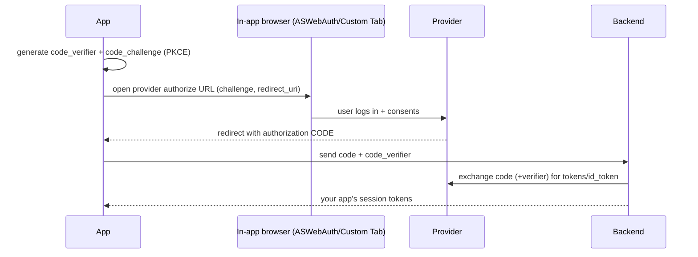
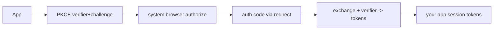

# OAuth 2.0 & Social Login (PKCE, Google/Apple)

> OAuth 2.0 lets users grant your app limited access via a trusted provider (Google/Apple/etc.) without sharing their password; mobile apps use the **Authorization Code flow with PKCE** — an in-app browser redirect exchanges a code for tokens securely.

## Introduction

Social login ("Sign in with Google/Apple") is OAuth 2.0/OpenID Connect in practice. This file covers the OAuth roles, the Authorization Code + **PKCE** flow (the secure mobile flow), and integrating Google/Apple sign-in — plus why implicit flow and embedded webviews are discouraged.

## Why this concept exists

Users prefer not to create/manage yet another password; providers offer secure, trusted identity. OAuth delegates authentication to the provider and returns tokens/identity to your app — but doing it securely on mobile (no client secret, redirect handling) requires PKCE.

## Real-world analogy

OAuth is a **valet key**: instead of handing over your master key (password), you give the valet (your app) a limited key (scoped token) issued by the car's manufacturer (provider) that only starts the car, not open the trunk. **PKCE** is a **one-time claim ticket** ensuring only the app that started the request can redeem the code.

## Problem Statement

Add "Sign in with Google" and "Sign in with Apple," securely exchanging the provider's auth code for tokens/identity and establishing your app's session. You'll use the Authorization Code + PKCE flow via a sign-in package.

## Internal Working



- **OAuth roles**: **Resource Owner** (user), **Client** (your app), **Authorization Server** (Google/Apple), **Resource Server** (API). **OIDC** adds an **`id_token`** (identity/claims) on top of OAuth (authorization).
- **Authorization Code + PKCE** (the mobile flow):
  1. App generates a `code_verifier` (random) + `code_challenge` (hash).
  2. Opens the provider's authorize URL in a **secure system browser** (ASWebAuthenticationSession / Android Custom Tabs), passing the challenge + `redirect_uri`.
  3. User authenticates/consents; provider redirects back with an **authorization code** (via a custom scheme / app link — [13 · deep_linking](../13%20Routing/deep_linking_and_url_strategy.md)).
  4. App/backend exchanges code + `code_verifier` for tokens (PKCE proves the same app).
  5. Establish your app session (often your backend issues its own JWTs — [token_auth_jwt.md](token_auth_jwt.md)).
- **PKCE** replaces the client secret (mobile apps can't keep secrets) and prevents code interception.
- **Google/Apple**: use `google_sign_in`/`sign_in_with_apple` (or a generic `oauth2`/`AppAuth`/`flutter_appauth`); Apple sign-in is **required** by App Store if you offer other social logins.
- **Avoid**: the deprecated **implicit flow** and **embedded webviews** (phishing/credential risk) — use the system browser.

## Memory Representation

Resulting provider/app tokens go in **secure storage** ([15 · secure_storage](../15%20Local%20Storage/secure_storage.md)); the `code_verifier` is short-lived in memory. Never log tokens/codes ([Module 37](../37%20Security/README.md)).

## Compiler Behavior / Runtime Behavior

The redirect returns to the app via a registered scheme/app link (platform config — [13 · deep_linking](../13%20Routing/deep_linking_and_url_strategy.md)); the code exchange is a network call.

## Flutter Engine Behavior

Sign-in packages open native secure browsers via the embedder and receive the redirect through platform deep-link config ([10 · embedder_and_startup](../10%20Flutter%20Architecture/embedder_and_startup.md)).

## Dart VM Behavior

Not applicable.

## Examples

```yaml
# pubspec.yaml
dependencies:
  google_sign_in: ^6.2.0
  sign_in_with_apple: ^6.1.0
```

```dart
import 'package:google_sign_in/google_sign_in.dart';
import 'package:sign_in_with_apple/sign_in_with_apple.dart';

class SocialAuth {
  final _google = GoogleSignIn(scopes: ['email']);

  // Google: package handles the OAuth flow; returns identity + tokens
  Future<String?> signInWithGoogle() async {
    final account = await _google.signIn();       // opens secure flow
    if (account == null) return null;             // user cancelled
    final auth = await account.authentication;     // idToken / accessToken
    // Send auth.idToken to YOUR backend -> backend verifies + issues your session:
    return auth.idToken;
  }

  // Apple: returns an authorization with identity token
  Future<String?> signInWithApple() async {
    final cred = await SignInWithApple.getAppleIDCredential(
      scopes: [AppleIDAuthorizationScopes.email, AppleIDAuthorizationScopes.fullName],
    );
    return cred.identityToken; // send to backend for verification
  }

  Future<void> signOut() => _google.signOut();
}
```

## Diagrams



## Common Mistakes

| Mistake | Why | Fix |
|---------|-----|-----|
| Embedded webview for login | Phishing/credential risk, provider bans | Use system browser (ASWebAuth/Custom Tabs) |
| Implicit flow | Deprecated, insecure | Authorization Code + PKCE |
| Client secret in the app | Can't keep secrets on-device | PKCE (no secret) |
| Verifying `id_token` only on client | Spoofable | Verify server-side |
| Missing Apple sign-in when offering others | App Store rejection | Add Sign in with Apple |
| Redirect scheme/app link not configured | Callback never returns | Configure platform deep links ([13](../13%20Routing/deep_linking_and_url_strategy.md)) |

## Best Practices

- Use **Authorization Code + PKCE** via the **system browser**; never embedded webviews or implicit flow.
- **Verify tokens server-side**; have your backend issue your app's own session tokens ([token_auth_jwt.md](token_auth_jwt.md)).
- Store resulting tokens in **secure storage**; never log codes/tokens.
- Offer **Sign in with Apple** if you offer other social logins (App Store requirement).
- Configure **redirect URIs** (custom scheme / app links) correctly per platform.
- Request **minimal scopes**; handle user cancellation gracefully.

## Performance

Sign-in is an occasional, user-driven flow; negligible runtime cost. The main concerns are security and correct redirect handling, not performance.

## Advantages / Disadvantages

- **+** No password to manage, trusted providers, better UX/conversion, standardized (OAuth/OIDC), secure with PKCE.
- **−** Redirect/deep-link + platform config complexity, provider dependency, Apple requirement, must verify server-side.

## Interview Questions

1. **🟢 What is OAuth 2.0?** — A delegation protocol letting users grant an app scoped access via a provider without sharing their password.
2. **🟢 OAuth vs OpenID Connect?** — OAuth is authorization (access tokens/scopes); OIDC adds authentication/identity via an `id_token` on top.
3. **🟡 Which OAuth flow do mobile apps use and why?** — Authorization Code with **PKCE** — secure without a client secret and resistant to code interception.
4. **🟡 What is PKCE and what problem does it solve?** — Proof Key for Code Exchange: a verifier/challenge pair proving the same app that started the flow redeems the code — replaces the impossible-to-keep client secret on mobile.
5. **🟡 Why avoid embedded webviews for login?** — Phishing risk (users can't verify the provider), credential exposure, and provider policy bans; use the system browser.
6. **🔴 Why verify the provider token server-side?** — Client tokens can be spoofed; the backend must verify the `id_token`/code and issue your own session — client-only trust is insecure.
7. **🔴 Why must you offer Sign in with Apple sometimes?** — App Store guidelines require it if the app offers other third-party social logins.

## Senior Engineer Tips

- Let a maintained package handle the flow (`google_sign_in`, `sign_in_with_apple`, or `flutter_appauth` for generic OAuth); don't hand-roll redirect/PKCE.
- Always exchange/verify on the **backend** and issue your own session tokens — treat the provider result as an assertion to verify, not a session.
- Configure redirect schemes/app links carefully; test the callback on real devices (cold + warm start).

## Architect Perspective

Social login delegates identity to trusted providers while your backend remains the session authority (verify → issue your own JWTs). Doing it via PKCE + system browser + server verification is the secure standard; it integrates with deep linking (callback), secure storage (tokens), and your session/guard layer ([Modules 13, 15, 37](../13%20Routing/deep_linking_and_url_strategy.md)).

## Summary

- OAuth 2.0 (+OIDC) delegates auth to providers; mobile uses **Authorization Code + PKCE** via the system browser.
- Verify tokens server-side and issue your own session; store tokens securely; offer Apple sign-in when required.
- Avoid implicit flow/embedded webviews; configure redirects; request minimal scopes.

## Revision Notes

- OAuth (authorization) + OIDC (`id_token` identity); roles: owner/client/authz server/resource server.
- Mobile flow: Authorization Code + **PKCE** (verifier/challenge, no client secret) via system browser; redirect via app link/scheme.
- Verify server-side → issue your own JWTs; tokens in secure storage; never log.
- Apple sign-in required if offering others; avoid implicit flow / embedded webviews.

## Practice Questions

1. Why PKCE instead of a client secret on mobile?
2. Why use the system browser, not a webview?
3. Why verify the provider token on the backend?

## Coding Questions

1. Implement Google + Apple sign-in returning identity tokens to send to a backend.
2. Handle user cancellation and errors gracefully.
3. Sketch the PKCE Authorization Code steps (verifier→challenge→code→exchange).

## Mini Project

**Social login (Flutter):** Add Google + Apple sign-in that obtains a provider identity token, sends it to a (fake) backend to "verify and issue" your app's JWTs, stores them in secure storage, and updates reactive auth state. Handle cancel/errors; require Apple when Google is present. Acceptance: PKCE/system-browser flow via packages; server-verification step; tokens secure; cancellation handled; runs.
