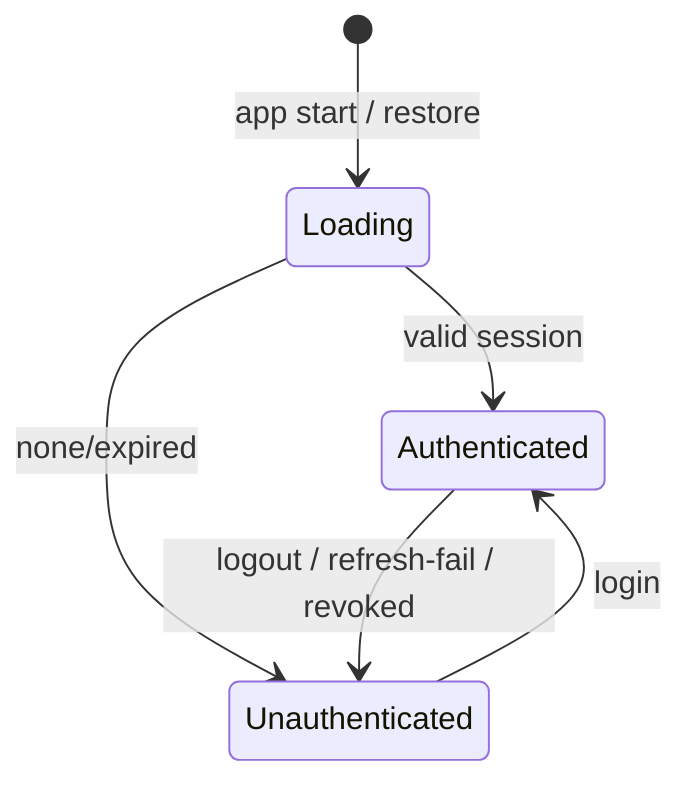

# Session Management (Storage, Guards, Logout, Lifecycle)

> Session management ties it all together: securely store tokens, expose **reactive auth state** that drives route guards and UI, refresh transparently, and **fully clear** everything on logout/expiry — behind a single `AuthRepository` the app depends on.

## Introduction

The capstone concept: the end-to-end session lifecycle. This file integrates secure storage ([15](../15%20Local%20Storage/secure_storage.md)), the refresh interceptor ([token_auth_jwt.md](token_auth_jwt.md)), route guards ([13 · guards_and_redirects](../13%20Routing/guards_and_redirects.md)), and reactive auth state ([11](../11%20State%20Management/README.md)) into one coherent, testable auth backbone.

## Why this concept exists

Auth pieces (login, storage, refresh, guards, logout) must work as a *system*. Gaps — tokens not cleared on logout, guards not reacting to state, no expiry handling — cause security and UX bugs. Centralizing the session lifecycle in an `AuthRepository` + reactive state makes it correct and testable.

## Real-world analogy

A **hotel front desk**: check-in issues a keycard (login→token), the desk tracks your status (auth state), doors read your card (guards), the card auto-renews if you extend (refresh), and checkout deactivates it everywhere (logout clears session). One system, one source of truth.

## Problem Statement

Wire: login stores tokens → app exposes `Stream<AuthState>` → guards redirect by state → requests auto-attach/refresh tokens → logout clears tokens + resets state → app restart restores session if valid. You'll assemble the `AuthRepository`-centered lifecycle.

## Internal Working

```mermaid
flowchart TD
    Login[login()] --> Save[TokenStore.save (secure)] --> State[emit Authenticated]
    Start[app start] --> Restore[read tokens -> valid? emit Authenticated : Unauthenticated]
    State --> Guard[router redirect (refreshListenable)]
    Req[requests] --> Interceptor[attach + auto-refresh]
    Interceptor -->|refresh fails| Logout
    Logout[logout()] --> Clear[TokenStore.clear] --> State2[emit Unauthenticated]
```

- **`AuthRepository`** (single source of truth): `login()`, `logout()`, `currentUser`, and a `Stream<AuthState>`/`Listenable` others observe.
- **Storage**: tokens in **secure storage** ([15 · secure_storage](../15%20Local%20Storage/secure_storage.md)); on startup, read + validate (expiry/refresh) to restore or clear the session.
- **Reactive state**: expose `AuthState` (sealed: `Authenticated`/`Unauthenticated`/`Loading`); feed it to the router's `refreshListenable` so login/logout re-route instantly ([13 · guards_and_redirects](../13%20Routing/guards_and_redirects.md)).
- **Auto-refresh**: the interceptor handles token expiry transparently; on refresh failure it triggers **logout** ([token_auth_jwt.md](token_auth_jwt.md)).
- **Logout**: clear **all** tokens/secrets, reset auth state, clear user-scoped caches/DI scopes ([14 · scopes_and_lifetimes](../14%20Dependency%20Injection/scopes_and_lifetimes.md)), and navigate to login.
- **Expiry/idle**: handle server-side revocation (401 that can't refresh) and optional idle timeout; re-lock with biometrics if configured ([biometric_auth.md](biometric_auth.md)).

## Memory Representation

Tokens: encrypted in secure storage; briefly in memory when used. Auth state is a small in-memory object broadcast to listeners. Clear user-scoped memory on logout to prevent leaks/data bleed ([08 · dispose_and_leaks](../08%20Widget%20Lifecycle/dispose_and_leaks.md)).

## Compiler Behavior

Sealed `AuthState` enables exhaustive UI/guard handling ([02 · records_and_patterns](../02%20Advanced%20Dart/records_and_patterns.md)).

## Runtime Behavior

State changes notify the router (re-run guards) and rebuild auth-dependent UI. Startup restores or clears the session; logout resets everything; refresh failure funnels to logout.

## Flutter Engine Behavior / Dart VM Behavior

Not applicable.

## Examples

```dart
// Reactive auth state + repository (single source of truth)
sealed class AuthState { const AuthState(); }
class AuthLoading extends AuthState { const AuthLoading(); }
class Authenticated extends AuthState { final String userId; const Authenticated(this.userId); }
class Unauthenticated extends AuthState { const Unauthenticated(); }

abstract interface class TokenStore {
  Future<String?> get accessToken;
  Future<void> save({required String access, required String refresh});
  Future<void> clear();
}

class AuthRepository {
  final TokenStore _store;
  final _controller = // broadcast auth state
      // ignore: prefer_const_constructors
      _StateController();
  AuthRepository(this._store);

  Stream<AuthState> get state => _controller.stream;

  Future<void> restore() async {                 // app startup
    final token = await _store.accessToken;
    _controller.emit(token != null ? const Authenticated('me') : const Unauthenticated());
    // (validate/refresh expiry in production)
  }

  Future<void> login(String user, String pass) async {
    _controller.emit(const AuthLoading());
    // ... call API, get tokens ...
    await _store.save(access: 'access', refresh: 'refresh'); // secure storage
    _controller.emit(const Authenticated('me'));
  }

  Future<void> logout() async {
    await _store.clear();                         // clear ALL tokens
    // clear user-scoped caches / DI session scope here
    _controller.emit(const Unauthenticated());
  }
}

// minimal broadcast controller stand-in
class _StateController {
  final _c = // StreamController.broadcast in real code
      <void Function(AuthState)>[];
  final List<AuthState> _last = [const AuthLoading()];
  Stream<AuthState> get stream async* { yield _last.last; }
  void emit(AuthState s) => _last.add(s);
}
```

```dart
// Router integration (go_router): refreshListenable = auth state,
// redirect: unauthenticated -> /login; authenticated on /login -> /home
// (see 13/guards_and_redirects.md). Logout() emits Unauthenticated -> auto-redirect.
```

## Diagrams



## Common Mistakes

| Mistake | Why | Fix |
|---------|-----|-----|
| Logout that leaves tokens/caches | Security leak, "ghost login" | Clear tokens + user-scoped caches + DI session scope |
| Guards not reacting to auth changes | Stale routing | Drive guards via `refreshListenable`/state stream |
| No session restore on startup | Forces re-login every launch | Read/validate tokens at startup |
| Auth state scattered across app | Inconsistent | Single `AuthRepository` source of truth |
| Not handling refresh-failure/revocation | Stuck/insecure session | Funnel to logout on unrecoverable 401 |
| User data persisting across accounts | Data bleed | Scope caches to session; clear on logout |

## Best Practices

- Centralize the lifecycle in an **`AuthRepository`** with a reactive `AuthState` (single source of truth).
- Store tokens in **secure storage**; **restore/validate** on startup; **auto-refresh** transparently.
- Drive **guards + UI** from auth state (`refreshListenable`); login/logout re-route instantly.
- On logout/expiry/revocation: **clear all tokens, user-scoped caches, and DI session scope**, then route to login.
- Consider **biometric re-lock** and optional **idle timeout** for sensitive apps.
- Keep it **testable**: inject `TokenStore`/API; assert state transitions.

## Performance

Session ops are infrequent (login/refresh/logout); reactive state changes are cheap. Clearing caches/scopes on logout prevents memory bleed ([Module 21](../21%20Performance/README.md)).

## Advantages / Disadvantages

- **+** Coherent, secure, reactive session; instant guard/UI updates; clean logout; restore-on-launch; testable.
- **−** Several moving parts to integrate correctly; must be disciplined about clearing everything and handling edge cases (revocation, multi-account).

## Interview Questions

1. **🟢 What does session management encompass?** — Storing tokens, exposing auth state, guarding routes, refreshing, and clearing everything on logout/expiry.
2. **🟢 Where should the session's source of truth live?** — In a single `AuthRepository` exposing reactive `AuthState`.
3. **🟡 How do guards react to login/logout instantly?** — The router's `refreshListenable` observes auth state; state changes re-run redirects ([13](../13%20Routing/guards_and_redirects.md)).
4. **🟡 What must logout do?** — Clear all tokens/secrets, reset auth state, clear user-scoped caches/DI session scope, and route to login.
5. **🟡 How is a session restored on app launch?** — Read tokens from secure storage, validate/refresh expiry, then emit `Authenticated`/`Unauthenticated`.
6. **🔴 How do refresh failure and server revocation flow through the system?** — An unrecoverable 401 triggers logout (clear + `Unauthenticated`), which re-routes to login via guards.
7. **🔴 How do you prevent data bleed between accounts?** — Scope caches/DI to the session and clear them on logout so the next user starts clean.

## Senior Engineer Tips

- Make **logout ruthless**: one method that clears tokens, caches, DI session scope, and in-memory state — audited so nothing lingers.
- Drive *everything* auth-related off the single `AuthState` stream; avoid duplicate auth flags scattered around.
- Test the full lifecycle (login→restore→refresh→logout→revocation) with injected fakes; these transitions are where bugs hide.

## Architect Perspective

Session management is the integration point of the entire auth stack — storage, tokens/refresh, guards, and reactive state — centralized in an `AuthRepository`. A single-source-of-truth, reactive, ruthlessly-clearing session lifecycle is a security and UX cornerstone that composes with routing, DI scopes, offline, and monitoring ([Modules 13, 14, 19, 52](../13%20Routing/guards_and_redirects.md)).

## Summary

- Centralize the session lifecycle in an `AuthRepository` with reactive `AuthState`.
- Secure-store tokens, restore on startup, auto-refresh, and drive guards/UI from state.
- Logout/expiry clears everything (tokens + caches + DI scope) and re-routes to login; keep it testable.

## Revision Notes

- `AuthRepository` = single source of truth; `Stream<AuthState>` (sealed) drives guards (`refreshListenable`) + UI.
- Tokens in secure storage; restore/validate on startup; auto-refresh; refresh-fail/revoke → logout.
- Logout clears tokens + user caches + DI session scope + state → route to login.
- Optional biometric re-lock/idle timeout; test the full lifecycle with fakes.

## Practice Questions

1. What are all the things logout must clear?
2. How do route guards respond instantly to login/logout?
3. How is a valid session restored on app restart?

## Coding Questions

1. Build an `AuthRepository` (login/logout/restore) emitting `AuthState`, backed by a secure `TokenStore`.
2. Wire it to `go_router` guards via `refreshListenable`.
3. Test transitions: login→authenticated, logout→unauthenticated, refresh-fail→logout.

## Mini Project — Module capstone

**End-to-end session (Flutter):** Assemble the full auth backbone: `AuthRepository` (reactive `AuthState`) + secure `TokenStore` + refresh interceptor ([token_auth_jwt.md](token_auth_jwt.md)) + `go_router` guards ([13](../13%20Routing/guards_and_redirects.md)) + optional biometric unlock ([biometric_auth.md](biometric_auth.md)). Login stores tokens; startup restores; guards react; refresh-failure/logout clears everything (tokens + caches + DI scope) and routes to login. Test the lifecycle with fakes. Acceptance: single source of truth; secure storage; reactive guards; ruthless logout; session restore; tests pass.
