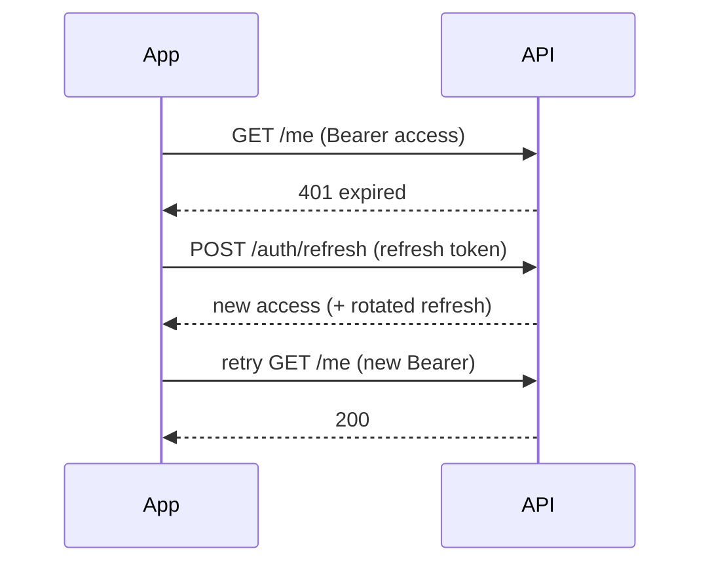

# Token-Based Auth (JWT, Access/Refresh, Auto-Refresh)

> A **JWT** is a signed, self-contained token carrying claims (user id, roles, expiry); apps use a short-lived **access token** for requests plus a longer-lived **refresh token** to obtain new access tokens — with an interceptor that auto-refreshes on 401 so the user never sees it.

## Introduction

The dominant mobile auth pattern: login returns an **access token** (short expiry) + **refresh token** (longer). Requests carry the access token; when it expires, a refresh flow silently exchanges the refresh token for a new access token. This file covers JWT structure, the access/refresh model, and the auto-refresh interceptor.

## Why this concept exists

Long-lived access tokens are dangerous if leaked; very short ones would force constant re-login. The access+refresh split gives **short-lived risk exposure** for access tokens plus a **seamless UX** via refresh — the practical balance for stateless mobile auth ([auth_fundamentals.md](auth_fundamentals.md)).

## Real-world analogy

An **event wristband that expires hourly** (access token) plus a **membership card** (refresh token): when the wristband expires, you quietly show your membership card at a kiosk to get a fresh wristband — without leaving the event or re-registering.

## Problem Statement

Login yields access+refresh tokens; requests attach the access token; when it expires (401), the app must refresh and retry transparently, and force re-login if refresh fails. You'll implement the model + auto-refresh interceptor.

## Internal Working

```mermaid
flowchart TD
    Login[login] --> Tokens[access (short) + refresh (long)]
    Tokens --> Store[secure storage]
    Req[request] --> Attach[attach access token]
    Attach --> API
    API -->|401 expired| Refresh[POST refresh-token -> new access]
    Refresh -->|success| Retry[retry original request]
    Refresh -->|fail| Relogin[clear session -> login]
```

- **JWT structure**: `header.payload.signature` (base64url) — payload holds **claims** (`sub`, `exp`, `roles`, etc.); the signature (server's secret/key) verifies integrity. **Never trust an unverified JWT client-side for security; the server verifies.** You may read `exp`/claims client-side for UX, but don't rely on it for authorization.
- **Access token**: short-lived (minutes), sent as `Authorization: Bearer`. Limits damage if leaked.
- **Refresh token**: longer-lived, stored securely, used only to get new access tokens (often rotated on use).
- **Auto-refresh flow** (interceptor — [16 · rest_client_and_interceptors](../16%20Networking/rest_client_and_interceptors.md)): on a 401, call the refresh endpoint, save the new access token, retry the original request **once**; on refresh failure, clear the session and route to login. Guard against **concurrent refreshes** (queue in-flight requests) and **infinite loops**.
- **Storage**: both tokens in **secure storage**, never prefs/logs ([15 · secure_storage](../15%20Local%20Storage/secure_storage.md)).

## Memory Representation

Tokens are small strings held briefly in memory when read; persisted encrypted in secure storage. Don't log them ([Module 37](../37%20Security/README.md)).

## Compiler Behavior

Not applicable.

## Runtime Behavior

Each request attaches the access token; a 401 triggers refresh+retry; simultaneous 401s must share one refresh (lock/queue) to avoid multiple refreshes. Refresh failure → logout.

## Flutter Engine Behavior / Dart VM Behavior

Not applicable.

## Examples

```dart
import 'package:dio/dio.dart';

abstract interface class TokenStore {          // backed by secure storage (Module 15)
  Future<String?> get accessToken;
  Future<String?> get refreshToken;
  Future<void> save({required String access, required String refresh});
  Future<void> clear();
}

class AuthInterceptor extends Interceptor {
  final Dio dio;                 // a bare dio for refresh (no interceptor loop)
  final TokenStore store;
  final Future<void> Function() onSessionExpired; // e.g., route to login
  bool _refreshing = false;
  AuthInterceptor(this.dio, this.store, this.onSessionExpired);

  @override
  void onRequest(RequestOptions options, RequestInterceptorHandler handler) async {
    final token = await store.accessToken;
    if (token != null) options.headers['Authorization'] = 'Bearer $token';
    handler.next(options);
  }

  @override
  void onError(DioException err, ErrorInterceptorHandler handler) async {
    // Only handle 401, and avoid refreshing the refresh call itself:
    final is401 = err.response?.statusCode == 401;
    final isRefreshCall = err.requestOptions.path.contains('/refresh');
    if (!is401 || isRefreshCall) return handler.next(err);

    try {
      final newAccess = await _refresh();      // shared/guarded refresh
      // retry original request with the new token (once):
      final req = err.requestOptions..headers['Authorization'] = 'Bearer $newAccess';
      final res = await dio.fetch(req);
      return handler.resolve(res);
    } catch (_) {
      await store.clear();
      await onSessionExpired();                // force re-login
      return handler.next(err);
    }
  }

  Future<String> _refresh() async {
    // (guard concurrent refreshes with a lock/queue in production)
    final refresh = await store.refreshToken;
    if (refresh == null) throw StateError('no refresh token');
    final res = await dio.post('/auth/refresh', data: {'refresh_token': refresh});
    final access = res.data['access_token'] as String;
    final newRefresh = res.data['refresh_token'] as String; // rotation
    await store.save(access: access, refresh: newRefresh);
    return access;
  }
}
```

## Diagrams



## Common Mistakes

| Mistake | Why | Fix |
|---------|-----|-----|
| Long-lived access tokens | Big damage if leaked | Short access + refresh |
| Refreshing on every 401 without guarding concurrency | Multiple refreshes / race | Single in-flight refresh (lock/queue) |
| Refresh loop (refresh call 401s) | Infinite loop | Exclude the refresh endpoint from the interceptor |
| Tokens in prefs/logs | Leak | Secure storage; never log tokens |
| Trusting client-decoded JWT for AuthZ | Bypassable | Server verifies; client claims are UX only |
| Not clearing tokens on refresh failure | Stuck/insecure session | Clear + route to login |

## Best Practices

- Use **short-lived access + longer refresh**; **rotate** refresh tokens on use.
- Auto-refresh in an **interceptor**: on 401 → refresh → retry once; exclude the refresh call; **serialize concurrent refreshes**.
- Store both tokens in **secure storage**; never log them.
- On refresh failure, **clear the session** and route to login (drive via reactive auth state + guards — [13](../13%20Routing/guards_and_redirects.md)).
- Treat client-decoded claims as **UX-only**; the server is the authority.

## Performance

Refresh happens rarely (only on expiry); serialized refresh avoids redundant calls. Negligible overhead; improves UX by hiding token expiry ([Module 21](../21%20Performance/README.md)).

## Advantages / Disadvantages

- **+** Stateless/scalable, seamless UX (silent refresh), limited leak exposure (short access), server-verifiable.
- **−** Refresh flow complexity (concurrency/loops), revocation still hard (short expiry mitigates), must store securely.

## Interview Questions

1. **🟢 What is a JWT?** — A signed, self-contained token (`header.payload.signature`) carrying claims (user id, roles, expiry); the server verifies the signature.
2. **🟢 Why access + refresh tokens?** — Short-lived access limits leak damage; a longer refresh token silently gets new access tokens for seamless UX.
3. **🟡 How does auto-refresh work?** — An interceptor catches 401, calls the refresh endpoint, saves the new access token, and retries the original request once; on failure it forces re-login.
4. **🟡 How do you avoid multiple concurrent refreshes?** — Serialize refresh (a lock/queue) so simultaneous 401s share one refresh call.
5. **🟡 Where are tokens stored, and where verified?** — Stored in secure storage on-device; verified server-side (client-decoded claims are UX-only).
6. **🔴 How do you prevent a refresh loop?** — Exclude the refresh endpoint from the auth interceptor and cap retries; on refresh 401, log out.
7. **🔴 How is revocation handled with stateless JWTs?** — Short access expiry + refresh rotation, plus optional server-side refresh-token blacklist/rotation to invalidate stolen refresh tokens.

## Senior Engineer Tips

- Get the **concurrency-guarded refresh** right early (queue in-flight requests, single refresh) — it's the #1 bug source.
- Rotate refresh tokens and detect reuse (a rotated token used twice = likely theft → revoke).
- Never log tokens; put refresh + storage behind an `AuthRepository`/`TokenStore` so the flow is centralized and testable.

## Architect Perspective

The access/refresh JWT pattern with an auto-refresh interceptor is the standard stateless mobile auth backbone: it balances security (short exposure, rotation) and UX (silent refresh), integrates with secure storage, interceptors, guards, and reactive auth state, and keeps servers stateless/scalable ([Modules 15, 16, 13, 37](../16%20Networking/rest_client_and_interceptors.md)).

## Summary

- JWT = signed claims; use short-lived access + longer refresh, both in secure storage.
- Auto-refresh via interceptor: 401 → refresh → retry once; guard concurrency + loops; logout on failure.
- Server verifies tokens; client claims are UX-only; rotate refresh tokens.

## Revision Notes

- JWT: header.payload.signature; claims (`sub`/`exp`/roles); server verifies.
- Access (short, Bearer) + refresh (long, rotated) → secure storage; never log.
- Interceptor: 401 → refresh (exclude refresh call, serialize) → retry once; fail → clear + login.
- Client claims = UX only; revocation via short expiry + rotation/blacklist.

## Practice Questions

1. Why short-lived access tokens?
2. How do you prevent concurrent-refresh races and refresh loops?
3. Why not trust a client-decoded JWT for authorization?

## Coding Questions

1. Implement an `AuthInterceptor` doing 401→refresh→retry-once (excluding the refresh call).
2. Add a lock so concurrent 401s trigger a single refresh.
3. Force logout (clear tokens + route to login) on refresh failure.

## Mini Project

**JWT session flow (Flutter):** Build a `TokenStore` (secure storage) + `AuthInterceptor` implementing access/refresh with concurrency-guarded auto-refresh, retry-once, refresh-call exclusion, and logout-on-failure; drive route guards from reactive auth state. Test 401→refresh→retry and refresh-failure→logout with a mocked `dio`. Acceptance: tokens secure; single guarded refresh; no loops; logout clears session; tests pass.
