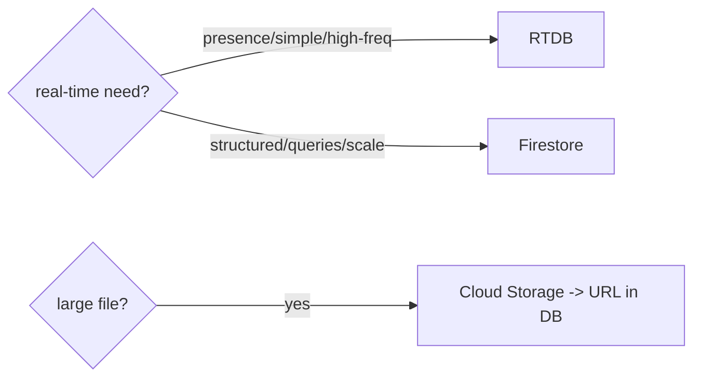

# Realtime Database & Cloud Storage

> **Realtime Database** is Firebase's original JSON-tree database — great for simple, high-frequency real-time sync (presence, live counters); **Cloud Storage** stores large files (images, videos, uploads) with resumable transfers and security rules.

## Introduction

Two more Firebase services: **Realtime Database (RTDB)** — a single JSON tree with low-latency sync — and **Cloud Storage** — object storage for blobs. This file covers when to use RTDB vs Firestore, and how to upload/download files with Storage, plus their security rules.

## Why this concept exists

Not everything fits Firestore. RTDB excels at simple, very-frequent real-time updates (presence, live scores) with lower latency and a different pricing model. Cloud Storage exists because databases shouldn't hold large binaries — files go to object storage with URLs referenced from the DB.

## Real-world analogy

RTDB is a **shared live whiteboard** (one big tree everyone sees update instantly); Firestore is an **organized filing cabinet** (structured docs). Cloud Storage is the **warehouse** for big crates (files) — the filing cabinet just holds the shipping label (download URL).

## Problem Statement

Track user **presence** (online/offline, high-frequency) and let users **upload a profile photo**. You'll use RTDB for presence and Cloud Storage for the image, storing its URL in the DB.

## Internal Working

```mermaid
flowchart TD
    subgraph RTDB
      Tree[single JSON tree] --> Ref[ref('status/uid')]
      Ref --> Listen[onValue: real-time Stream]
      Ref --> OnDisconnect[onDisconnect() -> set offline]
    end
    subgraph Storage
      Up[putFile/putData -> resumable upload] --> URL[getDownloadURL()]
      URL --> DB[store URL in Firestore/RTDB]
    end
```

- **Realtime Database** (`firebase_database`): one JSON tree; `ref(path)` → `set/update/push`; `onValue`/`onChildAdded` streams; **`onDisconnect()`** for presence (auto-write on disconnect). Lower latency, simpler queries than Firestore, priced by bandwidth/storage (not per-read). Best for **presence, live counters, simple high-frequency sync**.
- **RTDB vs Firestore**: RTDB = one tree, limited querying, cheaper for high-frequency small updates; Firestore = structured collections, richer queries/scaling, per-read billing. Prefer **Firestore** for most apps; RTDB for presence/simple real-time.
- **Cloud Storage** (`firebase_storage`): `ref(path).putFile/putData()` returns an `UploadTask` (progress, pause/resume); `getDownloadURL()` yields a shareable URL to store in the DB; `getData`/`writeToFile` to download. Handles large files, resumable transfers.
- **Security rules**: both have server-side rules (Storage rules gate by `request.auth`/path; RTDB rules by path/auth) — the real access control.

## Memory Representation

RTDB snapshots hold tree data in memory; Storage streams bytes (don't load huge files fully — stream). Store only **URLs** (not blobs) in the DB ([15 · file_storage](../15%20Local%20Storage/04_file_storage.md)).

## Compiler Behavior

Not applicable.

## Runtime Behavior

RTDB `onValue` emits on any change under the path; `onDisconnect` executes server-side when the client drops. Storage uploads/downloads report progress via task streams; failures need retry/error handling.

## Flutter Engine Behavior / Dart VM Behavior

Not applicable beyond async/streams.

## Examples

```dart
import 'dart:io';
import 'package:firebase_database/firebase_database.dart';
import 'package:firebase_storage/firebase_storage.dart';

// --- Realtime Database: presence ---
class PresenceService {
  final _db = FirebaseDatabase.instance;
  void goOnline(String uid) {
    final ref = _db.ref('status/$uid');
    ref.set({'state': 'online', 'lastSeen': ServerValue.timestamp});
    ref.onDisconnect().set({'state': 'offline', 'lastSeen': ServerValue.timestamp});
  }
  Stream<bool> watchOnline(String uid) =>
      _db.ref('status/$uid/state').onValue.map((e) => e.snapshot.value == 'online');
}

// --- Cloud Storage: upload profile photo, store URL ---
class StorageService {
  final _storage = FirebaseStorage.instance;
  Future<String> uploadProfilePhoto(String uid, File file) async {
    final ref = _storage.ref('users/$uid/profile.jpg');
    final task = ref.putFile(file);                 // resumable upload
    task.snapshotEvents.listen((s) {
      // progress: s.bytesTransferred / s.totalBytes
    });
    await task;
    return ref.getDownloadURL();                     // store this URL in Firestore/RTDB
  }
}
```

```text
// storage.rules: only the owner can write their folder
match /users/{uid}/{file=**} {
  allow read: if request.auth != null;
  allow write: if request.auth != null && request.auth.uid == uid;
}
```

## Diagrams



## Common Mistakes

| Mistake | Why | Fix |
|---------|-----|-----|
| Storing files/blobs in a database | Bloat, cost, limits | Cloud Storage; store the URL |
| Using RTDB for complex queries | Limited querying | Use Firestore for structured/queried data |
| No presence `onDisconnect()` | Stale "online" forever | Use `onDisconnect()` to set offline |
| Weak Storage/RTDB rules | Public data/files | Path + auth rules (owner-only writes) |
| Loading huge downloads into memory | OOM/jank | Stream to file; download at need |
| Leaking service types to UI | Coupling | Wrap in repositories |

## Best Practices

- Use **Firestore by default**; reach for **RTDB** for presence/live counters/simple high-frequency sync (use `onDisconnect()`).
- Store **files in Cloud Storage**, keep only **download URLs** in the DB; stream large transfers with progress.
- Write **strict rules** for both (owner/path/auth); rules are the security boundary.
- Wrap both behind **repositories**; handle upload/download errors + retries.
- Consider CDN/caching for served files; downscale images before upload ([07 · images](../07%20Widgets/07_images_and_assets.md)).

## Performance

RTDB is low-latency for small frequent updates; Storage handles large files with resumable/parallel transfers. Store URLs (not blobs) in the DB; stream big downloads; cache served images ([Module 21](../21%20Performance/README.md)).

## Advantages / Disadvantages

- **+ RTDB:** low latency, simple real-time, presence, cheaper high-frequency. **+ Storage:** large files, resumable, secure, URL-based.
- **− RTDB:** one tree, weak queries, easy to structure poorly. **− Storage:** must manage URLs/lifecycle/costs; both add lock-in.

## Interview Questions

1. **🟢 RTDB vs Firestore?** — RTDB is a single JSON tree, low-latency, limited queries, priced by bandwidth — best for presence/simple real-time; Firestore is structured, richer queries/scaling, per-read billing — the default for most data.
2. **🟢 What is Cloud Storage for?** — Storing large files/blobs (images, videos, uploads) with resumable transfers and rules; the DB holds the download URL.
3. **🟡 How do you implement presence?** — RTDB `onDisconnect()` sets the user offline server-side when the client drops; `onValue` streams status.
4. **🟡 Why store URLs, not files, in the database?** — Databases aren't for large binaries (cost/limits); Storage holds the file, DB references its URL.
5. **🟡 How do you track upload progress?** — Listen to the `UploadTask.snapshotEvents` (`bytesTransferred/totalBytes`).
6. **🔴 Where is access control for RTDB/Storage?** — Server-side security rules (path + `request.auth`), e.g., owner-only writes — not the client.
7. **🔴 When would you pick RTDB over Firestore despite Firestore being newer?** — Very-high-frequency, low-latency, simple real-time (presence/live counters) where RTDB's model/pricing fit better.

## Senior Engineer Tips

- Default to Firestore; add RTDB only for presence/live-counter use cases where its latency/pricing win.
- Always downscale/validate images before upload and stream large downloads; store CDN-friendly URLs.
- Test Storage/RTDB rules (emulator); owner/path scoping prevents cross-user data/file access.

## Architect Perspective

RTDB and Storage complement Firestore: RTDB for ephemeral high-frequency real-time (presence), Storage for blobs referenced by URL. Behind repositories with strict rules, they compose into a cost-effective, secure backend; choosing among RTDB/Firestore/Storage per data shape is a key architectural call ([03_firestore.md](03_firestore.md), [Module 37](../37%20Security/README.md)).

## Summary

- RTDB: JSON-tree, low-latency real-time (presence via `onDisconnect`); Firestore is the structured default.
- Cloud Storage: large files with resumable transfers; store URLs in the DB, not blobs.
- Secure both with server-side rules; wrap in repositories; stream large transfers.

## Revision Notes

- RTDB (JSON tree, `onValue`/`onDisconnect`, presence/high-freq, bandwidth-priced) vs Firestore (structured, per-read).
- Storage: `putFile`/`putData` (resumable, progress) → `getDownloadURL()` → store URL in DB.
- Rules (path + `request.auth`) = security; owner-only writes.
- Store URLs not blobs; stream big files; wrap in repositories.

## Practice Questions

1. When choose RTDB over Firestore?
2. Why store a file's URL in the DB, not the file itself?
3. How does presence use `onDisconnect()`?

## Coding Questions

1. Implement presence with RTDB (`onDisconnect` + `onValue`).
2. Upload a photo to Storage with progress and store its URL.
3. Write Storage rules allowing only the owner to write their folder.

## Mini Project

**Presence + profile photo (Flutter):** Build a `PresenceService` (RTDB `onDisconnect`) streaming online status and a `StorageService` uploading a (downscaled) profile photo with progress, storing the URL in Firestore. Add owner-only Storage rules. Acceptance: presence updates in real time; upload with progress; URL stored (not blob); rules scoped; runs (emulator ok).
