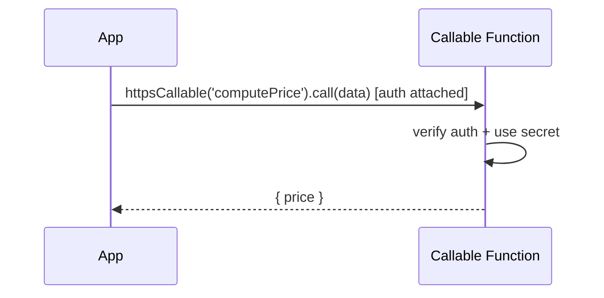

# Cloud Functions

> Cloud Functions run your backend code serverlessly in response to **triggers** (Firestore/Auth/Storage events, HTTPS) or **callable** functions invoked from the app — the place for trusted server-side logic (secrets, validation, fan-out, third-party calls) that must not live on the client.

## Introduction

Cloud Functions (deployed via the Firebase CLI, written in JS/TS/Python) execute server-side. Flutter apps call **callable functions** (`cloud_functions` package) or trigger **event functions** (on document create, user signup, file upload). This file covers when/why to use them, callable vs triggers, and security.

## Why this concept exists

Some logic must be trusted and server-side: using secret API keys, validating/sanitizing writes, sending notifications, charging payments, aggregating data, or calling third-party services. Putting these on the client is insecure/unreliable. Functions provide serverless backend compute integrated with Firebase.

## Real-world analogy

Cloud Functions are **automated back-office staff**: some react to events ("when a new order file arrives, process it" — triggers), others handle direct requests ("compute my quote" — callable). They work behind a locked door (server) with access to the safe (secrets) the public (client) can't reach.

## Problem Statement

When a user signs up, create their profile doc and send a welcome notification (trigger); and let the app request a server-computed price using a secret pricing key (callable). You'll use an Auth/Firestore trigger and a callable function.

## Internal Working

```mermaid
flowchart TD
    subgraph Triggers (event-driven)
      Signup[onUserCreate] --> CreateProfile[write profile doc + send FCM]
      DocWrite[onDocumentCreated] --> FanOut[aggregate/notify]
      Upload[onObjectFinalized] --> Process[resize image]
    end
    subgraph Callable (request/response)
      App -->|httpsCallable('price')| Fn[verify auth + use secret -> return result]
    end
```

- **Trigger functions** (background, event-driven): run on Firebase events — Auth (`onUserCreate`), Firestore (`onDocumentCreated/Updated`), Storage (`onObjectFinalized`), Pub/Sub/schedule. Used for fan-out, aggregation, notifications, post-processing.
- **Callable functions** (`onCall`): invoked from the app via `FirebaseFunctions.instance.httpsCallable('name').call(data)`; Firebase passes the caller's **auth context** automatically (verify it). Return typed JSON.
- **HTTPS functions** (`onRequest`): plain HTTP endpoints (webhooks, REST) — no auto auth context.
- **Security**: **verify auth/permissions inside the function** (callable gives `context.auth`); never trust client input; keep **secrets** in function config/Secret Manager (never in the app).
- **Deployment**: `firebase deploy --only functions`; functions run in the cloud (Node/Python), not in Dart.
- **Cold starts/cost**: serverless functions have cold-start latency and per-invocation cost; keep them lean.

## Memory Representation

Functions run server-side (not in the app); the Flutter side only sends/receives JSON. Callable results map to domain models in a repository ([05 · repository](../05%20Design%20Patterns/20_repository.md)).

## Compiler Behavior

Not applicable to Flutter (functions are JS/TS/Python); the Dart side is a typed call/result.

## Runtime Behavior

Callables are async network calls (handle errors/cold starts/timeouts). Triggers run asynchronously after events; they can retry (make idempotent). HTTPS/webhooks need their own auth.

## Flutter Engine Behavior / Dart VM Behavior

Not applicable.

## Examples

```dart
// Flutter side: call a callable function
import 'package:cloud_functions/cloud_functions.dart';

class PricingRepository {
  final FirebaseFunctions _functions;
  PricingRepository([FirebaseFunctions? f]) : _functions = f ?? FirebaseFunctions.instance;

  Future<double> quote(String sku, int qty) async {
    final callable = _functions.httpsCallable('computePrice');
    final result = await callable.call({'sku': sku, 'qty': qty}); // auth passed automatically
    return (result.data['price'] as num).toDouble(); // map result -> domain
  }
}
```

```js
// Server side (functions/index.js) — trusted logic, secrets stay here:
const { onCall } = require('firebase-functions/v2/https');
const { onUserCreated } = require('firebase-functions/v2/auth'); // illustrative

// Callable: verify auth + use a secret pricing key
exports.computePrice = onCall((request) => {
  if (!request.auth) throw new Error('unauthenticated'); // verify caller
  const { sku, qty } = request.data;
  const price = lookupPrice(sku) * qty; // uses server-only secret/config
  return { price };
});

// Trigger: create profile + welcome on signup
exports.onSignup = onUserCreated(async (event) => {
  const uid = event.data.uid;
  await createProfileDoc(uid);   // fan-out
  await sendWelcomeNotification(uid); // FCM
});
```

## Diagrams



## Common Mistakes

| Mistake | Why | Fix |
|---------|-----|-----|
| Putting secret keys/logic on the client | Exposed/insecure | Move to Cloud Functions (secrets in config) |
| Not verifying auth in callables | Anyone can invoke | Check `request.auth`/permissions |
| Non-idempotent triggers | Retries duplicate effects | Make triggers idempotent |
| Ignoring cold starts/timeouts | Slow/failed calls | Keep functions lean; handle timeouts client-side |
| Trusting client input | Injection/abuse | Validate/sanitize server-side |
| Leaking function result types to UI | Coupling | Map to entities in a repository |

## Best Practices

- Use functions for **trusted server-side logic**: secrets, validation, fan-out, notifications, payments, third-party calls.
- **Callables** for app-invoked request/response (auto auth context — verify it); **triggers** for event reactions (make **idempotent**).
- Keep **secrets server-side** (function config/Secret Manager); never in the app.
- Handle **cold starts/timeouts/errors** on the client; keep functions lean.
- Wrap callable results behind **repositories** (map to entities).

## Performance

Serverless scales automatically but has **cold-start latency** and per-invocation cost; keep functions small and warm critical paths if needed. Offload heavy/trusted work here to keep the client light ([Module 21](../21%20Performance/README.md)).

## Advantages / Disadvantages

- **+** Trusted server compute without managing servers, event-driven integration, secret-safe, scalable, integrates with FCM/Firestore.
- **−** Cold starts + cost, another language/runtime (JS/TS/Python), deployment/ops, vendor lock-in, idempotency care for triggers.

## Interview Questions

1. **🟢 What are Cloud Functions for?** — Running trusted server-side logic serverlessly in response to events (triggers) or app calls (callable/HTTPS).
2. **🟢 Callable vs trigger functions?** — Callable = app-invoked request/response with auto auth context; trigger = runs automatically on Firebase events (Auth/Firestore/Storage).
3. **🟡 Why not put secret keys/logic on the client?** — Clients are inspectable; secrets/trusted logic belong server-side in functions (config/Secret Manager).
4. **🟡 How do callables handle auth?** — Firebase passes the caller's auth context (`request.auth`); you must verify it inside the function.
5. **🟡 Why must triggers be idempotent?** — They can retry on failure; non-idempotent side effects (double-charging, duplicate notifications) would repeat.
6. **🔴 What's the cold-start tradeoff?** — First invocations after idle incur latency; keep functions lean, handle timeouts, and warm critical paths if needed.
7. **🔴 How do functions integrate with the rest of Firebase?** — Triggers react to Auth/Firestore/Storage events and can write Firestore/send FCM; callables serve the app — forming server-side glue.

## Senior Engineer Tips

- Treat callables like any API: verify auth, validate input, return typed results, and map them behind a repository.
- Make every trigger idempotent (check-then-act, dedupe keys) — retries are guaranteed eventually.
- Keep secrets and third-party calls exclusively in functions; the client should never hold API secrets.

## Architect Perspective

Cloud Functions provide the trusted server tier of a Firebase app: secure logic, secrets, validation, fan-out, and integrations — without running servers. Combined with rules (data access) they enforce security end-to-end; the tradeoffs (cold starts, lock-in, ops) are the cost of serverless. They're where payments, notifications, and cross-service orchestration belong ([Modules 31, 32, 37](../31%20Payments/README.md)).

## Summary

- Cloud Functions run trusted server-side logic via triggers (events) or callables (app requests).
- Keep secrets/validation/fan-out server-side; verify auth in callables; make triggers idempotent.
- Handle cold starts/errors; wrap results behind repositories; the client never holds secrets.

## Revision Notes

- Triggers (Auth/Firestore/Storage events, idempotent) vs callable (`httpsCallable`, auto auth context) vs HTTPS (webhooks).
- Secrets/trusted logic server-side (config/Secret Manager); verify `request.auth`; validate input.
- Cold starts + cost → lean functions; map results to entities.
- Server glue: react to events, write Firestore, send FCM.

## Practice Questions

1. When use a callable vs a trigger?
2. Why keep secret keys in functions, not the app?
3. Why must triggers be idempotent?

## Coding Questions

1. Call a callable `computePrice` from a `PricingRepository`, mapping the result.
2. Sketch an `onUserCreate` trigger that creates a profile + sends FCM.
3. Add auth verification + input validation to a callable (server pseudocode).

## Mini Project

**Server-side pricing + signup trigger (Flutter + functions):** Implement a callable `computePrice` (verifies auth, uses a server-only key) consumed by a `PricingRepository`, plus an `onUserCreate` trigger creating a profile doc and sending a welcome FCM. Acceptance: secret stays server-side; callable auth verified; trigger idempotent; result mapped to domain; client handles errors/cold starts.
