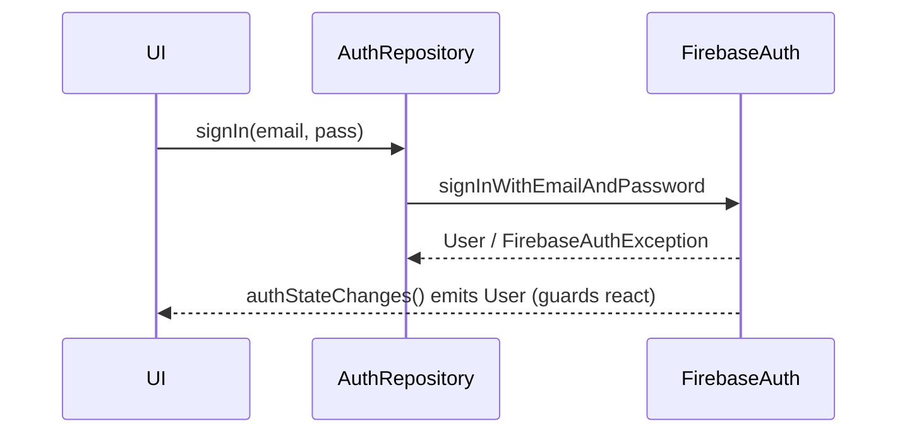

# Firebase Authentication

> `FirebaseAuth` provides managed authentication — email/password, phone, and federated providers (Google/Apple/etc.) — with a reactive `authStateChanges()` stream and server-issued ID tokens, so you get a full auth backend without running one.

## Introduction

FirebaseAuth (package: `firebase_auth`) handles sign-up/in/out, provider linking, and session persistence, exposing the current user and an auth-state stream. This file covers the providers, the reactive auth state (driving guards/UI), ID tokens, and wrapping it behind an `AuthRepository`.

## Why this concept exists

Building secure auth (password hashing, token issuance, provider integration, session persistence) is hard and risky. Firebase Auth provides it managed, integrating with the rest of Firebase (Firestore rules use `request.auth`), so teams focus on the app, not auth infrastructure.

## Real-world analogy

FirebaseAuth is an **outsourced security desk**: it checks IDs (email/password/social), issues badges (ID tokens), remembers who's inside (session persistence), and broadcasts entry/exit (auth-state stream) — you don't run the desk, you consume its decisions.

## Problem Statement

Implement email/password + Google sign-in, expose reactive auth state to drive route guards, and access the ID token for backend/Firestore. You'll use `FirebaseAuth` behind an `AuthRepository`.

## Internal Working

```mermaid
flowchart TD
    Methods[signInWithEmailAndPassword / signInWithCredential / createUser] --> FA[FirebaseAuth]
    FA --> Stream[authStateChanges() : Stream<User?>]
    FA --> Token[currentUser.getIdToken() : verified by backend/rules]
    Stream --> Guards[reactive guards + UI]
```

- **Methods**: `createUserWithEmailAndPassword`, `signInWithEmailAndPassword`, `signInWithCredential` (federated — combine with `google_sign_in`/`sign_in_with_apple` from [17 · oauth](../17%20Authentication/oauth_and_social_login.md)), `signInAnonymously`, phone auth, `sendPasswordResetEmail`, `signOut`.
- **Reactive state**: `authStateChanges()` (`Stream<User?>`) emits on sign-in/out/token refresh — feed it to your auth state / router `refreshListenable` ([17 · session_management](../17%20Authentication/session_management.md), [13 · guards](../13%20Routing/guards_and_redirects.md)).
- **ID token**: `user.getIdToken()` returns a verifiable JWT; send it to your backend (verify server-side) or rely on it in Firestore rules (`request.auth.uid`).
- **Persistence**: Firebase persists the session (auto-restores on launch) — no manual token storage needed for Firebase-only apps.
- **Errors**: `FirebaseAuthException` with codes (`wrong-password`, `email-already-in-use`, `user-not-found`) — map to domain failures.

## Memory Representation

`FirebaseAuth.instance` is a singleton; the current user + session are managed by the SDK (persisted natively). Wrap behind a repository ([05 · repository](../05%20Design%20Patterns/repository.md)).

## Compiler Behavior

Not applicable.

## Runtime Behavior

Auth methods are async and may throw `FirebaseAuthException`; `authStateChanges()` emits reactively. ID tokens auto-refresh; `getIdToken(true)` forces refresh.

## Flutter Engine Behavior

Crosses the embedder to native Firebase Auth SDKs; federated flows may open provider UIs.

## Dart VM Behavior

Not applicable.

## Examples

```dart
import 'package:firebase_auth/firebase_auth.dart';
import 'package:google_sign_in/google_sign_in.dart';

class FirebaseAuthRepository {
  final FirebaseAuth _auth;
  FirebaseAuthRepository([FirebaseAuth? auth]) : _auth = auth ?? FirebaseAuth.instance;

  // Reactive auth state -> drives guards/UI
  Stream<User?> get authState => _auth.authStateChanges();
  User? get currentUser => _auth.currentUser;

  Future<void> signUp(String email, String password) async {
    try {
      await _auth.createUserWithEmailAndPassword(email: email, password: password);
    } on FirebaseAuthException catch (e) {
      throw _mapError(e); // map to domain failure
    }
  }

  Future<void> signIn(String email, String password) async {
    try {
      await _auth.signInWithEmailAndPassword(email: email, password: password);
    } on FirebaseAuthException catch (e) {
      throw _mapError(e);
    }
  }

  Future<void> signInWithGoogle() async {
    final account = await GoogleSignIn().signIn();
    if (account == null) return; // cancelled
    final gAuth = await account.authentication;
    final cred = GoogleAuthProvider.credential(
      idToken: gAuth.idToken, accessToken: gAuth.accessToken);
    await _auth.signInWithCredential(cred); // federated sign-in
  }

  Future<String?> idToken() => _auth.currentUser?.getIdToken(); // for backend/rules
  Future<void> signOut() => _auth.signOut();

  Object _mapError(FirebaseAuthException e) => switch (e.code) {
        'wrong-password' || 'user-not-found' => 'Invalid credentials',
        'email-already-in-use' => 'Email already registered',
        _ => 'Auth error: ${e.code}',
      };
}
```

## Diagrams



## Common Mistakes

| Mistake | Why | Fix |
|---------|-----|-----|
| Manually storing Firebase tokens in secure storage | Firebase persists sessions itself | Rely on `authStateChanges()`/persistence |
| Ignoring `FirebaseAuthException` codes | Poor error UX | Map codes to domain failures |
| Trusting client `currentUser` for authorization | Spoofable | Enforce via Firestore rules / backend token verification |
| Not driving guards from `authStateChanges()` | Stale routing | Feed the stream to `refreshListenable` |
| Leaking `User`/Firebase types to UI | Lock-in/coupling | Map to a domain user in the repository |

## Best Practices

- Drive **reactive auth state** from `authStateChanges()`; feed guards/UI ([13](../13%20Routing/guards_and_redirects.md), [17 · session_management](../17%20Authentication/session_management.md)).
- Rely on Firebase's **built-in session persistence** (no manual token storage for Firebase-only apps).
- Map **`FirebaseAuthException` codes** to friendly domain failures.
- **Verify ID tokens server-side** (or via Firestore rules `request.auth`) — never trust client `currentUser` for authorization.
- Wrap in an **`AuthRepository`** mapping `User`→domain user (limit lock-in, testability).
- Combine federated sign-in with `google_sign_in`/`sign_in_with_apple` ([17 · oauth](../17%20Authentication/oauth_and_social_login.md)).

## Performance

Managed and efficient; `authStateChanges()` is a cheap stream. Token refresh is automatic. Negligible client cost.

## Advantages / Disadvantages

- **+** Managed secure auth, many providers, reactive state, built-in persistence, integrates with Firestore rules, fast to build.
- **−** Vendor lock-in, less control than custom auth, ties into the Firebase ecosystem, client user isn't an authorization source.

## Interview Questions

1. **🟢 What does `FirebaseAuth` provide?** — Managed authentication (email/phone/federated), session persistence, current user, and a reactive auth-state stream.
2. **🟢 How do you observe auth changes?** — `authStateChanges()` returns a `Stream<User?>` that emits on sign-in/out/token refresh.
3. **🟡 How do you do Google sign-in with Firebase?** — Get a Google credential (via `google_sign_in`) and call `signInWithCredential(GoogleAuthProvider.credential(...))`.
4. **🟡 Do you need to store Firebase tokens manually?** — No; Firebase persists the session and auto-restores it; use `authStateChanges()`/`currentUser`.
5. **🟡 How are auth errors surfaced?** — As `FirebaseAuthException` with codes (`wrong-password`, etc.) — map to domain failures.
6. **🔴 How is authorization enforced with Firebase Auth?** — Server-side: Firestore/Storage **security rules** using `request.auth.uid`, or backend verification of the ID token — not client `currentUser`.
7. **🔴 How do you limit lock-in?** — Wrap `FirebaseAuth` behind an `AuthRepository` mapping `User`→domain user, so the app doesn't depend on Firebase types.

## Senior Engineer Tips

- Treat `authStateChanges()` as the single source of truth for session; drive router guards + UI from it.
- Never authorize on client `currentUser`; put authorization in Firestore rules / backend token checks.
- Keep Firebase `User` out of your domain — map it in the repository so swapping auth backends is feasible.

## Architect Perspective

Firebase Auth gives a production auth backend with reactive state and ecosystem integration (rules), letting you skip auth infrastructure. Wrapped behind a repository with server-enforced authorization, it fits the same session/guard architecture as custom auth ([Module 17](../17%20Authentication/README.md)) while trading control for speed and lock-in.

## Summary

- `FirebaseAuth`: managed auth (email/phone/federated), reactive `authStateChanges()`, built-in persistence, ID tokens.
- Drive guards/UI from the auth stream; map errors; verify authorization server-side (rules/backend).
- Wrap in an `AuthRepository` (domain user) to limit lock-in and stay testable.

## Revision Notes

- Methods: email/phone/`signInWithCredential` (federated)/anonymous; `authStateChanges()` `Stream<User?>`.
- Firebase persists session (no manual storage); `getIdToken()` for backend/rules.
- Authorization via rules (`request.auth`) / backend — not client `currentUser`.
- Map `FirebaseAuthException` codes; wrap in `AuthRepository` (User→domain).

## Practice Questions

1. Why not manually store Firebase tokens?
2. How do you enforce authorization with Firebase Auth?
3. How do guards react to Firebase sign-in/out?

## Coding Questions

1. Build a `FirebaseAuthRepository` (email sign-in/up, Google, signOut, `authState`).
2. Drive `go_router` guards from `authStateChanges()`.
3. Map `FirebaseAuthException` codes to friendly messages; test with a fake.

## Mini Project

**Firebase auth (Flutter):** Implement email/password + Google sign-in behind a `FirebaseAuthRepository` mapping `User`→domain user, expose reactive auth state to `go_router` guards, map errors, and access the ID token. Acceptance: reactive guards from `authStateChanges()`; errors mapped; Firebase types wrapped; server-enforced authorization noted; runs.
