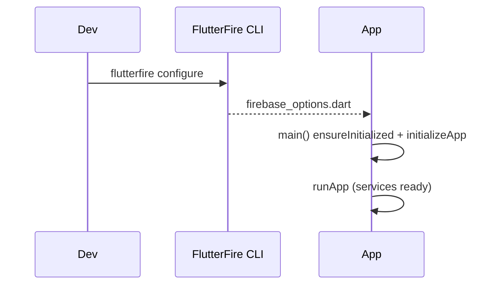

# Firebase Setup & Core (FlutterFire)

> FlutterFire is the official set of Firebase plugins for Flutter; you register your app in a Firebase project, generate config via the **FlutterFire CLI**, add `firebase_core`, and call `Firebase.initializeApp()` before `runApp` — then layer service plugins on top.

## Introduction

Every Firebase feature depends on core setup: a Firebase project, per-platform app registration, generated `firebase_options.dart`, and initialization. This file covers the setup flow, multi-environment (dev/prod) config, and initialization ordering.

## Why this concept exists

Firebase services need project credentials and platform-specific config (API keys, bundle ids). The FlutterFire CLI automates generating these into `firebase_options.dart`, avoiding manual, error-prone plist/json wrangling — and initialization must happen before any service is used.

## Real-world analogy

Setup is **connecting your appliance to utilities**: you register with the utility company (Firebase project), get a meter installed per unit (per-platform app registration), receive your account config (`firebase_options.dart`), and flip the main breaker (`initializeApp`) before anything runs.

## Problem Statement

Initialize Firebase in a Flutter app for Android + iOS with separate dev and prod projects, ensuring services are ready before the app runs. You'll use the FlutterFire CLI + `Firebase.initializeApp` with flavors.

## Internal Working

```mermaid
flowchart TD
    Project[Firebase project (dev/prod)] --> CLI[flutterfire configure]
    CLI --> Options[firebase_options.dart per platform]
    Main[main()] --> Ensure[WidgetsFlutterBinding.ensureInitialized]
    Ensure --> Init["Firebase.initializeApp(options: DefaultFirebaseOptions.currentPlatform)"]
    Init --> Services[use FirebaseAuth/Firestore/etc.]
```

- **Project + apps**: create a Firebase project; register Android (package name + SHA for some features), iOS (bundle id), web, etc.
- **FlutterFire CLI**: `flutterfire configure` generates `firebase_options.dart` (`DefaultFirebaseOptions.currentPlatform`) — no manual `google-services.json`/`GoogleService-Info.plist` copying for config (though platform files may still be needed for some services/build steps).
- **Core plugin**: `firebase_core`; add per service (`firebase_auth`, `cloud_firestore`, …).
- **Init**: in `main`, `WidgetsFlutterBinding.ensureInitialized()` then `await Firebase.initializeApp(options: ...)` **before** `runApp` ([06 · app_entry_point](../06%20Flutter%20Fundamentals/app_entry_point.md)).
- **Multi-environment (dev/prod)**: separate Firebase projects; use **build flavors** and per-flavor options (multiple `firebase_options` or `--project`/entrypoints) so dev doesn't write to prod data.

## Memory Representation

Firebase instances are singletons (`FirebaseAuth.instance`, `FirebaseFirestore.instance`); wrap them behind repositories/DI ([14 DI](../14%20Dependency%20Injection/README.md)).

## Compiler Behavior

`firebase_options.dart` is generated code (regenerate on config changes). Web vs mobile differ — the CLI handles per-platform options.

## Runtime Behavior

Using any Firebase service before `initializeApp` throws. Init is async (network/plugin setup); pre-`runApp` init adds a little startup time — keep it minimal, defer non-critical service init ([10 · embedder_and_startup](../10%20Flutter%20Architecture/embedder_and_startup.md)).

## Flutter Engine Behavior

Plugins cross the embedder to native Firebase SDKs; requires platform config (Gradle/CocoaPods) the CLI/`flutter` tooling sets up ([10 · embedder_and_startup](../10%20Flutter%20Architecture/embedder_and_startup.md)).

## Dart VM Behavior

Not applicable.

## Examples

```yaml
# pubspec.yaml
dependencies:
  firebase_core: ^3.0.0
  firebase_auth: ^5.0.0
  cloud_firestore: ^5.0.0
```

```dart
import 'package:firebase_core/firebase_core.dart';
import 'package:flutter/material.dart';
import 'firebase_options.dart'; // generated by `flutterfire configure`

Future<void> main() async {
  WidgetsFlutterBinding.ensureInitialized();      // required before async init
  await Firebase.initializeApp(
    options: DefaultFirebaseOptions.currentPlatform, // per-platform config
  );
  runApp(const MyApp());                           // now services are safe to use
}

class MyApp extends StatelessWidget {
  const MyApp({super.key});
  @override
  Widget build(BuildContext context) =>
      const MaterialApp(home: Scaffold(body: Center(child: Text('Firebase ready'))));
}
```

```text
Setup steps:
  dart pub global activate flutterfire_cli
  flutterfire configure --project=my-dev-project   # generates firebase_options.dart
  # For flavors: separate projects + per-flavor options / entrypoints (main_dev.dart, main_prod.dart)
```

## Diagrams



## Common Mistakes

| Mistake | Why | Fix |
|---------|-----|-----|
| Using services before `initializeApp` | Throws | `await Firebase.initializeApp()` first |
| Missing `ensureInitialized()` | Binding not ready | Call it before async init |
| One project for dev + prod | Dev pollutes prod data | Separate projects + flavors |
| Committing sensitive config carelessly | Some keys OK public, but rules matter | Rely on security rules + App Check ([37](../37%20Security/README.md)) |
| Heavy Firebase init blocking startup | Slow cold start | Init core only; defer non-critical services |

## Best Practices

- Use the **FlutterFire CLI** to generate/refresh `firebase_options.dart`.
- `ensureInitialized()` → `await Firebase.initializeApp()` **before** `runApp`; keep it lean.
- Use **separate Firebase projects for dev/prod** with build flavors/entrypoints.
- Wrap Firebase singletons behind **repositories/DI** to limit lock-in and enable testing.
- Rely on **security rules + App Check** (public client keys are expected; rules are the real defense — [37](../37%20Security/README.md), [observability_and_messaging.md](observability_and_messaging.md)).

## Performance

Init is a one-time startup cost; keep pre-`runApp` work minimal and defer non-critical service init post-first-frame ([10 · embedder_and_startup](../10%20Flutter%20Architecture/embedder_and_startup.md), [Module 21](../21%20Performance/README.md)).

## Advantages / Disadvantages

- **+** Fast full-stack setup, official tooling, cross-platform config automation, integrated services.
- **−** Vendor lock-in, per-platform/flavor config complexity, startup init cost, security depends on rules (not client secrecy).

## Interview Questions

1. **🟢 What is FlutterFire?** — The official set of Firebase plugins for Flutter (`firebase_core` + per-service packages).
2. **🟢 How do you initialize Firebase?** — `WidgetsFlutterBinding.ensureInitialized()` then `await Firebase.initializeApp(options: DefaultFirebaseOptions.currentPlatform)` before `runApp`.
3. **🟡 What does the FlutterFire CLI generate?** — `firebase_options.dart` with per-platform configuration (`DefaultFirebaseOptions.currentPlatform`).
4. **🟡 How do you separate dev and prod?** — Separate Firebase projects + build flavors/entrypoints with per-flavor options, so dev never writes to prod data.
5. **🟡 What happens if you use a service before init?** — It throws; initialization must complete first.
6. **🔴 Are Firebase client API keys secret?** — No — they're generally public identifiers; real security comes from **security rules** and **App Check**, not key secrecy.
7. **🔴 How do you limit Firebase lock-in?** — Wrap services behind repositories/abstractions so the domain doesn't depend on Firebase types directly.

## Senior Engineer Tips

- Keep Firebase types out of your domain — repositories map Firebase docs/results to entities so you could swap backends and stay testable ([05 · repository](../05%20Design%20Patterns/repository.md)).
- Set up dev/prod projects and flavors from day one; accidental prod writes from dev are painful.
- Defer non-critical Firebase init (analytics, remote config) until after the first frame for faster cold start.

## Architect Perspective

Firebase setup is the foundation and the lock-in decision point. Isolating Firebase behind repositories/DI, using separate environments, and treating rules/App Check as the security layer keeps the app testable, secure, and portable — essential before layering on Firestore, functions, and messaging ([firestore.md](firestore.md), [Module 37](../37%20Security/README.md)).

## Summary

- FlutterFire + `firebase_core`; generate config via the CLI; `ensureInitialized()` → `initializeApp()` before `runApp`.
- Separate dev/prod projects + flavors; wrap services behind repositories/DI.
- Client keys aren't secrets — security is rules + App Check; keep init lean.

## Revision Notes

- FlutterFire: `firebase_core` + service plugins; `flutterfire configure` → `firebase_options.dart`.
- `ensureInitialized()` → `await Firebase.initializeApp(options: currentPlatform)` before `runApp`.
- Dev/prod = separate projects + flavors/entrypoints.
- Repositories over Firebase types (lock-in/testing); security = rules + App Check (keys are public).

## Practice Questions

1. What must happen before using any Firebase service?
2. How do you keep dev writes out of prod?
3. Why aren't Firebase client keys a security concern by themselves?

## Coding Questions

1. Initialize Firebase in `main` with generated options.
2. Set up dev/prod entrypoints with per-flavor options.
3. Wrap `FirebaseAuth.instance` behind an injected repository.

## Mini Project

**Firebase bootstrap (Flutter):** Configure a Firebase project via the CLI, initialize in `main` (dev/prod entrypoints), and expose a `FirebaseService`/repository wrapping a core instance behind DI. Defer a non-critical service init post-first-frame. Acceptance: init before `runApp`; dev/prod separated; Firebase types wrapped; app runs.
