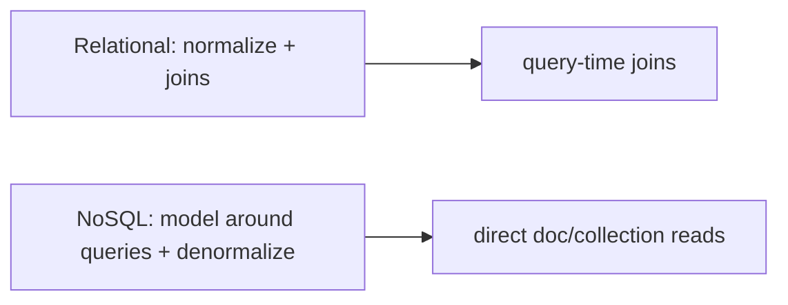

# Cloud Firestore

> Firestore is a serverless NoSQL **document/collection** database with real-time listeners, offline persistence, and **security rules** enforced server-side; you model for your queries (denormalize), stream data reactively, and pay per document read — so cost-aware modeling matters.

## Introduction

Firestore stores data as **documents** (JSON-like maps) in **collections**, supports **real-time** `snapshots()` streams, **offline** caching, and rich (but constrained) queries. This file covers data modeling, queries, real-time/offline, security rules, and cost — the make-or-break topics.

## Why this concept exists

Firestore provides a scalable, real-time, offline-capable database with no server to run and rules-based security. But NoSQL modeling differs from SQL: you **model around queries** (denormalize, avoid joins), and billing is **per read/write/delete**, so structure drives both correctness and cost.

## Real-world analogy

Firestore is a **filing system of folders (collections) holding labeled files (documents)**, some files pointing to sub-folders (subcollections). There's no cross-file "join query" like a relational DB — so you **arrange files to match how you'll look them up**, and you're charged each time you pull a file (read).

## Problem Statement

Model a chat app (users, chats, messages) for efficient queries, stream a chat's messages in real time, work offline, and secure it so users only read their own chats. You'll model collections, stream `snapshots()`, and write rules.

## Internal Working

```mermaid
flowchart TD
    Col[collection: chats] --> Doc[document: chatId {members, lastMsg}]
    Doc --> Sub[subcollection: messages] --> M[document: msgId {text, sender, ts}]
    App -->|snapshots()| Stream[real-time Stream<QuerySnapshot>]
    App -->|offline cache| Local[persisted locally]
    Rules[security rules] --> Server[enforced server-side]
```

- **Model**: collections → documents (maps) → subcollections. **Denormalize** and model **around read queries** (no joins; duplicate data to avoid extra reads).
- **Reads**: `get()` (once) or **`snapshots()`** (`Stream` of live updates — [02 · streams](../02%20Advanced%20Dart/streams.md)); queries via `.where()/.orderBy()/.limit()` (composite queries need **indexes**; Firestore prompts to create them).
- **Writes**: `set`/`update`/`add`/`delete`; **batches** and **transactions** for atomic multi-doc writes.
- **Real-time**: listeners push changes instantly; ideal for chat/collaborative UIs.
- **Offline**: enabled by default on mobile — cached reads/writes work offline and sync on reconnect (see [Module 19](../19%20Offline%20First/README.md)).
- **Security rules**: server-side rules (`match`/`allow`) using `request.auth`/resource data — the real access control (client can't be trusted). E.g., only members read a chat.
- **Cost**: billed per **document read/write/delete** (+ storage/bandwidth) — large lists/over-fetching get expensive; paginate + model tightly.

## Memory Representation

Snapshots hold document data in memory; offline cache persists locally. Large query results cost memory + read charges — paginate (`limit`, `startAfter`) ([15 · caching_strategies](../15%20Local%20Storage/caching_strategies.md)).

## Compiler Behavior

Documents are untyped maps by default; use converters (`withConverter`) or DTO mapping for type safety ([02 · json](../02%20Advanced%20Dart/json_and_serialization.md)).

## Runtime Behavior

`snapshots()` emits on every change (incl. local writes optimistically, then server-confirmed); missing indexes throw with a link to create them; rules violations return permission-denied.

## Flutter Engine Behavior / Dart VM Behavior

Not applicable beyond async/streams.

## Examples

```dart
import 'package:cloud_firestore/cloud_firestore.dart';

class Message {
  final String id, text, sender;
  final DateTime ts;
  Message(this.id, this.text, this.sender, this.ts);
}

class ChatRepository {
  final FirebaseFirestore _db;
  ChatRepository([FirebaseFirestore? db]) : _db = db ?? FirebaseFirestore.instance;

  // Real-time stream of a chat's messages (ordered, paginated)
  Stream<List<Message>> watchMessages(String chatId) {
    return _db
        .collection('chats').doc(chatId).collection('messages')
        .orderBy('ts', descending: true)
        .limit(50) // paginate to bound reads/cost
        .snapshots()
        .map((snap) => snap.docs
            .map((d) => Message(
                  d.id, d['text'] as String, d['sender'] as String,
                  (d['ts'] as Timestamp).toDate(),
                ))
            .toList());
  }

  Future<void> sendMessage(String chatId, String text, String sender) {
    return _db.collection('chats').doc(chatId).collection('messages').add({
      'text': text, 'sender': sender, 'ts': FieldValue.serverTimestamp(),
    });
  }
}
```

```text
// firestore.rules (server-enforced authorization):
match /chats/{chatId} {
  allow read, write: if request.auth != null
      && request.auth.uid in resource.data.members;   // only members
  match /messages/{msgId} {
    allow read: if request.auth != null
        && request.auth.uid in get(/databases/$(database)/documents/chats/$(chatId)).data.members;
    allow create: if request.auth.uid == request.resource.data.sender;
  }
}
```

## Diagrams



## Common Mistakes

| Mistake | Why | Fix |
|---------|-----|-----|
| Modeling like SQL (expecting joins) | Firestore has no joins | Denormalize; model around queries |
| Unbounded queries | Huge read cost + memory | `limit` + pagination (`startAfter`) |
| No/weak security rules | Data exposed (client untrusted) | Strict rules with `request.auth`/membership |
| Leaking `DocumentSnapshot`/Firestore types to UI | Lock-in/coupling | Map to entities in the repository |
| Ignoring index requirements | Query throws | Create composite indexes (Firestore links them) |
| Treating reads as free | Surprise bills | Model/paginate for cost; cache |

## Best Practices

- **Model around your queries**: denormalize, use subcollections, avoid needing joins; duplicate data deliberately.
- Use **`snapshots()`** for real-time UI; **paginate** (`limit`/`startAfter`) to bound reads/memory/cost.
- Write **strict security rules** (`request.auth`, membership/ownership) — authorization lives here, not the client.
- Use **transactions/batches** for atomic multi-doc updates; `FieldValue.serverTimestamp()` for consistent times.
- **Map documents→entities** in a repository (`withConverter` or manual); don't leak Firestore types.
- Leverage **offline persistence**; think about cost per read.

## Performance

Real-time listeners are efficient (deltas); cost/perf hinge on **query scope** — paginate and index. Denormalization trades write cost/duplication for cheap reads. Offline cache serves instantly ([Module 21](../21%20Performance/README.md), [Module 19](../19%20Offline%20First/README.md)).

## Advantages / Disadvantages

- **+** Serverless, real-time, offline, scalable, rules-based security, fast to build.
- **−** NoSQL modeling constraints (no joins, denormalization), per-read billing, index management, vendor lock-in, weak ad-hoc querying vs SQL.

## Interview Questions

1. **🟢 How does Firestore structure data?** — Collections → documents (maps) → subcollections; no tables/joins.
2. **🟢 How do you get real-time updates?** — `snapshots()` returns a `Stream` that emits on every change.
3. **🟡 Why "model around queries"?** — Firestore has no joins and bills per read; you denormalize/duplicate so each screen's data is a direct, cheap query.
4. **🟡 How is authorization enforced?** — Server-side **security rules** using `request.auth`/resource data; the client can't be trusted.
5. **🟡 How do you control cost and memory?** — Paginate (`limit`/`startAfter`), avoid unbounded queries, denormalize to reduce reads, and cache.
6. **🔴 How do you do atomic multi-document updates?** — Transactions (read-then-write with retries) or batched writes.
7. **🔴 What are Firestore's querying limitations vs SQL?** — No joins, limited compound queries (need composite indexes), no aggregations historically (some added), and range constraints — model accordingly.

## Senior Engineer Tips

- Design the data model **from the screens/queries backward**; the biggest Firestore mistakes are SQL-style normalization and unbounded reads.
- Treat security rules as production code: test them (emulator) and enforce ownership/membership.
- Wrap Firestore in repositories mapping docs→entities; it caps lock-in and makes UI code type-safe and testable.

## Architect Perspective

Firestore trades relational flexibility for serverless scale, real-time, and offline — powerful when you **model around queries** and **secure with rules**. Cost-aware, denormalized modeling and repository boundaries are the architectural keys; it pairs with offline-first ([19](../19%20Offline%20First/README.md)) and rules/App Check security ([37](../37%20Security/README.md)).

## Summary

- Firestore: NoSQL documents/collections, real-time `snapshots()`, offline, server-side rules.
- Model around queries (denormalize, no joins), paginate for cost, secure with rules, map docs→entities.
- Great for real-time/offline apps when modeled and secured deliberately; mind per-read billing and lock-in.

## Revision Notes

- Collections→documents→subcollections; no joins → denormalize/model around queries.
- `get()` vs `snapshots()` (real-time Stream); `.where/orderBy/limit` (composite indexes); transactions/batches.
- Offline by default; security rules (`request.auth`) = authorization; per-read billing → paginate.
- Map docs→entities in repository (`withConverter`); don't leak Firestore types.

## Practice Questions

1. Why can't you model Firestore like a relational DB?
2. Where is authorization enforced and how?
3. How do you bound read cost/memory?

## Coding Questions

1. Model a chat (chats + messages subcollection) and stream messages with `snapshots()` + pagination.
2. Write security rules restricting reads to chat members.
3. Map documents to entities via a repository (`withConverter` or manual).

## Mini Project

**Real-time chat data layer (Flutter):** Model users/chats/messages, build a `ChatRepository` streaming paginated messages via `snapshots()` (mapped to entities), sending messages with `serverTimestamp`, plus security rules limiting access to members. Acceptance: query-shaped model; real-time + paginated; rules enforce membership; Firestore types wrapped; runs (emulator ok).
