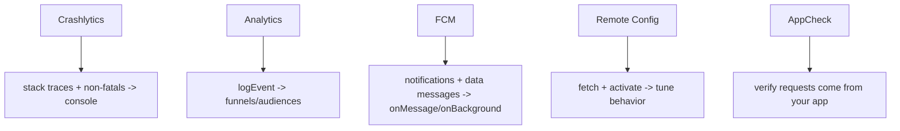
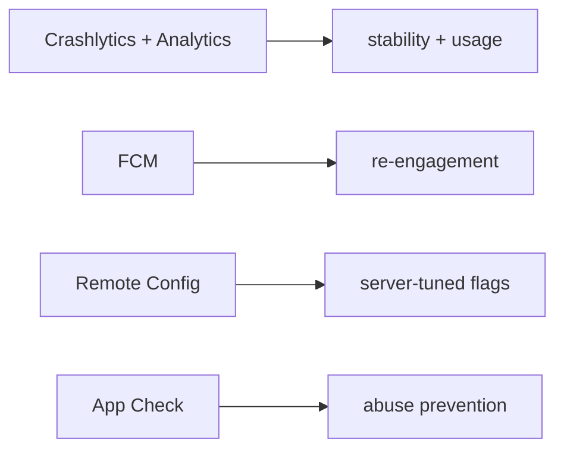

# Observability & Messaging (Crashlytics, Analytics, FCM, Remote Config, App Check)

> Firebase rounds out with operational services: **Crashlytics** (crash reporting), **Analytics** (events/funnels), **Cloud Messaging/FCM** (push notifications), **Remote Config** (server-tuned flags), and **App Check** (attest requests come from your genuine app) — the observability, growth, and abuse-prevention layer.

## Introduction

Beyond data/auth, Firebase offers services for *running* an app: knowing when it crashes (Crashlytics), how it's used (Analytics), pushing messages (FCM), toggling behavior remotely (Remote Config), and blocking abuse (App Check). This file surveys each and how they fit.

## Why this concept exists

Shipping isn't enough — you must observe crashes, understand usage, re-engage users, tune behavior without redeploying, and stop bots/abuse. These managed services provide that operational layer that would otherwise require significant custom infrastructure.

## Real-world analogy

These are a store's **operations department**: security cameras catching accidents (Crashlytics), foot-traffic analytics (Analytics), the PA/loyalty texts (FCM), adjustable signage/promos (Remote Config), and the ID-check at the door verifying you're a real customer, not a bot (App Check).

## Problem Statement

You need crash reports with stack traces, key usage events, push notifications (with deep links), a feature flag you can flip server-side, and protection so only your genuine app hits your backend. You'll wire each service.

## Internal Working



- **Crashlytics** (`firebase_crashlytics`): capture fatal crashes + **non-fatal** errors with stack traces; wire `FlutterError.onError` and `PlatformDispatcher.instance.onError`/`runZonedGuarded` to record uncaught errors ([Module 38](../38%20Error%20Handling/README.md), [Module 52](../52%20Monitoring/README.md)). Add custom keys/logs for context.
- **Analytics** (`firebase_analytics`): `logEvent(name, parameters)` for funnels, user properties, audiences; screen tracking. Respect privacy/consent.
- **Cloud Messaging (FCM)** (`firebase_messaging`): push **notification** and **data** messages; foreground (`onMessage`), background (`onBackgroundMessage`), and tap handling (deep-link routing — [13 · deep_linking](../13%20Routing/deep_linking_and_url_strategy.md), [Module 32](../32%20Notifications/README.md)); device tokens + topics; requires permission (iOS) and platform setup.
- **Remote Config** (`firebase_remote_config`): fetch server-defined key-values (feature flags, A/B params); `fetchAndActivate()` with sensible defaults + fetch intervals — tune behavior without an app update.
- **App Check** (`firebase_app_check`): attests requests originate from your untampered app (via Play Integrity / DeviceCheck / reCAPTCHA), protecting backends/Firestore/Functions from abuse — a key part of "keys aren't secrets, rules + App Check are the defense" ([firebase_setup_and_core.md](firebase_setup_and_core.md), [Module 37](../37%20Security/README.md)).

## Memory Representation

These are lightweight client SDKs sending events/reports/tokens; Remote Config caches fetched values locally. FCM handlers run on the isolate (background handler is a top-level function).

## Compiler Behavior

FCM's background handler must be a top-level/static function (runs in a background isolate — [02 · isolates](../02%20Advanced%20Dart/isolates.md)).

## Runtime Behavior

Crashlytics batches reports (visible after next launch/upload); Analytics events are batched; FCM delivers foreground/background/terminated differently; Remote Config serves cached values until fetched+activated; App Check attaches attestation tokens to requests.

## Flutter Engine Behavior

All cross the embedder to native SDKs; FCM background handling and notification display involve platform notification systems ([Module 32](../32%20Notifications/README.md)).

## Dart VM Behavior

Background FCM handler runs in a separate isolate; plugin access there may need setup.

## Examples

```dart
import 'package:firebase_crashlytics/firebase_crashlytics.dart';
import 'package:firebase_analytics/firebase_analytics.dart';
import 'package:firebase_remote_config/firebase_remote_config.dart';
import 'package:firebase_messaging/firebase_messaging.dart';
import 'package:flutter/foundation.dart';

// Crashlytics: capture uncaught errors globally (in main, after init)
void wireCrashlytics() {
  FlutterError.onError = FirebaseCrashlytics.instance.recordFlutterFatalError;
  PlatformDispatcher.instance.onError = (error, stack) {
    FirebaseCrashlytics.instance.recordError(error, stack, fatal: true);
    return true;
  };
}

// Analytics
Future<void> logPurchase(double amount) =>
    FirebaseAnalytics.instance.logEvent(name: 'purchase', parameters: {'amount': amount});

// Remote Config feature flag
Future<bool> newCheckoutEnabled() async {
  final rc = FirebaseRemoteConfig.instance;
  await rc.setDefaults({'new_checkout': false});
  await rc.fetchAndActivate();
  return rc.getBool('new_checkout');
}

// FCM: background handler must be top-level
@pragma('vm:entry-point')
Future<void> _bgHandler(RemoteMessage message) async {
  // handle background message (no UI)
}
Future<void> wireMessaging() async {
  await FirebaseMessaging.instance.requestPermission();      // iOS permission
  FirebaseMessaging.onBackgroundMessage(_bgHandler);
  FirebaseMessaging.onMessage.listen((m) {/* foreground */});
  FirebaseMessaging.onMessageOpenedApp.listen((m) {
    // route to a screen (deep link) based on m.data
  });
}
```

## Diagrams



## Common Mistakes

| Mistake | Why | Fix |
|---------|-----|-----|
| No global error capture | Crashes invisible | Wire `FlutterError.onError`/`onError`/zone to Crashlytics |
| FCM background handler not top-level | Won't run | Use a top-level `@pragma('vm:entry-point')` function |
| Analytics without consent | Privacy/legal violation | Gate on consent; anonymize |
| Remote Config without defaults/intervals | Wrong behavior/quota issues | Set defaults + sensible fetch intervals |
| Relying on rules alone (no App Check) | Backend abuse from non-app clients | Add App Check |
| Logging PII in analytics/crash keys | Privacy leak | Redact; no secrets/PII ([37](../37%20Security/README.md)) |

## Best Practices

- Wire **Crashlytics** to global error handlers ([Module 38](../38%20Error%20Handling/README.md)) + custom keys for context; record non-fatals too.
- Log **meaningful Analytics events** (funnels) with **consent** and no PII.
- Handle **FCM** in all states (foreground/background/terminated); route taps via deep links; register a **top-level background handler**.
- Use **Remote Config** for flags/A-B with **defaults** and reasonable fetch intervals; treat as tuning, not critical logic.
- Enable **App Check** to protect backends/Firestore/Functions (with rules) — client keys aren't the security layer.

## Performance

Lightweight SDKs; batch/async sending. FCM background handling and Remote Config fetch add minor cost; defer non-critical init post-first-frame ([firebase_setup_and_core.md](firebase_setup_and_core.md), [Module 21](../21%20Performance/README.md)).

## Advantages / Disadvantages

- **+** Managed observability/growth/security layer, integrated, fast to adopt, cross-platform.
- **−** Privacy/consent obligations, platform setup (FCM/App Check), vendor lock-in, background-handler/isolate quirks.

## Interview Questions

1. **🟢 What does each service do?** — Crashlytics (crash/error reporting), Analytics (usage events), FCM (push), Remote Config (server-tuned flags), App Check (request attestation/abuse prevention).
2. **🟢 How do you capture uncaught errors in Crashlytics?** — Wire `FlutterError.onError` and `PlatformDispatcher.onError`/`runZonedGuarded` to `recordError`/`recordFlutterFatalError`.
3. **🟡 How is FCM handled in different app states?** — `onMessage` (foreground), a top-level `onBackgroundMessage` handler (background/terminated), and `onMessageOpenedApp` (tap → deep link).
4. **🟡 What is Remote Config for?** — Fetching server-defined values (feature flags, A/B params) to tune behavior without an app update; use defaults + fetch intervals.
5. **🟡 What problem does App Check solve?** — It attests requests come from your genuine, untampered app, protecting backends/Firestore/Functions from abuse — complementing rules.
6. **🔴 Why aren't Firebase client keys the security boundary?** — They're public identifiers; security comes from **security rules + App Check** (server-enforced), not key secrecy.
7. **🔴 What privacy considerations apply to Analytics/Crashlytics?** — Obtain consent, avoid PII/secrets in events/keys, and comply with platform/legal requirements.

## Senior Engineer Tips

- Treat Crashlytics + Analytics as part of your monitoring strategy ([Module 52](../52%20Monitoring/README.md)); add custom keys/breadcrumbs so crashes are diagnosable.
- Design FCM payloads to carry a route for deep-link routing on tap; test all app states on device.
- Layer **rules + App Check** for real security; never treat client keys as secret ([Module 37](../37%20Security/README.md)).

## Architect Perspective

These services form the operational and abuse-prevention layer: observability (Crashlytics/Analytics — [Module 52](../52%20Monitoring/README.md)), engagement (FCM — [Module 32](../32%20Notifications/README.md)), controllability (Remote Config), and integrity (App Check — [Module 37](../37%20Security/README.md)). Wired with consent, deep-link routing, and rules+App Check, they make a Firebase app observable, tunable, and defensible in production.

## Summary

- Crashlytics (crashes/non-fatals via global handlers), Analytics (consented events), FCM (multi-state push + deep links), Remote Config (flags with defaults), App Check (attestation).
- Client keys aren't secrets — security is **rules + App Check**; respect privacy/consent; defer non-critical init.
- These form the observability/growth/security layer of a Firebase app.

## Revision Notes

- Crashlytics: wire `FlutterError.onError`/`PlatformDispatcher.onError`; record non-fatals + custom keys.
- Analytics: `logEvent` (consent, no PII); FCM: `onMessage`/top-level `onBackgroundMessage`/`onMessageOpenedApp` (deep link), permission + platform setup.
- Remote Config: defaults + `fetchAndActivate` + intervals (tuning, not critical logic).
- App Check: attest genuine app; security = rules + App Check (keys public).

## Practice Questions

1. How do you capture uncaught Flutter errors in Crashlytics?
2. How is FCM handled foreground vs background vs tap?
3. Why do rules + App Check (not client keys) provide security?

## Coding Questions

1. Wire global error handlers to Crashlytics and record a non-fatal with custom keys.
2. Handle FCM in all states and route a tapped notification via deep link.
3. Read a feature flag from Remote Config with defaults.

## Mini Project — Module capstone

**Ops-ready Firebase slice (Flutter):** Add Crashlytics (global handlers + non-fatals + custom keys), key Analytics events (with a consent gate), FCM (all states + deep-link routing on tap), a Remote Config feature flag (with defaults), and enable App Check — all initialized after core, non-critical ones deferred post-first-frame. Acceptance: crashes captured; consented analytics; FCM routes on tap; flag toggles behavior; App Check enabled; no PII/secrets logged. (Combines with auth/Firestore/functions for the full Module 18 capstone.)
