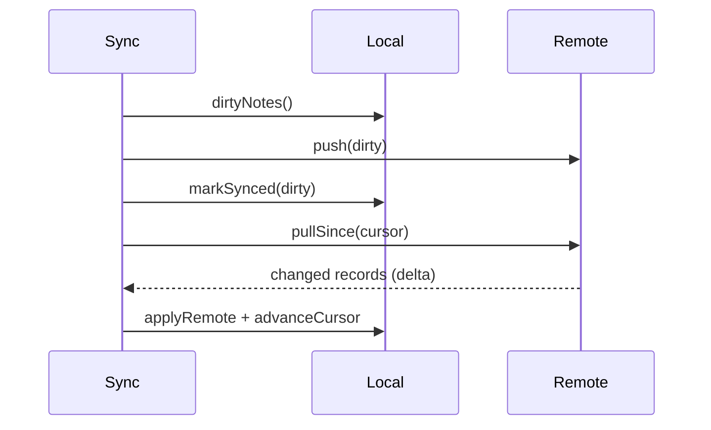

# The Sync Engine (Pull/Push, Delta Sync, Sync State)

> A sync engine reconciles the local store with the server: **push** local (dirty) changes up, **pull** remote changes down — ideally as **deltas** (only what changed since a cursor) — while tracking sync state and running opportunistically on connectivity/interval/app events.

## Introduction

The sync engine is the background reconciler of offline-first. This file covers the sync loop (push then pull), **delta sync** (change cursors/timestamps), sync triggers, ordering, and exposing sync **status** — the plumbing that keeps local and remote convergent.

## Why this concept exists

Two independently-mutated stores (local + remote) must converge. Naive "fetch everything every time" is slow/expensive; and offline writes must eventually reach the server. A sync engine formalizes *what* to send/fetch, *when*, and *in what order* — efficiently and reliably.

## Real-world analogy

A **shipping-and-receiving dock**: outbound (push) sends your packages (local changes) to the warehouse; inbound (pull) receives new stock (remote changes) since your last delivery slip (cursor). You don't recount the whole warehouse each time — you process only what changed (delta).

## Problem Statement

Sync a notes app efficiently: push dirty notes, pull only notes changed since the last sync, handle deletes, run on reconnect/interval, and show a "syncing/synced/error" status. You'll build the sync loop with a delta cursor.

## Internal Working

```mermaid
flowchart TD
    Trigger[connectivity / interval / app resume / manual] --> Sync[sync()]
    Sync --> Push[push dirty local changes -> clear dirty]
    Push --> Pull[pull remote changes since cursor]
    Pull --> Apply[apply to local + advance cursor]
    Apply --> Status[emit SyncState: syncing/idle/error]
```

- **Push (upload)**: send local **dirty** records (creates/updates/deletes-as-tombstones) to the server; on success, clear their dirty flag and record the server's version. This drains the **outbox** ([04_connectivity_and_outbox.md](04_connectivity_and_outbox.md)).
- **Pull (download)**: fetch remote changes **since a cursor** (a timestamp or opaque token) — **delta sync** — apply them to the local store, then **advance the cursor**. Full sync only on first run/reset.
- **Order**: typically **push before pull** (so the server has your latest, and pulled data reflects it), then merge with conflict handling ([03_conflict_resolution.md](03_conflict_resolution.md)).
- **Triggers**: on connectivity regained, periodic interval, app resume, after a local write (debounced), or manual pull-to-refresh; background sync via WorkManager ([Module 33](../33%20Background%20Services/README.md)).
- **Sync state**: expose a `SyncState` (`idle`/`syncing`/`error` + last-synced time) as a stream for UI indicators.
- **Idempotency & retries**: syncs can fail/retry — make push idempotent (server upsert by id) and retry with backoff; avoid overlapping syncs (a lock/flag).
- **Deletes**: use **tombstones** (soft-delete flag) so deletions propagate; purge tombstones after all peers have synced.

## Memory Representation

The cursor + sync metadata persist locally (DB); sync batches load changed records only (delta) → bounded memory. Large syncs run off-isolate ([02 · isolates](../02%20Advanced%20Dart/04_isolates.md)).

## Compiler Behavior

Not applicable.

## Runtime Behavior

Sync runs async in the background; overlapping runs are prevented; failures retry with backoff; the cursor only advances on a fully-applied pull (so a crash mid-sync re-pulls safely).

## Flutter Engine Behavior / Dart VM Behavior

Not applicable beyond async; heavy merges → isolate.

## Examples

```dart
enum SyncStatus { idle, syncing, error }
class SyncState {
  final SyncStatus status;
  final DateTime? lastSynced;
  const SyncState(this.status, [this.lastSynced]);
}

class SyncEngine {
  final LocalStore local;   // watchNotes/upsert/dirtyNotes/cursor
  final RemoteApi remote;   // push / pullSince
  bool _running = false;
  final _state = // broadcast StreamController<SyncState> in real code
      _StateBus();

  SyncEngine(this.local, this.remote);
  Stream<SyncState> get state => _state.stream;

  Future<void> sync() async {
    if (_running) return;              // avoid overlapping syncs
    _running = true;
    _state.emit(const SyncState(SyncStatus.syncing));
    try {
      // 1) PUSH dirty local changes (idempotent upsert by id)
      final dirty = await local.dirtyNotes();
      if (dirty.isNotEmpty) {
        await remote.push(dirty);
        await local.markSynced(dirty);  // clear dirty + store server version
      }
      // 2) PULL remote deltas since cursor
      final cursor = await local.syncCursor();
      final changes = await remote.pullSince(cursor);
      for (final note in changes) {
        await local.applyRemote(note);  // reconcile (conflict handling here)
      }
      await local.advanceCursor(_maxUpdatedAt(changes) ?? cursor);
      _state.emit(SyncState(SyncStatus.idle, DateTime.now()));
    } catch (e) {
      _state.emit(const SyncState(SyncStatus.error)); // retry later w/ backoff
    } finally {
      _running = false;
    }
  }

  DateTime? _maxUpdatedAt(List<Note> notes) =>
      notes.isEmpty ? null : notes.map((n) => n.updatedAt).reduce((a, b) => a.isAfter(b) ? a : b);
}

// stand-ins
abstract interface class LocalStore {
  Future<List<Note>> dirtyNotes();
  Future<void> markSynced(List<Note> notes);
  Future<DateTime?> syncCursor();
  Future<void> advanceCursor(DateTime? cursor);
  Future<void> applyRemote(Note note);
}
abstract interface class RemoteApi {
  Future<void> push(List<Note> notes);
  Future<List<Note>> pullSince(DateTime? cursor);
}
class Note { final String id; final DateTime updatedAt; const Note(this.id, this.updatedAt); }
class _StateBus { Stream<SyncState> get stream async* {} void emit(SyncState s) {} }
```

## Diagrams



## Common Mistakes

| Mistake | Why | Fix |
|---------|-----|-----|
| Full sync every time | Slow, costly | Delta sync with a cursor |
| Pull before push | Pulled data misses local changes | Push then pull (usually) |
| Advancing cursor before applying | Lost changes on crash | Advance only after successful apply |
| Overlapping syncs | Races/duplication | Guard with a running flag/lock |
| Hard deletes | Deletions don't propagate | Tombstones + later purge |
| Non-idempotent push | Duplicates on retry | Upsert by id; idempotent server |
| No sync status | Opaque UX | Expose `SyncState` stream |

## Best Practices

- Do **delta sync** with a persisted **cursor** (timestamp/token); full sync only on first run/reset.
- **Push before pull**; make push **idempotent** (upsert by id) and retry with **backoff**.
- **Advance the cursor only after** changes are fully applied (crash-safe).
- **Prevent overlapping syncs**; trigger on connectivity/interval/resume/manual (debounce after writes).
- Use **tombstones** for deletes; purge when safe.
- Expose **sync state** for UI; run heavy merges off-isolate; do background sync via WorkManager ([Module 33](../33%20Background%20Services/README.md)).

## Performance

Delta sync minimizes bandwidth/battery vs full sync; batching + backoff avoid storms; off-isolate merges keep the UI smooth ([Module 21](../21%20Performance/README.md)).

## Advantages / Disadvantages

- **+** Efficient convergence, resilient (idempotent/retry), background/opportunistic, observable status.
- **−** Cursor/tombstone bookkeeping, ordering/idempotency subtleties, conflict handling required, testing complexity.

## Interview Questions

1. **🟢 What does a sync engine do?** — Reconciles local and remote by pushing local (dirty) changes and pulling remote changes into the local store.
2. **🟢 What is delta sync?** — Fetching only records changed since a stored cursor (timestamp/token), instead of everything.
3. **🟡 Why push before pull?** — So the server has your latest changes before you pull, and the pulled state (and conflict resolution) accounts for them.
4. **🟡 When do you advance the sync cursor?** — Only after remote changes are fully applied locally, so a crash mid-sync safely re-pulls.
5. **🟡 How do you propagate deletes?** — Tombstones (soft-delete flags) synced like updates, purged after convergence.
6. **🔴 How do you make sync safe under retries/crashes?** — Idempotent push (upsert by id), overlap guard, cursor-after-apply, and backoff retries.
7. **🔴 What triggers a sync?** — Connectivity regained, intervals, app resume, post-write (debounced), manual refresh, and background jobs (WorkManager).

## Senior Engineer Tips

- Persist the cursor and advance it **transactionally after apply**; this single rule prevents most "lost update on crash" bugs.
- Make push idempotent server-side (upsert by client id / dedupe key) so retries are safe.
- Expose sync status + last-synced time; users trust apps that show sync state.

## Architect Perspective

The sync engine is the heart of offline-first: a background, delta-based, idempotent reconciler behind the repository, feeding conflict resolution and draining the outbox. Its correctness (ordering, cursor discipline, idempotency) determines data integrity; it composes with connectivity handling, background execution, and conflict strategy into a resilient data layer ([04_connectivity_and_outbox.md](04_connectivity_and_outbox.md), [03_conflict_resolution.md](03_conflict_resolution.md), [Module 33](../33%20Background%20Services/README.md)).

## Summary

- Sync = push dirty local changes, pull remote deltas since a cursor, apply, advance cursor.
- Push before pull; idempotent push + backoff; advance cursor after apply; tombstones for deletes.
- Guard overlaps, trigger opportunistically, expose sync state, offload heavy merges.

## Revision Notes

- Push (dirty, idempotent upsert) → pull (delta since cursor) → apply → advance cursor (after apply).
- Triggers: connectivity/interval/resume/post-write/manual/background.
- Tombstones for deletes; overlap guard; retry+backoff; `SyncState` stream.
- Cursor discipline = crash safety; heavy merges off-isolate.

## Practice Questions

1. Why is delta sync better than full sync?
2. Why advance the cursor only after applying changes?
3. How do you make push safe under retries?

## Coding Questions

1. Implement `SyncEngine.sync()` (push dirty → pull delta → apply → advance cursor) with an overlap guard.
2. Add idempotent push (upsert by id) + retry with backoff.
3. Expose a `SyncState` stream and drive a UI status indicator.

## Mini Project

**Delta sync engine (Flutter):** Build a `SyncEngine` over fake local/remote stores implementing push-then-pull delta sync with a persisted cursor (advanced after apply), tombstone deletes, overlap guard, retry/backoff, and a `SyncState` stream. Trigger it on a fake connectivity event. Acceptance: delta (not full) sync; idempotent push; crash-safe cursor; deletes propagate; status observable; runs. (Conflicts handled in [03_conflict_resolution.md](03_conflict_resolution.md).)
