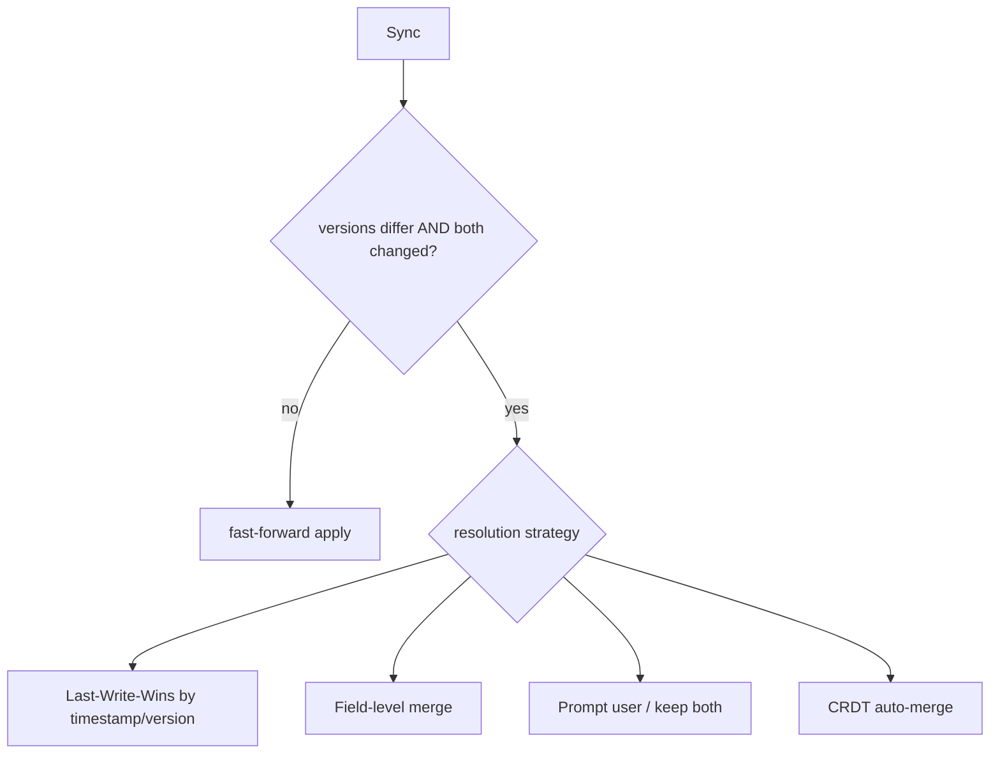
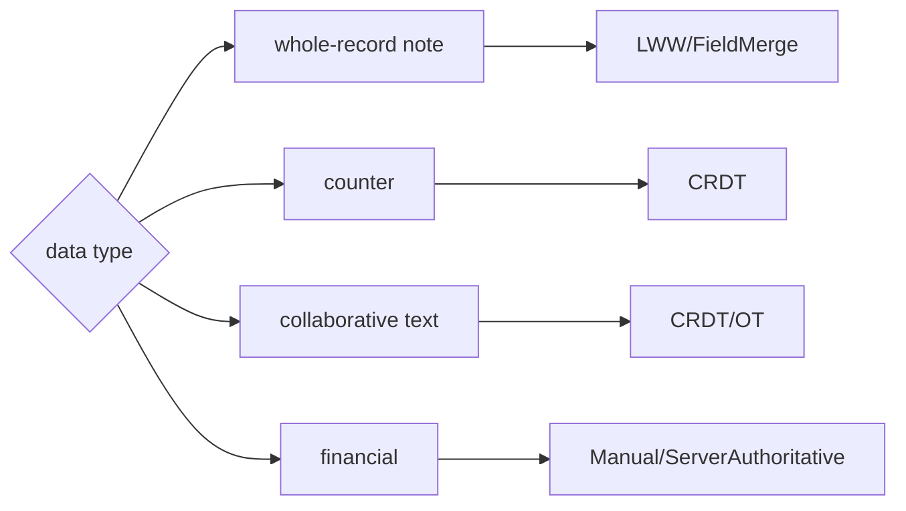

# Conflict Resolution (LWW, Versioning, Merge, CRDTs)

> When the same record is edited both locally and remotely before syncing, you have a **conflict** — resolve it with a deliberate strategy: last-write-wins (simple, lossy), version/field merge (smarter), or CRDTs (automatic convergence for collaborative data).

## Introduction

Concurrent edits are inevitable in offline-first (two devices, or device + server). This file covers detecting conflicts (versions/vector clocks) and the strategies — **last-write-wins (LWW)**, **field-level merge**, **manual resolution**, and **CRDTs** — with their tradeoffs.

## Why this concept exists

Sync must decide *whose change wins* when both sides changed. Ignoring conflicts silently loses data. A chosen, documented strategy makes convergence predictable and matches the data's needs (a note vs a collaborative doc vs a counter differ).

## Real-world analogy

Two editors mark up the **same document offline**, then both submit. Conflict resolution is the **editor-in-chief's policy**: "latest submission wins" (LWW), "merge non-overlapping edits" (field merge), "ask a human to reconcile overlaps" (manual), or a **shared live doc that auto-merges keystrokes** (CRDT).

## Problem Statement

Device A and the server both edit note #7 while A was offline. On sync, decide the winner without silently losing intent. You'll detect the conflict (version) and apply a strategy per the data type.

## Internal Working



- **Detection**: compare **versions** (monotonic counter) or **vector clocks**; a conflict = the remote's base version differs from what the local change was based on (both diverged). Timestamps alone are unreliable (clock skew) — prefer versions/logical clocks.
- **Strategies**:
  - **Last-Write-Wins (LWW)**: newest timestamp/version wins; simple, but **loses** the other side's change. Fine for low-contention/whole-record data.
  - **Field-level merge**: merge non-conflicting fields; only truly-overlapping fields need a tiebreak. Preserves more intent.
  - **Manual / keep-both**: surface the conflict to the user (or store both versions) — for high-value data where silent loss is unacceptable.
  - **CRDTs (Conflict-free Replicated Data Types)**: data structures (counters, sets, sequences/text) that **merge automatically and commutatively** to a consistent state regardless of order — ideal for collaborative editing/counters; more complex.
- **Server authority**: often the server is the tiebreaker/validator; some designs resolve on-device, others server-side.
- **Choice by data**: whole-record note → LWW/field-merge; counter → CRDT; collaborative text → CRDT/OT; financial → manual/server-authoritative.

## Memory Representation

Records carry version/clock metadata; CRDTs carry extra state (e.g., per-replica counters). Manual/keep-both may store multiple versions temporarily ([02_sync_engine.md](02_sync_engine.md)).

## Compiler Behavior

Not applicable.

## Runtime Behavior

On pull/apply, the engine detects conflicts and applies the strategy; LWW/merge produce a single record; CRDTs merge deterministically; manual defers to the user.

## Flutter Engine Behavior / Dart VM Behavior

Not applicable; heavy merges off-isolate.

## Examples

```dart
class Note {
  final String id, title, body;
  final int version;        // monotonic; incremented on each change
  final DateTime updatedAt;
  const Note(this.id, this.title, this.body, this.version, this.updatedAt);
}

// Last-Write-Wins (by version, fallback updatedAt)
Note resolveLWW(Note local, Note remote) =>
    remote.version > local.version ? remote
    : local.version > remote.version ? local
    : (remote.updatedAt.isAfter(local.updatedAt) ? remote : local);

// Field-level merge: keep each side's change to different fields; tiebreak overlaps
Note resolveFieldMerge(Note base, Note local, Note remote) {
  String pick(String b, String l, String r) {
    final localChanged = l != b, remoteChanged = r != b;
    if (localChanged && !remoteChanged) return l;   // only local changed
    if (remoteChanged && !localChanged) return r;   // only remote changed
    if (!localChanged && !remoteChanged) return b;
    // both changed the same field -> tiebreak (LWW)
    return remote.version >= local.version ? r : l;
  }
  return Note(
    base.id,
    pick(base.title, local.title, remote.title),
    pick(base.body, local.body, remote.body),
    (local.version > remote.version ? local.version : remote.version) + 1,
    DateTime.now(),
  );
}
```

## Diagrams



## Common Mistakes

| Mistake | Why | Fix |
|---------|-----|-----|
| Timestamp-only LWW | Clock skew → wrong winner/data loss | Use versions/logical clocks (+timestamp tiebreak) |
| Silent LWW on high-value data | Loses user intent | Field-merge / manual / keep-both |
| No base version (can't detect conflict) | Can't tell divergence | Track the version each change was based on |
| Rolling own CRDT casually | Very hard to get right | Use a library / restrict to simple CRDTs |
| One strategy for all data | Mismatch | Choose per data type/contention |

## Best Practices

- **Detect** conflicts with versions/logical clocks (not raw timestamps); keep the **base version** a change was made against.
- **Choose the strategy per data**: LWW for low-contention whole records; field-merge to preserve intent; manual/keep-both for high-value data; **CRDTs** for counters/sets/collaborative text.
- Prefer **server-authoritative** validation for critical/financial data.
- Make resolution **deterministic and documented**; test conflicting-edit scenarios.
- Run heavy merges off-isolate; surface unresolved conflicts to the user when needed.

## Performance

LWW/field-merge are O(fields); CRDTs carry extra state/merge cost but avoid round-trips. Off-isolate large merges; conflict handling is infrequent relative to reads ([Module 21](../21%20Performance/README.md)).

## Advantages / Disadvantages

- **+ LWW:** trivial. **+ Field-merge:** preserves more intent. **+ CRDT:** automatic, order-independent convergence (great for collaboration).
- **− LWW:** data loss. **− Field-merge:** overlaps still need tiebreak. **− CRDT:** complexity/state overhead. **− Manual:** UX burden.

## Interview Questions

1. **🟢 What causes a sync conflict?** — The same record changed both locally and remotely (divergent versions) before syncing.
2. **🟢 What is last-write-wins and its downside?** — Newest change wins by timestamp/version; it silently discards the losing side's change (data loss).
3. **🟡 Why prefer versions/logical clocks over timestamps?** — Device clocks skew; versions/vector clocks reliably capture causal order and divergence.
4. **🟡 What is field-level merge?** — Merge non-overlapping field changes automatically; only fields both sides changed need a tiebreak — preserving more intent than whole-record LWW.
5. **🟡 What are CRDTs and when do you use them?** — Data types that merge automatically and commutatively to a consistent state (counters, sets, sequences); ideal for collaborative editing/counters.
6. **🔴 How do you resolve conflicts for financial data?** — Prefer server-authoritative validation / manual resolution — never silent LWW that could lose money.
7. **🔴 How do you choose a strategy?** — By data type and contention: whole-record→LWW/field-merge, counters/collab→CRDT, critical→manual/server.

## Senior Engineer Tips

- Track the **base version** each local edit was made against — without it you can't distinguish a fast-forward from a real conflict.
- Don't hand-roll complex CRDTs; use libraries or restrict to well-understood ones (G-Counter, LWW-register, OR-Set).
- Default to field-merge for editable records (better UX than whole-record LWW); reserve manual for high-stakes overlaps.

## Architect Perspective

Conflict resolution is where offline-first correctness is won or lost. Choosing per-data strategies (with version-based detection, server authority for critical data, and CRDTs for collaboration) and documenting them prevents silent data loss and surprises. It's a core part of the sync design ([02_sync_engine.md](02_sync_engine.md)) and the hardest to retrofit — decide early ([Module 48](../48%20System%20Design/README.md)).

## Summary

- Conflicts arise from concurrent local+remote edits; detect via versions/logical clocks (not timestamps).
- Strategies: LWW (simple/lossy), field-merge (preserves intent), manual/keep-both (high-value), CRDTs (auto-converge for collaboration).
- Choose per data type; prefer server authority for critical data; make resolution deterministic and tested.

## Revision Notes

- Detect: versions/vector clocks + base version (timestamps unreliable).
- LWW (lossy) / field-merge (intent-preserving) / manual/keep-both / CRDT (auto-converge: counters/sets/text).
- Choose per data + contention; server-authoritative for critical/financial.
- Don't hand-roll complex CRDTs; heavy merges off-isolate; test conflicts.

## Practice Questions

1. Why are timestamps a poor basis for LWW?
2. When is a CRDT the right choice?
3. Which strategy for a collaborative counter vs a bank balance?

## Coding Questions

1. Implement version-based LWW and a field-level merge for a record.
2. Detect a conflict using a base version + local/remote versions.
3. Implement a simple G-Counter CRDT (per-replica counts, merge = max).

## Mini Project

**Conflict resolver (Dart):** Implement conflict detection (base+local+remote versions) and three resolvers — LWW, field-merge, and a G-Counter CRDT — with tests covering fast-forward, overlapping-field, and concurrent-counter cases. Wire the chosen resolver into the sync engine's apply step. Acceptance: correct detection; per-strategy resolution; CRDT converges regardless of merge order; tests pass.
