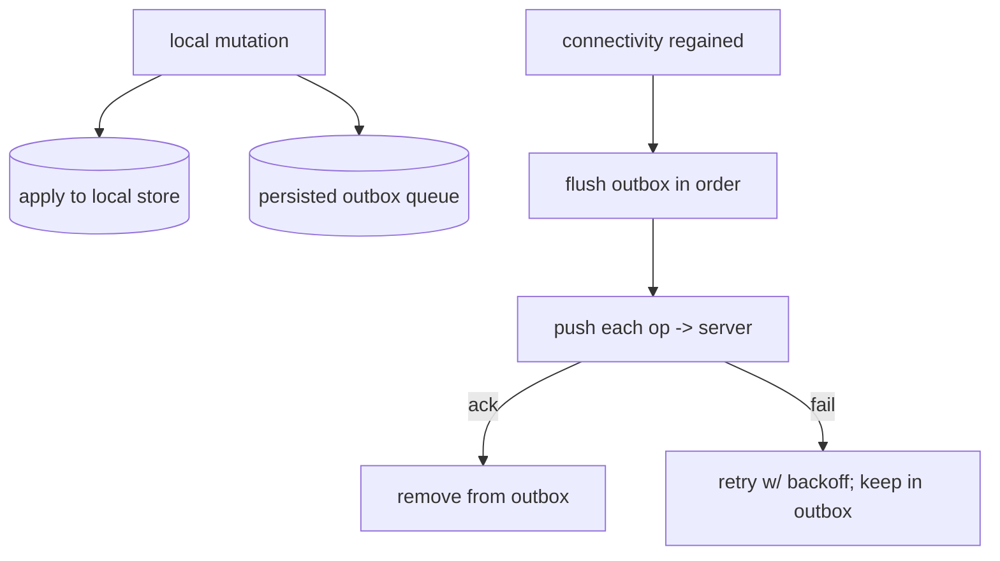

# Connectivity & the Outbox (Queued Mutations)

> Offline writes must not be lost: record each mutation in a durable **outbox** (a persisted queue) and **flush** it to the server when connectivity returns — with idempotency, ordering, and retry — so the app accepts writes anytime and reliably delivers them later.

## Introduction

Reads offline are easy (local store); **writes** offline are the hard part — you can't reach the server, but you must not drop the user's action. The **outbox pattern** persists pending mutations and replays them on reconnect. This file covers connectivity detection and the outbox (queue) mechanics.

## Why this concept exists

If an offline write only lived in memory, it'd be lost on app kill. And when connectivity returns, queued writes must reach the server exactly once, in a sensible order, surviving retries. The outbox makes offline mutations **durable and eventually-delivered**.

## Real-world analogy

An **outbox tray**: when the mail can't go out (offline), letters (mutations) sit in the tray persistently. When the courier arrives (connectivity), they're mailed in order; if delivery fails, they stay in the tray for the next attempt — nothing is lost.

## Problem Statement

A user creates and edits notes with no connection, then closes and reopens the app; when connectivity returns, all their changes must reach the server exactly once, in order. You'll persist mutations in an outbox and flush on connectivity.

## Internal Working



- **Outbox**: a **persisted** queue (DB table) of pending operations (create/update/delete), each with an id, payload, timestamp, and attempt count. Written **transactionally with** the local change so they never diverge.
- **Connectivity detection**: `connectivity_plus` reports online/offline transitions; but "has a network" ≠ "server reachable" — verify with a real request/heartbeat before assuming success.
- **Flush**: on connectivity (or app resume/interval/background job), send queued ops **in order**; on server ack, **remove** the op; on failure, keep it and **retry with backoff**.
- **Idempotency**: each op carries a **client-generated id/dedupe key** so server upserts are safe under retries (the server may have applied it before the ack was lost).
- **Ordering & dependencies**: preserve causal order (create before update before delete of the same entity); coalesce redundant ops (many edits → last state) where safe.
- **Failure handling**: distinguish transient (retry) vs permanent (4xx validation → surface/park the op) errors; cap attempts; avoid poison-message loops.
- Integrates with the sync engine's **push** phase ([02_sync_engine.md](02_sync_engine.md)) and conflict resolution ([03_conflict_resolution.md](03_conflict_resolution.md)).

## Memory Representation

The outbox is on disk (durable across restarts); only the flushing batch is in memory. Attempt counts/backoff state persist per op ([Module 20](../20%20Database/README.md)).

## Compiler Behavior

Not applicable.

## Runtime Behavior

Writes enqueue instantly (UI unaffected). Flush runs opportunistically; failed ops remain queued and retry; app restart resumes flushing from the persisted outbox.

## Flutter Engine Behavior

Connectivity plugins cross the embedder; background flush uses WorkManager/background isolates ([Module 33](../33%20Background%20Services/README.md), [02 · isolates](../02%20Advanced%20Dart/04_isolates.md)).

## Dart VM Behavior

Not applicable.

## Examples

```dart
import 'dart:async';

class Mutation {
  final String id;            // client-generated (idempotency key)
  final String type;          // 'create' | 'update' | 'delete'
  final Map<String, dynamic> payload;
  final int attempts;
  const Mutation(this.id, this.type, this.payload, {this.attempts = 0});
}

abstract interface class Outbox {          // persisted (DB-backed)
  Future<void> enqueue(Mutation m);
  Future<List<Mutation>> pending();        // ordered
  Future<void> remove(String id);
  Future<void> bumpAttempts(String id);
}
abstract interface class RemoteApi { Future<void> apply(Mutation m); }
abstract interface class Connectivity { Stream<bool> get onOnline; Future<bool> get isOnline; }

class OutboxSync {
  final Outbox outbox;
  final RemoteApi remote;
  final Connectivity connectivity;
  bool _flushing = false;
  OutboxSync(this.outbox, this.remote, this.connectivity) {
    connectivity.onOnline.listen((online) { if (online) flush(); }); // flush on reconnect
  }

  // Called by the repository on every offline-capable write:
  Future<void> record(Mutation m) => outbox.enqueue(m); // durable, transactional with local write

  Future<void> flush() async {
    if (_flushing || !await connectivity.isOnline) return;
    _flushing = true;
    try {
      for (final m in await outbox.pending()) {         // in order
        try {
          await remote.apply(m);                         // idempotent (upsert by m.id)
          await outbox.remove(m.id);                      // ack -> remove
        } on Exception {
          await outbox.bumpAttempts(m.id);                // keep + retry later (backoff/cap)
          break;                                          // stop on first failure (preserve order)
        }
      }
    } finally {
      _flushing = false;
    }
  }
}
```

## Diagrams

```mermaid
sequenceDiagram
    participant UI
    participant Repo
    participant Outbox
    participant Server
    UI->>Repo: edit note (offline)
    Repo->>Outbox: enqueue mutation (durable)
    Note over Outbox: persists across restart
    Server-->>Repo: connectivity returns
    Repo->>Server: flush ops in order (idempotent)
    Server-->>Outbox: ack -> remove; fail -> retry
```

## Common Mistakes

| Mistake | Why | Fix |
|---------|-----|-----|
| In-memory-only queue | Lost on app kill | Persist the outbox (DB) |
| Assuming "online" = server reachable | Captive portals/dead servers | Verify with a real request |
| Non-idempotent ops | Duplicates on lost-ack retries | Client id / dedupe key + server upsert |
| Ignoring order/dependencies | create-after-update errors | Preserve causal order; stop-on-failure |
| Infinite retry on 4xx (poison) | Stuck queue | Distinguish permanent errors; cap/park |
| Not writing outbox transactionally with local | Divergence (local changed, no op) | Enqueue in the same transaction |

## Best Practices

- **Persist** the outbox and enqueue **transactionally** with the local write (never lose an op).
- Use **client-generated ids/dedupe keys** + **idempotent** server upserts so retries are safe.
- **Flush on connectivity/resume/interval/background**; verify server reachability, not just "has network."
- Preserve **causal order**; **stop on failure** (or dependency-aware ordering); **retry with backoff**, cap attempts, and **park poison messages**.
- Coalesce redundant ops where safe; integrate with the sync engine's push + conflict handling.
- Do background flush via **WorkManager** ([Module 33](../33%20Background%20Services/README.md)).

## Performance

Enqueue is instant (UI unaffected); flush batches network work opportunistically. Bounded/persisted queue avoids memory growth; backoff prevents storms ([Module 21](../21%20Performance/README.md)).

## Advantages / Disadvantages

- **+** Never-lose-writes offline, reliable eventual delivery, instant UX, resilient to restarts/flaky networks.
- **−** Durable-queue + idempotency + ordering complexity, poison-message handling, retry/backoff tuning.

## Interview Questions

1. **🟢 What is the outbox pattern?** — A persisted queue of pending mutations that's flushed to the server when connectivity returns, so offline writes aren't lost.
2. **🟢 Why must the outbox be persisted?** — In-memory queues are lost on app kill; durability guarantees eventual delivery across restarts.
3. **🟡 Why idempotency, and how?** — A lost ack can cause a retry after the server already applied the op; client-generated ids + server upsert make replays safe.
4. **🟡 Why isn't "device online" enough to flush?** — Captive portals/dead servers mean network ≠ reachable; verify with a real request before treating flush as successful.
5. **🟡 How do you handle ordering?** — Preserve causal order (create→update→delete of an entity); typically stop on first failure to avoid out-of-order application.
6. **🔴 How do you handle a permanently-failing op (poison message)?** — Detect permanent (e.g., 4xx validation) errors, cap attempts, and park/surface it instead of infinite retry blocking the queue.
7. **🔴 Why enqueue transactionally with the local write?** — So the local state and the pending op never diverge (no "changed locally but no op to sync" or vice versa).

## Senior Engineer Tips

- Store the outbox in the same DB and **enqueue in the same transaction** as the local mutation — atomicity here prevents the nastiest sync bugs.
- Always attach a **client id** to mutations; it's your idempotency key and correlation id for conflict handling.
- Separate transient vs permanent failures early; a poison message that infinitely retries can block all delivery.

## Architect Perspective

The outbox is the durability guarantee of offline-first writes — the write-side counterpart to the local-source-of-truth read model. Combined with the sync engine (push), conflict resolution, and connectivity/background execution, it delivers "accept writes anytime, deliver reliably later." Its idempotency/ordering/durability discipline is core to data integrity at scale ([02_sync_engine.md](02_sync_engine.md), [03_conflict_resolution.md](03_conflict_resolution.md), [Module 33](../33%20Background%20Services/README.md)).

## Summary

- Persist offline mutations in a durable **outbox**, enqueued transactionally with the local write; flush on connectivity/resume/background.
- Ensure **idempotency** (client ids + server upsert), preserve **order**, retry with **backoff**, and park poison messages.
- Verify real reachability; integrate with sync/conflict handling; background flush via WorkManager.

## Revision Notes

- Outbox = persisted queue of mutations (id/type/payload/attempts); enqueue transactional with local write.
- Flush on connectivity/resume/interval/background; verify reachability (not just "online").
- Idempotent (client id + upsert); preserve causal order; stop-on-fail; backoff + cap + park poison.
- Integrates with sync push + conflict resolution; background via WorkManager.

## Practice Questions

1. Why persist the outbox instead of keeping it in memory?
2. How do you make replayed mutations safe?
3. How do you prevent a poison message from blocking the queue?

## Coding Questions

1. Implement an `OutboxSync` that enqueues mutations and flushes in order on connectivity.
2. Add idempotency (client id + upsert) and retry-with-backoff + attempt cap.
3. Enqueue the outbox op transactionally with the local write (pseudocode/DB).

## Mini Project

**Durable outbox (Flutter):** Build an `Outbox` (DB-backed) + `OutboxSync` that records offline note mutations, persists across restart, flushes in causal order on a fake connectivity event with idempotent upserts, retry/backoff, and poison-message parking. Prove writes survive app kill and deliver once. Acceptance: durable + transactional enqueue; idempotent/ordered flush; survives restart; poison handled; runs.
