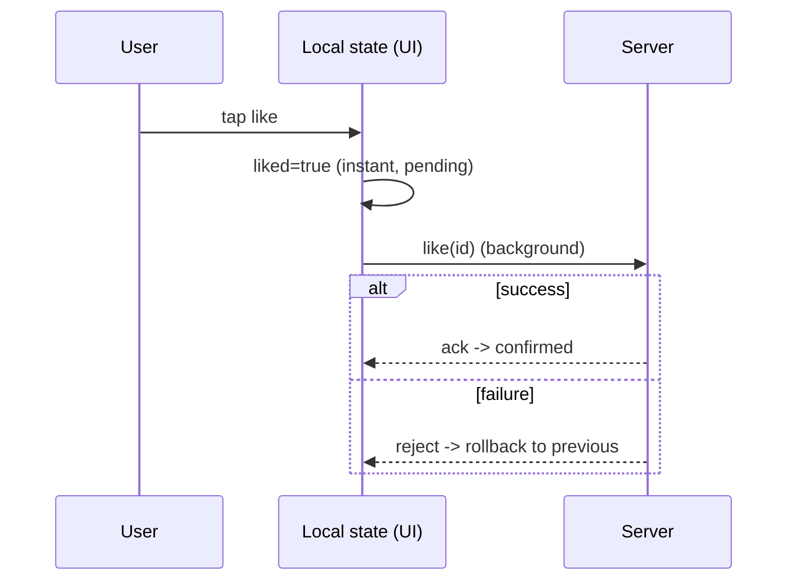

# Optimistic UI (Updates & Rollback)

> Optimistic UI applies a change to the local state **immediately** — assuming success — so the UI feels instant; if the server/sync later rejects it, you **roll back** (or reconcile) to the confirmed state.

## Introduction

In offline-first, writes hit the local store and the UI updates instantly (optimistic), while sync confirms with the server in the background. This file covers doing that safely: apply-immediately, track pending state, and **roll back** on failure — the UX payoff of offline-first.

## Why this concept exists

Waiting for a server round-trip before showing a "like," sent message, or edited field feels slow. Optimistic UI removes that latency by trusting the local write and reconciling later — but it must handle the rare rejection gracefully (rollback) so the UI never lies permanently.

## Real-world analogy

Optimistic UI is **speaking before the interpreter confirms**: you say your line immediately (instant UX), and if the interpreter reports it was misheard/rejected, you **correct it** (rollback). Fast by default, corrected when necessary.

## Problem Statement

A "like" button should turn filled instantly (offline too), a message should appear as "sent" immediately, and if the server later rejects the like, the UI should revert. You'll apply optimistically, mark pending, and roll back on failure.

## Internal Working

```mermaid
flowchart TD
    Action[user action] --> Apply[apply to local state NOW (optimistic)]
    Apply --> UI[UI updates instantly]
    Apply --> Sync[enqueue/push in background]
    Sync -->|success| Confirm[mark confirmed]
    Sync -->|failure| Rollback[revert to previous state / reconcile]
    Rollback --> UI2[UI corrects + inform user]
```

- **Apply immediately**: mutate the local store/state at once; the UI (reading local) reflects it instantly — works offline (queued via outbox — [04_connectivity_and_outbox.md](04_connectivity_and_outbox.md)).
- **Track pending/confirmed**: mark the item as `pending` (optionally show a subtle indicator); on server ack → `confirmed`; on reject → rollback.
- **Rollback**: keep the **previous value** (or a reverse operation) to restore if the server rejects (validation/conflict). Then optionally inform the user or re-apply server truth.
- **Reconciliation**: when sync pulls server state, it may **replace** the optimistic value with the authoritative one (which usually matches). Conflicts route to conflict resolution ([03_conflict_resolution.md](03_conflict_resolution.md)).
- **Idempotency**: pair with client ids so retries don't double-apply ([04_connectivity_and_outbox.md](04_connectivity_and_outbox.md)).
- **Scope**: great for low-risk, reversible actions (likes, edits, reorder); be cautious for irreversible/financial actions (prefer confirmation there).

## Memory Representation

Keep the prior value (or inverse op) for rollback until confirmation; a pending set/flag tracks in-flight optimistic changes ([Module 11](../11%20State%20Management/README.md)).

## Compiler Behavior

Not applicable.

## Runtime Behavior

The UI updates on the local write (frame-fast); background sync confirms/rejects later; on reject the local state is reverted and the UI re-renders. Rare and brief; most optimistic updates confirm.

## Flutter Engine Behavior / Dart VM Behavior

Not applicable.

## Examples

```dart
class Post {
  final String id;
  final bool liked;
  final int likes;
  final bool pending;   // optimistic in-flight
  const Post(this.id, this.liked, this.likes, {this.pending = false});
  Post copyWith({bool? liked, int? likes, bool? pending}) =>
      Post(id, liked ?? this.liked, likes ?? this.likes, pending: pending ?? this.pending);
}

abstract interface class PostStore {           // local source of truth
  Post get(String id);
  void set(Post p);                             // updates local + notifies UI
}
abstract interface class LikeApi { Future<void> like(String id, bool liked); }

class LikeController {
  final PostStore store;
  final LikeApi api;
  LikeController(this.store, this.api);

  Future<void> toggleLike(String id) async {
    final prev = store.get(id);                 // keep previous for rollback
    // 1) OPTIMISTIC: apply immediately (UI instant, works offline)
    final optimistic = prev.copyWith(
      liked: !prev.liked,
      likes: prev.likes + (prev.liked ? -1 : 1),
      pending: true,
    );
    store.set(optimistic);
    try {
      await api.like(id, optimistic.liked);     // background confirm (or via outbox)
      store.set(optimistic.copyWith(pending: false)); // confirmed
    } catch (_) {
      store.set(prev);                          // 2) ROLLBACK to previous state
      // optionally: show a snackbar "Couldn't like, try again"
    }
  }
}
```

## Diagrams



## Common Mistakes

| Mistake | Why | Fix |
|---------|-----|-----|
| No rollback on failure | UI shows a lie permanently | Keep previous value; revert on reject |
| Optimistic for irreversible/financial actions | Bad if it fails | Require confirmation for high-risk actions |
| Not tracking pending state | Can't reconcile/indicate in-flight | Mark `pending` until confirmed |
| Double-apply on retry | Duplicated effect | Idempotency (client id) |
| Ignoring server-truth reconciliation | Local drifts from server | Let sync replace with authoritative value |
| Blocking UI to await server | Defeats the point | Apply local first, confirm in background |

## Best Practices

- **Apply locally first** (instant UX), enqueue/push in the background; keep the **previous value** for rollback.
- Track **pending → confirmed/rolled-back**; optionally show subtle pending indicators.
- **Roll back** on rejection and **inform the user**; reconcile with server truth on sync.
- Use **idempotency** (client ids) so retries don't double-apply.
- Reserve optimistic UI for **low-risk, reversible** actions; require confirmation for irreversible/financial ones.

## Performance

Removes perceived latency (frame-fast updates) — a major UX win. Rollbacks are rare/brief. No extra cost beyond keeping a prior value ([Module 21](../21%20Performance/README.md)).

## Advantages / Disadvantages

- **+** Instant, responsive UX; works offline; hides network latency; feels native.
- **−** Rollback/reconciliation complexity; brief incorrect state on failure; unsuitable for irreversible actions; needs idempotency.

## Interview Questions

1. **🟢 What is optimistic UI?** — Applying a change locally immediately (assuming success) so the UI is instant, reconciling/rolling back if the server later rejects it.
2. **🟢 What must you keep for rollback?** — The previous state (or an inverse operation) to restore if the server rejects the change.
3. **🟡 How does it relate to offline-first?** — Writes hit the local source of truth instantly (optimistic); the outbox/sync confirms with the server in the background.
4. **🟡 Why track a pending state?** — To indicate in-flight changes and to know what to reconcile/roll back on ack/reject.
5. **🟡 When should you NOT use optimistic UI?** — For irreversible/high-risk/financial actions where a failed assumption is costly — require confirmation instead.
6. **🔴 Why is idempotency needed?** — Retries (lost acks) could double-apply the change; client-id-based idempotency prevents duplicates.
7. **🔴 How do you reconcile with server truth?** — On sync pull, replace optimistic values with authoritative ones; route genuine conflicts to conflict resolution.

## Senior Engineer Tips

- Model state so rollback is trivial: keep `previous` or use immutable `copyWith` and restore it — don't try to "undo" mutations in place.
- Pair optimistic UI with the outbox: the optimistic local change *is* what gets synced; rollback = revert local + drop/mark the op.
- Show restraint: optimistic for likes/edits/reorder; explicit confirmation for payments/deletes-of-record.

## Architect Perspective

Optimistic UI is the UX dividend of offline-first: it makes local-source-of-truth feel instant while sync/outbox/conflict handling ensure eventual correctness. Designed with pending/rollback/idempotency and scoped to reversible actions, it delivers native-feeling responsiveness — completing the offline-first stack ([01_offline_first_fundamentals.md](01_offline_first_fundamentals.md), [04_connectivity_and_outbox.md](04_connectivity_and_outbox.md), [03_conflict_resolution.md](03_conflict_resolution.md)).

## Summary

- Optimistic UI applies changes locally immediately and rolls back on server rejection.
- Track pending→confirmed/rolled-back; keep the previous value; use idempotency; reconcile with server truth.
- Instant UX for reversible actions; require confirmation for irreversible ones.

## Revision Notes

- Apply local now (instant) → background confirm → rollback on reject (keep previous value).
- Track `pending`; idempotency (client id) for retries; reconcile with server truth on sync.
- Reversible/low-risk only; confirm irreversible/financial actions.
- Pairs with outbox (the optimistic change is what syncs).

## Practice Questions

1. What do you keep to enable rollback?
2. Why is optimistic UI risky for financial actions?
3. How does it combine with the outbox?

## Coding Questions

1. Implement optimistic like-toggle with rollback on failure.
2. Add a pending indicator + idempotent retry.
3. Reconcile an optimistic value when sync pulls the authoritative one.

## Mini Project — Module capstone

**Offline-first notes (Flutter):** Combine all five files: local store as source of truth (instant reads/writes), **optimistic** edits with rollback, a durable **outbox** for offline mutations, a **sync engine** (delta push/pull), and **conflict resolution** (LWW/field-merge) — all behind a `NotesRepository` exposing a reactive stream and a `SyncState`. Prove: works fully offline, survives restart, reconciles + resolves conflicts on reconnect, and rolls back rejected optimistic writes. Acceptance: instant/optimistic UX; never-lost writes; delta sync; conflicts resolved; rollback works; runs.
